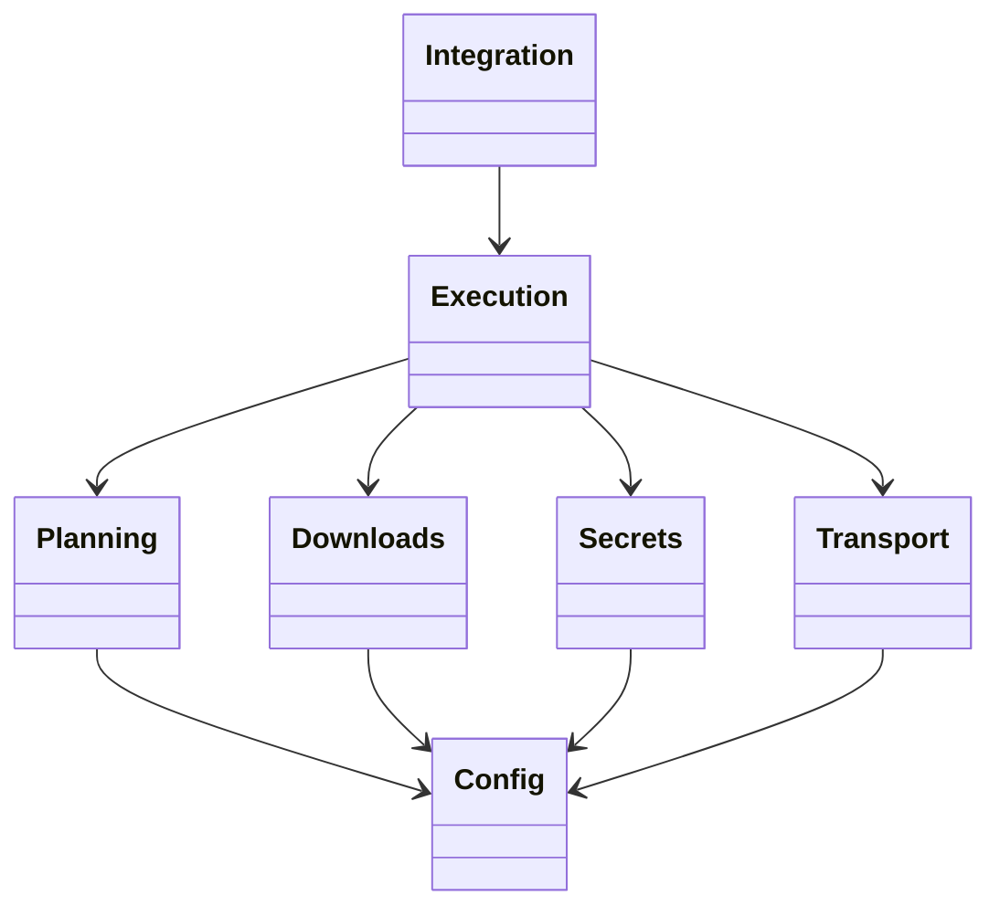
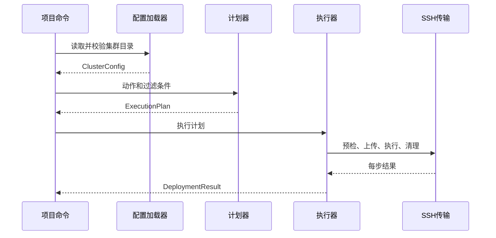
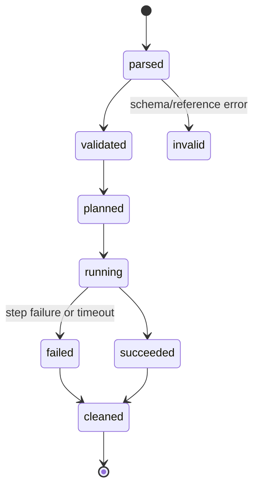

# 自动流水线计划

Workflow tier: high-risk

Risk profile: ./risk-profile.yaml

## Trigger
- Proposal: docs/versions/v0.1/modules/deployment-framework/001-initial-deployment-framework/proposal.md
- User launch confirmed: yes
- User launch statement: “确认，自动完成”
- Launch stage: proposal
- First auto stage: design
- Design source: pipeline/plan.md
- Per-stage user confirmation: skipped by explicit user auto-pipeline authorization
- Auto-confirm completed document stages: no design/testing Markdown documents generated; repository-local document extensions only
- Auto-pipeline document policy: stage-selective; automatic design uses pipeline plan; automatic testing uses runtime state; testplan.yaml required for automatic testing
- Version: v0.1
- Packet module: deployment-framework
- Task name: 001-initial-deployment-framework
- Target module(s): deployment-framework
- change_id values: CHG-deployment-core, CHG-deployment-safety, CHG-package-source, CHG-project-integration, CHG-environment-deployment, CHG-secret-delivery

## Acceptance Baseline
- 最终验收以用户确认后的 `proposal.md` 为唯一需求基线。

## Stage Graph
| Task ID | Stage | Execution Mode | Responsibility | Scope | Parent Task | Depends On | Output | Done Condition |
|---------|-------|----------------|----------------|-------|-------------|------------|--------|----------------|
| D-1 | design | auto-pipeline | 将提案转化为无环模块关系、接口、状态与失败模型 | deployment-framework 完整设计映射 | root | none | 本计划中的设计映射和范围绑定 | 计划检查通过且不生成 design.md |
| I-1 | implementation | auto-pipeline | 建立包骨架、领域模型、配置解析和确定性规划 | 配置与规划核心 | root | D-1 | 可导入的配置和计划模块 | 所有配置在 SSH 前可完整校验并生成稳定计划 |
| I-3 | implementation | auto-pipeline | 实现 HTTP/HTTPS 下载、流式哈希和临时工件清理 | 包资源模块 | root | I-1 | 下载提供方与已验证工件 | 成功、哈希失败和网络失败均有确定结果与清理 |
| I-5 | implementation | auto-pipeline | 实现机器级环境实例、依赖图和脚本动作 | 环境部署模块 | root | I-1 | 环境模型和 check/install 生命周期 | 多机实例隔离、无环排序及失败阻断可执行 |
| I-6 | implementation | auto-pipeline | 实现文件私钥投递、配置密钥上下文和模板替换 | 敏感数据投递模块 | root | I-1 | 安全投递与远端上下文运行时 | 最小投递、原子替换、固定变量替换和清理完成 |
| I-2 | implementation | auto-pipeline | 实现严格 SSH 边界、远端工作区与失败传播 | SSH 传输和执行核心 | root | I-3, I-5, I-6 | SSH 适配器与串行执行器 | 解释器预检、脚本顺序、fail-fast、清理和结果汇总完成 |
| I-4 | implementation | auto-pipeline | 实现公开 API、CLI、项目绑定与文档示例 | 项目集成表面 | root | I-2 | create_cli/run、console script、README | 任意工作目录可调用绑定项目命令且实例不串扰 |
| T-1 | testing | auto-pipeline | 从提案、计划和实现派生并实现任务级测试 | 单元、DV、集成与契约验证 | root | I-4 | tests、testplan.yaml、统一入口及运行证据 | 任务全部 change_id 有可执行成功证据 |
| A-1 | acceptance | auto-pipeline | 独立尝试证伪需求、设计、实现和测试充分性 | 全部交付物 | root | T-1 | acceptance-report.md | 所有类别完成审查且无阻塞发现 |

## Submodule Tasks
| Task ID | Stage | Execution Mode | Responsibility | Submodule | Parent Task | Depends On | Output | Done Condition |
|---------|-------|----------------|----------------|-----------|-------------|------------|--------|----------------|

直接子模块已经按职责拆为 I-1 至 I-6。设计统一保存在本计划中，测试必须跨模块验证完整调用链，因此不再创建更深子任务；这避免多个任务同时修改公共模型、测试计划和运行态证据。

## Parallel Scheduling
- Strategy: dependency-ready-set
- Concurrency: use all runtime-available child-agent slots
- Shared artifact owner: parent-orchestrator
- Lock directory: `.harness/locks/`
- Dispatch rule: launch dependency-ready work with practical edit coordination and available capacity
- Serialization reasons: explicit dependency, edit coordination, or exhausted concurrency capacity
- Evidence: record launched task ids and serialization reasons in `.harness/pipelines/v0.1/deployment-framework/001-initial-deployment-framework/state.json` scheduler waves

## Dependency Graphs


| Level | Parent | Node | Depends On |
|-------|--------|------|------------|
| submodule | deployment-framework | Config | none |
| submodule | deployment-framework | Planning | Config |
| submodule | deployment-framework | Downloads | Config |
| submodule | deployment-framework | Secrets | Config |
| submodule | deployment-framework | Transport | Config |
| submodule | deployment-framework | Execution | Planning, Downloads, Secrets, Transport |
| submodule | deployment-framework | Integration | Execution |

## 关键调用流




## Exported Interfaces
| Interface | Owner | Consumer | Compatibility | Affected Callers | Migration Path |
|-----------|-------|----------|---------------|------------------|----------------|
| `create_cli(config_root, download_providers, file_secrets, config_secrets)` | Integration | CHG-project-integration | new | none | none |
| `run(options, bindings)` | Integration | CHG-project-integration | new | none | none |
| `DownloadProvider.fetch(request)` | Downloads | CHG-package-source | new | none | none |
| `SSHTransport` protocol | Transport | CHG-deployment-safety | new | none | none |
| `DeploymentContext.config_secret(name)` 与 `render_template` | Secrets | CHG-secret-delivery | new | none | none |

## File-Level Interfaces
```python
from collections.abc import Callable, Mapping
from pathlib import Path
from typing import Protocol, Sequence

class DownloadProvider(Protocol):
    def fetch(self, request: "DownloadRequest", destination: Path) -> "VerifiedArtifact": ...

class SSHTransport(Protocol):
    def connect(self, target: "ResolvedMachine") -> "RemoteSession": ...

class DeploymentContext:
    def config_secret(self, name: str) -> str: ...
    def render_template(self, source: Path, destination: Path) -> None: ...

def create_cli(
    *,
    config_root: Path,
    download_providers: Mapping[str, DownloadProvider] | None = None,
    file_secrets: Mapping[str, Path] | None = None,
    config_secrets: Mapping[str, str | Callable[[], str]] | None = None,
) -> Callable[[Sequence[str] | None], int]: ...

def run(options: "RunOptions", bindings: "ProjectBindings") -> "DeploymentResult": ...
```

## 配置与错误契约
| 契约 | 必填结构 | 拒绝条件 | 消费者 |
|------|----------|----------|--------|
| `cluster.yaml` v1 | `schema_version`、集群名、执行器区域、App 到机器映射 | 非 v1、重复/未知 App 或机器、未知字段 | Config、Planning |
| `machines.yaml` v1 | 机器名、区域、SSH 字段、地址、机器级环境实例 | 重复机器/实例、缺路由地址、未知环境依赖、未知字段 | Config、Planning、Transport |
| `environment.yaml` v1 | 名称、Python 动作脚本、默认参数、可选包/敏感输入声明 | 名称/目录不匹配、非 `.py`、路径逃逸、未知动作 | Config、Execution |
| `app.yaml` v1 | 名称、版本、包哈希、Python 动作脚本、配置输入声明 | 名称/目录不匹配、缺哈希、未知提供方/变量、路径逃逸 | Config、Downloads、Execution |
| 远端上下文 JSON v1 | 普通配置、声明的配置密钥、当前机器/环境/App/动作 | 版本不符、未声明密钥、权限不安全 | 项目 Python 配置脚本 |

- YAML 仅用安全加载器解析，重复键和未知字段均拒绝；v1 是只读输入，不写回或迁移集群配置。
- CLI 动作为 `validate`、`plan`、`configure`、`deploy`、`start`、`stop`、`restart`，环境定向调用另支持 `check`、`install`。
- 退出码固定为：`0` 成功、`2` 用法或配置错误、`3` 本地/远端预检失败、`4` 下载或远端执行失败、`130` 用户取消。
- 远端脚本以 `DEPLOYMENT_CONTEXT_PATH` 接收非敏感的上下文文件路径；脚本退出 `0` 表示成功，其他退出码保留为步骤失败证据。stdout/stderr 在汇总前脱敏。
- 取消时不启动新步骤，关闭当前会话并清理临时工件；清理失败使原本成功的目标转为失败，原本失败/取消的目标保留主因并附加清理失败。

## API and Build Surface Impact
- Public API impact: backward-compatible
- Crate-root export change: no
- Build-surface change: yes
- Documentation examples affected: yes

## Consumer Migration Closure
| Old Symbol | New Path | change_id | Consumer Path | Consumer Kind | Migration Status |
|------------|----------|-----------|---------------|---------------|------------------|
| new-package-entry | `deployment_framework:create_cli` | CHG-project-integration | README.md | documented-project-consumer | migrated |
| no-previous-build | pyproject.toml | CHG-deployment-core | pyproject.toml | package-build | migrated |

## State Ownership
| State | Owner | Access Interface | Lifecycle | Failure Transitions |
|-------|-------|------------------|-----------|---------------------|
| 已解析集群配置 | Config | `load_cluster` | parsed -> validated -> immutable | invalid -> error before SSH |
| 确定性执行计划 | Planning | `build_plan` | created -> filtered -> immutable | invalid dependency/address -> planning error |
| 已验证下载工件 | Downloads | `VerifiedArtifact` context manager | temporary -> verified -> consumed -> deleted | network/hash failure -> deleted |
| 文件私钥和配置密钥绑定 | Secrets | `ProjectBindings` | bound -> selected -> delivered -> released | missing/invalid target -> fail before dependent script |
| 远端临时工作区和会话 | Execution | `RemoteSession` | created -> populated -> executing -> cleaned | preflight/script/timeout failure -> best-effort cleanup |
| 部署结果 | Execution | `DeploymentResult` | pending -> success/failed/skipped | first target step failure -> remaining target steps skipped |

## Failure Flows
| Flow | Boundary | Failure | Handling |
|------|----------|---------|----------|
| 集群加载 | YAML -> Config | 缺字段、未知引用、重复身份、路径逃逸 | 聚合本地校验错误并在首次 SSH 前退出 |
| 地址解析 | Planning -> Machine | 同区缺内网 IP 或跨区缺公网 IP | 失败关闭；只有显式地址类型覆盖可改变选择 |
| 包下载 | HTTP -> Downloads | 超时、重定向异常、容量超限、哈希不匹配 | 删除临时文件并阻止对应部署脚本 |
| 环境依赖 | Planning -> Environment | 循环、缺实例、check/install 失败 | 计划阶段拒绝循环；运行失败阻断依赖 App |
| 文件私钥投递 | Secrets -> Remote FS | 非绝对路径、权限不安全、上传/替换失败 | 副作用前拒绝或保留原文件并报告失败 |
| 配置渲染 | Config secret -> Python script | 缺失/未声明变量、脚本复制敏感值 | 未知变量失败；最小上下文并清理临时文件 |
| SSH 执行 | Execution -> Transport | host key、认证、超时、取消、解释器或脚本失败 | 不降级 host-key 策略；目标内 fail-fast，独立目标继续，依赖目标跳过并清理 |
| 资源清理 | Execution -> Remote FS | 临时工作区、下载或敏感上下文删除失败 | 成功目标升级为失败；失败/取消目标保留主因并附加清理错误 |
| 项目命令 | Integration -> Core | 当前目录变化或多项目绑定串扰 | 配置根使用绝对绑定；所有扩展和敏感输入均为实例状态 |

## Rejected Alternatives
| Decision Type | Selected | Rejected | Reason |
|---------------|----------|----------|--------|
| boundary | 项目提供敏感输入、框架仅投递 | 框架内置保险库与轮换 | 用户明确要求只区分文件私钥和配置密钥并完成部署/替换 |
| technical | Paramiko SSH、PyYAML、stdlib HTTP 和显式 Protocol | 调用系统 ssh/curl 与自由格式 Shell | 需要可测试的 host-key、参数、超时、SFTP 和错误边界 |
| collaboration | 六个实现任务按依赖拆分，父编排器维护计划/状态 | 每个文件单独子任务或单一超大任务 | 当前边界能并行独立模块，同时避免公共模型和证据冲突 |

## Implementation Scope Bindings
| change_id | target_module | proposal_id | design_coverage | scope_paths | design_rules_applied |
|-----------|---------------|-------------|-----------------|-------------|----------------------|
| CHG-deployment-core | deployment-framework | P-001 | Config、Planning 与领域模型覆盖目录 schema、地址和确定性计划 | `pyproject.toml`, `README.md`, `src/deployment_framework`, `tests` | 自顶向下分解、无环依赖、单一状态所有者、失败关闭 |
| CHG-deployment-safety | deployment-framework | P-002 | Transport、Execution 覆盖严格 SSH、远端脚本和清理 | `src/deployment_framework`, `tests` | 信任边界、失败流、资源生命周期、接口消费者 |
| CHG-package-source | deployment-framework | P-003 | Downloads 覆盖可扩展提供方、HTTP/HTTPS 和哈希 | `src/deployment_framework`, `tests` | 技术子模块隔离、流式资源所有权、失败处理 |
| CHG-project-integration | deployment-framework | P-004 | Integration 覆盖 create_cli/run、项目绑定和命令入口 | `pyproject.toml`, `README.md`, `src/deployment_framework`, `tests` | 公开消费者、兼容性、构建表面、实例隔离 |
| CHG-environment-deployment | deployment-framework | P-005 | Config、Planning、Execution 覆盖机器实例和 Python 生命周期 | `README.md`, `src/deployment_framework`, `tests` | 业务边界、依赖拓扑、状态转换、失败阻断 |
| CHG-secret-delivery | deployment-framework | P-006 | Secrets、Execution 覆盖两类敏感输入、原子投递和模板上下文 | `pyproject.toml`, `README.md`, `src/deployment_framework`, `tests` | 最小权限、路径边界、临时状态所有权、固定替换语义 |

## File-Level Implementation Sequence
| Sequence | Task ID | File-Level Module | Action | Depends On | change_id | target_module | Scope Paths | Context Sources |
|----------|---------|-------------------|--------|------------|-----------|---------------|-------------|-----------------|
| 1 | I-1 | `pyproject.toml`, `src/deployment_framework/errors.py`, `models.py`, `config.py`, `planning.py` | create | none | CHG-deployment-core | deployment-framework | `pyproject.toml` `src/deployment_framework` | proposal P-001、配置与错误契约、Dependency Graphs、State Ownership |
| 2 | I-3 | `src/deployment_framework/downloads.py` | create | I-1 | CHG-package-source | deployment-framework | `src/deployment_framework` | proposal P-003、DownloadProvider、包下载失败流 |
| 3 | I-5 | `src/deployment_framework/environment.py` | create | I-1 | CHG-environment-deployment | deployment-framework | `src/deployment_framework` | proposal P-005、机器环境依赖和状态模型 |
| 4 | I-6 | `src/deployment_framework/secrets.py`, `remote_context.py` | create | I-1 | CHG-secret-delivery | deployment-framework | `src/deployment_framework` | proposal P-006、DeploymentContext、敏感数据失败流 |
| 5 | I-2 | `src/deployment_framework/transport.py`, `execution.py`, `results.py` | create | I-3, I-5, I-6 | CHG-deployment-safety | deployment-framework | `src/deployment_framework` | proposal P-002、SSHTransport、远端工作区与取消/清理状态 |
| 6 | I-4 | `src/deployment_framework/cli.py`, `integration.py`, `__init__.py`, `__main__.py`, `README.md` | create | I-2 | CHG-project-integration | deployment-framework | `pyproject.toml` `README.md` `src/deployment_framework` | proposal P-004、CLI 错误契约、公开接口和消费者闭包 |

## Return Rules
- 验收发现提案歧义时停止流水线并请求用户决定，不推断需求，也不创建自动 proposal 返回任务。
- 验收发现设计缺陷返回 D-1；缺失行为或实现缺陷返回对应 I-*；测试不足返回 T-1。
- 同一问题超过 5 次未成功修复时停止并向用户报告。

执行状态、测试证据、返回记录和最终验收仅存储在 `.harness/pipelines/v0.1/deployment-framework/001-initial-deployment-framework/state.json`，不写入本不可变设计计划。
