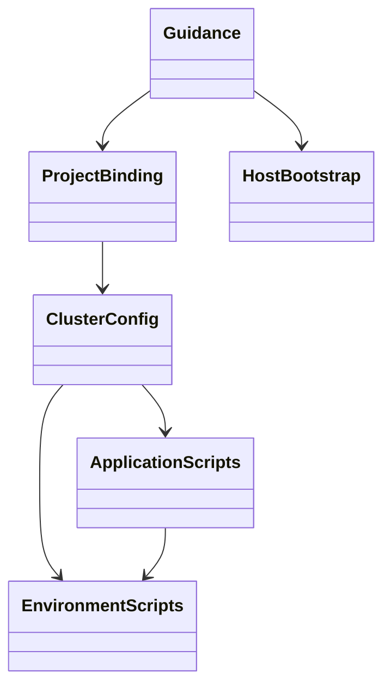
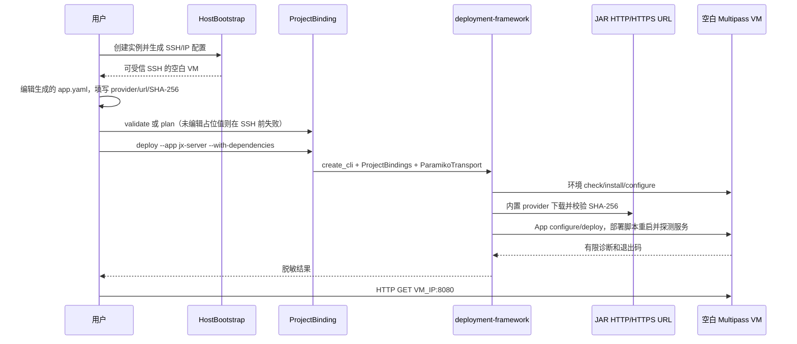
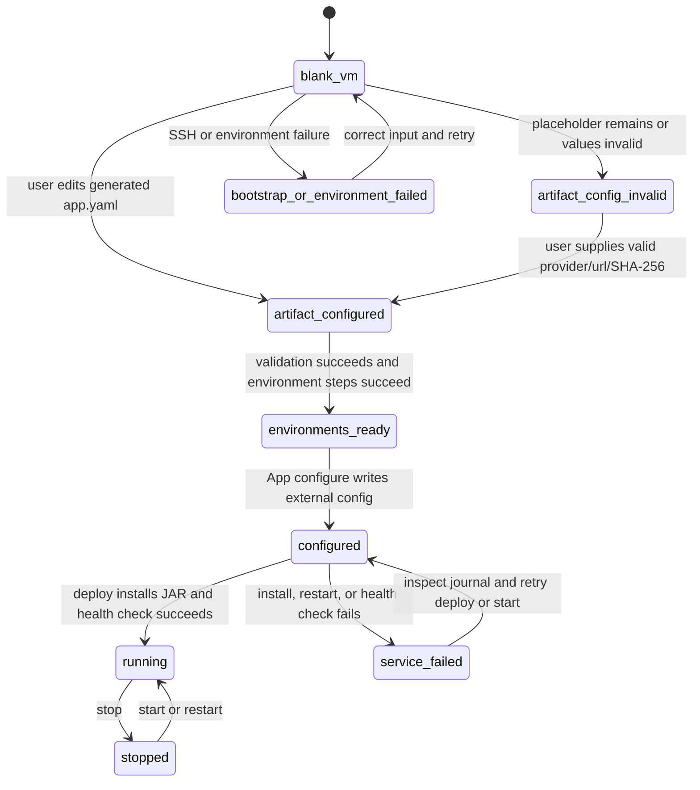

# eleph-server Multipass 示例自动流水线计划

Workflow tier: high-risk

Risk profile: ./risk-profile.yaml

## Trigger
- Proposal: docs/versions/v0.1/modules/deployment-framework/002-eleph-server-multipass-example/proposal.md
- User launch confirmed: yes
- User launch statement: “确认，自动完成”
- Confirmed revision: `prepare-multipass.ps1` 不处理任何 JAR 参数；调用方在引导完成后手工编辑生成的 App YAML。
- Launch stage: proposal
- First auto stage: design
- Design source: pipeline/plan.md
- Per-stage user confirmation: skipped by explicit user auto-pipeline authorization
- Auto-confirm completed document stages: no design/testing Markdown documents generated; repository-local document extensions only
- Auto-pipeline document policy: stage-selective; automatic design uses pipeline plan; automatic testing uses runtime state; testplan.yaml required for automatic testing
- Version: v0.1
- Packet module: deployment-framework
- Task name: 002-eleph-server-multipass-example
- Target module(s): deployment-framework
- change_id values: CHG-multipass-bootstrap, CHG-eleph-http-deploy, CHG-example-guidance

## Acceptance Baseline
- 最终验收只以用户确认后的 `proposal.md` 为需求基线。

## Stage Graph
| Task ID | Stage | Execution Mode | Responsibility | Scope | Parent Task | Depends On | Output | Done Condition |
|---------|-------|----------------|----------------|-------|-------------|------------|--------|----------------|
| D-1 | design | auto-pipeline | 把已确认边界转换为独立消费者项目、deploy 环境/App 契约、状态与失败模型 | 完整示例设计映射 | root | none | 本计划中的设计映射和范围绑定 | 计划检查通过且不生成 design.md |
| I-1 | implementation | auto-pipeline | 建立独立项目、公开 API 命令绑定、最小 Multipass 引导和生成配置边界 | ProjectBinding 与 HostBootstrap | root | D-1 | 可安装项目、CLI、bootstrap 与基础集群模板 | bootstrap 只创建或识别空白 VM、注入 SSH 公钥、取得 IP/可信 host key 并原样发布基础集群；它不接收、校验或替换 JAR 配置 |
| I-2 | implementation | auto-pipeline | 实现 JRE、MySQL、Redis、jx-runtime 环境定义、schema 快照和生命周期脚本 | EnvironmentScripts | root | I-1 | 四类环境定义、脚本和数据库模板 | deploy 计划可完成环境检查、安装、配置与依赖排序 |
| I-3 | implementation | auto-pipeline | 实现带明显无效制品占位值的 jx-server App YAML、配置模板、安装、systemd 与健康检查 | ApplicationScripts | root | I-1, I-2 | 直接版本化的 `app.yaml`、模板及生命周期脚本 | 未手工填写制品配置时在 SSH 前失败；填写有效 HTTP(S) URL/SHA 后 deploy 可下载校验 JAR、原子安装并启动服务完成健康检查 |
| I-4 | implementation | auto-pipeline | 完成目录内中文说明、手工编辑 App YAML 步骤和安全/清理指南 | Guidance | root | I-1, I-2, I-3 | 独立 README 与示例输入文件 | 不依赖根 README 即可按“引导、编辑 App YAML、验证、部署”顺序执行示例 |
| T-1 | testing | auto-pipeline | 从提案、计划和实现派生并执行任务级测试 | 单元、契约、集成与文档契约 | root | I-4 | tests、testplan.yaml、运行态覆盖与测试证据 | 三个 change_id 均有成功的自动化证据；真实 Multipass 条件验收若环境缺失必须明确未执行 |
| A-1 | acceptance | auto-pipeline | 独立寻找需求、设计、实现和验证缺陷 | 全部交付物 | root | T-1 | acceptance-report.md | 完整缺陷发现结束，结论如实反映真实 Multipass 验收状态 |

## Submodule Tasks
| Task ID | Stage | Execution Mode | Responsibility | Submodule | Parent Task | Depends On | Output | Done Condition |
|---------|-------|----------------|----------------|-----------|-------------|------------|--------|----------------|

直接子模块已按独立所有权映射为 I-1 至 I-4；设计统一维护跨模块契约，测试验证完整 deploy 计划和生命周期，因此不再增加会重复共享配置或证据所有权的更深子任务。

## Parallel Scheduling
- Strategy: dependency-ready-set
- Concurrency: use all runtime-available child-agent slots
- Shared artifact owner: parent-orchestrator
- Lock directory: `.harness/locks/`
- Dispatch rule: launch dependency-ready work with practical edit coordination and available capacity
- Serialization reasons: explicit dependency, edit coordination, or exhausted concurrency capacity
- Evidence: record launched task ids and serialization reasons in `.harness/pipelines/v0.1/deployment-framework/002-eleph-server-multipass-example/state.json` scheduler waves

## Dependency Graphs


| Level | Parent | Node | Depends On |
|-------|--------|------|------------|
| submodule | eleph-server-multipass | HostBootstrap | none |
| submodule | eleph-server-multipass | EnvironmentScripts | none |
| submodule | eleph-server-multipass | ApplicationScripts | EnvironmentScripts |
| submodule | eleph-server-multipass | ClusterConfig | EnvironmentScripts, ApplicationScripts |
| submodule | eleph-server-multipass | ProjectBinding | ClusterConfig |
| submodule | eleph-server-multipass | Guidance | HostBootstrap, ProjectBinding |

## Key Call Flows




## Exported Interfaces
| Interface | Owner | Consumer | Compatibility | Affected Callers | Migration Path |
|-----------|-------|----------|---------------|------------------|----------------|
| `eleph-deploy ACTION --cluster multipass` | ProjectBinding | CHG-eleph-http-deploy、README 用户 | new | none | 固定 `.state/clusters` 配置根并使用框架既有动作；首次执行 `deploy --app jx-server --with-dependencies` |
| `prepare-multipass.ps1 [-InstanceName NAME] [-Cpus N] [-Memory SIZE] [-Disk SIZE] [-UbuntuImage IMAGE]` | HostBootstrap | CHG-multipass-bootstrap、README 用户 | new | none | 不存在 JAR 参数；引导后手工编辑 `.state/clusters/multipass/apps/jx-server/app.yaml` |
| deploy v1 cluster/machines/environment/app YAML | ClusterConfig | `deployment_framework.load_cluster` 与 `build_plan` | new | none | 严格使用 schema_version 1，不增加自定义字段 |
| `DeploymentContext.from_environment()`、`metadata`、`config_secret()`、`render_template()` | EnvironmentScripts、ApplicationScripts | deployment-framework 远端运行时 | backward-compatible | none | 只使用现有公开接口；模板和 config_secrets 只在 configure 阶段使用 |
| 内置 `http`/`https` DownloadProvider | App package 声明 | deployment-framework executor | backward-compatible | none | 框架在宿主机下载、限额、校验后通过 SSH 工作区上传 |

## File-Level Interfaces
```python
from collections.abc import Sequence

def main(argv: Sequence[str] | None = None) -> int:
    """绑定生成配置、敏感输入和严格 Paramiko transport 后调用 create_cli。"""

class SecretSettings:
    @classmethod
    def from_environment(cls) -> "SecretSettings": ...
    def as_config_secrets(self) -> dict[str, str]: ...
```

```powershell
param(
    [string] $InstanceName = "eleph-server",
    [int] $Cpus = 2,
    [string] $Memory = "4G",
    [string] $Disk = "20G",
    [string] $UbuntuImage = "22.04"
)
```

HostBootstrap 将 `cluster-template/apps/jx-server/app.yaml` 原样复制到生成集群，不解释其 package 内容，也不依据制品值改变行为。CLI 构造 `ParamikoTransport(known_hosts=<example>/.state/clusters/multipass/known_hosts)` 并传给 `create_cli`。机器私钥和 host key 均位于一次原子发布的生成集群目录内，私钥路径满足加载器的目录套约束。远端脚本以顶层 `main()` 为进程入口，从同一远端工作区内框架上传的 `deployment_framework.py` 导入 `DeploymentContext`，只使用标准库和参数列表形式的 `subprocess.run(..., check=True)`。

## Configuration Contracts
| Contract | Required Shape | Rejected Inputs | Consumer |
|----------|----------------|-----------------|----------|
| `.state/clusters/multipass/machines.yaml` | VM IP、`ubuntu`、集群内相对私钥路径及 jre/mysql/redis/jx-runtime 环境实例 | 非 IP、绝对或越界私钥、缺失私钥、未知环境或循环依赖 | `load_cluster` / `build_plan` |
| `cluster-template/apps/jx-server/app.yaml` 与生成副本 | 模板直接包含 `provider`、`source.url`、SHA-256、`depends_on: [jx-runtime]` 和生命周期脚本；版本库值是明显无效的 `EDIT_ME_*` 占位值，用户必须在生成副本中把三项共同改为匹配的有效 HTTP(S) 配置 | 未编辑占位值、非 `http`/`https` provider、非 HTTP(S) URL、URL 凭据、非 64 位十六进制 SHA-256、未知 source 字段或缺脚本；均须在建立 SSH 连接前拒绝 | `load_cluster` / `build_plan` / DownloadProvider |
| 进程环境敏感输入 | `ELEPH_DB_PASSWORD`、`ELEPH_REDIS_PASSWORD`、`ELEPH_TOKEN_SECRET` 非空且满足示例安全格式 | 缺失、空值、控制字符、日志回显 | ProjectBinding / configure scripts |
| schema 快照 | 示例内版本化 UTF-8 SQL；初始化标记只在完整导入成功后创建 | 缺文件、导入失败、重复破坏已有数据 | mysql configure script |
| App 外部配置 | configure 从声明模板和 config secrets 原子生成 mode 0600 配置，监听 `0.0.0.0:8080` | 猜测模板路径、直接读取宿主环境变量、明文入库 | App configure/deploy scripts |

## Framework Execution Semantics
- `create_cli` 只接受框架既有动作；示例不伪造 `up`。首次部署使用 `eleph-deploy deploy --cluster multipass --app jx-server --with-dependencies`。
- `prepare-multipass.ps1` 只替换 `machines.yaml.tpl` 的 VM 地址并发布 SSH trust bundle；它不接受制品参数，不解析或改写 `app.yaml`。调用方随后手工编辑生成副本，再运行 `validate`/`plan`；占位值或不完整制品配置必须在 transport 建立前失败。
- 框架对 App deploy 的固定顺序是 `configure -> deploy`，不会隐式运行 App start。为满足单条部署命令即可访问，App deploy 脚本在原子安装 JAR 后执行 systemd restart/start 和有界 HTTP 健康检查；start/stop/restart 脚本仍供显式生命周期命令使用。
- 环境 deploy 固定执行 `check -> install -> configure`。`jx-runtime` 依赖 jre/mysql/redis，负责特权目录和 systemd unit；App configure/deploy 只写入由 ubuntu 用户拥有的应用目录。
- package 只在 environment install 或 App deploy 获取；JRE/MySQL/Redis/jx-runtime 不声明 package，JAR 只在 App deploy 获取。config_secrets 与 templates 只投递到 configure。
- 定向 App 且不带 `--with-dependencies` 时，框架只检查依赖环境。README 的首次部署命令必须保留此标志。
- 健康检查使用有限次数、间隔和单次超时访问 `http://127.0.0.1:8080/`；任意小于 500 的 HTTP 响应表示进程可达，连接失败、5xx 或超时返回非零。宿主机验收访问 `http://<vm-ip>:8080/`。

## API and Build Surface Impact
- Public API impact: none
- Crate-root export change: no
- Build-surface change: yes
- Documentation examples affected: yes

## Consumer Migration Closure
| Old Symbol | New Path | change_id | Consumer Path | Consumer Kind | Migration Status |
|------------|----------|-----------|---------------|---------------|------------------|
| no-previous-example-package | `examples/eleph-server-multipass/pyproject.toml` | CHG-eleph-http-deploy | examples/eleph-server-multipass/README.md | example-project | migrated |
| no-previous-bootstrap-command | `examples/eleph-server-multipass/prepare-multipass.ps1` | CHG-multipass-bootstrap | examples/eleph-server-multipass/README.md | documented-command | migrated |
| no-previous-example-guide | `examples/eleph-server-multipass/README.md` | CHG-example-guidance | examples/eleph-server-multipass/README.md | documentation | migrated |

## State Ownership
| State | Owner | Access Interface | Lifecycle | Failure Transitions |
|-------|-------|------------------|-----------|---------------------|
| `.state` 内 SSH 身份、known_hosts 与生成集群基础副本 | HostBootstrap | prepare-multipass.ps1 | absent -> generated-with-artifact-placeholders -> refreshed-with-artifact-placeholders -> locally removed | 新 VM 用 cloud-init 注入专用公钥；任一步失败均不发布生成配置，不删除调用前已有 VM/身份；重新引导会重新发布明显无效占位值，绝不继承或推断 JAR 配置 |
| `.state/clusters/multipass/apps/jx-server/app.yaml` 内制品字段 | 调用方 | 引导后的手工编辑 + deploy `validate`/`plan` | invalid-placeholder -> manually-configured -> locally-validated -> deployed | bootstrap 不读取或维护该状态；未编辑、只编辑部分字段或字段不匹配时在 SSH 前失败，不触碰 VM |
| MySQL `jxdy` schema 与 `jx_server` 账号 | EnvironmentScripts/mysql | 特权 configure 脚本调用 mysql CLI | absent -> created -> initialized -> preserved | 导入失败返回非零并阻断 App；初始化标记只在完整成功后创建 |
| Redis 服务及认证配置 | EnvironmentScripts/redis | systemctl 与受管配置 | absent -> installed -> configured -> running | 配置或重启失败返回非零，原配置先备份并在失败时恢复 |
| 应用目录内 JAR 与 application.yml | ApplicationScripts | deploy/configure scripts | absent -> configured/staged -> active -> replaced | HTTP 校验失败时不上传；远端使用临时文件与原子 rename，失败保留当前 JAR |
| `eleph-server.service` | EnvironmentScripts/jx-runtime | systemctl | absent -> configured -> running/stopped/failed | restart/start/health 失败返回非零并保留 journal 诊断入口 |

## Failure Flows
| Flow | Boundary | Failure | Handling |
|------|----------|---------|----------|
| Multipass 引导 | host -> VM | 命令缺失、同名实例不安全、创建失败、无 IP、host key 获取失败 | 立即失败且不发布生成集群；引导不要求或检查 JAR，bootstrap 之后禁止 exec/transfer/mount |
| 手工制品配置 | user -> generated app.yaml -> framework validation | 占位值未替换、provider/URL/SHA 只填写部分、格式无效或不匹配 | `validate`、`plan` 或 deploy 的本地配置加载阶段失败，且必须发生在 SSH transport 建立和任何 VM 变更之前 |
| deploy SSH 入口 | ProjectBinding -> framework | 私钥、known_hosts 或地址错误 | 严格拒绝连接，不降级接受未知 host key |
| 环境准备 | framework -> apt/systemd | 网络、包安装、服务启动失败 | 当前步骤非零退出，依赖步骤和 App 被阻断，重试执行幂等检查 |
| 数据初始化 | mysql configure -> schema | 密钥无效、SQL 不兼容、部分导入 | 非零退出；成功标记不提前写入，重试可继续恢复 |
| 制品获取 | HTTP(S) -> host downloads -> SSH | URL、重定向、超时、大小或 SHA 不匹配 | 使用框架 provider 的限制与清理语义；未取得 VerifiedArtifact 时不上传 |
| 应用替换 | App deploy -> application dir | 写入或替换失败 | 清理临时路径并保留当前 JAR；成功后保留 previous 版本 |
| 服务启动 | systemd -> HTTP | JVM 退出或健康检查超时 | 脚本非零退出，只输出有限状态信息且不打印敏感配置 |

## Rejected Alternatives
| Decision Type | Selected | Rejected | Reason |
|---------------|----------|----------|--------|
| boundary | Multipass 只创建空白 VM；首次 SSH 后全部走 deploy | 使用 multipass exec/transfer/mount 安装依赖或复制应用 | 用户明确要求环境和其余部署动作使用 deploy 支持机制 |
| technical | 用户在生成的直接 `app.yaml` 中手工填写内置 HTTP(S) provider、URL、SHA-256；环境/App Python 脚本执行部署 | bootstrap 参数/替换逻辑、`app.yaml.tpl`、本地文件 provider、构建 JAR、Shell/Ansible/Docker 绕过 | 用户明确要求引导不管 JAR，同时仍以 deploy 模块原生制品和生命周期机制为主体 |
| collaboration | 四个顺序明确的实现任务、统一测试和独立验收 | 每个脚本单独任务或全部塞入单一实现任务 | 当前拆分隔离所有权并避免共享 YAML/README 并发冲突 |

## Implementation Scope Bindings
| change_id | target_module | proposal_id | design_coverage | scope_paths | design_rules_applied |
|-----------|---------------|-------------|-----------------|-------------|----------------------|
| CHG-multipass-bootstrap | deployment-framework | P-001 | HostBootstrap、SSH 信任状态、空白 VM 边界与失败关闭 | `examples/eleph-server-multipass/**` | 顶层分解、单一状态所有者、信任边界、失败恢复 |
| CHG-eleph-http-deploy | deployment-framework | P-002 | ProjectBinding、ClusterConfig、EnvironmentScripts、ApplicationScripts、数据/服务状态与调用流 | `examples/eleph-server-multipass/**` | 无环依赖、公开消费者、数据所有权、运行时失败流、实现顺序 |
| CHG-example-guidance | deployment-framework | P-003 | Guidance、命令/配置契约、安全边界与验收入口 | `examples/eleph-server-multipass/**` | 具体消费者、兼容性决定、文档影响与非目标边界 |

## File-Level Implementation Sequence
| Sequence | Task ID | File-Level Module | Action | Depends On | change_id | target_module | Scope Paths | Context Sources |
|----------|---------|-------------------|--------|------------|-----------|---------------|-------------|-----------------|
| 1 | I-1 | `examples/eleph-server-multipass/pyproject.toml`, `.gitignore`, `src/eleph_server_deploy/**`, `prepare-multipass.ps1`, `cluster-template/cluster.yaml`, `machines.yaml.tpl` | modify | none | CHG-multipass-bootstrap | deployment-framework | `examples/eleph-server-multipass/**` | proposal P-001/P-002、HostBootstrap、ProjectBinding、SSH 失败流、无 JAR 参数/替换边界 |
| 2 | I-2 | `examples/eleph-server-multipass/cluster-template/environments/jre/**`, `mysql/**`, `redis/**`, `jx-runtime/**` | create | I-1 | CHG-eleph-http-deploy | deployment-framework | `examples/eleph-server-multipass/**` | EnvironmentScripts、schema 来源快照、数据/服务状态、环境失败流 |
| 3 | I-3 | `examples/eleph-server-multipass/cluster-template/apps/jx-server/app.yaml`, `templates/application.yml.tpl`, `scripts/**` | modify | I-1, I-2 | CHG-eleph-http-deploy | deployment-framework | `examples/eleph-server-multipass/**` | ApplicationScripts、直接 App YAML 无效占位契约、制品/服务状态、应用失败流 |
| 4 | I-4 | `examples/eleph-server-multipass/README.md`, `.env.example` | modify | I-1, I-2, I-3 | CHG-example-guidance | deployment-framework | `examples/eleph-server-multipass/**` | proposal P-003、无参数引导命令、手工 App YAML 编辑/验证顺序、配置/失败边界 |

## Return Rules
- 验收发现 proposal 歧义时记录阻塞需求发现和 rejected，然后停止并请求用户决定。
- 依赖、状态、失败模型或文件顺序缺陷返回 D-1；缺失行为或脚本缺陷返回对应 I-*；验证不足返回 T-1。
- 同一问题超过 5 次未修复时停止并向用户报告。
- 执行状态、测试证据、返回记录和最终验收只写入 `.harness/pipelines/v0.1/deployment-framework/002-eleph-server-multipass-example/state.json`。
