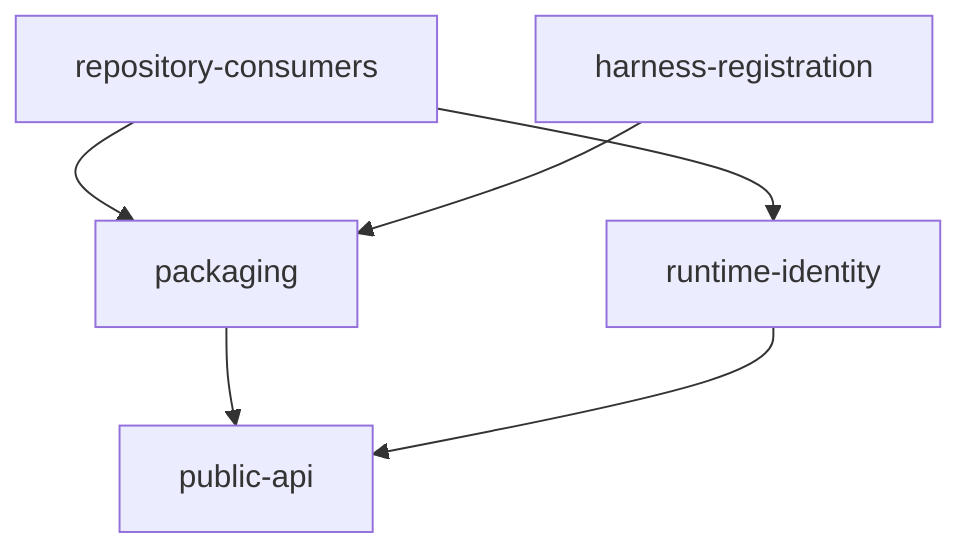

# sfo-deploy 重命名自动流水线计划

Workflow tier: high-risk

Risk profile: ./risk-profile.yaml

## Trigger
- Proposal: docs/versions/v0.1/modules/deployment-framework/005-rename-to-sfo-deploy/proposal.md
- User launch confirmed: yes
- User launch statement: `确认，自动完成`
- Launch stage: proposal
- First auto stage: design
- Design source: pipeline/plan.md
- Per-stage user confirmation: skipped by explicit user auto-pipeline authorization
- Auto-confirm completed document stages: no design/testing Markdown documents generated; repository-local document extensions only
- Auto-pipeline document policy: stage-selective; automatic design uses pipeline plan; automatic testing uses runtime state; testplan.yaml required for automatic testing
- Version: v0.1
- Packet module: deployment-framework
- Task name: 005-rename-to-sfo-deploy
- Target module(s): deployment-framework
- change_id values: CHG-rename-sfo-deploy

## Acceptance Baseline
- 最终验收以用户已确认的 `proposal.md` 为唯一需求基线。

## Identity Transition Boundary
- 当前已启动任务的 `Packet module`、任务目录和 `changes.target_module` 保留 `deployment-framework`，它们标识被迁移的源模块并构成已冻结的流水线/审计绑定，不随生产名称迁移而改写。
- 交付后的活跃产品模块、统一测试模块键及后续新任务身份使用 `sfo-deploy`。统一测试入口不得硬编码被替换的旧模块名；它通过固定迁移任务名 `005-rename-to-sfo-deploy` 定位任务 packet、从其父目录动态取得源 packet 模块，再把该源模块目录下的任务测试计划单向注册到 `sfo-deploy/<task-name>`。测试覆盖检查与流水线最终完成门禁都从 `test-run.py --list` 按精确 `task_name` 唯一解析同一规范 scope，零候选或多候选均关闭失败。因此本任务的完成命令为 `sfo-deploy/005-rename-to-sfo-deploy all`，且旧调用键仍被拒绝。

## Stage Graph
| Task ID | Stage | Execution Mode | Responsibility | Scope | Parent Task | Depends On | Output | Done Condition |
|---------|-------|----------------|----------------|-------|-------------|------------|--------|----------------|
| D-1 | design | auto-pipeline | 审查并固化完整命名迁移的边界、依赖、接口、消费者和实现顺序 | 本任务计划中的设计映射 | root | none | 完整且通过检查的 pipeline/plan.md 与 risk-profile.yaml 设计判断 | 自动设计映射通过且不生成 design.md |
| I-1 | implementation | auto-pipeline | 迁移发行元数据、Python 包目录及生产运行时标识 | 根项目生产包与构建入口 | root | D-1 | 可通过新名称构建和导入的生产实现 | 所有生产文件和公开入口使用新名称 |
| I-2 | implementation | auto-pipeline | 迁移 README、根测试和示例消费者 | 仓库内公开消费者 | root | I-1 | 使用 sfo-deploy/sfo_deploy 的文档、测试与示例 | 仓库内消费者不再依赖旧名称 |
| I-3 | implementation | auto-pipeline | 迁移锁文件与 Harness 任务测试注册 | 构建锁定与测试路由 | root | I-1 | 更新后的 uv.lock、test-run.py、testing-coverage-check.py 和 pipeline-plan-check.py | 锁文件声明新发行名，统一测试入口、覆盖检查与最终完成门禁共用新模块任务路由 |
| T-1 | testing | auto-pipeline | 从提案、设计和实现派生并执行破坏性迁移验证 | 任务级契约、单元、DV、集成和示例验证 | root | I-2, I-3 | testplan.yaml、测试实现、运行时覆盖和测试运行证据 | sfo-deploy/005-rename-to-sfo-deploy all 成功 |
| A-1 | acceptance | auto-pipeline | 独立查找需求、设计、实现与测试缺陷 | 全部交付物和验证证据 | root | T-1 | acceptance-report.md | 独立验收结论 accepted |

## Submodule Tasks
| Task ID | Stage | Execution Mode | Responsibility | Submodule | Parent Task | Depends On | Output | Done Condition |
|---------|-------|----------------|----------------|-----------|-------------|------------|--------|----------------|

本任务是一个不可拆分的公开身份迁移：设计由 D-1 统一保持发行名、导入名、CLI 和远端运行时名称一致；实现按生产身份、仓库消费者、锁文件/Harness 三个互不覆盖的编辑边界拆为 I-1/I-2/I-3；测试必须在所有实现完成后由 T-1 统一验证正向新入口和负向旧入口，因此不再创建更深的直接子模块任务。

## Parallel Scheduling
- Strategy: dependency-ready-set
- Concurrency: use all runtime-available child-agent slots
- Shared artifact owner: parent-orchestrator
- Lock directory: `.harness/locks/`
- Dispatch rule: launch dependency-ready work with practical edit coordination and available capacity
- Serialization reasons: explicit dependency, edit coordination, or exhausted concurrency capacity
- Evidence: record launched task ids and serialization reasons in `.harness/pipelines/v0.1/deployment-framework/005-rename-to-sfo-deploy/state.json` scheduler waves

## Dependency Graphs

| Level | Parent | Node | Depends On |
|-------|--------|------|------------|
| submodule | deployment-framework | public-api | none |
| submodule | deployment-framework | packaging | public-api |
| submodule | deployment-framework | runtime-identity | public-api |
| submodule | deployment-framework | repository-consumers | packaging, runtime-identity |
| submodule | deployment-framework | harness-registration | packaging |

## Exported Interfaces
| Interface | Owner | Consumer | Compatibility | Affected Callers | Migration Path |
|-----------|-------|----------|---------------|------------------|----------------|
| Python distribution `deployment-framework` -> `sfo-deploy` | packaging | 仓库根安装与示例项目依赖 | breaking | pyproject.toml、uv.lock、examples/eleph-server-multipass/pyproject.toml | 依赖键和锁文件包身份统一改为 sfo-deploy |
| Python package `deployment_framework` -> `sfo_deploy` | public-api | README、根测试、示例源码和生命周期脚本 | breaking | Consumer Migration Closure 表中的 Python/文档消费者 | 将 import、模块执行入口和构建包路径统一改为 sfo_deploy |
| console script `deploy-framework` -> `sfo-deploy` | packaging | README 命令示例与安装后的操作员入口 | breaking | README.md 与外部命令调用方 | 用 sfo-deploy 替换旧命令；不提供包装器 |
| remote runtime file `deployment_framework.py` -> `sfo_deploy.py` | runtime-identity | 上传后的远端 Python 生命周期脚本 | migration-required | execution.py、remote runtime 集成测试及示例脚本 | 上传新文件名并让所有远端脚本从 sfo_deploy 导入 |
| Harness module/task route `deployment-framework/*` -> `sfo-deploy/*` | harness-registration | 统一测试入口、测试覆盖检查、流水线最终完成门禁与历史目录中的任务测试计划 | migration-required | harness/scripts/test-run.py、harness/scripts/testing-coverage-check.py、harness/scripts/pipeline-plan-check.py、当前及已完成任务的 testplan.yaml 与测试运行 artifact | test-run.py 将规范模块键改为 sfo-deploy，通过固定迁移任务名定位 packet 并动态推导源父模块，发现该父模块下任务计划时仅生成新路由；testing-coverage-check.py 与 pipeline-plan-check.py 从统一测试入口的 `--list` 结果按精确 task_name 唯一取得同一规范 scope，零候选或多候选均关闭失败。三处均不保留旧模块名字面映射或旧调用键 |

## API and Build Surface Impact
- Public API impact: breaking
- Crate-root export change: yes
- Build-surface change: yes
- Documentation examples affected: yes

## Consumer Migration Closure
| Old Symbol | New Path | change_id | Consumer Path | Consumer Kind | Migration Status |
|------------|----------|-----------|---------------|---------------|------------------|
| deployment-framework | sfo-deploy | CHG-rename-sfo-deploy | pyproject.toml | build metadata | migrated |
| deployment-framework | sfo-deploy | CHG-rename-sfo-deploy | uv.lock | lockfile | migrated |
| deployment-framework | sfo-deploy | CHG-rename-sfo-deploy | examples/eleph-server-multipass/pyproject.toml | package consumer | migrated |
| deploy-framework | sfo-deploy | CHG-rename-sfo-deploy | README.md | CLI documentation | migrated |
| deployment_framework | sfo_deploy | CHG-rename-sfo-deploy | README.md | API documentation | migrated |
| deployment_framework | sfo_deploy | CHG-rename-sfo-deploy | tests/contract/test_public_contract.py | contract test | migrated |
| deployment-framework | sfo-deploy | CHG-rename-sfo-deploy | tests/contract/verify_rename_contract.py | 集中式旧发行名与旧 Harness 路由拒绝 fixture | allowed-negative-fixture |
| deployment_framework | sfo_deploy | CHG-rename-sfo-deploy | tests/contract/verify_rename_contract.py | 集中式旧 Python 包名拒绝 fixture | allowed-negative-fixture |
| deploy-framework | sfo-deploy | CHG-rename-sfo-deploy | tests/contract/verify_rename_contract.py | 集中式旧 CLI 拒绝 fixture | allowed-negative-fixture |
| deployment_framework | sfo_deploy | CHG-rename-sfo-deploy | tests/dv/test_execution.py | DV test | migrated |
| deployment_framework | sfo_deploy | CHG-rename-sfo-deploy | tests/integration/test_project_cli.py | integration test | migrated |
| deployment_framework | sfo_deploy | CHG-rename-sfo-deploy | tests/integration/test_remote_runtime.py | integration test | migrated |
| deployment_framework | sfo_deploy | CHG-rename-sfo-deploy | tests/unit/test_config_planning.py | unit test | migrated |
| deployment_framework | sfo_deploy | CHG-rename-sfo-deploy | tests/unit/test_downloads.py | unit test | migrated |
| deployment_framework | sfo_deploy | CHG-rename-sfo-deploy | tests/unit/test_environment_secrets.py | unit test | migrated |
| deployment_framework | sfo_deploy | CHG-rename-sfo-deploy | tests/unit/test_transport.py | unit test | migrated |
| deployment-framework | sfo-deploy | CHG-rename-sfo-deploy | tests/conftest.py | test fixture | migrated |
| deployment_framework | sfo_deploy | CHG-rename-sfo-deploy | examples/eleph-server-multipass/README.md | consumer documentation | migrated |
| deployment_framework | sfo_deploy | CHG-rename-sfo-deploy | examples/eleph-server-multipass/src/eleph_server_deploy/cli.py | package consumer | migrated |
| deployment_framework | sfo_deploy | CHG-rename-sfo-deploy | examples/eleph-server-multipass/tests/test_artifact_contract.py | consumer test | migrated |
| deployment_framework | sfo_deploy | CHG-rename-sfo-deploy | examples/eleph-server-multipass/tests/test_config_contract.py | consumer test | migrated |
| deployment_framework | sfo_deploy | CHG-rename-sfo-deploy | examples/eleph-server-multipass/tests/test_plan.py | consumer test | migrated |
| deployment-framework | sfo-deploy | CHG-rename-sfo-deploy | examples/eleph-server-multipass/tests/test_project_install.py | install contract test | migrated |
| deployment_framework | sfo_deploy | CHG-rename-sfo-deploy | examples/eleph-server-multipass/cluster-template/apps/jx-server/scripts/configure.py | remote consumer | migrated |
| deployment_framework | sfo_deploy | CHG-rename-sfo-deploy | examples/eleph-server-multipass/cluster-template/apps/jx-server/scripts/deploy.py | remote consumer | migrated |
| deployment_framework | sfo_deploy | CHG-rename-sfo-deploy | examples/eleph-server-multipass/cluster-template/apps/jx-server/scripts/lifecycle.py | remote consumer | migrated |
| deployment_framework | sfo_deploy | CHG-rename-sfo-deploy | examples/eleph-server-multipass/cluster-template/environments/jx-runtime/scripts/configure.py | remote consumer | migrated |
| deployment_framework | sfo_deploy | CHG-rename-sfo-deploy | examples/eleph-server-multipass/cluster-template/environments/mysql/scripts/configure.py | remote consumer | migrated |
| deployment_framework | sfo_deploy | CHG-rename-sfo-deploy | examples/eleph-server-multipass/cluster-template/environments/redis/scripts/configure.py | remote consumer | migrated |
| deployment-framework | sfo-deploy | CHG-rename-sfo-deploy | harness/scripts/test-run.py | Harness test routing | migrated |
| deployment-framework | sfo-deploy | CHG-rename-sfo-deploy | harness/scripts/testing-coverage-check.py | Harness testing coverage runner scope | migrated |
| deployment-framework | sfo-deploy | CHG-rename-sfo-deploy | harness/scripts/pipeline-plan-check.py | Harness pipeline completion artifact scope | migrated |
| deployment_framework | sfo_deploy | CHG-rename-sfo-deploy | src/sfo_deploy/__init__.py | package root | migrated |
| deployment_framework | sfo_deploy | CHG-rename-sfo-deploy | src/sfo_deploy/__main__.py | module CLI | migrated |
| deploy-framework | sfo-deploy | CHG-rename-sfo-deploy | src/sfo_deploy/cli.py | CLI 程序名 | migrated |
| deployment-framework | sfo-deploy | CHG-rename-sfo-deploy | src/sfo_deploy/downloads.py | HTTP identity | migrated |
| deployment-framework | sfo-deploy | CHG-rename-sfo-deploy | src/sfo_deploy/execution.py | runtime staging | migrated |
| deployment-framework | sfo-deploy | CHG-rename-sfo-deploy | src/sfo_deploy/remote_runtime.py | remote runtime identity | migrated |
| deployment-framework | sfo-deploy | CHG-rename-sfo-deploy | src/sfo_deploy/transport.py | remote workspace identity | migrated |

## State Ownership
| State | Owner | Access Interface | Lifecycle | Failure Transitions |
|-------|-------|------------------|-----------|---------------------|
| 不适用：本次不新增或迁移持久/共享状态 | deployment-framework | 仅静态包、命令和运行时标识 | 构建或运行时解析新名称 | 任一旧名称残留导致构建、导入或命令失败并由验证阻断 |

## Failure Flows
| Flow | Boundary | Failure | Handling |
|------|----------|---------|----------|
| 根项目或示例安装 | pyproject/uv -> build backend | 发行名或 source 键不同步 | 构建/安装契约失败并阻止验收 |
| Python API 导入 | 消费者 -> sfo_deploy | 包目录、wheel 内容或 import 未同步 | 新导入正向检查失败；旧导入负向检查必须失败 |
| CLI 调用 | console script -> sfo_deploy.cli | 入口名或目标模块仍为旧值 | CLI 帮助契约失败并阻止验收 |
| 远端生命周期脚本 | execution upload -> remote scripts | 上传文件名和脚本 import 不一致 | 远端运行时集成测试暴露 ImportError 并返回实现修复 |
| 任务级统一测试与完成门禁 | 历史任务目录 -> 活跃 Harness 模块键 | 仅重命名 MODULE_SUITES 会使当前 testplan 仍以源 packet 父模块注册；testing-coverage-check.py 或 pipeline-plan-check.py 若继续拼接冻结 packet module，会分别 dry-run 旧调用键或查找错误 artifact scope | test-run.py 通过固定迁移任务名定位 packet、动态推导其父模块，并把该父模块下任务计划单向注册到 sfo-deploy；testing-coverage-check.py 与 pipeline-plan-check.py 从 test-run.py `--list` 输出按精确 task_name 唯一选择规范 scope，零候选或多候选均关闭失败。验证新任务路由与完成 artifact 可达、旧路由不可达，且实现中不存在旧模块名字面映射 |

## Rejected Alternatives
| Decision Type | Selected | Rejected | Reason |
|---------------|----------|----------|--------|
| boundary | 一次性迁移发行名、导入名、CLI、运行时标识和仓库消费者 | 只修改 pyproject 的显示名称 | 局部修改会留下多个旧入口并造成安装与源码行为不一致 |
| technical | 直接破坏性重命名且以负向契约验证旧入口消失 | 保留旧包和 CLI 兼容别名 | 用户要求修改模块名称，兼容层会长期暴露两个品牌且扩大维护表面 |
| collaboration | I-1 完成生产身份后并行执行 I-2 消费者迁移与 I-3 锁文件/Harness 迁移 | 所有文件由一个超大实现步骤串行修改 | 分离不重叠编辑面可并行，同时用 I-1 依赖保证消费者基于稳定的新身份迁移 |

## Implementation Scope Bindings
| change_id | target_module | proposal_id | design_coverage | scope_paths | design_rules_applied |
|-----------|---------------|-------------|-----------------|-------------|----------------------|
| CHG-rename-sfo-deploy | deployment-framework | P-001 | packaging、public-api、runtime-identity、repository-consumers 与 harness-registration 共同完成一次原子公开身份迁移 | `pyproject.toml`, `uv.lock`, `README.md`, `src/**`, `tests/**`, `examples/**`, `harness/scripts/test-run.py`, `harness/scripts/testing-coverage-check.py`, `harness/scripts/pipeline-plan-check.py` | 自顶向下模块分解、无环依赖、破坏性接口消费者闭包、单一状态判断、失败流和实现顺序 |

## File-Level Implementation Sequence
| Sequence | Task ID | File-Level Module | Action | Depends On | change_id | target_module | Scope Paths | Context Sources |
|----------|---------|-------------------|--------|------------|-----------|---------------|-------------|-----------------|
| 1 | I-1 | `pyproject.toml` 与 `src/deployment_framework/*.py` -> `src/sfo_deploy/*.py` | rename / modify | none | CHG-rename-sfo-deploy | deployment-framework | `pyproject.toml` `src/**` | proposal P-001、Exported Interfaces、Failure Flows |
| 2 | I-2 | `README.md`、`tests/**/*.py`、`examples/eleph-server-multipass/**` | modify | I-1 | CHG-rename-sfo-deploy | deployment-framework | `README.md` `tests/**` `examples/**` | Consumer Migration Closure、I-1 新公开身份 |
| 3 | I-3 | `uv.lock`、`harness/scripts/test-run.py`、`harness/scripts/testing-coverage-check.py`、`harness/scripts/pipeline-plan-check.py` | modify / regenerate | I-1 | CHG-rename-sfo-deploy | deployment-framework | `uv.lock` `harness/scripts/test-run.py` `harness/scripts/testing-coverage-check.py` `harness/scripts/pipeline-plan-check.py` | Build Surface Impact、Identity Transition Boundary、Harness 路由、覆盖检查与最终完成门禁共用规范 scope |

## Return Rules
- 验收发现提案歧义时，以 `rejected` 完成报告并停止流水线，请用户决策，不推断需求。
- 设计映射缺陷返回 D-1；生产身份缺陷返回 I-1；消费者遗漏返回 I-2；锁文件或测试路由缺陷返回 I-3；测试覆盖不足返回 T-1。
- 同一阻断问题超过 5 次未成功修复时停止并报告用户。

执行状态、测试证据、返回记录和最终验收仅存储在 `.harness/pipelines/v0.1/deployment-framework/005-rename-to-sfo-deploy/state.json`。
