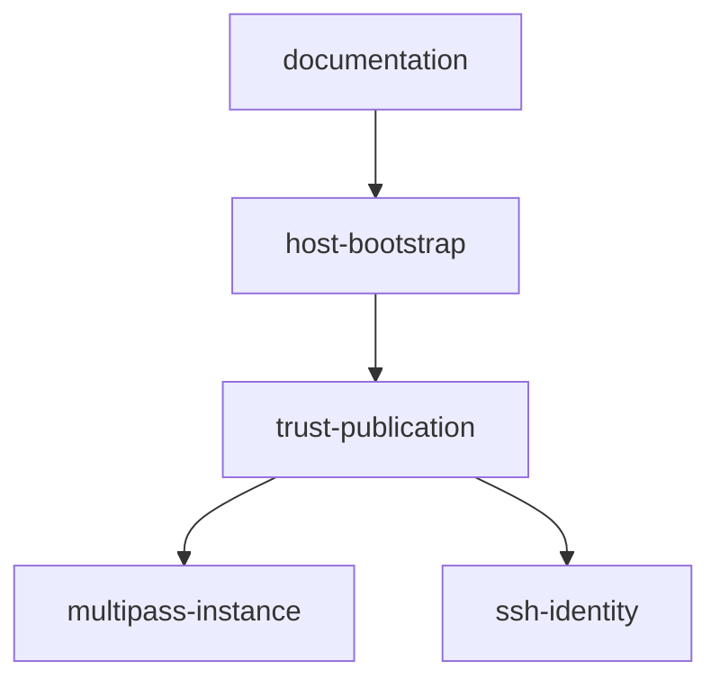

# Multipass Bash 准备脚本自动流水线计划

Workflow tier: high-risk

Risk profile: ./risk-profile.yaml

## Trigger

- Proposal:
  docs/versions/v0.1/modules/deployment-framework/006-add-shell-multipass-prepare/proposal.md
- User launch confirmed: yes
- User launch statement: `确认，自动完成任务`
- Launch stage: proposal
- First auto stage: design
- Design source: pipeline/plan.md
- Per-stage user confirmation: skipped by explicit user auto-pipeline authorization
- Auto-confirm completed document stages: no design/testing Markdown documents generated;
  repository-local document extensions only
- Auto-pipeline document policy: stage-selective; automatic design uses pipeline plan; automatic
  testing uses runtime state; testplan.yaml required for automatic testing
- Version: v0.1
- Packet module: deployment-framework
- Task name: 006-add-shell-multipass-prepare
- Target module(s): deployment-framework
- change_id values: CHG-shell-multipass-prepare

## Acceptance Baseline

- 最终验收以用户已确认的 `proposal.md` 为唯一需求基线；Bash
  实现允许采用平台惯用参数形式，但安全边界和生成状态必须与 PowerShell 入口等价。

## Stage Graph

| Task ID | Stage          | Execution Mode | Responsibility                                                              | Scope                                      | Parent Task | Depends On | Output                                        | Done Condition                                                                       |
| ------- | -------------- | -------------- | --------------------------------------------------------------------------- | ------------------------------------------ | ----------- | ---------- | --------------------------------------------- | ------------------------------------------------------------------------------------ |
| D-1     | design         | auto-pipeline  | 审查并固化 Bash 引导入口的模块边界、信任状态、失败流和实现顺序              | 本计划中的自动设计映射与 risk-profile.yaml | root        | none       | 通过检查的 pipeline/plan.md 与风险检查项      | 设计映射完整且未生成 design.md                                                       |
| I-1     | implementation | auto-pipeline  | 实现 Bash CLI、跨平台依赖检查、Multipass 生命周期、SSH 信任和事务式目录发布 | prepare-multipass.sh                       | root        | D-1        | 可执行且失败关闭的 Bash 准备脚本              | 脚本在 macOS Bash 3.2 兼容语法范围内实现全部设计流、具备可执行位并通过 `bash -n`     |
| I-2     | implementation | auto-pipeline  | 补充 Linux/macOS 前提、调用示例、后续命令和平台边界                         | 示例 README                                | root        | I-1        | 与真实脚本一致的 README 用法                  | Windows 与 Linux/macOS 入口、依赖、参数及共同后续步骤均清晰可执行                    |
| T-1     | testing        | auto-pipeline  | 从提案、设计和交付代码派生并执行任务级验证                                  | Bash 契约、隔离生命周期、文档与可选 E2E    | root        | I-2        | testplan.yaml、测试实现、运行时覆盖和测试证据 | `sfo-deploy/006-add-shell-multipass-prepare all` 成功并生成匹配任务 scope 的运行制品 |
| A-1     | acceptance     | auto-pipeline  | 独立尝试证伪需求、安全边界、实现和测试充分性                                | 全部交付物及运行证据                       | root        | T-1        | acceptance-report.md                          | 独立验收结论 accepted                                                                |

## Submodule Tasks

| Task ID | Stage | Execution Mode | Responsibility | Submodule | Parent Task | Depends On | Output | Done Condition |
| ------- | ----- | -------------- | -------------- | --------- | ----------- | ---------- | ------ | -------------- |

脚本的参数、实例生命周期、SSH
信任和发布必须共享同一失败关闭控制流，拆成并行实现会增加混合状态风险，因此由 I-1
合并实现；这些是同一 Bash
文件内的概念子模块，没有可安全独立交付的直接子模块任务。文档在脚本接口稳定后由 I-2 串行更新，测试由
T-1 独立派生。

## Parallel Scheduling

- Strategy: dependency-ready-set
- Concurrency: use all runtime-available child-agent slots
- Shared artifact owner: parent-orchestrator
- Lock directory: `.harness/locks/`
- Dispatch rule: launch dependency-ready work with practical edit coordination and available
  capacity
- Serialization reasons: explicit dependency, edit coordination, or exhausted concurrency capacity
- Evidence: record launched task ids and serialization reasons in
  `.harness/pipelines/v0.1/deployment-framework/006-add-shell-multipass-prepare/state.json`
  scheduler waves

## Dependency Graphs

| Level     | Parent               | Node               | Depends On                       |
| --------- | -------------------- | ------------------ | -------------------------------- |
| submodule | deployment-framework | multipass-instance | none                             |
| submodule | deployment-framework | ssh-identity       | none                             |
| submodule | deployment-framework | trust-publication  | multipass-instance, ssh-identity |
| submodule | deployment-framework | host-bootstrap     | trust-publication                |
| submodule | deployment-framework | documentation      | host-bootstrap                   |

## Exported Interfaces

| Interface                                                                                                                 | Owner             | Consumer                                | Compatibility       | Affected Callers            | Migration Path                                                                   |
| ------------------------------------------------------------------------------------------------------------------------- | ----------------- | --------------------------------------- | ------------------- | --------------------------- | -------------------------------------------------------------------------------- |
| `prepare-multipass.sh [--instance-name NAME] [--cpus N] [--memory SIZE] [--disk SIZE] [--ubuntu-image IMAGE]` 及 `--help` | host-bootstrap    | Linux/macOS 示例用户、README 和任务测试 | new                 | 无既有调用方                | 只接受空格分隔的长选项且不接受位置参数；默认值与 PowerShell 一致，新入口与其并存 |
| `.state/clusters/multipass` 信任包结构                                                                                    | trust-publication | eleph-server-deploy CLI                 | backward-compatible | 现有示例 CLI 与配置装载测试 | 生成与 PowerShell 入口相同的相对路径和 schema，无需消费者迁移                    |

## API and Build Surface Impact

- Public API impact: backward-compatible
- Crate-root export change: no
- Build-surface change: no
- Documentation examples affected: yes

## Consumer Migration Closure

| Old Symbol                                               | New Path                                       | change_id                   | Consumer Path                                               | Consumer Kind        | Migration Status |
| -------------------------------------------------------- | ---------------------------------------------- | --------------------------- | ----------------------------------------------------------- | -------------------- | ---------------- |
| PowerShell-only prepare invocation                       | 并列的 PowerShell 与 Bash prepare 入口         | CHG-shell-multipass-prepare | examples/eleph-server-multipass/README.md                   | 用户操作文档         | migrated         |
| PowerShell-only bootstrap contract test                  | PowerShell 与 Bash 各自的引导契约测试          | CHG-shell-multipass-prepare | examples/eleph-server-multipass/tests/test_bootstrap.py     | 消费者测试           | migrated         |
| PowerShell-only conditional Multipass prepare invocation | 按宿主平台选择 PowerShell 或 Bash prepare 入口 | CHG-shell-multipass-prepare | examples/eleph-server-multipass/tests/test_multipass_e2e.py | 条件化真实环境消费者 | migrated         |

## State Ownership

| State                                  | Owner              | Access Interface                                                | Lifecycle                                                                                                  | Failure Transitions                                                                                                                                                         |
| -------------------------------------- | ------------------ | --------------------------------------------------------------- | ---------------------------------------------------------------------------------------------------------- | --------------------------------------------------------------------------------------------------------------------------------------------------------------------------- |
| Multipass 实例                         | multipass-instance | `multipass info/start/launch` 的独立 argv 调用                  | 不存在时创建，存在且本地可信状态完整时按需启动；新建后任一步失败均不自动删除                               | 未知实例、启动失败或启动/创建后信息读取失败时终止且不发布新信任包                                                                                                           |
| 专用 SSH 身份与认可的 host-key 集合    | ssh-identity       | `ssh-keygen`、`ssh-keyscan`、0600 私钥和 key 类型+内容集合比较  | 新实例生成 ed25519 密钥，可信重跑复用私钥/公钥并重新核验已记录 IPv4 与远端 host key 集合                   | 公私钥不一致、IPv4 改变、key 集合改变、扫描超时或权限设置失败时终止                                                                                                         |
| `bootstrap.json` 与模板派生配置        | trust-publication  | Python JSON/IPv4 解析、固定字段写入及字面值模板替换             | 只在 staging 中以 UTF-8 构建；确认唯一占位符被替换后随整个目录发布                                         | JSON/schema/IPv4 无效、占位符数量异常或写入失败时丢弃 staging，不触碰现有目标                                                                                               |
| 发布事务的 staging、唯一备份和目标目录 | trust-publication  | 同一 `.state` 文件系统内的目录重命名与受限清理                  | `mktemp` 在 `.state` 下创建 staging；已有目标先改名为唯一备份，再把完整 staging 改名为目标，提交后删除备份 | 新目标改名失败时恢复备份；EXIT/INT/TERM 清理只处理脚本记录且经父目录/前缀校验的路径；进程被强杀或主机崩溃可能留下备份但不能暴露混合修订，后续运行失败关闭并要求人工核对恢复 |
| 单实例 prepare 互斥锁                  | host-bootstrap     | `.state/.prepare-multipass.lock` 原子目录创建与当前进程持有标记 | 在任何实例或信任状态操作前取得，正常退出、错误和 INT/TERM 后释放；强杀残留需人工核对                       | 锁已存在或不是可创建目录时失败关闭，不探测或修改 Multipass/clusterRoot，避免两个发布事务交错                                                                                |

## Failure Flows

| Flow               | Boundary                                   | Failure                                                                                                | Handling                                                                                                                                                                                              |
| ------------------ | ------------------------------------------ | ------------------------------------------------------------------------------------------------------ | ----------------------------------------------------------------------------------------------------------------------------------------------------------------------------------------------------- |
| 参数进入脚本       | 用户 argv -> Bash 参数解析                 | 未知/重复参数、缺值、位置参数、非法实例名/CPU/容量，或镜像值以 `-` 开头、包含空白/控制字符             | 在任何 Multipass 或状态写入前以非零退出并输出明确错误；不用 `eval`/`source`，外部命令均用数组或逐项引用保持 argv 边界                                                                                 |
| 并发准备           | 两个宿主进程 -> 共享实例和 `.state`        | 另一进程已持有锁或强杀后留下锁目录                                                                     | 原子 `mkdir` 锁失败即关闭退出；不尝试猜测锁是否陈旧或自动删除，操作者核对后手工恢复                                                                                                                   |
| 宿主兼容与依赖检查 | Linux/macOS Bash -> 宿主工具               | Bash 语法超出 3.2、缺少 Python 3.11、Multipass/OpenSSH 或所用标准文件工具                              | 在创建 staging、生成密钥或调用 Multipass 前失败；不依赖 GNU-only `readlink -f`、`realpath`、`stat` 格式或 `sed -i`                                                                                    |
| 已有实例探测       | multipass JSON -> 本地可信 bootstrap       | 同名实例缺少可信文件，bootstrap 不是预期 JSON/schema/实例名/IPv4，或专用公私钥不一致                   | 拒绝接管，保持已有实例和信任包不变；Multipass JSON 和状态文件仅作为数据传给 Python，不经 shell 求值                                                                                                   |
| 已有实例恢复运行   | 本地脚本 -> multipass start                | 状态非 Running 且启动失败                                                                              | 立即终止，不进入信任包发布                                                                                                                                                                            |
| 新实例创建         | 专用公钥/cloud-init -> multipass launch    | 公钥格式无效、launch 失败或创建后无法读取 IPv4                                                         | 失败关闭且不发布信任包；与 PowerShell 边界一致，可能已创建的 VM 保留供操作者核对                                                                                                                      |
| SSH 信任核验       | 已验证实例 IPv4/ssh-keyscan -> known_hosts | 扫描记录不是目标地址的 ed25519/rsa key、key 集合为空、可信 IPv4 改变、key 集合改变或 30 次有界扫描超时 | 以 key 类型+内容的去重集合比较，忽略记录顺序但不忽略 key 差异；失败关闭且不改写可信状态                                                                                                               |
| 信任包发布         | staging -> backup/clusterRoot              | 备份或新目录改名失败、恢复失败、收到 INT/TERM、提交后备份清理失败                                      | 提交前失败恢复旧目录并返回非零；恢复失败同时保留可诊断备份路径且不扩大删除；提交后的备份清理失败不回滚或删除已发布完整目标，但返回非零并报告残留；只清理由当前进程创建且通过边界校验的 staging/backup |

## Rejected Alternatives

| Decision Type | Selected                                                                                                                | Rejected                                                                | Reason                                                                                                                            |
| ------------- | ----------------------------------------------------------------------------------------------------------------------- | ----------------------------------------------------------------------- | --------------------------------------------------------------------------------------------------------------------------------- |
| boundary      | 新增并列 Bash 入口且保持 PowerShell 不变                                                                                | 用 Bash 替换 PowerShell                                                 | Windows 用户仍依赖现有脚本，替换会制造不必要的破坏性迁移                                                                          |
| technical     | macOS Bash 3.2 兼容的严格模式、数组/逐项引用 argv、Python JSON/IPv4/key-blob 解析、原子目录锁和同文件系统目录级事务发布 | 严格 POSIX sh、GNU-only 工具、eval/source、无锁逐文件覆盖或新增 jq 依赖 | 该组合能在两类宿主保持参数边界、拒绝无效身份并串行发布单修订信任包；Python 已是示例前提，避免求值注入、GNU 工具锁定和额外 jq 依赖 |
| collaboration | 单一 I-1 维护完整安全控制流，I-2 和 T-1 在接口稳定后串行执行                                                            | 把密钥、实例和发布逻辑交给并行实现步骤                                  | 三部分共享状态与失败恢复，分拆编辑容易引入不一致边界                                                                              |

## Implementation Scope Bindings

| change_id                   | target_module        | proposal_id         | design_coverage                                                                                                       | scope_paths                                                                                                                                     | design_rules_applied                                                                                                     |
| --------------------------- | -------------------- | ------------------- | --------------------------------------------------------------------------------------------------------------------- | ----------------------------------------------------------------------------------------------------------------------------------------------- | ------------------------------------------------------------------------------------------------------------------------ |
| CHG-shell-multipass-prepare | deployment-framework | P-001, P-002, P-003 | multipass-instance、ssh-identity、trust-publication、host-bootstrap 与 documentation 共同交付 Bash 入口并保持信任边界 | `examples/eleph-server-multipass/prepare-multipass.sh`, `examples/eleph-server-multipass/README.md`, `examples/eleph-server-multipass/tests/**` | 自顶向下模块分解、无环依赖、Bash 3.2/Linux/macOS 兼容边界、公开接口消费者闭包、单一状态所有者、失败/恢复流和串行实现顺序 |

## File-Level Implementation Sequence

| Sequence | Task ID | File-Level Module                                      | Action         | Depends On | change_id                   | target_module        | Scope Paths                                            | Context Sources                                                                                  |
| -------- | ------- | ------------------------------------------------------ | -------------- | ---------- | --------------------------- | -------------------- | ------------------------------------------------------ | ------------------------------------------------------------------------------------------------ |
| 1        | I-1     | `examples/eleph-server-multipass/prepare-multipass.sh` | add executable | none       | CHG-shell-multipass-prepare | deployment-framework | `examples/eleph-server-multipass/prepare-multipass.sh` | proposal P-001/P-002、Exported Interfaces、State Ownership、Failure Flows、Rejected Alternatives |
| 2        | I-2     | `examples/eleph-server-multipass/README.md`            | modify         | I-1        | CHG-shell-multipass-prepare | deployment-framework | `examples/eleph-server-multipass/README.md`            | proposal P-003、Exported Interfaces、I-1 最终参数接口                                            |

## Return Rules

- 验收发现提案歧义时，以 `rejected` 完成报告并停止流水线，请用户决策，不推断需求。
- Bash 边界或失败模型缺陷返回 D-1；脚本缺陷返回 I-1；文档缺陷返回 I-2；覆盖或测试实现缺陷返回 T-1。
- 同一阻断问题超过 5 次未成功修复时停止并报告用户。

执行状态、测试证据、返回记录和最终验收仅存储在
`.harness/pipelines/v0.1/deployment-framework/006-add-shell-multipass-prepare/state.json`。
