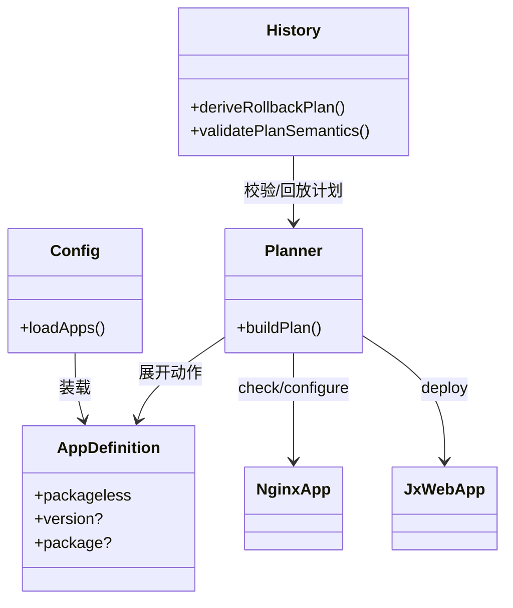
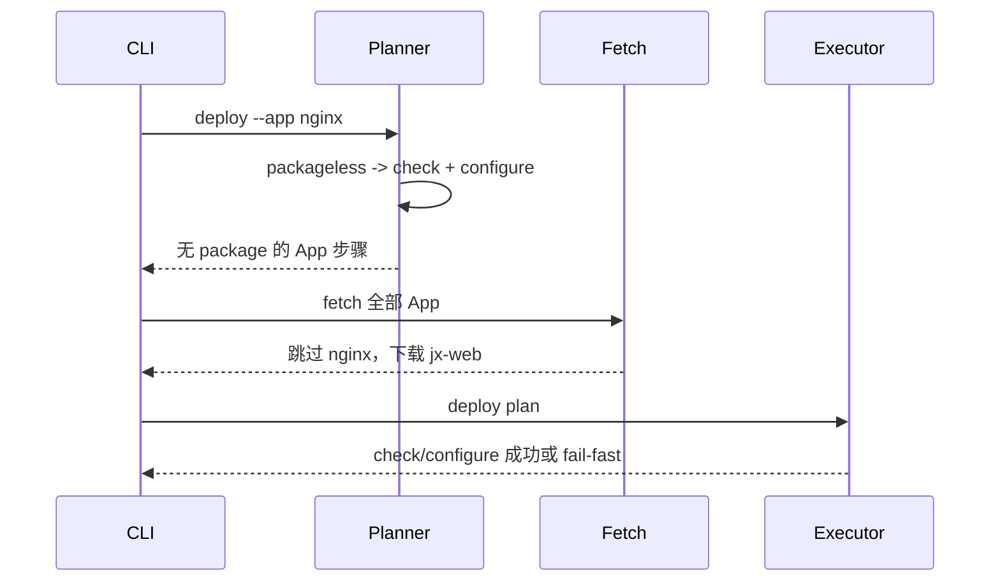
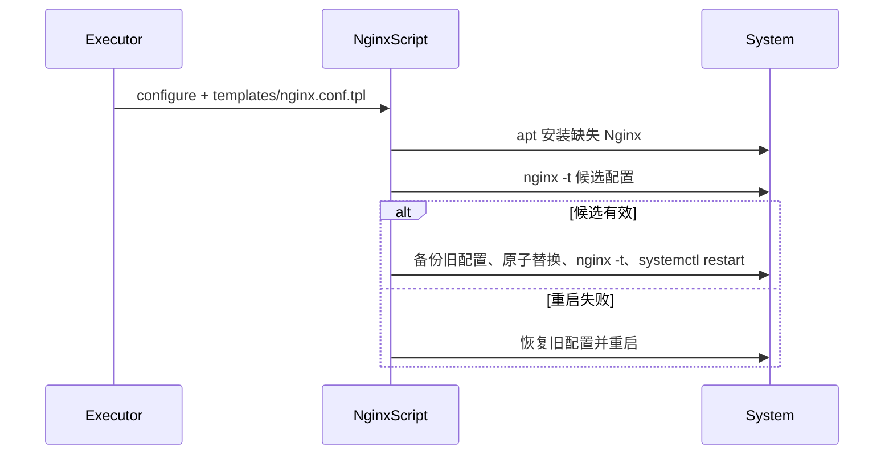
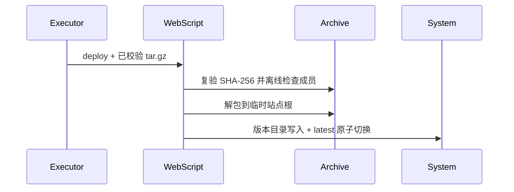

Risk profile: ./risk-profile.yaml

## Design Scope

本设计覆盖 sfo-deploy 的 App 生命周期契约与 Multipass 示例。框架新增显式 `packageless: true`
App：没有版本、没有安装包、不参与 fetch/包上传/包解压， 部署时按 `check -> configure`
执行。Multipass 示例用该能力新增 `nginx` App； 同时新增普通 App `jx-web`，继续使用版本化 tar.gz
制品并原子发布静态站点。

## Useful Context

- 现有 App schema v2 要求 `app_versions.yaml` 提供 version/package，普通 App 的 deploy 动作必须有
  `deploy` 脚本；该假设阻止纯配置型 App。
- `fetch` 已能对没有 package 的 App 记录 `appsWithoutPackage`，但配置层尚不允许 该状态进入规划。
- 发布历史把 App 回退计划限定为 configure/deploy；packageless App 没有 deploy， 需要允许
  check/configure 回放。
- Multipass 模板与 live 集群必须保持脚本集合一致；新增脚本后独立远端脚本
  契约检查的固定数量和禁止项需要同步。

## Overall Approach

1. App schema v2 增加可选 `packageless: true`。显式标记避免根据缺失字段静默 推断；普通 App
   路径和既有 YAML 保持不变。
2. packageless App 不允许 package/version，也不需要 `app_versions.yaml` 条目；
   出现条目时拒绝。它必须声明 `check` 与 `configure`，禁止 `deploy`。
3. 规划器把 packageless App 的 `deploy` 请求展开为 `check -> configure`； 普通 App 仍按既有
   configure/deploy 顺序展开。configure-only App 没有 package_path，也不生成 bundle-scripts 上传。
4. 发布历史允许 packageless 回退计划保存并重放 App `check/configure`； planSummary 对缺失 App
   version 保持安全。
5. `nginx` App 用模板生成候选配置，先 `nginx -t`，再原子替换 `/etc/nginx/nginx.conf`
   并重启；重启失败恢复旧配置。脚本可按需安装 Nginx。
6. `jx-web` App 下载/校验 tar.gz，拒绝绝对路径、`..`、符号链接/硬链接等 危险成员，安全解包后发布到
   `/home/projects/ui` 并保留版本目录。

## Layered Design Document Index

| level  | parent_document | unit                        | design_document | responsibility                                                                      |
| ------ | --------------- | --------------------------- | --------------- | ----------------------------------------------------------------------------------- |
| module | design.md       | sfo-deploy + Multipass 示例 | design.md       | packageless App、Nginx 与 jx-web 接入的模块级设计；功能规模小，文件级模块在本文定义 |

## Module Relationship UML



## File-Level Interfaces

- Consumer: CHG-packageless-app
- Compatibility: backward-compatible

```typescript
// src/types.ts
export interface AppDefinition {
  readonly name: string;
  readonly directory: string;
  readonly installDirectory?: string;
  readonly version?: string;
  readonly package?: PackageSpec;
  readonly packageless: boolean;
  readonly scripts: ScriptDefinition;
  readonly dependsOn: readonly string[];
}
```

- Consumer: CHG-packageless-app
- Compatibility: backward-compatible

```typescript
// src/planning.ts
// packageless deploy 展开为 ["check", "configure"]。
// package App deploy 展开为 [configure?, "deploy"]。
export function buildPlan(
  cluster: ClusterConfig,
  actionOrRequest: string | PlanRequest,
  options?: Omit<PlanRequest, "action">,
): ExecutionPlan;
```

- Consumer: CHG-packageless-app
- Compatibility: backward-compatible

```typescript
// src/history.ts
// deploy 计划允许 packageless App 的 check/configure。
// rollback 计划允许 packageless App 的 check/configure。
export function deriveRollbackPlan(plan: ExecutionPlan): ExecutionPlan;
```

`packageless` 是新增公开类型字段；现有构造普通 App 的消费者仍会得到
`packageless: false`。没有新的函数签名或参数，行为向后兼容。

Multipass 生命周期脚本是远端契约：`nginx` 的 configure 脚本读取
`DEPLOYMENT_METADATA_PATH.templates["nginx.conf.tpl"]`；`jx-web` 的 deploy 脚本读取
`package_path`、`install_directory`、`parameters.version` 和 `keep_versions`。

## API and Build Surface Impact

- Public API impact: backward-compatible
- Crate-root export change: no
- Build-surface change: yes
- Documentation examples affected: yes

## Consumer Migration Closure

| Old Symbol                                        | New Path                                                  | Change ID           | Consumer Kind    | Consumer Path                                                          | Migration Status |
| ------------------------------------------------- | --------------------------------------------------------- | ------------------- | ---------------- | ---------------------------------------------------------------------- | ---------------- |
| App schema v2 必须有 app_versions/version/package | `packageless: true` 可省略上述版本信息                    | CHG-packageless-app | 集群 YAML 调用方 | `examples/eleph-server-multipass/cluster-template/apps/nginx/app.yaml` | migrated         |
| App deploy 必须有 deploy 动作                     | packageless App 使用 check/configure                      | CHG-packageless-app | 集群 YAML 调用方 | `examples/eleph-server-multipass/cluster-template/apps/nginx/app.yaml` | migrated         |
| 远端脚本固定数量 21                               | 新增 jx-web deploy 与 nginx check/configure               | CHG-nginx-app       | 合同检查         | `tests/contract/verify_independent_remote_scripts.ts`                  | migrated         |
| `configure.ts` 一律禁止                           | 仅禁止普通 App 配置残留，允许 packageless nginx configure | CHG-nginx-app       | 合同检查         | `tests/integration/independent_remote_scripts.test.ts`                 | migrated         |

## Key Flows







## State and Ownership

- Owner: `src/config.ts` 拥有 App schema 的 `packageless` 与 package/version 一致性；
  `src/planning.ts` 拥有动作展开；`src/history.ts` 拥有发布计划/回退语义。
- packageless deploy 的动作展开由 `src/planning.ts` 拥有；发布快照/回退由 `src/history.ts` 拥有。
- Nginx 最终状态由目标机 systemd 拥有；App 脚本只拥有候选配置、备份和替换/
  恢复流程。替换前备份旧配置；重启失败恢复旧配置后再重启。
- `jx-web` 发布状态由 `/home/projects/.sfo-deploy/jx-web/<version>/` 拥有； `/home/projects/ui`
  只作为原子 latest 指针。失败时保留旧 latest。

## Directly Mapped Change Items

| change_id           | target_module        | proposal_id         | Design Coverage                                                                | Scope Paths                                                                                                                                                                                                                                                                                                                                                                 |
| ------------------- | -------------------- | ------------------- | ------------------------------------------------------------------------------ | --------------------------------------------------------------------------------------------------------------------------------------------------------------------------------------------------------------------------------------------------------------------------------------------------------------------------------------------------------------------------- |
| CHG-packageless-app | deployment-framework | P-001               | File-Level Interfaces、Module Relationship UML、Key Flows、State and Ownership | src/types.ts, src/config.ts, src/planning.ts, src/history.ts, tests/unit/config_planning.test.ts, tests/integration/environment_placement.test.ts, docs/guides/sfo-deploy-cluster-configuration.md                                                                                                                                                                          |
| CHG-nginx-app       | deployment-framework | P-002, P-004, P-005 | Key Flows、State and Ownership、Consumer Migration Closure                     | examples/eleph-server-multipass/cluster-template/apps/nginx/**, examples/eleph-server-multipass/clusters/multipass/apps/nginx/**, examples/eleph-server-multipass/cluster-template/cluster.yaml, examples/eleph-server-multipass/clusters/multipass/cluster.yaml, tests/contract/verify_independent_remote_scripts.ts, tests/integration/independent_remote_scripts.test.ts |
| CHG-jx-web-app      | deployment-framework | P-003, P-004        | Key Flows、State and Ownership                                                 | examples/eleph-server-multipass/cluster-template/apps/jx-web/**, examples/eleph-server-multipass/clusters/multipass/apps/jx-web/**, examples/eleph-server-multipass/cluster-template/app_versions.yaml, examples/eleph-server-multipass/clusters/multipass/app_versions.yaml, examples/eleph-server-multipass/README.md                                                     |

## Implementation Order

| phase | goal                                 | depends_on | output                                                                         |
| ----- | ------------------------------------ | ---------- | ------------------------------------------------------------------------------ |
| 1     | packageless 类型、装载校验和计划行为 | none       | src/types.ts, src/config.ts, src/planning.ts                                   |
| 2     | 历史计划/回退语义                    | Phase 1    | src/history.ts                                                                 |
| 3     | Multipass 模板与 live App            | Phases 1-2 | examples/eleph-server-multipass/**                                             |
| 4     | 框架与示例测试、文档契约             | Phases 1-3 | tests/**, README.md, docs/guides/**, examples/eleph-server-multipass/README.md |

## File-Level Implementation Sequence

| sequence | file_level_module               | action | depends_on | change_id                           | scope_path                                                                                                                                            | implementation_task |
| -------- | ------------------------------- | ------ | ---------- | ----------------------------------- | ----------------------------------------------------------------------------------------------------------------------------------------------------- | ------------------- |
| 1        | src/types.ts                    | modify | none       | CHG-packageless-app                 | src/types.ts                                                                                                                                          | root                |
| 2        | src/config.ts                   | modify | 1          | CHG-packageless-app                 | src/config.ts                                                                                                                                         | root                |
| 3        | src/planning.ts                 | modify | 1-2        | CHG-packageless-app                 | src/planning.ts                                                                                                                                       | root                |
| 4        | src/history.ts                  | modify | 1-3        | CHG-packageless-app                 | src/history.ts                                                                                                                                        | root                |
| 5        | Multipass nginx App             | create | 1-4        | CHG-nginx-app                       | examples/eleph-server-multipass/cluster-template/apps/nginx/**, examples/eleph-server-multipass/clusters/multipass/apps/nginx/**                      | root                |
| 6        | Multipass jx-web App            | create | 1-4        | CHG-jx-web-app                      | examples/eleph-server-multipass/cluster-template/apps/jx-web/**, examples/eleph-server-multipass/clusters/multipass/apps/jx-web/**, app_versions.yaml | root                |
| 7        | Cluster placement and contracts | modify | 5-6        | CHG-nginx-app, CHG-jx-web-app       | cluster.yaml, tests/contract/**, tests/integration/**                                                                                                 | root                |
| 8        | Documentation                   | modify | 7          | CHG-packageless-app, CHG-jx-web-app | README.md, docs/guides/sfo-deploy-cluster-configuration.md, examples/eleph-server-multipass/README.md                                                 | root                |

## Design Notes

- `packageless` 显式为布尔值；仅 `true` 触发特殊路径，`false` 或缺失沿用普通 App。这样普通 App 漏写
  package 时仍会失败，而不是被误判为配置型 App。
- packageless App 的 `check` 是部署前置能力检查；Nginx 未安装不是失败，configure
  会安装。已安装时检查可执行能力和当前配置语法，不因服务未运行阻断部署。
- `nginx` App 不新增 TLS、缓存、域名或防火墙；模板只承载提案中的 80 端口 SPA 与 `/prod-api/`
  代理语义。
- `jx-web` 采用版本目录加 latest 指针；如果目标路径已存在非指针目录则失败关闭，
  避免覆盖未知站点数据。

## Risks and Rollback

- packageless 误用：显式字段、强制 check/configure、禁止 deploy，并用负例测试。
- Nginx 重启失败：先候选 `nginx -t`，替换前保存旧配置；重启失败恢复旧配置。
- 静态包注入：部署前限制 tar 成员类型和路径，解包到临时目录并验证 index.html。
- 历史兼容：v3 计划只扩展 App 动作集合；旧普通 App 计划不需要迁移。
- 回退：packageless 回放 check/configure；package App 保留现有 configure/deploy
  回退。撤销配置或前端可按发布历史执行 rollback。
