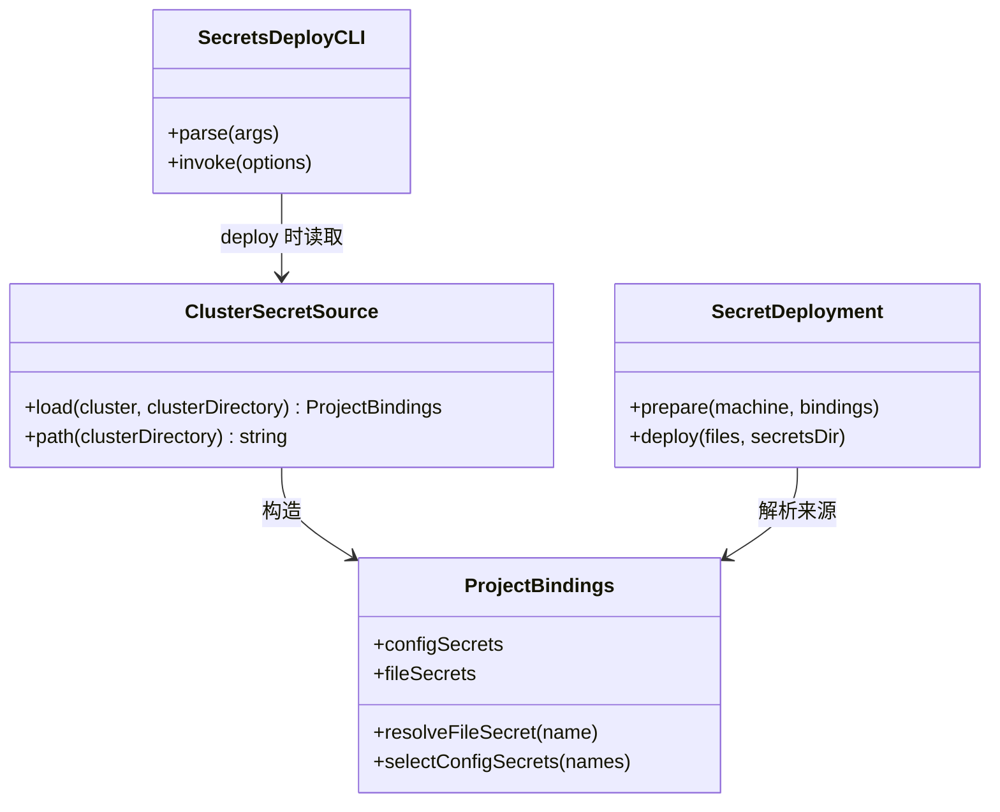
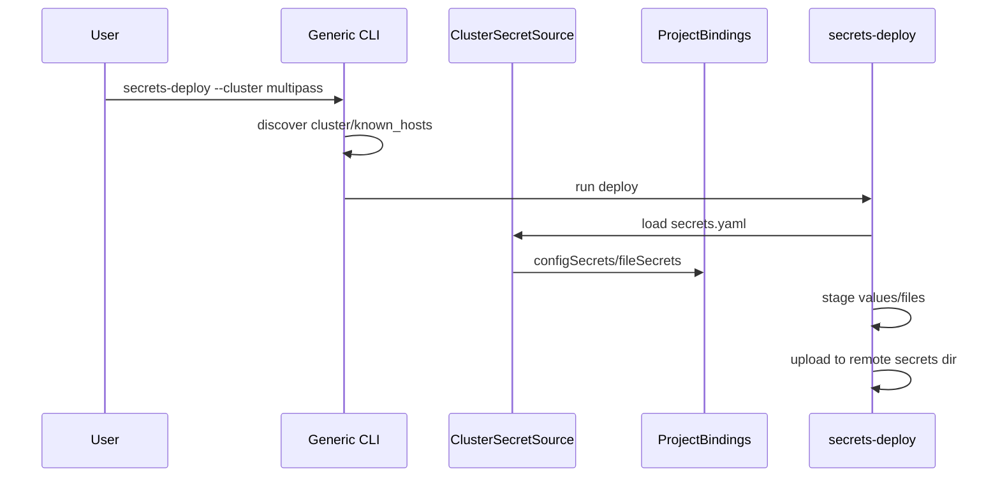

Risk profile: ./risk-profile.yaml

## Design Scope

本设计把集群本地 `secrets.yaml` 定为 `sfo-deploy secrets-deploy` 的默认秘密来源。可提交的
`cluster.yaml` 继续只声明密钥名、`kind` 和放置机器；本地 YAML 直接用密钥名作顶层键。`kind: value`
的值是秘密字符串，`kind: file` 的值是本地源文件路径。路径相对于 `secrets.yaml`
所在目录解析，并限制在该目录内。

同时，通用 CLI 在集群目录存在 `known_hosts` 时自动使用该文件。这样 Multipass
示例可以删除项目绑定入口，只调用通用 `src/cli.ts`。

## Useful Context

`ProjectBindings` 已经能分别解析 `configSecrets` 和 `fileSecrets`；`prepareSecretDeployments`
已经按每台机器选择声明密钥、暂存值/文件并上传。当前缺口是通用 CLI 只有空的
`ProjectBindings`，而示例入口负责读取环境变量和指定 `known_hosts`。

## Overall Approach

新增一个集群秘密装载器：读取 `<cluster-directory>/secrets.yaml`，按 `cluster.yaml.secrets`
的声明把每个顶层键分派为 `configSecrets` 或 `fileSecrets`，再构造内部 `ProjectBindings`。`deploy`
操作必须在 SSH 连接前装载；`--check` 和 `--remove` 不读取该文件。`known_hosts` 在构造默认 OpenSSH
transport 前自动发现。

拒绝使用项目侧 `.env` 或在 `cluster.yaml` 内嵌秘密值；这是把可提交声明与本地秘密来源分离的边界。

## Layered Design Document Index

| Level  | Parent Document | Unit                    | Design Document | Responsibility                                       |
| ------ | --------------- | ----------------------- | --------------- | ---------------------------------------------------- |
| module | design.md       | sfo-deploy CLI 秘密部署 | design.md       | 定义集群本地秘密来源、known_hosts 发现和示例入口迁移 |

## Module Relationship UML



## File-Level Interfaces

- Consumer: CHG-cluster-secret-source
- Compatibility: backward-compatible

```typescript
// src/secrets.ts
export const SECRET_SOURCE_FILENAME = "secrets.yaml";

export function clusterSecretSourcePath(clusterDirectory: string): string;

export async function loadClusterSecretSource(
  cluster: ClusterConfig,
  clusterDirectory: string,
): Promise<ProjectBindings>;
```

- Consumer: CHG-cluster-known-hosts
- Compatibility: backward-compatible

```typescript
// src/integration.ts
async function discoverClusterKnownHosts(
  clusterDirectory: string,
): Promise<string | undefined>;
```

`src/cli.ts` 只更新 `secrets-deploy` 帮助说明；不新增 CLI 参数。

## API and Build Surface Impact

- Public API impact: backward-compatible
- Crate-root export change: no
- Build-surface change: yes
- Documentation examples affected: yes

## Consumer Migration Closure

| Old Symbol                 | New Path                              | Change ID                    | Consumer Kind | Consumer Path                               | Migration Status |
| -------------------------- | ------------------------------------- | ---------------------------- | ------------- | ------------------------------------------- | ---------------- |
| `src/cli.ts` 示例绑定入口  | `src/integration.ts` 内部集群秘密装载 | CHG-multipass-no-binding-cli | Deno task CLI | `examples/eleph-server-multipass/deno.json` | migrated         |
| 手动构造 `ProjectBindings` | 通用 CLI 自动装载 `secrets.yaml`      | CHG-cluster-secret-source    | CLI 调用方    | `examples/eleph-server-multipass/README.md` | migrated         |

## Key Flows



`--check` 与 `--remove` 不经过 `secrets.yaml`；它们只依赖 `cluster.yaml` 和远端状态。

## State and Ownership

- Owner: `secrets.yaml` 装载器 `cluster.yaml.secrets` 是可提交声明来源；`secrets.yaml`
  是本地秘密来源的唯一 owner。装载器只读取并转换，不写回该文件。临时暂存目录仍由 `secrets-deploy`
  创建和清理。

## Directly Mapped Change Items

| change_id                    | target_module        | proposal_id | Design Coverage                                           | Scope Paths                                                                                                                                                      |
| ---------------------------- | -------------------- | ----------- | --------------------------------------------------------- | ---------------------------------------------------------------------------------------------------------------------------------------------------------------- |
| CHG-cluster-secret-source    | deployment-framework | P1-1        | 新增集群秘密装载器，更新 secrets-deploy 装配与帮助/文档。 | `src/secrets.ts`, `src/integration.ts`, `src/cli.ts`, `tests/**`, `docs/guides/sfo-deploy-cluster-configuration.md`, `examples/eleph-server-multipass/README.md` |
| CHG-cluster-known-hosts      | deployment-framework | P1-2        | 新增集群目录 known_hosts 自动发现并接入默认 transport。   | `src/integration.ts`, `tests/**`, `docs/guides/sfo-deploy-cluster-configuration.md`, `examples/eleph-server-multipass/README.md`                                 |
| CHG-multipass-no-binding-cli | deployment-framework | P1-3        | 迁移示例配置、任务入口和文档，移除项目绑定入口依赖。      | `examples/eleph-server-multipass/deno.json`, `examples/eleph-server-multipass/README.md`, `tests/**`, `docs/guides/sfo-deploy-cluster-configuration.md`          |

## Implementation Order

| Phase | Goal                             | Depends On | Output                               |
| ----- | -------------------------------- | ---------- | ------------------------------------ |
| 1     | 实现并校验 `secrets.yaml` 装载器 | none       | `src/secrets.ts`                     |
| 2     | 接入 `secrets-deploy` 和帮助文档 | Phase 1    | `src/integration.ts`, `src/cli.ts`   |
| 3     | 实现 known_hosts 自动发现        | none       | `src/integration.ts`                 |
| 4     | 迁移 Multipass 示例入口与配置    | Phases 1-3 | `examples/eleph-server-multipass/**` |
| 5     | 更新指南和测试                   | Phases 1-4 | docs 与 tests                        |

## File-Level Implementation Sequence

| Sequence | File Level Module                                 | Action | Depends On        | Change ID                    | Scope Path                                        | Implementation Task |
| -------- | ------------------------------------------------- | ------ | ----------------- | ---------------------------- | ------------------------------------------------- | ------------------- |
| 1        | `src/secrets.ts`                                  | modify | none              | CHG-cluster-secret-source    | `src/secrets.ts`                                  | root                |
| 2        | `src/integration.ts`                              | modify | src/secrets.ts    | CHG-cluster-secret-source    | `src/integration.ts`                              | root                |
| 3        | `src/integration.ts`                              | modify | none              | CHG-cluster-known-hosts      | `src/integration.ts`                              | root                |
| 4        | `src/cli.ts`                                      | modify | src/secrets.ts    | CHG-cluster-secret-source    | `src/cli.ts`                                      | root                |
| 5        | `examples/eleph-server-multipass/deno.json`       | modify | framework changes | CHG-multipass-no-binding-cli | `examples/eleph-server-multipass/deno.json`       | root                |
| 6        | `examples/eleph-server-multipass/src/cli.ts`      | delete | framework changes | CHG-multipass-no-binding-cli | `examples/eleph-server-multipass/src/cli.ts`      | root                |
| 7        | `examples/eleph-server-multipass/README.md`       | modify | framework changes | CHG-multipass-no-binding-cli | `examples/eleph-server-multipass/README.md`       | root                |
| 8        | `docs/guides/sfo-deploy-cluster-configuration.md` | modify | framework changes | CHG-cluster-secret-source    | `docs/guides/sfo-deploy-cluster-configuration.md` | root                |
| 9        | tests under `tests/`                              | modify | framework changes | CHG-cluster-secret-source    | `tests/**`                                        | root                |

## Design Notes

- `ProjectBindings` 保留为公共 API；普通集群不再需要用它写项目入口。
- 顶层 YAML 键与 `cluster.yaml.secrets` 键一一对应，避免本地来源和集群声明漂移。
- 集群目录存在 `known_hosts` 时优先使用；不存在时沿用默认 OpenSSH 行为。显式
  `RunDependencies.knownHosts` 或 `transport` 仍然优先。

## Risks and Rollback

装载错误必须在 SSH 前失败关闭，且错误只包含密钥名或路径类别。若行为需回退，可恢复项目绑定入口；通用
CLI 的新行为对没有 `secrets.yaml` 的 `--check`/`--remove`
保持兼容。部署失败时临时目录和远端会话按现有路径清理。
