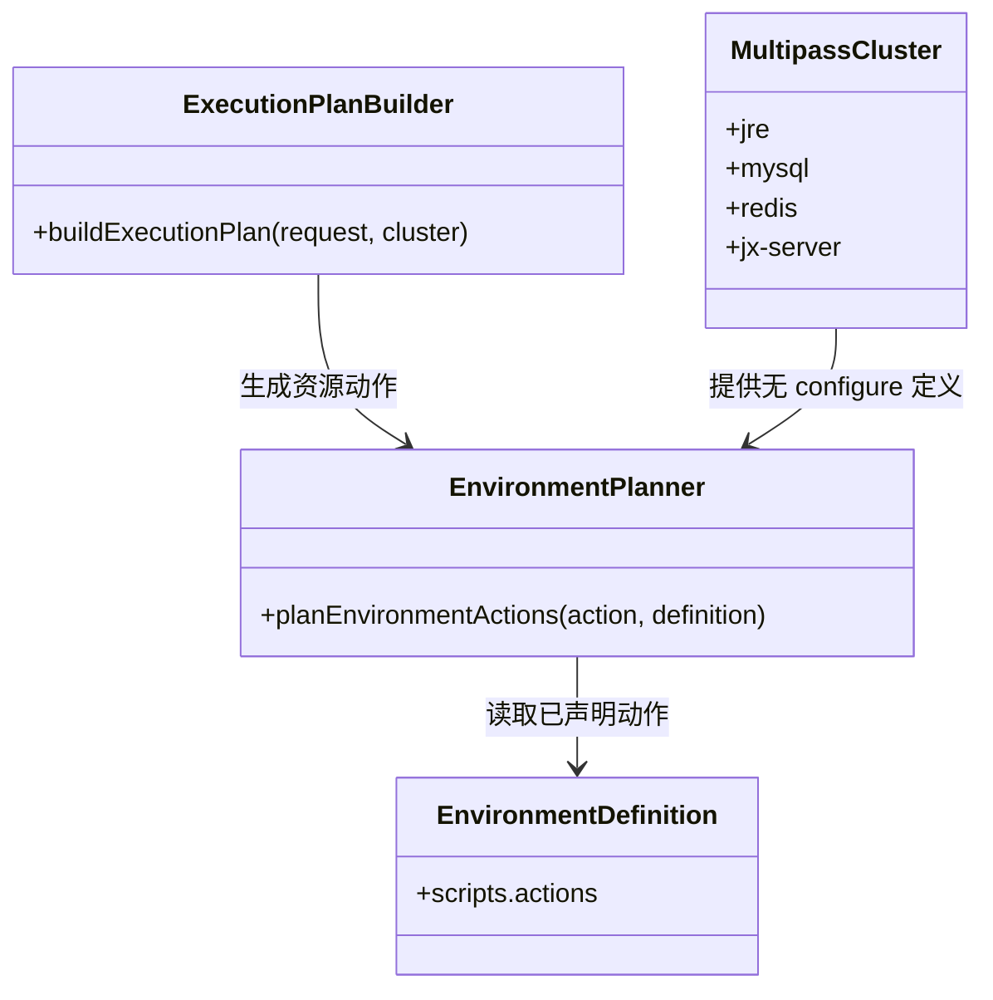
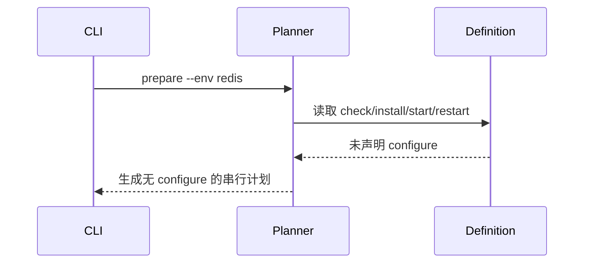

Risk profile: ./risk-profile.yaml

## Design Scope

本设计让 `configure` 成为环境/App 的可选生命周期动作：资源声明了 `configure`
时保持现有行为；未声明时不生成该步骤。Multipass 示例按用户裁剪删除全部 configure
脚本和相关职责，删除 `jx-runtime`，并让 `jx-server` 直接依赖 `jre`、`mysql`、`redis`。

## Useful Context

`planEnvironmentActions` 当前在环境 `deploy/configure` 时强制要求 configure；`buildExecutionPlan`
也假定环境 prepare 有 configure、App deploy 必须先 configure。示例 App 的 deploy 检查并打包
`application.yml`，该文件由已删除的 App configure 生成；MySQL check 还要求 schema
标记和表结构。若只删除脚本，这些假设会造成配置校验或部署失败。

## Overall Approach

框架侧最小改动是把“有 configure 才加入计划”作为通用规则。对环境 prepare/deploy，check
仍可选、install 仍强制；对 App deploy，只有声明 configure 才加入 configure。Multipass 示例随后删除
configure 及其附属模板、秘密消费、`jx-runtime` 和对应检查假设。

不新增配置模式或开关；YAML 中省略 `configure` 本身就是声明。已有显式 configure 的集群无需迁移。

## Layered Design Document Index

| Level  | Parent Document | Unit                                     | Design Document | Responsibility                                 |
| ------ | --------------- | ---------------------------------------- | --------------- | ---------------------------------------------- |
| module | design.md       | sfo-deploy 生命周期规划与 Multipass 示例 | design.md       | 定义可选 configure、依赖裁剪和示例资产删除边界 |

## Module Relationship UML



## File-Level Interfaces

- Consumer: CHG-optional-multipass-configure
- Compatibility: backward-compatible

```typescript
// src/environment.ts
export function planEnvironmentActions(
  requestedAction: string,
  definition: EnvironmentDefinition,
): readonly EnvironmentAction[];

// src/planning.ts
function orderedActions(
  definition: EnvironmentDefinition | AppDefinition,
  requestedAction: string,
): readonly string[];
```

`planEnvironmentActions` 对无 `configure` 的定义返回不包含 configure 的序列；显式 configure
的返回值保持不变。`orderedActions` 是规划器内部辅助接口，环境和 App 都通过它决定动作序列。

Multipass 生命周期脚本不是模块级公共 API；变更是其 YAML 声明与远端行为契约：无 configure
时执行器不暴露秘密、模板或 `DEPLOYMENT_METADATA_PATH.templates`。

## API and Build Surface Impact

- Public API impact: backward-compatible
- Crate-root export change: no
- Build-surface change: yes
- Documentation examples affected: yes

## Consumer Migration Closure

| Old Symbol                   | New Path                       | Change ID                        | Consumer Kind        | Consumer Path                                                              | Migration Status |
| ---------------------------- | ------------------------------ | -------------------------------- | -------------------- | -------------------------------------------------------------------------- | ---------------- |
| `scripts.configure` 强制假设 | 可选 `scripts.configure`       | CHG-optional-multipass-configure | 集群 YAML 调用方     | `docs/guides/sfo-deploy-cluster-configuration.md`                          | migrated         |
| `jx-runtime` 聚合环境        | `jre`/`mysql`/`redis` 直接依赖 | CHG-optional-multipass-configure | Multipass 集群调用方 | `examples/eleph-server-multipass/cluster-template/apps/jx-server/app.yaml` | migrated         |

## Key Flows



App deploy 在无 App configure 时直接生成 `deploy`；install/deploy 的远端错误和回滚路径沿用现有行为。

## State and Ownership

not-applicable: 不修改持久化数据、发布历史或共享运行时状态；只改变计划动作集合和示例资产。

## Directly Mapped Change Items

| change_id                        | target_module        | proposal_id | Design Coverage                                                                                            | Scope Paths                                                           |
| -------------------------------- | -------------------- | ----------- | ---------------------------------------------------------------------------------------------------------- | --------------------------------------------------------------------- |
| CHG-optional-multipass-configure | deployment-framework | P-001       | 使 configure 可选；删除 Multipass configure、jx-runtime、附属模板/秘密声明，并调整检查和 App deploy 假设。 | `src/**`, `tests/**`, `docs/**`, `examples/eleph-server-multipass/**` |

## Implementation Order

| Phase | Goal                          | Depends On | Output                                  |
| ----- | ----------------------------- | ---------- | --------------------------------------- |
| 1     | 实现可选 configure 的规划行为 | none       | `src/environment.ts`, `src/planning.ts` |
| 2     | 裁剪 Multipass 模板与生成集群 | Phase 1    | `examples/eleph-server-multipass/**`    |
| 3     | 更新框架测试与文档            | Phases 1-2 | `tests/**`, `docs/**`                   |

## File-Level Implementation Sequence

| Sequence | File Level Module                                                                                           | Action               | Depends On           | Change ID                        | Scope Path                                                                                                  | Implementation Task |
| -------- | ----------------------------------------------------------------------------------------------------------- | -------------------- | -------------------- | -------------------------------- | ----------------------------------------------------------------------------------------------------------- | ------------------- |
| 1        | `src/environment.ts`                                                                                        | modify               | none                 | CHG-optional-multipass-configure | `src/environment.ts`                                                                                        | root                |
| 2        | `src/planning.ts`                                                                                           | modify               | `src/environment.ts` | CHG-optional-multipass-configure | `src/planning.ts`                                                                                           | root                |
| 3        | Multipass YAML 与脚本资产                                                                                   | create/delete/modify | framework changes    | CHG-optional-multipass-configure | `examples/eleph-server-multipass/**`                                                                        | root                |
| 4        | `tests/**`                                                                                                  | modify               | framework changes    | CHG-optional-multipass-configure | `tests/**`                                                                                                  | root                |
| 5        | `README.md`, `examples/eleph-server-multipass/README.md`, `docs/guides/sfo-deploy-cluster-configuration.md` | modify               | implementation       | CHG-optional-multipass-configure | `README.md`, `examples/eleph-server-multipass/README.md`, `docs/guides/sfo-deploy-cluster-configuration.md` | root                |

## Design Notes

- 省略 `configure` 是自然声明；不引入 `configure_required` 之类的重复开关。
- 已有 configure 的资源必须保持旧顺序和秘密/模板暴露行为。
- 用户明确接受 Multipass 不再交付数据库初始化、Redis 认证、systemd unit、Java alternatives
  和应用配置。

## Risks and Rollback

主要风险是删除动作导致依赖链断开或 App deploy 继续引用不存在文件；通过计划测试和 Multipass
合同检查阻断。若需回退，可恢复各 YAML 的 `scripts.configure`、脚本/模板与
`jx-runtime`；框架侧可选化本身向后兼容。
