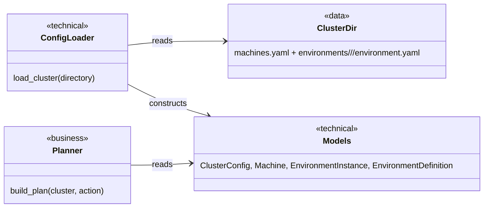
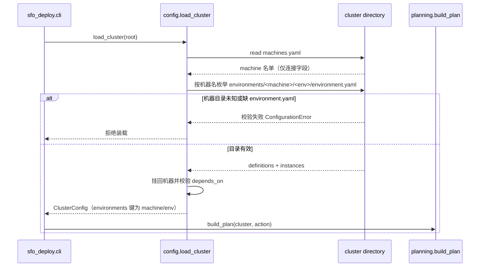

# 环境目录按机器组织设计

Risk profile: ./risk-profile.yaml

## Design Scope

### Goals

- 让 `machines.yaml` 只保留机器身份与连接信息，不再承载任何环境相关字段。
- 让 `environments/<机器名>/<app>/environment.yaml`
  成为每台机器上某个第三方工具环境的自包含声明（含版本、参数、依赖、权限、脚本、模板、密钥声明）。
- 保留 `apps/` 独立目录与 `cluster.yaml.apps`
  放置语义（自研应用，经常更新），保留现有生命周期脚本机制。

### Non-goals

- 不提供旧布局兼容装载或自动迁移（用户已确认 clean break）。
- 不改变 `prepare-multipass.*` 的 VM 引导、SSH 信任与原子发布机制本身。
- 不把自研应用并入环境目录，也不改变 App 的部署/启动/停止语义。

## Useful Context

- 现有 `ClusterConfig`：`machines`（含 `environments`
  实例列表）、`environments`（按定义名索引）、`apps`、`placements`；`build_plan` 依赖
  `machine.environments` 与 `cluster.environments[env.definition]` 两个映射。
- 现有 `resolve_environment` 校验 `instance.definition == definition.name`，并合并定义 `defaults`
  与实例 `parameters`；`instance_id` 与计划节点 id 都是 `machine/env`。
- `machines.yaml` 解析使用严格字段校验（未知字段报错），因此移除 `environments`
  字段后，旧文件会自动被拒，无需额外分支。
- 示例 `cluster-template` 是 `prepare-multipass.*` 复制发布信任包的唯一来源；prepare 脚本只替换根部
  `machines.yaml` 的 IP 占位，不触碰 `environments/`。

## Overall Approach

保持现有内部模型与规划/执行管线不变，只把“机器环境从哪里来”改为目录枚举：

1. `_load_machines` 只解析机器连接字段，机器对象先不带环境。
2. 新增 `_load_machine_environments(root, machines)`：读取
   `environments/<机器名>/<app>/environment.yaml`，每个目录同时产生一个 `EnvironmentDefinition`（key
   为 `机器名/环境名`）和一个 `EnvironmentInstance`（`definition` 指向同一 key）。
3. 用 `dataclasses.replace` 把实例挂回机器后校验依赖。
4. 示例模板改为 `environments/eleph-server/<env>/` 布局，并在每个 `environment.yaml` 内声明
   `version`、`parameters`、`depends_on`。
5. 测试夹具、契约断言与 README 同步到新布局；旧布局由严格校验明确拒绝。

## Layered Design Document Index

| level     | parent_document | unit                              | design_document                                                                   | responsibility                  |
| --------- | --------------- | --------------------------------- | --------------------------------------------------------------------------------- | ------------------------------- |
| root      | `design.md`     | deployment-framework / sfo-deploy | `design.md`                                                                       | 环境目录布局与装载/规划行为设计 |
| submodule | `design.md`     | (无新增子模块)                    | not-applicable: 变更仅落在 `config.py` 单一文件级模块与数据模板，无新增业务子模块 | 无子模块层                      |

## Module Relationship UML



## File-Level Interfaces

```python
# src/sfo_deploy/config.py
def _load_machines(path: Path, root: Path) -> dict[str, Machine]: ...

def _load_machine_environments(
    root: Path, machines: Mapping[str, Machine]
) -> tuple[
    dict[str, EnvironmentDefinition],          # key: "<machine>/<env>"
    dict[str, tuple[EnvironmentInstance, ...]], # key: machine name
]: ...

def load_cluster(directory: str | Path) -> ClusterConfig:
    """签名不变；返回对象的 environments 映射改为按 '<machine>/<env>' 索引。"""
```

- Consumer: `sfo_deploy.cli` / `sfo_deploy.planning` / `sfo_deploy.integration` /
  `CHG-environment-dir-layout`
- Compatibility: backward-compatible, migration-required, breaking
- Migration path: 所有仓库内消费者与文档示例迁移到新键与每机自包含 YAML；旧集群不提供装载迁移

## API and Build Surface Impact

- Public API impact: breaking
- Crate-root export change: no
- Build-surface change: no
- Documentation examples affected: yes

## Consumer Migration Closure

| Old Symbol                                        | New Path                                                 | change_id                  | Consumer Path                                                        | Consumer Kind | Migration Status |
| ------------------------------------------------- | -------------------------------------------------------- | -------------------------- | -------------------------------------------------------------------- | ------------- | ---------------- |
| `cluster.environments["database"]`                | `cluster.environments["<machine>/<env>"]`                | CHG-environment-dir-layout | `tests/unit/test_config_planning.py`                                 | test          | migrated         |
| `set(cluster.environments) == {"jre", ...}`       | `set(cluster.environments) == {"eleph-server/jre", ...}` | CHG-environment-dir-layout | `examples/eleph-server-multipass/tests/test_config_contract.py`      | test          | migrated         |
| 共享定义式 environments/<定义名>/environment.yaml | 每机 environments/<机器名>/<环境名>/environment.yaml     | CHG-environment-dir-layout | `tests/conftest.py`                                                  | test fixture  | migrated         |
| machines.yaml 环境实例列表字段                    | machines.yaml 无环境字段（目录即声明）                   | CHG-environment-dir-layout | `examples/eleph-server-multipass/cluster-template/machines.yaml.tpl` | data template | migrated         |

## Key Flows



## State and Ownership

- Owner: `sfo_deploy.config` 装载器（集群目录树）
- 持久状态只有一个：集群目录树本身。所有者是 `sfo_deploy.config` 装载器；其他模块只读
  `ClusterConfig`。
- 不变量：机器名与 `environments` 顶层目录名一致；环境实例身份恒为 `机器名/环境名`；`machines.yaml`
  不含环境字段；`apps/` 与 `cluster.yaml.apps` 保持独立。
- 无运行期共享状态变化，无状态转换图。

## Directly Mapped Change Items

| change_id                  | target_module | proposal_id                       | Design Coverage                                                       | Scope Paths                                                                        | Interface / Boundary Impact                                                                       | Notes                               |
| -------------------------- | ------------- | --------------------------------- | --------------------------------------------------------------------- | ---------------------------------------------------------------------------------- | ------------------------------------------------------------------------------------------------- | ----------------------------------- |
| CHG-environment-dir-layout | sfo-deploy    | P-001, P-002, P-003, P-004, P-005 | 本文件 Module Relationship/Key Flows/File-Level Interfaces 与下方序列 | `src/sfo_deploy/**`, `examples/eleph-server-multipass/**`, `tests/**`, `README.md` | `ClusterConfig.environments` 键变为 machine/env；environment.yaml schema 扩展；机器环境从目录枚举 | 保留 `apps/` 独立语义；旧布局不兼容 |

## Implementation Order

| Phase | Goal                                               | Depends On | Output                  |
| ----- | -------------------------------------------------- | ---------- | ----------------------- |
| 1     | 先改数据形状：示例模板环境目录与 machines.yaml.tpl | 无         | 新布局数据源            |
| 2     | 改造装载器：machines 无环境解析 + 机器目录枚举     | Phase 1    | `config.py` 新装载逻辑  |
| 3     | 同步测试夹具与断言                                 | Phase 1, 2 | 新布局测试              |
| 4     | 同步文档与生成集群状态                             | Phase 1    | README 与本地信任包一致 |

## File-Level Implementation Sequence

| sequence | file_level_module                                                    | action                                                                                       | depends_on | change_id                  | scope_path                                        | implementation_task |
| -------- | -------------------------------------------------------------------- | -------------------------------------------------------------------------------------------- | ---------- | -------------------------- | ------------------------------------------------- | ------------------- |
| 1        | `examples/eleph-server-multipass/cluster-template/environments/**`   | modify（目录重排为 `<machine>/<env>/`，environment.yaml 增加 version/parameters/depends_on） | none       | CHG-environment-dir-layout | `examples/eleph-server-multipass/**`              | I-001               |
| 2        | `examples/eleph-server-multipass/cluster-template/machines.yaml.tpl` | modify（移除 environments 列表）                                                             | 1          | CHG-environment-dir-layout | `examples/eleph-server-multipass/**`              | I-002               |
| 3        | `src/sfo_deploy/config.py`                                           | modify（_load_machines 去掉环境解析；新增 _load_machine_environments；load_cluster 组装）    | 1, 2       | CHG-environment-dir-layout | `src/sfo_deploy/**`                               | I-003               |
| 4        | `tests/conftest.py`                                                  | modify（夹具改为每机自包含环境目录）                                                         | 3          | CHG-environment-dir-layout | `tests/**`                                        | I-004               |
| 5        | `tests/unit/test_config_planning.py`                                 | modify（environments 键与依赖注入断言）                                                      | 4          | CHG-environment-dir-layout | `tests/**`                                        | I-005               |
| 6        | `examples/eleph-server-multipass/tests/test_config_contract.py`      | modify（environments 键断言）                                                                | 4          | CHG-environment-dir-layout | `examples/eleph-server-multipass/**`              | I-006               |
| 7        | `README.md`、`examples/eleph-server-multipass/README.md`             | modify（布局与示例）                                                                         | 1          | CHG-environment-dir-layout | `README.md`, `examples/eleph-server-multipass/**` | I-007               |
| 8        | `examples/eleph-server-multipass/clusters/multipass/**`              | regenerate（git-ignored 本地信任包，手动同步模板布局）                                       | 1          | CHG-environment-dir-layout | `examples/eleph-server-multipass/**`              | I-008               |

## Design Notes

- Rejected
  alternative：双布局兼容装载。有真实成本（校验分支、实例/定义两套来源、隐藏漂移）且与用户“不兼容旧布局”的决定冲突，因此拒绝。
- Rejected alternative：`cluster.environments`
  继续按环境名索引、多机同名环境互相覆盖。会破坏多机各自参数的实例语义，拒绝。
- New abstraction justification：不新增抽象；沿用
  `EnvironmentDefinition`/`EnvironmentInstance`/`ScriptDefinition`，仅改变装载来源与键语义，保持规划与执行代码零改动。
- Test-stage details：测试用例、夹具与验证 id 由 testing 阶段设计，本文件不承载。
- Large-module submodule decision：`config.py` 是唯一装载器文件级模块，按“大模块根 3+
  独立对外文件才拆子模块”的判断不拆分。

## Risks and Rollback

- 旧布局集群（含当前生成的 `clusters/multipass`）按设计拒绝装载；回滚方式为恢复代码后按旧模板重新
  prepare 生成。
- 若环境中存在脚本路径相对于 `environment.yaml` 的假设，目录层级从 `environments/<def>/` 变为
  `environments/<machine>/<env>/`，脚本相对路径（`scripts/*.py`、`templates/*`）保持不变。
- `ClusterConfig.environments` 键语义变化需要同步全部仓库内消费者（见 Consumer Migration
  Closure）；漏改会以测试失败暴露。
- 多机同名环境各自独立目录时，key 冲突不会发生（键含机器名）。
