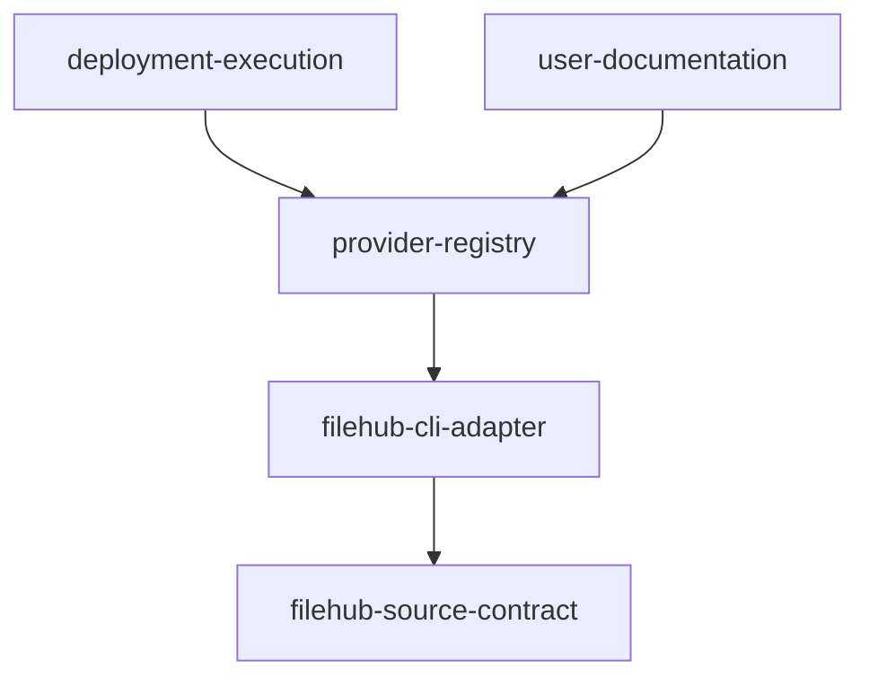
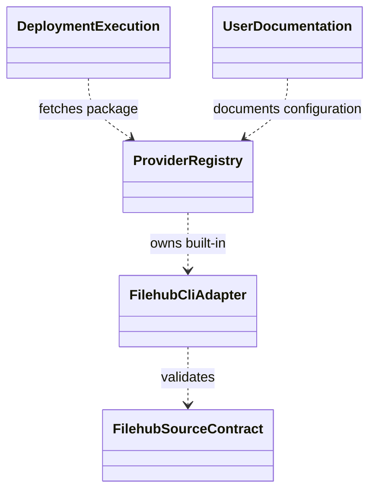
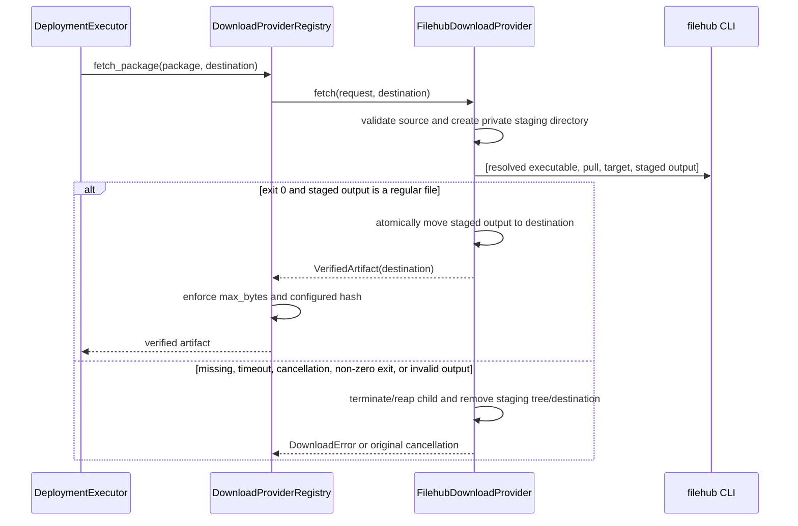
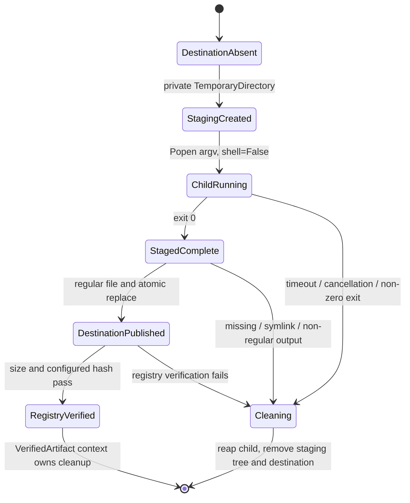

# filehub 下载支持自动流水线计划

Workflow tier: high-risk

Risk profile: ./risk-profile.yaml

## Trigger

- Proposal: docs/versions/v0.1/modules/sfo-deploy/011-add-filehub-download/proposal.md
- User launch confirmed: yes
- User launch statement: `确认，自动完成`
- Launch stage: proposal
- First auto stage: design
- Design source: pipeline/plan.md
- Per-stage user confirmation: skipped by explicit user auto-pipeline authorization
- Auto-confirm completed document stages: no design/testing Markdown documents generated;
  repository-local document extensions only
- Auto-pipeline document policy: stage-selective; automatic design uses pipeline plan; automatic
  testing uses runtime state; testplan.yaml required for automatic testing
- Version: v0.1
- Packet module: sfo-deploy
- Task name: 011-add-filehub-download
- Target module(s): sfo-deploy
- change_id values: CHG-filehub-download

## Acceptance Baseline

- 最终验收以用户确认的 `proposal.md` 为需求基线；上游 filehub 命令以检查时提交
  `1931c789f4733d17f6455c22b0aa9af2eb873120` 的 `pull`、稳定退出码、安装文档和 `reqwest::Client`
  每请求 60 秒总超时为兼容依据。当前 pull
  会顺序执行项目解析、版本元数据读取和流式下载，并可能进行一次 session 续期；因此 sfo-deploy 另设
  900 秒进程总期限，不能把单个 HTTP 请求的 60 秒误当成整个 CLI
  进程期限。若上游改变命令位置参数、输出覆盖语义、退出码或请求序列，需先重新审查兼容边界。

## Stage Graph

| Task ID | Stage          | Execution Mode | Responsibility                                          | Scope                                           | Parent Task | Depends On | Output                                       | Done Condition                                                   |
| ------- | -------------- | -------------- | ------------------------------------------------------- | ----------------------------------------------- | ----------- | ---------- | -------------------------------------------- | ---------------------------------------------------------------- |
| D-1     | design         | auto-pipeline  | 审查并固化 filehub 配置、进程、凭据、工件和失败恢复边界 | 本计划设计映射与 risk-profile.yaml              | root        | none       | 通过结构检查的 pipeline/plan.md 与风险检查项 | 设计映射完整且未生成 design.md                                   |
| I-1     | implementation | auto-pipeline  | 实现 filehub provider、默认注册与错误提示               | downloads.py                                    | root        | D-1        | 满足设计的生产代码                           | provider 覆盖 P-001/P-002/P-003 且不修改测试文件                 |
| I-2     | implementation | auto-pipeline  | 补充 filehub 配置、安装和登录前置说明                   | README.md                                       | root        | I-1        | 与实现一致的用户文档                         | README 覆盖 P-004 且示例采用最终 source.target 契约              |
| T-1     | testing        | auto-pipeline  | 从提案、设计和交付代码派生并执行任务级测试              | 下载单元/契约测试、testplan 和 runtime evidence | root        | I-2        | 测试实现、testplan.yaml、测试运行制品        | `sfo-deploy/011-add-filehub-download all` 成功并覆盖所有触发风险 |
| A-1     | acceptance     | auto-pipeline  | 独立证伪需求、设计、实现、失败边界与测试充分性          | 全部交付物和任务运行证据                        | root        | T-1        | acceptance-report.md                         | 独立验收结论 accepted                                            |

## Submodule Tasks

| Task ID | Stage | Execution Mode | Responsibility | Submodule | Parent Task | Depends On | Output | Done Condition |
| ------- | ----- | -------------- | -------------- | --------- | ----------- | ---------- | ------ | -------------- |

filehub source 校验、进程调用、目标生命周期和注册表组成同一个下载 provider
控制流，并落在同一生产文件中；拆成多个并行实现任务会增加错误清理与二次校验不一致的风险，因此由 I-1
合并实现。README 在接口稳定后由 I-2 串行更新；测试必须再独立派生，验收必须与实现/测试分离。

## Parallel Scheduling

- Strategy: dependency-ready-set
- Concurrency: use all runtime-available child-agent slots
- Shared artifact owner: parent-orchestrator
- Lock directory: `.harness/locks/`
- Dispatch rule: launch dependency-ready work with practical edit coordination and available
  capacity
- Serialization reasons: explicit dependency, edit coordination, or exhausted concurrency capacity
- Evidence: record launched task ids and serialization reasons in
  `.harness/pipelines/v0.1/sfo-deploy/011-add-filehub-download/state.json` scheduler waves

## Dependency Graphs



| Level     | Parent     | Node                    | Depends On              |
| --------- | ---------- | ----------------------- | ----------------------- |
| submodule | sfo-deploy | filehub-source-contract | none                    |
| submodule | sfo-deploy | filehub-cli-adapter     | filehub-source-contract |
| submodule | sfo-deploy | provider-registry       | filehub-cli-adapter     |
| submodule | sfo-deploy | deployment-execution    | provider-registry       |
| submodule | sfo-deploy | user-documentation      | provider-registry       |

## Runtime Call and Lifecycle







## Exported Interfaces

| Interface                                                                                        | Owner               | Consumer                                                    | Compatibility       | Affected Callers                 | Migration Path                                   |
| ------------------------------------------------------------------------------------------------ | ------------------- | ----------------------------------------------------------- | ------------------- | -------------------------------- | ------------------------------------------------ |
| `package.provider: filehub` 与 `package.source.target: SERVER/PROJECT/VERSION/NAME`              | provider-registry   | CHG-filehub-download、项目部署 YAML 与 `DeploymentExecutor` | backward-compatible | 现有配置装载器和下载注册表消费者 | 新 provider 与 http/https 并存；既有配置无需迁移 |
| `FilehubDownloadProvider.fetch(request: DownloadRequest, destination: Path) -> VerifiedArtifact` | filehub-cli-adapter | `DownloadProviderRegistry.fetch`                            | new                 | 无既有调用方                     | 由默认注册表内部消费，不替换现有 provider 接口   |
| 客户端缺失 `DownloadError`（包含 `filehub` 命令名与官方安装入口）                                | filehub-cli-adapter | sfo-deploy CLI 错误映射与操作者                             | backward-compatible | 现有下载错误处理器               | 仍属于既有下载错误/退出码 4，仅增加可操作详情    |

## File-Level Interfaces

`src/sfo_deploy/downloads.py` 保持下载状态与子进程生命周期的单一所有者；这些新增符号由
`CHG-filehub-download` 和默认注册表消费，不增加新的凭据或配置所有者。

```python
class FilehubDownloadProvider:
    def fetch(self, request: DownloadRequest, destination: Path) -> VerifiedArtifact: ...

def _source_target(source: Mapping[str, Any]) -> str: ...

def _find_filehub_executable() -> str: ...

def _run_filehub_pull(executable: str, target: str, staged_output: Path) -> int: ...

def _terminate_and_reap(process: subprocess.Popen[bytes]) -> None: ...
```

- `FilehubDownloadProvider.fetch` 是 `DownloadProviderRegistry` 的新内部内置实现，兼容性为
  `new`；它只返回最终 `destination` 的 `VerifiedArtifact`。
- `_source_target`、`_find_filehub_executable`、`_run_filehub_pull` 与 `_terminate_and_reap`
  为文件私有实现接口，消费者仅为 `FilehubDownloadProvider.fetch`，不构成公开迁移面。

## API and Build Surface Impact

- Public API impact: backward-compatible
- Crate-root export change: no
- Build-surface change: no
- Documentation examples affected: yes

## Consumer Migration Closure

| Old Symbol     | New Path                        | change_id            | Consumer Path | Consumer Kind    | Migration Status |
| -------------- | ------------------------------- | -------------------- | ------------- | ---------------- | ---------------- |
| not-applicable | new built-in `filehub` provider | CHG-filehub-download | none-found    | runtime consumer | verified-none    |

## State Ownership

| State                                                     | Owner               | Access Interface                                                                                       | Lifecycle                                                                                                                                                                                                          | Failure Transitions                                                                                                                                                   |
| --------------------------------------------------------- | ------------------- | ------------------------------------------------------------------------------------------------------ | ------------------------------------------------------------------------------------------------------------------------------------------------------------------------------------------------------------------ | --------------------------------------------------------------------------------------------------------------------------------------------------------------------- |
| 下载暂存树、最终目标与 provider 返回的 `VerifiedArtifact` | filehub-cli-adapter | `filehub pull TARGET STAGED_OUTPUT`、同文件系统原子移动与 `VerifiedArtifact.cleanup()`                 | 最终目标必须先不存在；在目标父目录创建唯一私有暂存目录，CLI 的最终文件及 `.DESTINATION_NAME.PROCESS_ID.tmp` 都只能落在该目录；CLI 成功且输出为普通文件后原子移动到最终目标，框架二次校验后由既有上下文管理生命周期 | 命令缺失、非零退出、超时、异常/取消、未生成普通文件均先回收子进程再递归清理私有暂存目录；发布最终目标后发生异常、超限或哈希失败则删除最终目标，任何失败都不得返回工件 |
| filehub 客户端凭据与服务器配置                            | filehub CLI         | 默认凭据文件、`FILEHUB_CONFIG` 与其它 `FILEHUB_*` 环境变量                                             | sfo-deploy 只继承环境并调用 pull，不读取、缓存、变更或输出凭据                                                                                                                                                     | 无凭据/认证/授权失败由 filehub 非零退出，sfo-deploy 分类为下载失败且不重试                                                                                            |
| 外部 filehub 进程                                         | filehub-cli-adapter | `shutil.which("filehub")` 得到的绝对可执行路径、`subprocess.Popen` argv、`stdin/stdout/stderr=DEVNULL` | 单次下载启动一个同步子进程；`shell=False`，不自动重试；filehub 每个网络请求有 60 秒总超时，sfo-deploy 对整个当前兼容序列施加 900 秒总期限                                                                          | 启动失败、总超时、非零退出和调用线程取消均执行 terminate -> 2 秒等待 -> kill -> wait 的有界回收；原始取消异常在清理后继续抛出，子进程输出从不转发或记录               |

## Failure Flows

| Flow              | Boundary                                    | Failure                                                                                          | Handling                                                                                                                                                                                                                  |
| ----------------- | ------------------------------------------- | ------------------------------------------------------------------------------------------------ | ------------------------------------------------------------------------------------------------------------------------------------------------------------------------------------------------------------------------- |
| 配置进入 provider | `package.source` -> filehub-source-contract | source 不是映射、缺少/空 target、存在未知字段                                                    | 在启动进程前抛出 `DownloadError`；target 去除首尾空白后作为单一 argv 值，不自行解析或改写上游目标串                                                                                                                       |
| 查找客户端        | PATH -> filehub-cli-adapter                 | `shutil.which("filehub")` 无结果，或解析后启动时文件已消失                                       | 抛出中文 `DownloadError`，包含官方仓库 README 安装入口和 Linux/macOS、Windows 提示；不自动联网或执行安装脚本                                                                                                              |
| 启动下载          | sfo-deploy -> filehub CLI                   | 进程启动 OSError、900 秒总超时、调用线程取消或未生成目标                                         | 使用解析后的可执行绝对路径及 `[executable, "pull", target, str(staged_output)]`，`shell=False`、三个标准流均为 `DEVNULL`；超时/取消时 terminate 后 2 秒未退出则 kill 并 wait，清理整个暂存树且不重试                      |
| 外部下载          | filehub CLI -> filehub 服务                 | 退出码 1-8、未知非零退出，或单个请求的 60 秒超时                                                 | 不转发可能含凭据的 stdout/stderr；以稳定退出码生成固定且有界的类别提示（1 客户端用法/兼容，2 认证，3 授权，4 冲突，5 目标输入/不存在，6 网络/超时，7 完整性，8 本地文件系统，其他为未知失败），统一包装为 `DownloadError` |
| 暂存发布          | 私有暂存目录 -> provider 目标               | CLI 残留 `.DESTINATION_NAME.PROCESS_ID.tmp`、输出缺失、符号链接/非普通文件，或发布时发生 OSError | 暂存目录与最终目标位于同一父目录；仅普通 staged output 可原子移动到仍应不存在的 destination，随后清理整个暂存树；任一失败清理暂存树和已出现的最终目标                                                                     |
| 框架二次校验      | provider 目标 -> DownloadProviderRegistry   | 符号链接/非普通文件、超过 max_bytes、配置声明哈希不匹配                                          | 既有 `_verify_artifact` 拒绝并清理；成功时用实际算法/哈希/大小覆盖工件元数据                                                                                                                                              |
| 取消与清理        | Python 调用线程 -> 子进程/暂存树/目标文件   | `KeyboardInterrupt` 或其它 BaseException                                                         | 先确保子进程结束并被 wait 回收，再清理暂存树和已经出现的目标，最后原样重抛；不把取消转换成下载错误、成功或可复用工件                                                                                                      |

## Rejected Alternatives

| Decision Type | Selected                                                                                                   | Rejected                                                                                                | Reason                                                                                                                                 |
| ------------- | ---------------------------------------------------------------------------------------------------------- | ------------------------------------------------------------------------------------------------------- | -------------------------------------------------------------------------------------------------------------------------------------- |
| boundary      | 调用官方 filehub CLI，并由 sfo-deploy 保留最终完整性校验                                                   | 在 sfo-deploy 内复制 filehub HTTP API、认证续期和凭据存储                                               | CLI 已是上游稳定交付面；复制会扩大安全、兼容和依赖边界                                                                                 |
| technical     | 通过 PATH 解析可执行文件后用无 shell argv 同步调用，输出落入同父目录私有暂存树，继承 filehub 默认配置/环境 | 直接把最终目标交给 CLI、shell 命令字符串、YAML token/password、运行时自动安装或自定义 provider 插件要求 | 私有暂存树可清理上游 PID 临时文件且避免失败目标暴露；argv 避免注入，默认凭据保持单一所有者；内置 provider 才满足开箱支持与缺失提示要求 |
| technical     | 不转发 stdout/stderr，按稳定退出码给出固定诊断；外层施加 900 秒总期限并回收进程                            | 捕获后截断原始输出、只依赖上游单请求 60 秒超时、无限等待                                                | 截断仍可能泄露位于前缀中的 token/session，单请求超时也不是 CLI 总时限；固定诊断和总期限同时满足凭据与生命周期边界                      |
| collaboration | I-1 合并 source/进程/清理/注册与文档实现，T-1 独立派生测试，A-1 独立验收                                   | 将同一 downloads.py 控制流拆给多个并行实现任务                                                          | 单文件共享失败路径，拆分会增加并发编辑和边界漂移，独立测试/验收仍提供职责分离                                                          |

## Implementation Scope Bindings

| change_id            | target_module | proposal_id                | design_coverage                                                                                                                                  | scope_paths                                  | design_rules_applied                                                                                |
| -------------------- | ------------- | -------------------------- | ------------------------------------------------------------------------------------------------------------------------------------------------ | -------------------------------------------- | --------------------------------------------------------------------------------------------------- |
| CHG-filehub-download | sfo-deploy    | P-001, P-002, P-003, P-004 | filehub-source-contract、filehub-cli-adapter、provider-registry、deployment-execution 与 user-documentation 共同交付配置、运行时、错误和文档边界 | `src/sfo_deploy/**`, `README.md`, `tests/**` | 自顶向下模块分解、无环依赖、公开配置消费者闭包、单一状态所有者、凭据边界、失败/清理流和串行实现顺序 |

## File-Level Implementation Sequence

| Sequence | Task ID | File-Level Module             | Action | Depends On | change_id            | target_module | Scope Paths                   | Context Sources                                                                                        |
| -------- | ------- | ----------------------------- | ------ | ---------- | -------------------- | ------------- | ----------------------------- | ------------------------------------------------------------------------------------------------------ |
| 1        | I-1     | `src/sfo_deploy/downloads.py` | modify | none       | CHG-filehub-download | sfo-deploy    | `src/sfo_deploy/downloads.py` | proposal P-001/P-002/P-003、Exported Interfaces、File-Level Interfaces、State Ownership、Failure Flows |
| 2        | I-2     | `README.md`                   | modify | I-1        | CHG-filehub-download | sfo-deploy    | `README.md`                   | proposal P-004、最终 source.target 与缺失客户端错误契约                                                |

## Return Rules

- 验收发现提案歧义或错误边界时，以 `rejected` 完成报告并停止流水线，请用户决策，不推断需求。
- 配置、凭据、进程或清理模型缺陷返回 D-1；生产代码/README 缺陷返回
  I-1；覆盖、测试实现或运行证据缺陷返回 T-1。
- 同一阻断问题超过 5 次未成功修复时停止并报告用户。

执行状态、测试证据、返回记录和最终验收仅存储在
`.harness/pipelines/v0.1/sfo-deploy/011-add-filehub-download/state.json`。
