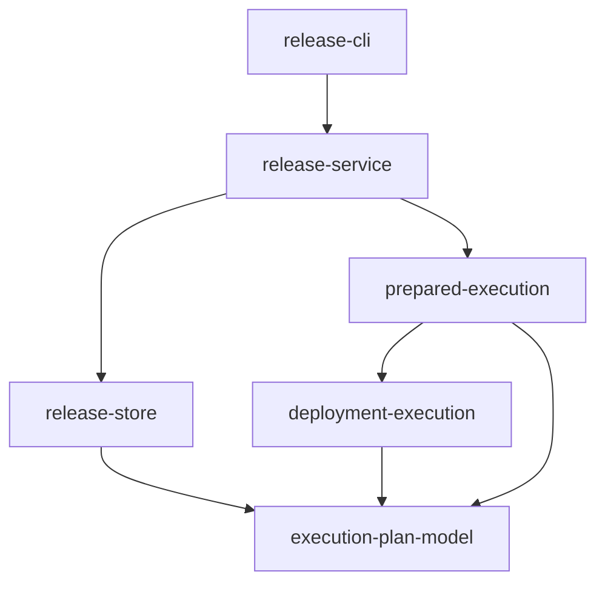
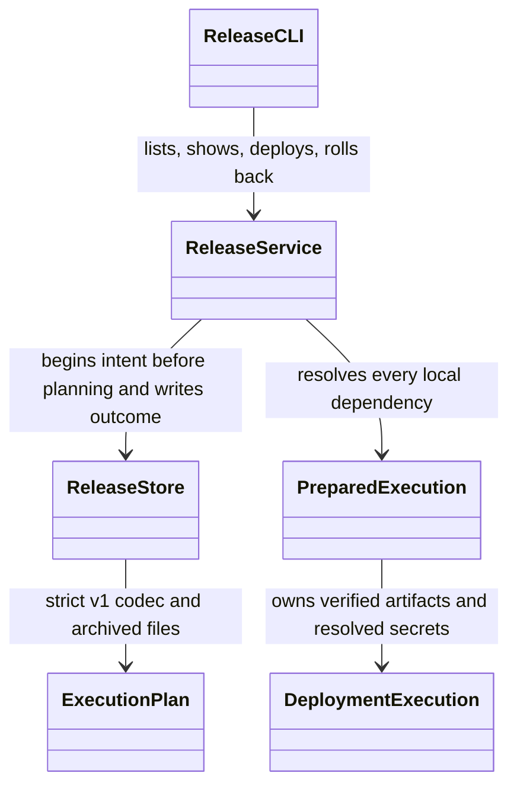
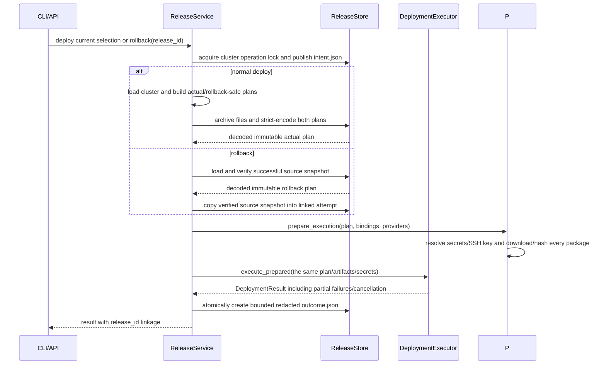
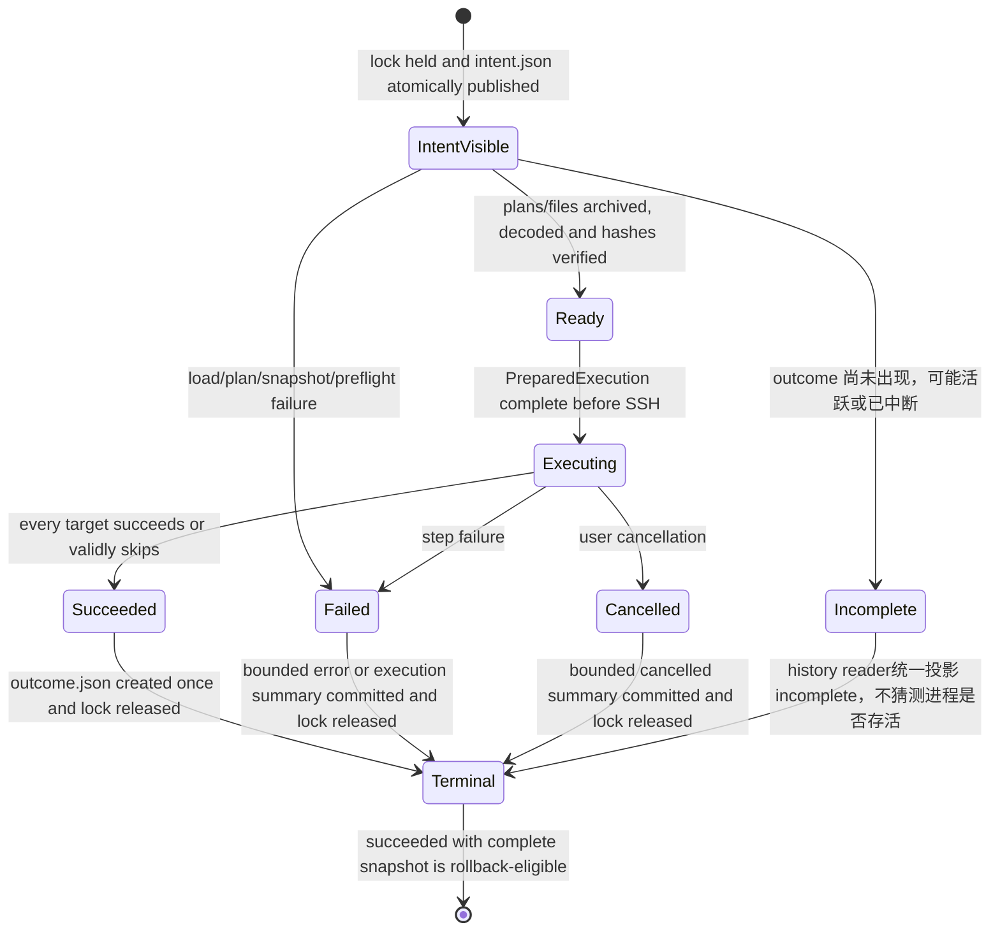

# 发布历史与指定版本回退自动流水线计划

Workflow tier: high-risk

Risk profile: ./risk-profile.yaml

## Trigger

- Proposal: docs/versions/v0.1/modules/sfo-deploy/012-release-history-rollback/proposal.md
- User launch confirmed: yes
- User launch statement: 确认，这里指浏览发布记录，自动完成
- Launch stage: proposal
- First auto stage: design
- Design source: pipeline/plan.md
- Per-stage user confirmation: skipped by explicit user auto-pipeline authorization
- Auto-confirm completed document stages: no design/testing Markdown documents generated;
  repository-local document extensions only
- Auto-pipeline document policy: stage-selective; automatic design uses pipeline plan; automatic
  testing uses runtime state; testplan.yaml required for automatic testing
- Version: v0.1
- Packet module: sfo-deploy
- Task name: 012-release-history-rollback
- Target module(s): sfo-deploy
- change_id values: CHG-release-history, CHG-release-history-cli, CHG-release-rollback

## Acceptance Baseline

- 最终验收以用户确认的 `proposal.md` 为唯一需求基线。
- 风险绑定说明：本流水线从 proposal 启动，`task.yaml.stage` 按自动流水线规则始终保留为手工 launch
  cursor；因此 `risk-profile-check.py --prepare` 按其规范把 `source_bindings.design_source`
  保持为空。实际自动 Design source 由 `task.yaml.pipeline_plan`、Trigger 中的
  `Design source: pipeline/plan.md` 和本计划结构检查共同绑定；不得手工伪造与 checker
  语义冲突的字段。

## Stage Graph

| Task ID | Stage          | Execution Mode | Responsibility                                                                           | Scope                                                  | Parent Task | Depends On | Output                                       | Done Condition                                                               |
| ------- | -------------- | -------------- | ---------------------------------------------------------------------------------------- | ------------------------------------------------------ | ----------- | ---------- | -------------------------------------------- | ---------------------------------------------------------------------------- |
| D-1     | design         | auto-pipeline  | 审查并固化发布记录、不可变快照、查询、回退与失败恢复边界                                 | 本计划设计映射与 risk-profile.yaml                     | root        | none       | 通过结构检查的 pipeline/plan.md 与风险检查项 | 设计映射完整且未生成 design.md                                               |
| I-1     | implementation | auto-pipeline  | 实现版本化 attempt、严格执行计划 codec、快照、原子组件提交和完整性校验                   | 发布历史持久化领域模块                                 | root        | D-1        | 历史模型与存储生产代码                       | 规划前先留 intent，崩溃可见且终态/快照严格校验                               |
| I-2     | implementation | auto-pipeline  | 将包、配置/文件密钥与 SSH key 本地预检移到首次连接前并让执行器消费同一 PreparedExecution | 零远端副作用的执行准备                                 | root        | I-1        | 准备/执行生产代码                            | 所有可本地发现的失败在 connect 前发生，已验证工件不重复下载                  |
| I-3     | implementation | auto-pipeline  | 把发布 attempt、实际快照计划和指定版本回退接入 RunOptions/run                            | 发布与回退编排                                         | root        | I-2        | 编排与结果元数据生产代码                     | deploy 执行反序列化后的快照计划；rollback 只重放安全计划并均终结历史         |
| I-4     | implementation | auto-pipeline  | 暴露 history/rollback CLI、公共 API、JSON 输出与用户文档                                 | CLI、导出契约和 README                                 | root        | I-3        | 公共接口与文档                               | 当前配置损坏时仍可查询/回退，参数互斥、迁移边界和容量说明完整                |
| T-1     | testing        | auto-pipeline  | 从提案、设计和交付代码派生任务级测试并生成运行证据                                       | unit/DV/integration 测试、testplan 和 runtime evidence | root        | I-4        | 测试实现、testplan.yaml 与测试运行制品       | `sfo-deploy/012-release-history-rollback all` 成功并覆盖全部风险与 change_id |
| A-1     | acceptance     | auto-pipeline  | 独立证伪需求、设计、实现、失败边界、安全性与测试充分性                                   | 全部交付物和任务运行证据                               | root        | T-1        | acceptance-report.md                         | 独立验收结论 accepted                                                        |

## Submodule Tasks

| Task ID | Stage | Execution Mode | Responsibility | Submodule | Parent Task | Depends On | Output | Done Condition |
| ------- | ----- | -------------- | -------------- | --------- | ----------- | ---------- | ------ | -------------- |

发布存储、执行准备、编排和 CLI 是同一业务能力的四层串行依赖；分别由 I-1 至 I-4 独立交付。严格 codec
与 attempt 生命周期先稳定，执行器再建立零 SSH 的准备边界，编排随后消费，CLI
最后暴露最终契约；测试必须在生产实现完成后独立派生，验收与实现/测试分离。

## Parallel Scheduling

- Strategy: dependency-ready-set
- Concurrency: use all runtime-available child-agent slots
- Shared artifact owner: parent-orchestrator
- Lock directory: `.harness/locks/`
- Dispatch rule: launch dependency-ready work with practical edit coordination and available
  capacity
- Serialization reasons: explicit dependency, edit coordination, or exhausted concurrency capacity
- Evidence: record launched task ids and serialization reasons in
  `.harness/pipelines/v0.1/sfo-deploy/012-release-history-rollback/state.json` scheduler waves

## Dependency Graphs



| Level     | Parent     | Node                 | Depends On                                 |
| --------- | ---------- | -------------------- | ------------------------------------------ |
| submodule | sfo-deploy | execution-plan-model | none                                       |
| submodule | sfo-deploy | release-store        | execution-plan-model                       |
| submodule | sfo-deploy | deployment-execution | execution-plan-model                       |
| submodule | sfo-deploy | prepared-execution   | deployment-execution, execution-plan-model |
| submodule | sfo-deploy | release-service      | release-store, prepared-execution          |
| submodule | sfo-deploy | release-cli          | release-service                            |

## Runtime Call and Lifecycle







## Exported Interfaces

| Interface                                                                                                | Owner              | Consumer                                                             | Compatibility       | Affected Callers                                                                  | Migration Path                                                                                                                                                                        |
| -------------------------------------------------------------------------------------------------------- | ------------------ | -------------------------------------------------------------------- | ------------------- | --------------------------------------------------------------------------------- | ------------------------------------------------------------------------------------------------------------------------------------------------------------------------------------- |
| `RunOptions(..., action="history", release_id: Optional[str])`                                           | release-service    | `make_entrypoint`、CHG-release-history-cli                           | backward-compatible | `src/sfo_deploy/cli.py` 与项目绑定 API 用户                                       | 新字段有缺省值；既有构造和动作不变                                                                                                                                                    |
| `RunOptions(..., action="rollback", release_id: str)`                                                    | release-service    | `make_entrypoint`、CHG-release-rollback                              | backward-compatible | `src/sfo_deploy/cli.py` 与项目绑定 API 用户                                       | 新动作显式要求 release_id；既有动作不读取该字段                                                                                                                                       |
| `ReleaseRecord`、`ReleaseHistoryResult` 与 `get/list` 查询结果                                           | release-store      | `run`、CLI JSON serializer、CHG-release-history                      | new                 | 无既有调用方                                                                      | 从 `sfo_deploy` 新增导出，不替换现有结果类型                                                                                                                                          |
| `DeploymentResult.release_id` 与 `source_release_id` 可选元数据                                          | release-service    | CLI serializer、项目绑定 API 用户                                    | backward-compatible | `src/sfo_deploy/cli.py` 与 `tests/dv/test_execution.py`                           | 字段带 None 缺省值；既有位置参数构造与结果判定不变                                                                                                                                    |
| `execute_plan` 的全计划本地准备语义                                                                      | prepared-execution | 直接执行 API 用户、release-service                                   | migration-required  | `tests/dv/test_execution.py` 与 `src/sfo_deploy/integration.py`                   | API 签名不变；本地 provider/密钥错误提前到任何 SSH 连接前，调用方不再依赖逐目标延迟下载                                                                                               |
| `ReleaseSourceCodec` 可选 provider 扩展协议                                                              | prepared-execution | `DownloadProviderRegistry`、自定义 DownloadProvider 与 release-store | migration-required  | `src/sfo_deploy/history.py`、`src/sfo_deploy/downloads.py` 与自定义 provider 用户 | HTTP/Filehub 内置实现；需要参与可回退 deploy 的自定义 provider 在同一对象实现版本化 export/import；未实现者仍可被直接 `execute_plan` 使用，但经 `run(... deploy ...)` 时在 SSH 前失败 |
| `.sfo-deploy/releases/RELEASE_ID/intent.json`、可选 `outcome.json` 与 `snapshot/manifest.json` schema v1 | release-store      | 同版本 ReleaseStore 与操作人员备份工具                               | new                 | 集群目录历史消费者                                                                | ReleaseRecord 是读取时对 intent/outcome/snapshot 的投影视图，不另写 record.json；未知 schema 失败关闭且 v1 组件不原地迁移                                                             |

## File-Level Interfaces

`src/sfo_deploy/history.py` 是发布数据、快照路径与提交生命周期的唯一所有者；`integration.py`
只通过其类型和方法访问历史，不直接解析持久化 JSON。

```python
@dataclass(frozen=True)
class ReleaseExecutionSummary:
    exit_code: int
    targets: tuple[ReleaseTargetSummary, ...]

@dataclass(frozen=True)
class ReleaseErrorSummary:
    category: str
    message: str

@dataclass(frozen=True)
class ReleaseRecord:
    release_id: str
    cluster: str
    operation: str
    source_release_id: Optional[str]
    status: str
    started_at: str
    finished_at: Optional[str]
    selection: ReleaseSelection
    apps: tuple[str, ...]
    machines: tuple[str, ...]
    app_versions: Mapping[str, str]
    execution_result: Optional[ReleaseExecutionSummary]
    error: Optional[ReleaseErrorSummary]
    rollback_eligible: bool

@dataclass(frozen=True)
class ReleaseHistoryResult:
    cluster: str
    releases: tuple[ReleaseRecord, ...]

class ReleaseStore:
    def begin_attempt(self, *, operation: str, selection: ReleaseSelection, source_release_id: Optional[str] = None) -> PendingRelease: ...
    def list(self) -> tuple[ReleaseRecord, ...]: ...
    def get(self, release_id: str) -> ReleaseRecord: ...
    def load_rollback_plan(self, release_id: str) -> ExecutionPlan: ...

class PendingRelease:
    def archive_plans(self, executed_plan: ExecutionPlan, rollback_plan: ExecutionPlan) -> ExecutionPlan: ...
    def inherit_rollback_snapshot(self, source_release_id: str) -> ExecutionPlan: ...
    def finish_result(self, result: DeploymentResult) -> ReleaseRecord: ...
    def finish_error(self, *, status: str, category: str, message: str) -> ReleaseRecord: ...

class PreparedExecution(AbstractContextManager):
    plan: ExecutionPlan
    steps: Mapping[str, PreparedStep]

def prepare_execution(plan: ExecutionPlan, bindings: ProjectBindings, registry: DownloadProviderRegistry) -> PreparedExecution: ...
def execute_prepared(prepared: PreparedExecution, transport: SSHTransport) -> DeploymentResult: ...

@runtime_checkable
class ReleaseSourceCodec(Protocol):
    @property
    def release_source_schema(self) -> str: ...
    def export_release_source(self, source: Mapping[str, Any]) -> Mapping[str, Any]: ...
    def import_release_source(self, payload: Mapping[str, Any]) -> Mapping[str, Any]: ...

class DownloadProviderRegistry:
    def export_release_source(self, provider: str, source: Mapping[str, Any]) -> ReleaseSourceEnvelope: ...
    def import_release_source(self, provider: str, envelope: ReleaseSourceEnvelope) -> Mapping[str, Any]: ...
```

- `ReleaseStore`/`PendingRelease` 是文件级内部编排接口，消费者为 `integration.run` 与
  `CHG-release-history`/`CHG-release-rollback`，兼容性为 `new`。`begin_attempt` 在
  `load_cluster/build_plan` 前发布 intent；若没有 outcome，读取时统一派生
  `incomplete`（可能活跃也可能崩溃中断）且永不可回退。
- `ReleaseRecord` 与 `ReleaseHistoryResult` 是新增只读公共结果类型，兼容性为
  `new`；字段只含已校验、脱敏且 JSON 可序列化的摘要。`selection` 始终投影 intent
  中的完整调用选择（机器、App、环境、执行区域、地址类型、依赖开关），包括配置加载或规划前失败的
  attempt；`apps`、`machines`、`app_versions` 只投影已归档 actual plan
  的实际范围，未形成计划时保持为空。
- `ReleaseExecutionSummary` 采用字段白名单，只保存
  step/target/status/exit/error-category/skip/cleanup 的有界摘要；读取时必须与 snapshot
  `actual-plan` 的完整 step ID 集合及每步 machine/kind/resource/action
  精确绑定，拒绝空、缺失、额外、重复或身份漂移的步骤，并校验 step status/exit/error/skip、target
  status 与总 exit code 的组合。既有执行语义中，只有存在同资源后续 install 的 environment check 可用
  succeeded + 非零退出码表示“检查未满足但可继续安装”；`check-satisfied` 只允许跳过该 environment
  install 且其前置 check 必须 exit 0，`target-fail-fast` 必须存在同目标前置失败；成功发布的 App
  configure/deploy 必须实际 succeeded。摘要禁止保存 stdout、stderr、异常
  repr、绝对本地路径或远端临时路径。
- `ReleaseSourceCodec` 由同一个 provider 对象选择性实现，schema id 必须匹配安全名称且写入
  envelope；registry 在 export/import 两端同时核对 provider 名、schema id、有界纯 JSON payload
  和往返结果。内置 HTTP/Filehub codec 固定为 v1，自定义 provider 未实现协议时不允许进入审计
  deploy/rollback，但保留直接 `execute_plan` 的既有扩展用途。
- `integration.run` 保持既有单入口；新增 history/rollback 分支与可选 `release_id` 字段为
  `backward-compatible`，但 deploy 强制可写审计根以及 `execute_plan` 的全计划预检时序属于
  `migration-required` 运行语义。

## API and Build Surface Impact

- Public API impact: migration-required
- Crate-root export change: yes
- Build-surface change: no
- Documentation examples affected: yes

## Consumer Migration Closure

| Old Symbol                                | New Path                                                 | change_id               | Consumer Path                           | Consumer Kind                | Migration Status |
| ----------------------------------------- | -------------------------------------------------------- | ----------------------- | --------------------------------------- | ---------------------------- | ---------------- |
| DeploymentResult without release metadata | `DeploymentResult.release_id` / `source_release_id`      | CHG-release-history-cli | `src/sfo_deploy/cli.py`                 | runtime consumer             | migrated         |
| incremental per-step preparation          | `prepare_execution` before `execute_prepared`            | CHG-release-rollback    | `src/sfo_deploy/integration.py`         | runtime consumer             | migrated         |
| direct `execute_plan` tests               | unchanged signature with earlier local-failure timing    | CHG-release-rollback    | `tests/dv/test_execution.py`            | repository test consumer     | migrated         |
| custom `DownloadProvider.fetch` only      | `DownloadProvider.fetch` + optional `ReleaseSourceCodec` | CHG-release-history     | `tests/integration/test_project_cli.py` | repository provider consumer | migrated         |

## State Ownership

| State                                                                | Owner              | Access Interface                                                                                        | Lifecycle                                                                                                                                                                                                                                                                                                                                                                                                                  | Failure Transitions                                                                                                                                                                                                  |
| -------------------------------------------------------------------- | ------------------ | ------------------------------------------------------------------------------------------------------- | -------------------------------------------------------------------------------------------------------------------------------------------------------------------------------------------------------------------------------------------------------------------------------------------------------------------------------------------------------------------------------------------------------------------------- | -------------------------------------------------------------------------------------------------------------------------------------------------------------------------------------------------------------------- |
| 发布 attempt 目录、intent/outcome、snapshot manifest 与归档脚本/模板 | release-store      | `ReleaseStore` 与 `PendingRelease`                                                                      | release ID 必须匹配 `rYYYYMMDDTHHMMSSffffffZ-[0-9a-f]{16}`；获取同集群跨进程独占锁后，在隐藏暂存目录完整写入并同步 intent，再把整个目录原子发布为 0700 attempt；snapshot、outcome 均各自在临时名完整写入、文件 fsync、无覆盖发布后父目录 fsync，且 outcome 只允许创建一次；无锁读者仅在 hard-link 无覆盖发布的短暂双链接窗口等待发布收敛，除此之外继续拒绝硬链接组件；ReleaseRecord 仅是读取时投影，不存在额外 record.json | intent 后任一可捕获异常写入 failed/cancelled outcome；无 outcome 统一显示 incomplete，不区分活跃或崩溃；任何非 succeeded 或快照不完整记录不可回退；历史组件不原地修改                                                |
| 同集群发布/回退顺序                                                  | release-store      | 跨平台 stdlib operation lock                                                                            | POSIX 使用 `fcntl.flock(LOCK_EX)`，Windows 使用持有一字节的 `msvcrt.locking`，带有界等待；锁从 begin_attempt 前一直持有到 outcome fsync，进程退出由 OS 自动释放；只读 history 依赖原子组件而不占长锁                                                                                                                                                                                                                       | 超时在无 SSH 前以配置错误失败；崩溃自动释放内核锁且遗留 intent 派生 incomplete，后续动作不会重用 ID 或覆盖记录                                                                                                       |
| v1 执行计划 codec 与归档文件                                         | release-store      | strict encode/decode + canonical JSON SHA-256                                                           | 只允许字段白名单：ExecutionPlan、PlanStep、ResolvedMachine/Machine 的非秘密连接字段、PackageSpec、FileSecretTarget、ConfigTemplate、参数/依赖；JSON 使用 UTF-8、排序键、紧凑分隔符、allow_nan=false；归档文件采用规范 POSIX 相对路径和 SHA-256                                                                                                                                                                             | 拒绝 unknown/duplicate key、重复 step/id、非法 kind/action/address、缺失依赖、拓扑环、非 JSON 参数、NaN、绝对/逃逸路径、符号链接、额外/缺失/篡改文件及未知 schema；实际 deploy 只执行 decode 后计划                  |
| 当前发布/回退动作与来源关联                                          | release-service    | `run(RunOptions)`                                                                                       | begin_attempt 先于 load_cluster；当前配置构建实际计划和回退安全计划；`derive_rollback_plan` 只保留所选 App configure/deploy 及其传递环境 check，重新计算依赖并拒绝 environment install/configure 和其它 App 动作；成功 rollback 继承完整快照并可再次成为回退目标                                                                                                                                                           | 规划/codec/本地准备失败提交 failed outcome 且零 SSH；执行失败/取消提交对应有界摘要；历史终结失败不返回部署成功；source_release_id 形成不可变 lineage                                                                 |
| 包、配置/文件密钥、SSH key 与临时工件                                | prepared-execution | provider-specific release source codec + `prepare_execution` / `PreparedExecution` / `execute_prepared` | source snapshot 失败关闭：HTTP/HTTPS v1 只接受无 userinfo、query、fragment 的稳定 URL；filehub v1 只接受四段规范 target；自定义 provider 必须显式注册带 schema id 的 export/import codec，否则 deploy 在 SSH 前失败。codec 另施加 JSON 深度/项目/字符串/总字节上限；配置和文件秘密从当前 ProjectBindings 解析到私有临时区，SSH key 只保存相对集群目录逻辑引用并在当前集群根重新解析，绝不复制私钥内容                      | 含预签名 query/userinfo 或无 codec custom source 拒绝留入快照并写 failed outcome；provider、绑定、私钥、下载、大小或哈希失败在 connect 前关闭 PreparedExecution；执行消费同一已验证工件和暂存秘密，避免二次下载/解析 |
| 历史容量与路径边界                                                   | release-store      | codec constants and lstat/open/fstat validation                                                         | release 根固定为解析后的 `CLUSTER/.sfo-deploy/releases`；目录逐级拒绝 symlink，单 JSON 1 MiB、单归档文件 16 MiB、总快照 128 MiB、最多 4096 文件/10000 steps，结果 message 每项 4 KiB、总 outcome 4 MiB；所有源文件与归档文件均必须是 nlink=1 的普通文件，复制后的快照文件为独立 0600 文件                                                                                                                                  | 任一上限超限在 SSH 前失败并留 failed outcome；不自动删除历史，README 要求操作者监控/备份磁盘；任何 lstat/open/fstat 身份变化、源硬链接或路径逃逸失败关闭                                                             |

## Failure Flows

| Flow          | Boundary                                      | Failure                                                                                                                       | Handling                                                                                                                                                |
| ------------- | --------------------------------------------- | ----------------------------------------------------------------------------------------------------------------------------- | ------------------------------------------------------------------------------------------------------------------------------------------------------- |
| 建立发布尝试  | RunOptions -> release-store                   | 历史根不可写、锁超时、intent 创建/同步失败                                                                                    | 不加载配置、不执行 SSH；没有成功持久化 intent 就拒绝部署；intent 已持久化后的错误必须写 outcome，缺失 outcome 统一显示 incomplete                       |
| 规划与快照    | 当前配置/ExecutionPlan -> release-store       | 配置/规划失败、路径不是普通文件、符号链接、文件变化、codec/容量/同步失败                                                      | 写入 record-only failed outcome；不删除 intent，不暴露半写 snapshot；实际执行计划来自已校验 snapshot decode                                             |
| 浏览历史      | history root -> ReleaseRecord                 | 临时组件、损坏 JSON、未知 schema、目录名/cluster/record ID 不一致、无 outcome                                                 | 忽略明确临时组件；无 outcome 返回 incomplete 且不可回退；任何已提交组件损坏使 list/detail 整体以 ConfigurationError 失败，绝不静默跳过或标成成功        |
| 指定回退版本  | CLI/API -> release-store                      | ID 为空/非法/不存在、来源非 succeeded、来源为失败回退、manifest 缺失/篡改/逃逸                                                | 在 provider、SSH 和远端副作用前抛出 ConfigurationError；不创建伪成功记录                                                                                |
| 导出包定位符  | PackageSpec.source -> provider-specific codec | HTTP URL 含 userinfo/query/fragment、filehub target 非四段规范格式、custom provider 未显式注册版本化 codec，或 codec 输出超限 | 在 SSH 前拒绝 deploy 并提交 failed outcome；绝不把预签名 URL、token 或任意 provider mapping 通用 dump 到 snapshot；README 记录 custom provider 迁移方式 |
| 重建执行计划  | snapshot -> ExecutionPlan                     | unknown/duplicate 字段、类型/NaN/上限错误、重复步骤、依赖缺失/循环、文件额外/缺失/哈希不符                                    | 拒绝整个快照；不使用当前集群脚本替补，也不部分执行；普通 deploy 与 rollback 均消费 decode 后计划                                                        |
| 派生回退计划  | source actual plan -> rollback plan           | 含 environment install/configure、App 外动作、无法闭合依赖或 selected App 不完整                                              | 归档时即拒绝 deploy 并写 failed；规则只保留传递环境 check 和每个目标 App 的 configure->deploy 链，requested_action 固定为 rollback                      |
| 发布/回退预检 | release-service -> prepared-execution         | provider/source、配置/文件密钥、SSH key、下载或哈希失败                                                                       | 提交 failed attempt 并沿用稳定 DeploymentError 类别/退出码，零 connect；PreparedExecution 清理全部本地暂存物                                            |
| 远端执行      | immutable plan -> DeploymentExecutor          | 部分机器失败、取消、下载/SSH/脚本错误                                                                                         | 保留现有目标内 fail-fast 与跨目标隔离；提交 failed/cancelled 记录并返回原结果/错误语义                                                                  |
| 最终历史提交  | PendingRelease -> outcome.json                | 摘要编码、fsync 或原子创建失败                                                                                                | 不把动作报告为完整成功；返回可诊断 ExecutionError；intent 保持 incomplete 且不可回退，不覆盖已存在 outcome                                              |

## Rejected Alternatives

| Decision Type | Selected                                                                                                                             | Rejected                                                                                                        | Reason                                                                                                                                                    |
| ------------- | ------------------------------------------------------------------------------------------------------------------------------------ | --------------------------------------------------------------------------------------------------------------- | --------------------------------------------------------------------------------------------------------------------------------------------------------- |
| boundary      | 在每个集群目录内维护本地、追加式、不可变发布记录                                                                                     | 全局数据库或远端历史服务                                                                                        | 用户要求集群版本回退，当前框架以自包含集群目录为边界；外部服务会引入凭据、可用性和跨操作端一致性需求                                                      |
| technical     | intent/snapshot/outcome 写一次组件 + OS 自动释放的跨平台文件锁 + provider-specific source codec + 严格计划 codec + PreparedExecution | 整目录末尾一次 rename、敏感键猜测或通用 dump provider source、SQLite/第三方锁、只存版本字符串或复制整个集群目录 | 先发布 intent 才能覆盖崩溃审计；内核锁避免 stale lock；provider-specific codec 失败关闭预签名 URL/custom 凭据；严格 codec/准备对象兼顾可复现与零 SSH 预检 |
| collaboration | I-1 存储、I-2 执行准备、I-3 编排、I-4 CLI/文档严格串行，T-1 后置测试、A-1 独立验收                                                   | 多代理并行修改 history/execution/integration/cli 的连续控制流                                                   | 上游接口未稳定前并行会造成 snapshot schema、PreparedExecution、错误语义和 JSON 契约漂移；阶段分离仍保留独立测试与验收                                     |

## Implementation Scope Bindings

| change_id               | target_module | proposal_id | design_coverage                                                                                                                  | scope_paths                                  | design_rules_applied                                                            |
| ----------------------- | ------------- | ----------- | -------------------------------------------------------------------------------------------------------------------------------- | -------------------------------------------- | ------------------------------------------------------------------------------- |
| CHG-release-history     | sfo-deploy    | P-001       | release-store、execution-plan-model、intent/snapshot/outcome 状态机、跨进程锁与严格 codec 共同交付崩溃可见审计和不可变快照       | `src/sfo_deploy/**`, `tests/**`, `README.md` | 自顶向下分解、无环依赖、单一持久状态所有者、版本化 schema、容量/并发/崩溃恢复流 |
| CHG-release-history-cli | sfo-deploy    | P-002       | release-cli、Exported Interfaces、API impact 与消费者闭包交付列表/详情/API/JSON 契约                                             | `src/sfo_deploy/**`, `tests/**`, `README.md` | 具体消费者、向后兼容决策、文件级 Python 接口与文档边界                          |
| CHG-release-rollback    | sfo-deploy    | P-003       | release-service、prepared-execution、deployment-execution、Runtime Call and Lifecycle 与预检/重放 Failure Flows 交付指定版本回退 | `src/sfo_deploy/**`, `tests/**`, `README.md` | 状态所有权、依赖方向、零 SSH 本地准备、失败包含调用流、回退与非目标边界         |

## File-Level Implementation Sequence

| Sequence | Task ID | File-Level Module                                                                         | Action | Depends On | change_id               | target_module | Scope Paths                                                                               | Context Sources                                                                       |
| -------- | ------- | ----------------------------------------------------------------------------------------- | ------ | ---------- | ----------------------- | ------------- | ----------------------------------------------------------------------------------------- | ------------------------------------------------------------------------------------- |
| 1        | I-1     | `src/sfo_deploy/history.py`                                                               | create | none       | CHG-release-history     | sfo-deploy    | `src/sfo_deploy/history.py`                                                               | proposal P-001、File-Level Interfaces、State Ownership、strict codec 与 Failure Flows |
| 2        | I-2     | `src/sfo_deploy/execution.py`, `src/sfo_deploy/secrets.py`, `src/sfo_deploy/downloads.py` | modify | I-1        | CHG-release-rollback    | sfo-deploy    | `src/sfo_deploy/execution.py`, `src/sfo_deploy/secrets.py`, `src/sfo_deploy/downloads.py` | proposal P-003、PreparedExecution 接口、零 SSH 预检、资源清理 Failure Flows           |
| 3        | I-3     | `src/sfo_deploy/integration.py`, `src/sfo_deploy/results.py`                              | modify | I-2        | CHG-release-rollback    | sfo-deploy    | `src/sfo_deploy/integration.py`, `src/sfo_deploy/results.py`                              | proposal P-001/P-003、attempt 生命周期、快照实际执行、回退派生、结果 lineage          |
| 4        | I-4     | `src/sfo_deploy/cli.py`, `src/sfo_deploy/__init__.py`, `README.md`                        | modify | I-3        | CHG-release-history-cli | sfo-deploy    | `src/sfo_deploy/cli.py`, `src/sfo_deploy/__init__.py`, `README.md`                        | proposal P-002、Exported Interfaces、API migration、参数互斥、最终历史/回退契约       |

## Return Rules

- 验收发现提案歧义或错误边界时，以 `rejected` 完成报告并停止流水线，请用户决策，不推断需求。
- 持久化格式、快照或状态模型缺陷返回 D-1；生产存储/codec 缺陷返回 I-1；执行准备缺陷返回
  I-2；编排/回退缺陷返回 I-3；CLI/API/文档缺陷返回 I-4；覆盖、测试实现或运行证据缺陷返回 T-1。
- 同一阻断问题超过 5 次未成功修复时停止并报告用户。

执行状态、测试证据、返回记录和最终验收仅存储在
`.harness/pipelines/v0.1/sfo-deploy/012-release-history-rollback/state.json`。
