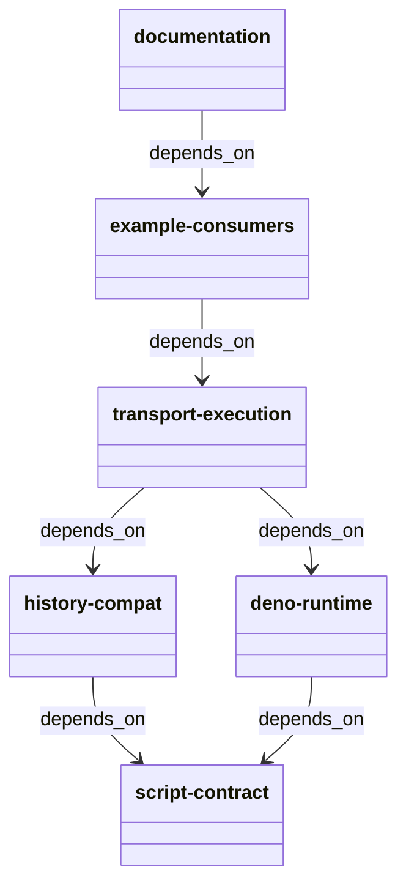
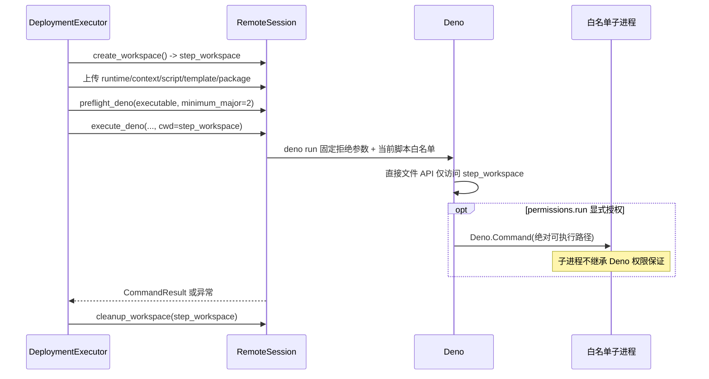
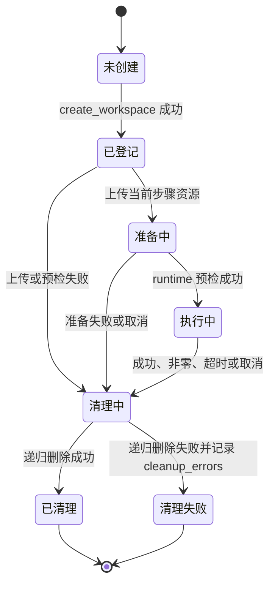

# Deno TypeScript 集群脚本自动流水线计划

Workflow tier: high-risk

Risk profile: ./risk-profile.yaml

## Trigger

- Proposal: docs/versions/v0.1/modules/sfo-deploy/016-deno-cluster-scripts/proposal.md
- User launch confirmed: yes
- User launch statement: `按推荐方案确认 high-risk，自动完成`
- Launch stage: proposal
- First auto stage: design
- Design source: pipeline/plan.md
- Per-stage user confirmation: skipped by explicit user auto-pipeline authorization
- Auto-confirm completed document stages: no design/testing Markdown documents generated;
  repository-local document extensions only
- Auto-pipeline document policy: stage-selective; automatic design uses pipeline plan; automatic
  testing uses runtime state; testplan.yaml required for automatic testing
- Version: v0.1
- Packet module: sfo-deploy
- Task name: 016-deno-cluster-scripts
- Target module(s): sfo-deploy
- change_id values: CHG-deno-script-contract, CHG-deno-example-migration

## Acceptance Baseline

- 最终验收以用户已确认的 `proposal.md` 为唯一需求基线。
- 权限保证只覆盖 Deno 脚本通过运行时 API
  发起的直接文件和网络访问；配置显式白名单启动的子进程按目标机身份运行，不属于该保证。
- 每个步骤的远端临时资源工作目录是 Deno 唯一直接读写目录；旧 Python
  发布快照保留兼容回退，新集群配置只接受 TypeScript。

## Stage Graph

| Task ID | Stage          | Execution Mode | Responsibility                                                                | Scope                                           | Parent Task | Depends On | Output                                            | Done Condition                                                           |
| ------- | -------------- | -------------- | ----------------------------------------------------------------------------- | ----------------------------------------------- | ----------- | ---------- | ------------------------------------------------- | ------------------------------------------------------------------------ |
| D-1     | design         | auto-pipeline  | 审查并固化 Deno 配置契约、权限边界、逐步骤工作区、历史兼容和实现顺序          | 本计划设计映射与 risk-profile.yaml              | root        | none       | 通过结构检查的 pipeline/plan.md 与风险检查项      | 设计映射完整且未生成 design.md                                           |
| I-1     | implementation | auto-pipeline  | 实现 TypeScript 脚本模型、严格配置解析、Deno 远端上下文和 v1/v2/v3 历史 codec | 配置、领域模型、规划、远端运行时与发布历史      | root        | D-1        | 新 Deno 计划契约及旧 Python/Deno 快照兼容生产代码 | 新配置只产生 Deno v3 计划，v1 Python 与既有 v2 Deno 快照仍可解码         |
| I-2     | implementation | auto-pipeline  | 实现 Deno 预检、权限 argv、安全执行及逐步骤远端工作区生命周期                 | SSH 传输与执行器                                | root        | I-1        | 权限受限的 Deno 执行路径与遗留 Python 路径        | 直接读写和网络权限正确拼装，步骤工作区始终清理                           |
| I-3     | implementation | auto-pipeline  | 迁移 eleph-server-multipass 生命周期脚本、配置和用户文档                      | 示例 TypeScript 消费者及仓库文档                | root        | I-2        | 可由 Deno 执行的示例集群与一致文档                | 示例无集群 `.py` 脚本且静态检查通过                                      |
| T-1     | testing        | auto-pipeline  | 从提案、计划和交付代码派生权限、兼容、生命周期与示例验证                      | unit、DV、integration 测试、testplan 和运行证据 | root        | I-3        | 测试实现、testplan.yaml 与任务测试制品            | `sfo-deploy/016-deno-cluster-scripts all` 成功并覆盖全部风险与 change_id |
| A-1     | acceptance     | auto-pipeline  | 独立证伪需求、权限边界、兼容性、实现和测试充分性                              | 全部交付物与任务运行证据                        | root        | T-1        | acceptance-report.md                              | 独立验收结论 accepted                                                    |

## Submodule Tasks

| Task ID | Stage | Execution Mode | Responsibility | Submodule | Parent Task | Depends On | Output | Done Condition |
| ------- | ----- | -------------- | -------------- | --------- | ----------- | ---------- | ------ | -------------- |

配置/计划模型与历史 codec
必须先稳定，传输执行器才能消费一致的运行时和权限结构；示例随后迁移到最终接口。三段实现有严格依赖并分别作为
I-1、I-2、I-3 独立任务，测试在生产实现后派生，验收与实现/测试分离，因此不再增加嵌套子模块任务。

## Parallel Scheduling

- Strategy: dependency-ready-set
- Concurrency: use all runtime-available child-agent slots
- Shared artifact owner: parent-orchestrator
- Lock directory: `.harness/locks/`
- Dispatch rule: launch dependency-ready work with practical edit coordination and available
  capacity
- Serialization reasons: explicit dependency, edit coordination, or exhausted concurrency capacity
- Evidence: record launched task ids and serialization reasons in
  `.harness/pipelines/v0.1/sfo-deploy/016-deno-cluster-scripts/state.json` scheduler waves

## Dependency Graphs



| Level     | Parent     | Node                | Depends On                   |
| --------- | ---------- | ------------------- | ---------------------------- |
| submodule | sfo-deploy | script-contract     | none                         |
| submodule | sfo-deploy | history-compat      | script-contract              |
| submodule | sfo-deploy | deno-runtime        | script-contract              |
| submodule | sfo-deploy | transport-execution | deno-runtime, history-compat |
| submodule | sfo-deploy | example-consumers   | transport-execution          |
| submodule | sfo-deploy | documentation       | example-consumers            |

关键运行调用流固定为“准备本地稳定输入 -> 建立目标会话 -> 为当前步骤创建工作目录 ->
在该目录内预检并执行 -> 无条件清理当前步骤目录”。工作目录同时作为远端进程
`cwd`，因此脚本使用的相对路径与 `--allow-read`/`--allow-write` 指向同一边界。





## Exported Interfaces

| Interface                                                                      | Owner               | Consumer                                  | Compatibility       | Affected Callers                                                                                                                                   | Migration Path                                                                                                                    |
| ------------------------------------------------------------------------------ | ------------------- | ----------------------------------------- | ------------------- | -------------------------------------------------------------------------------------------------------------------------------------------------- | --------------------------------------------------------------------------------------------------------------------------------- |
| `machines.yaml` 的 `deno` 命令字段（默认 `deno`）替代新配置中的 `python`       | script-contract     | 配置加载、规划、示例集群和配置指南        | migration-required  | `src/sfo_deploy/config.py`, `tests/conftest.py`, `examples/eleph-server-multipass/cluster-template/machines.yaml.tpl`                              | 新集群把 `python` 改为 `deno`；发布历史 v1 解码器继续读取旧 `python` 字段                                                         |
| `scripts.install[]` 等动作的 `{path, permissions: {run, net}}` TypeScript 条目 | script-contract     | 环境/App 配置、规划、历史 codec、示例脚本 | migration-required  | `tests/conftest.py`, `examples/eleph-server-multipass/cluster-template/apps/jx-server/app.yaml`, `docs/guides/sfo-deploy-cluster-configuration.md` | `.py` 路径迁移为 `.ts` 对象；未声明 `run`/`net` 时为空白名单，所有命令路径使用绝对路径                                            |
| `RemoteSession.preflight_deno` 与 `execute_deno`                               | transport-execution | `DeploymentExecutor` 和测试传输实现       | migration-required  | `src/sfo_deploy/execution.py`, `tests/dv/test_execution.py`, `tests/integration/test_remote_runtime.py`                                            | 新计划调用 Deno 方法；旧 Python 快照继续调用保留的 `preflight_python`/`execute_python` 兼容方法                                   |
| TypeScript `DeploymentContext` 模块                                            | deno-runtime        | 所有新环境/App `.ts` 生命周期脚本         | new                 | 无既有 TypeScript 调用方                                                                                                                           | 运行时与脚本一起上传到步骤工作区，通过相对 import 和 `DEPLOYMENT_CONTEXT_PATH` 读取上下文                                         |
| execution-plan schema v3                                                       | history-compat      | `ReleaseStore` 快照写入、读取与 rollback  | backward-compatible | `src/sfo_deploy/history.py`, `tests/test_release_history.py`                                                                                       | 新写入使用 v3 保存 Deno runtime/interpreter/run/net 与多 IP 数组；严格读取 v1 Python、既有 v2 Deno 和 v3，且不改写 v1/v2 来源快照 |

### 文件级接口契约

控制端领域模型以显式不可变值承载运行时和权限，不再用裸 `Path` 推断执行语义。新配置把
`machines[].deno` 规范化为 `ScriptRuntime(kind="deno", executable=...)`；v1
快照解码器只在兼容路径构造 `kind="python"`。`ScriptInvocation` 是计划、准备、CLI 展示和 v2/v3 codec
的共同边界。

```python
from dataclasses import dataclass
from pathlib import Path, PurePosixPath
from typing import Literal, Mapping, Sequence

@dataclass(frozen=True)
class ScriptPermissions:
    run: tuple[str, ...] = ()
    net: tuple[str, ...] = ()

@dataclass(frozen=True)
class ScriptRuntime:
    kind: Literal["deno", "python"]
    executable: str

@dataclass(frozen=True)
class ScriptInvocation:
    source: Path
    permissions: ScriptPermissions

@dataclass(frozen=True)
class Machine:
    # 其余现有 SSH、地址和环境字段保持不变。
    script_runtime: ScriptRuntime = ScriptRuntime("deno", "deno")

@dataclass(frozen=True)
class PlanStep:
    # 其余现有步骤字段保持不变。
    scripts: tuple[ScriptInvocation, ...]

class RemoteSession(Protocol):
    def preflight_deno(self, executable: str, *, minimum_major: int = 2) -> CommandResult: ...
    def execute_deno(
        self,
        executable: str,
        script: PurePosixPath,
        *,
        workspace: PurePosixPath,
        context_path: PurePosixPath,
        permissions: ScriptPermissions,
        privileged: bool = False,
    ) -> CommandResult: ...
    # preflight_python/execute_python 只供 v1 快照兼容路径继续使用。
```

TypeScript 运行时保持上下文 JSON schema v1，不远程加载任何模块，并提供与现有 Python
生命周期脚本所需能力等价的最小接口；`renderTemplate`
的目标必须位于当前工作目录，持久安装由显式白名单子进程完成。

```typescript
export type JsonValue = null | boolean | number | string | JsonValue[] | {
  [key: string]: JsonValue;
};

export class ConfigurationError extends Error {}

export class DeploymentContext {
  static fromPath(path: string): Promise<DeploymentContext>;
  static fromEnvironment(): Promise<DeploymentContext>;
  readonly metadata: Readonly<Record<string, JsonValue>>;
  configSecret(name: string): string;
  render(template: string): string;
  renderTemplate(source: string, destination: string): Promise<void>;
}
```

execution-plan v2/v3 的机器运行时对象固定为 `{kind: "deno", executable: string}`，脚本数组项固定为
`{source: archive-path, permissions: {run: string[], net: string[]}}`；v3 另外把
`private_ip`、`public_ip` 固定为保持顺序的 IP
数组，所有版本对象均严格拒绝未知或缺失字段。新编码器只写 `PLAN_SCHEMA_VERSION = 3`。reader
按版本独立分流：v1 保持原 `machine.definition.python`、裸脚本归档路径和标量/空 IP，映射为 Python
`ScriptRuntime` 与空权限；v2 保持 Deno runtime/权限与标量/空 IP，映射为单元素或空地址元组；v3
严格读取 Deno runtime/权限和 IP 数组。v1/v2 来源快照始终保持不可变且不会原地升级；读取 v2
后产生的新发布或回退 attempt 可按当前编码器另写 v3，但不得改写来源文件。新集群配置不能产生 Python
计划。发布记录、outcome 和 snapshot manifest 继续使用现有全局 schema v1，只有 execution-plan
文件使用独立的 v1/v2/v3 版本分流。

`execute_deno` 必须逐项构造 argv，禁止拼接用户输入。固定参数为
`run --no-prompt --no-config --no-remote --no-npm --deny-ffi --allow-env=DEPLOYMENT_CONTEXT_PATH --allow-read=<workspace> --allow-write=<workspace>`；空
`run`/`net` 分别追加 `--deny-run`/`--deny-net`，非空时只追加一个带规范化逗号列表的
`--allow-run=...`/`--allow-net=...`。脚本绝对路径最后追加，并以已登记的 `workspace` 为
`cwd`。不得出现裸 `--allow-run`、裸 `--allow-net`、`--allow-all` 或远程/npm import 能力。

## External Runtime Dependencies

- 新计划目标机必须提供可调用且主版本不低于 2 的 Deno；`machines[].deno` 只接受单个裸命令名或规范绝对
  POSIX 路径，拒绝空白、控制字符、逗号和相对路径片段。
- `permissions.run` 每项必须是规范绝对 POSIX 可执行路径，拒绝
  `.`/`..`、反斜杠、逗号、NUL、控制字符和重复值；它只选择 Deno
  可启动的程序，不证明远端文件不可替换，也不约束已启动子进程。
- `permissions.net` 每项只接受无 scheme、userinfo、路径和通配符的主机/IP，可带 1..65535 端口；IPv6
  端口形式必须使用方括号，拒绝逗号、控制字符和重复值。示例健康检查仅授权 `127.0.0.1:8080`。
- TypeScript runtime 和生命周期脚本只能使用步骤工作目录内的相对本地
  import；执行器固定禁用配置自动发现、remote 和 npm 解析，因此目标机不在运行时下载代码。

## API and Build Surface Impact

- Public API impact: migration-required
- Crate-root export change: no
- Build-surface change: yes
- Documentation examples affected: yes

## Consumer Migration Closure

| Old Symbol                                   | New Path                                                          | change_id                  | Consumer Path                                                                                          | Consumer Kind            | Migration Status           |
| -------------------------------------------- | ----------------------------------------------------------------- | -------------------------- | ------------------------------------------------------------------------------------------------------ | ------------------------ | -------------------------- |
| `machines[].python`                          | `machines[].deno`                                                 | CHG-deno-script-contract   | tests/conftest.py                                                                                      | 配置测试夹具             | migrated                   |
| `machines[].python`                          | `machines[].deno`                                                 | CHG-deno-example-migration | examples/eleph-server-multipass/cluster-template/machines.yaml.tpl                                     | 示例配置                 | migrated                   |
| `ScriptDefinition.actions: tuple[Path, ...]` | `tuple[ScriptInvocation, ...]`                                    | CHG-deno-script-contract   | src/sfo_deploy/environment.py                                                                          | 环境动作规划消费者       | migrated                   |
| `PlanStep.scripts` 裸路径                    | 显式运行时和权限调用                                              | CHG-deno-script-contract   | src/sfo_deploy/cli.py                                                                                  | 计划 JSON 展示消费者     | migrated                   |
| `scripts/*.py` 字符串条目                    | `.ts` 权限对象条目                                                | CHG-deno-example-migration | examples/eleph-server-multipass/cluster-template/apps/jx-server/app.yaml                               | 示例 App 配置            | migrated                   |
| `scripts/*.py` 字符串条目                    | `.ts` 权限对象条目                                                | CHG-deno-example-migration | examples/eleph-server-multipass/cluster-template/environments/eleph-server/jre/environment.yaml        | 示例环境配置             | migrated                   |
| `scripts/*.py` 字符串条目                    | `.ts` 权限对象条目                                                | CHG-deno-example-migration | examples/eleph-server-multipass/cluster-template/environments/eleph-server/jx-runtime/environment.yaml | 示例环境配置             | migrated                   |
| `scripts/*.py` 字符串条目                    | `.ts` 权限对象条目                                                | CHG-deno-example-migration | examples/eleph-server-multipass/cluster-template/environments/eleph-server/mysql/environment.yaml      | 示例环境配置             | migrated                   |
| `scripts/*.py` 字符串条目                    | `.ts` 权限对象条目                                                | CHG-deno-example-migration | examples/eleph-server-multipass/cluster-template/environments/eleph-server/redis/environment.yaml      | 示例环境配置             | migrated                   |
| `step.machine.machine.python`                | `runtime.kind == "deno"` 分支调用 `preflight_deno`/`execute_deno` | CHG-deno-script-contract   | src/sfo_deploy/execution.py                                                                            | 新 Deno 计划运行时分派   | migrated                   |
| `preflight_python`                           | v1 `runtime.kind == "python"` 预检分支                            | CHG-deno-script-contract   | src/sfo_deploy/execution.py                                                                            | 旧发布快照执行兼容       | allowed-compatibility-shim |
| `execute_python`                             | v1 `runtime.kind == "python"` 执行分支                            | CHG-deno-script-contract   | src/sfo_deploy/execution.py                                                                            | 旧发布快照执行兼容       | allowed-compatibility-shim |
| `preflight_python`                           | `RemoteSession` v1 Python 预检协议与实现                          | CHG-deno-script-contract   | src/sfo_deploy/transport.py                                                                            | 旧发布快照传输兼容       | allowed-compatibility-shim |
| `execute_python`                             | `RemoteSession` v1 Python 执行协议与实现                          | CHG-deno-script-contract   | src/sfo_deploy/transport.py                                                                            | 旧发布快照传输兼容       | allowed-compatibility-shim |
| `preflight_python`                           | v1 Python 预检测试替身                                            | CHG-deno-script-contract   | tests/test_release_history.py                                                                          | 旧发布快照兼容夹具       | allowed-negative-fixture   |
| `execute_python`                             | v1 Python 执行测试替身                                            | CHG-deno-script-contract   | tests/test_release_history.py                                                                          | 旧发布快照兼容夹具       | allowed-negative-fixture   |
| `preflight_python`                           | v1 Python 预检测试替身                                            | CHG-deno-script-contract   | tests/dv/test_execution.py                                                                             | 旧运行时分支兼容夹具     | allowed-negative-fixture   |
| `execute_python`                             | v1 Python 执行测试替身                                            | CHG-deno-script-contract   | tests/dv/test_execution.py                                                                             | 旧运行时分支兼容夹具     | allowed-negative-fixture   |
| `preflight_python`                           | v1 Python 预检测试替身                                            | CHG-deno-script-contract   | tests/integration/test_remote_runtime.py                                                               | 旧远端运行时兼容夹具     | allowed-negative-fixture   |
| `execute_python`                             | v1 Python 执行测试替身                                            | CHG-deno-script-contract   | tests/integration/test_remote_runtime.py                                                               | 旧远端运行时兼容夹具     | allowed-negative-fixture   |
| execution-plan v1 Python 读取                | v1 兼容解码与 v3 Deno 编码并存                                    | CHG-deno-script-contract   | src/sfo_deploy/history.py                                                                              | Python 发布回退消费者    | allowed-compatibility-shim |
| execution-plan v2 Deno 读取                  | v2 兼容解码与 v3 多 IP Deno 编码并存                              | CHG-deno-script-contract   | src/sfo_deploy/history.py                                                                              | 既有 Deno 发布回退消费者 | allowed-compatibility-shim |
| Python 生命周期脚本指南                      | TypeScript/Deno 权限指南                                          | CHG-deno-example-migration | docs/guides/sfo-deploy-cluster-configuration.md                                                        | 用户文档                 | migrated                   |

## State Ownership

| State                                  | Owner               | Access Interface                                                   | Lifecycle                                                                                                                                               | Failure Transitions                                                                                  |
| -------------------------------------- | ------------------- | ------------------------------------------------------------------ | ------------------------------------------------------------------------------------------------------------------------------------------------------- | ---------------------------------------------------------------------------------------------------- |
| 每脚本 runtime、解释器、run/net 白名单 | script-contract     | 严格 YAML 加载 -> PlanStep 脚本调用结构 -> execution-plan v3 codec | 配置时规范化为不可变值；准备执行时复制稳定输入；快照写入后不可变                                                                                        | 未知字段、非 `.ts`、非规范绝对命令路径、逗号或控制字符、非法网络目标在 SSH 前失败                    |
| 每步骤远端资源工作目录                 | transport-execution | `RemoteSession.create_workspace`、上传、执行和 `cleanup_workspace` | 单一步骤开始时创建 0700 目录，包含 runtime/context/script/template/package；步骤完成或失败后递归清理                                                    | 创建/上传/执行/上下文清理失败进入步骤失败或 cleanup_errors；只清理由当前会话登记且符合固定前缀的目录 |
| 部署上下文与配置密钥                   | deno-runtime        | TypeScript `DeploymentContext.fromEnvironment()`                   | mode 0600 上传到当前步骤目录，只包含当前 configure 声明的秘密；执行后随目录清理                                                                         | JSON/schema/秘密名或模板错误失败；输出继续经 Redactor 脱敏；清理失败可见且不遮蔽主错误               |
| 发布计划快照 runtime 与地址信息        | history-compat      | execution-plan v1/v2/v3 strict codec                               | 新发布只写 v3；旧 v1 Python 与 v2 Deno 来源保持不可变并按各自兼容路径读取；由旧快照派生的新 attempt 不回写来源，rollback 使用解码后的固定运行时与主地址 | 未知 schema/字段、非法权限、v3 非法 IP 数组或归档文件失败关闭；不把 v1/v2 来源静默升级或原地改写     |

## Failure Flows

| Flow         | Boundary                            | Failure                                                                   | Handling                                                                                                                                               |
| ------------ | ----------------------------------- | ------------------------------------------------------------------------- | ------------------------------------------------------------------------------------------------------------------------------------------------------ |
| 集群配置装载 | YAML -> script-contract             | `.py`、缺失/逃逸 `.ts`、未知权限、非绝对 run 命令、非法 net 目标或重复值  | 在计划、下载和 SSH 前抛出 ConfigurationError；不猜测权限或自动授予网络/子进程                                                                          |
| Deno 预检    | DeploymentExecutor -> RemoteSession | Deno 缺失、版本输出异常或主版本低于 2                                     | 在该机器首个新脚本前以 PreflightError 失败；目标内后续步骤 fail-fast，其他目标继续；旧 Python 快照改走 Python 3 预检                                   |
| 步骤资源准备 | executor -> remote workspace        | 工作区创建、runtime/context/script/template/package 上传失败              | 当前步骤失败并尽力清理已登记目录；秘密和制品不复用到其他步骤目录                                                                                       |
| 权限命令拼装 | ScriptInvocation -> `deno run` argv | 目录、网络或命令值含注入载荷，未声明直接访问或提示请求                    | 配置验证和 `_validate_argv` 保持逐项 argv；固定拒绝参数并把 cwd/read/write 绑定到已登记步骤目录；空白名单使用显式 deny 参数，未授权由 Deno 返回非零    |
| 用户脚本执行 | Deno -> 白名单子进程/本机网络       | 未列程序、未列 host、脚本非零、超时或特权预检失败                         | 未列能力被 Deno 拒绝；已列子进程不承诺继承权限；错误沿用步骤失败、脱敏、目标内 fail-fast 和跨目标隔离                                                  |
| 发布历史回退 | v1/v2/v3 snapshot -> executor       | v1 Python 运行时不可用、v2/v3 权限字段损坏、v3 地址数组非法或脚本归档篡改 | v1 走既有 Python 预检；v2 按 Deno 与标量地址兼容路径读取；v3 按 Deno 与多 IP 数组严格读取；旧来源不改写，任何失败在执行结果/历史终态可见且不降级运行时 |
| 步骤结束     | executor -> RemoteSession cleanup   | 上下文单文件删除或工作区递归删除失败                                      | 工作区作为最终清理边界；失败追加 cleanup_errors，成功步骤转为失败，不清理会话未登记路径                                                                |

## Rejected Alternatives

| Decision Type | Selected                                                                                                | Rejected                                                                                       | Reason                                                                                                 |
| ------------- | ------------------------------------------------------------------------------------------------------- | ---------------------------------------------------------------------------------------------- | ------------------------------------------------------------------------------------------------------ |
| boundary      | Deno 直接 API 受资源目录和 net/run 白名单约束，显式子进程不属于保证                                     | 声称 Deno 权限可约束子进程，或把任务扩大为 OS 沙箱/特权代理                                    | 用户明确接受子进程权限不受控制；前者不真实，后者超出已确认范围                                         |
| technical     | 每脚本权限对象、绝对可执行路径、逐步骤工作区、离线本地 TypeScript runtime、计划 v3 + 严格 v1/v2 readers | 裸 `--allow-run`、共享机器级工作区、远程 import、删除历史 Python/Deno 支持或原地宽松升级 v1/v2 | 所选方案缩小误授权和跨步骤数据可见性，阻止依赖加载联网，并保留不可变旧快照的真实回退语义及多 IP 新编码 |
| collaboration | I-1 契约/codec、I-2 执行生命周期、I-3 示例/文档严格串行，T-1 后置测试、A-1 独立验收                     | 多代理同时修改模型、执行器、历史和示例                                                         | 下游参数与兼容语义依赖上游数据结构，串行可以避免共享接口漂移；阶段独立仍保证测试与验收分离             |

## Implementation Scope Bindings

| change_id                  | target_module | proposal_id | design_coverage                                                                                                                                   | scope_paths                                                    | design_rules_applied                                                                   |
| -------------------------- | ------------- | ----------- | ------------------------------------------------------------------------------------------------------------------------------------------------- | -------------------------------------------------------------- | -------------------------------------------------------------------------------------- |
| CHG-deno-script-contract   | sfo-deploy    | P-001       | script-contract、deno-runtime、transport-execution、history-compat 共同交付 Deno 直接权限边界、逐步骤目录、v1 Python/v2 Deno 读取兼容和 v3 新编码 | `src/sfo_deploy/**`, `tests/**`, `README.md`, `docs/guides/**` | 自顶向下分解、无环依赖、具体消费者迁移、单一状态所有者、安全/失败/清理流和串行实现顺序 |
| CHG-deno-example-migration | sfo-deploy    | P-002       | example-consumers 与 documentation 把所有集群生命周期消费者迁移到最终 TypeScript 权限契约                                                         | `examples/eleph-server-multipass/**`                           | 消费者闭包、构建/部署表面、示例运行时边界和依赖后置迁移                                |

## File-Level Implementation Sequence

| Sequence | Task ID | File-Level Module                                                                                                                                                                                               | Action | Depends On | change_id                  | target_module | Scope Paths                                                                                                                                                                                                     | Context Sources                                                                                           |
| -------- | ------- | --------------------------------------------------------------------------------------------------------------------------------------------------------------------------------------------------------------- | ------ | ---------- | -------------------------- | ------------- | --------------------------------------------------------------------------------------------------------------------------------------------------------------------------------------------------------------- | --------------------------------------------------------------------------------------------------------- |
| 1        | I-1     | `src/sfo_deploy/models.py`, `src/sfo_deploy/config.py`, `src/sfo_deploy/planning.py`, `src/sfo_deploy/environment.py`, `src/sfo_deploy/cli.py`, `src/sfo_deploy/remote_runtime.py`, `src/sfo_deploy/history.py` | modify | none       | CHG-deno-script-contract   | sfo-deploy    | `src/sfo_deploy/models.py`, `src/sfo_deploy/config.py`, `src/sfo_deploy/planning.py`, `src/sfo_deploy/environment.py`, `src/sfo_deploy/cli.py`, `src/sfo_deploy/remote_runtime.py`, `src/sfo_deploy/history.py` | proposal P-001、Exported Interfaces、文件级接口契约、State Ownership、v1/v2/v3 codec 与配置 Failure Flows |
| 2        | I-2     | `src/sfo_deploy/transport.py`, `src/sfo_deploy/execution.py`                                                                                                                                                    | modify | I-1        | CHG-deno-script-contract   | sfo-deploy    | `src/sfo_deploy/transport.py`, `src/sfo_deploy/execution.py`                                                                                                                                                    | proposal P-001、权限 argv、逐步骤目录、预检与清理 Failure Flows                                           |
| 3        | I-3     | `README.md`, `docs/guides/sfo-deploy-cluster-configuration.md`, `examples/eleph-server-multipass/README.md`, `examples/eleph-server-multipass/cluster-template/**`                                              | modify | I-2        | CHG-deno-example-migration | sfo-deploy    | `README.md`, `docs/guides/sfo-deploy-cluster-configuration.md`, `examples/eleph-server-multipass/**`                                                                                                            | proposal P-002、最终 Exported Interfaces、示例权限与旧回退边界                                            |

## Return Rules

- 验收发现提案歧义或错误边界时，以 `rejected` 完成报告并停止流水线，请用户决策，不推断需求。
- 配置/计划/历史设计缺陷返回 D-1；契约/codec 实现缺陷返回 I-1；传输/执行/清理缺陷返回
  I-2；示例/文档缺陷返回 I-3；覆盖、测试实现或运行证据缺陷返回 T-1。
- 同一阻断问题超过 5 次未成功修复时停止并报告用户。

执行状态、测试证据、返回记录和最终验收仅存储在
`.harness/pipelines/v0.1/sfo-deploy/016-deno-cluster-scripts/state.json`。
