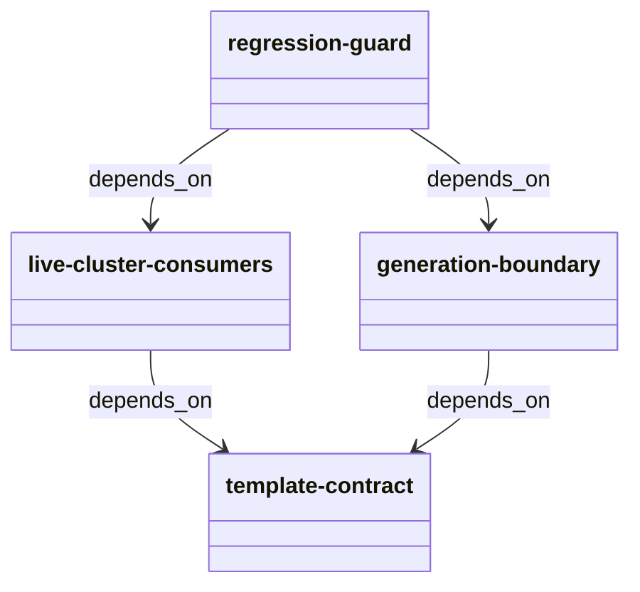
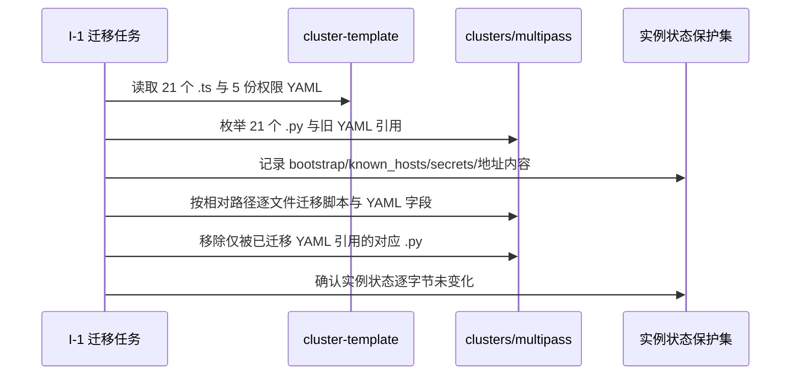
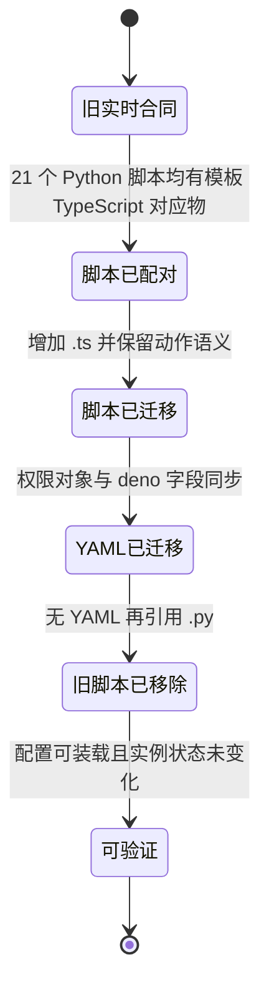

# 实时集群生命周期脚本迁移自动流水线计划

Workflow tier: high-risk

Risk profile: ./risk-profile.yaml

## Trigger

- Proposal: docs/versions/v0.1/modules/sfo-deploy/017-migrate-live-cluster-scripts/proposal.md
- User launch confirmed: yes
- User launch statement: `确认，自动完成`
- Launch stage: proposal
- First auto stage: design
- Design source: pipeline/plan.md
- Per-stage user confirmation: skipped by explicit user auto-pipeline authorization
- Auto-confirm completed document stages: no design/testing Markdown documents generated;
  repository-local document extensions only
- Auto-pipeline document policy: stage-selective; automatic design uses pipeline plan; automatic
  testing uses runtime state; testplan.yaml required for automatic testing
- Version: v0.1
- Packet module: sfo-deploy
- Task name: 017-migrate-live-cluster-scripts
- Target module(s): sfo-deploy
- change_id values: CHG-live-cluster-ts-migration, CHG-live-cluster-ts-regression

## Acceptance Baseline

- 最终验收以用户已确认的 `proposal.md` 为唯一需求基线。
- 生产迁移只覆盖实时 `examples/**/clusters/**` 中的生命周期脚本及其 App、环境、机器
  YAML；不以模板整体覆盖实时目录。
- bootstrap、known_hosts、secrets、节点地址、模板参数和其他实例状态必须保持不变；历史基线、旧快照与
  Python 兼容夹具不属于清理目标。
- 当前 shell 与 PowerShell 生成器均复制已迁移的
  `cluster-template`，本设计不预设修改生成器；若测试暴露真实生成缺陷，返回 D-1
  扩展设计绑定后再修复。

## Stage Graph

| Task ID | Stage          | Execution Mode | Responsibility                                                         | Scope                                                   | Parent Task | Depends On | Output                                        | Done Condition                                                                   |
| ------- | -------------- | -------------- | ---------------------------------------------------------------------- | ------------------------------------------------------- | ----------- | ---------- | --------------------------------------------- | -------------------------------------------------------------------------------- |
| D-1     | design         | auto-pipeline  | 固化实时集群迁移映射、实例状态保护边界、生成路径和防回退责任           | 本计划、risk-profile.yaml 与初始运行态                  | root        | none       | 通过结构检查的设计映射与风险检查项            | 两个 change_id 均有具体边界且未生成 design.md                                    |
| I-1     | implementation | auto-pipeline  | 逐文件迁移实时集群的 21 个生命周期脚本、5 份资源 YAML 和机器运行时字段 | `examples/**/clusters/**` 实时部署配置                  | root        | D-1        | 与规范模板语义一致的实时 TypeScript/Deno 集群 | 实时目录无生命周期 `.py` 或旧 YAML 合同，受保护实例状态未变化                    |
| T-1     | testing        | auto-pipeline  | 从提案、设计和迁移结果派生静态、行为、配置、生成与防回退验证           | `examples/**/tests/**`、`tests/**`、testplan 与运行证据 | root        | I-1        | 测试实现、testplan.yaml 和任务测试制品        | `sfo-deploy/017-migrate-live-cluster-scripts all` 成功并覆盖全部风险与 change_id |
| A-1     | acceptance     | auto-pipeline  | 独立证伪迁移完整性、行为等价、权限最小化、状态保护和测试充分性         | 全部交付物与任务运行证据                                | root        | T-1        | acceptance-report.md                          | 独立验收结论 accepted                                                            |

## Submodule Tasks

| Task ID | Stage | Execution Mode | Responsibility | Submodule | Parent Task | Depends On | Output | Done Condition |
| ------- | ----- | -------------- | -------------- | --------- | ----------- | ---------- | ------ | -------------- |

实时机器、App
与四类环境位于同一被忽略实例树，且共享同一套模板合同和状态保护边界；拆成并行实现任务会增加部分迁移与覆盖冲突风险。因此
I-1 作为一个原子迁移任务，T-1 在其完成后独立设计验证，A-1 再独立验收，不增加嵌套子模块任务。

## Parallel Scheduling

- Strategy: dependency-ready-set
- Concurrency: use all runtime-available child-agent slots
- Shared artifact owner: parent-orchestrator
- Lock directory: `.harness/locks/`
- Dispatch rule: launch dependency-ready work with practical edit coordination and available
  capacity
- Serialization reasons: explicit dependency, edit coordination, or exhausted concurrency capacity
- Evidence: record launched task ids and serialization reasons in
  `.harness/pipelines/v0.1/sfo-deploy/017-migrate-live-cluster-scripts/state.json` scheduler waves

## Dependency Graphs



| Level     | Parent     | Node                   | Depends On                                  |
| --------- | ---------- | ---------------------- | ------------------------------------------- |
| submodule | sfo-deploy | template-contract      | none                                        |
| submodule | sfo-deploy | live-cluster-consumers | template-contract                           |
| submodule | sfo-deploy | generation-boundary    | template-contract                           |
| submodule | sfo-deploy | regression-guard       | live-cluster-consumers, generation-boundary |

迁移调用流固定为先解析模板与实时路径的相对映射，再记录受保护实例状态，随后逐文件增加 `.ts`、更新
YAML、移除对应
`.py`，最后比较受保护状态。任何无法一一映射的脚本、实例专属生命周期差异或生成器缺陷都停止 I-1
并返回设计，不通过整体复制猜测处理。





## Exported Interfaces

| Interface                                                                                                                                                                                            | Owner                  | Consumer                                          | Compatibility       | Affected Callers                                                                                                                                                                | Migration Path                                                                      |
| ---------------------------------------------------------------------------------------------------------------------------------------------------------------------------------------------------- | ---------------------- | ------------------------------------------------- | ------------------- | ------------------------------------------------------------------------------------------------------------------------------------------------------------------------------- | ----------------------------------------------------------------------------------- |
| 实时 `machines.yaml` 的 `deno: /usr/local/bin/deno`                                                                                                                                                  | live-cluster-consumers | 配置加载、规划与目标机预检                        | migration-required  | `examples/eleph-server-multipass/clusters/multipass/machines.yaml`                                                                                                              | 仅把旧 `python` 字段替换为模板既定 deno 字段，保留真实 IP、SSH 用户、端口和私钥路径 |
| 实时 App/环境 `scripts.configure[]`、`scripts.deploy[]`、`scripts.lifecycle[]`、`scripts.check[]`、`scripts.install[]`、`scripts.start[]`、`scripts.stop[]`、`scripts.restart[]` TypeScript 权限对象 | live-cluster-consumers | 当前严格配置加载器与部署计划                      | migration-required  | `examples/eleph-server-multipass/clusters/multipass/apps/jx-server/app.yaml`, `examples/eleph-server-multipass/clusters/multipass/environments/eleph-server/*/environment.yaml` | 按对应模板动作同步 path/run/net，保留版本、依赖、秘密和模板声明                     |
| 21 个实时 TypeScript 生命周期脚本                                                                                                                                                                    | live-cluster-consumers | Deno 运行时与白名单子进程                         | backward-compatible | `examples/eleph-server-multipass/clusters/multipass/apps/jx-server/scripts/*.ts`, `examples/eleph-server-multipass/clusters/multipass/environments/eleph-server/*/scripts/*.ts` | 以相同相对路径的模板 `.ts` 为行为来源，替换旧 Python 实现而不改变部署动作结果       |
| `cluster-template` 到新实时集群的复制边界                                                                                                                                                            | generation-boundary    | `prepare-multipass.sh` 与 `prepare-multipass.ps1` | backward-compatible | `examples/eleph-server-multipass/prepare-multipass.sh`, `examples/eleph-server-multipass/prepare-multipass.ps1`                                                                 | 两条路径已经复制当前模板；保持实现不变并由后置验证证明不会生成旧合同                |

### 文件级消费合同

实时 YAML 只能把实例专属机器值与模板合同结合；脚本字段不允许采用兼容旧格式，也不为 Deno
权限补充模板以外的能力。

```yaml
machines:
  - name: eleph-server
    private_ip: <保留实时节点地址>
    ssh_private_key: secrets/id_ed25519
    deno: /usr/local/bin/deno

scripts:
  <action>:
    - path: scripts/<script>.ts
      permissions:
        run: [<与对应模板动作完全一致的绝对命令路径>]
        net: [<与对应模板动作完全一致的目标>]
```

TypeScript 文件保持模板导出的调用方式，不引入新的远程 import、npm 依赖或直接访问持久目录的
API；持久系统操作仍通过已声明子进程完成。

```typescript
import { DeploymentContext } from "./sfo_deploy.ts";

const context = await DeploymentContext.fromEnvironment();
// 每个实时脚本的命令、参数、退出码和配置渲染与同相对路径模板脚本一致。
```

## External Runtime Dependencies

- 静态验证使用仓库现有 Deno 2；实时目标机继续使用模板声明的
  `/usr/local/bin/deno`，本任务不安装或升级 Deno。
- 配置语义由当前 `sfo_deploy.load_cluster` 与计划构建接口判定，不新增宽松兼容解析。
- shell 与 PowerShell 生成器继续复制 `cluster-template`；只读检查已确认它们没有独立维护旧 Python
  脚本来源。
- `clusters/` 被示例 `.gitignore`
  忽略但属于用户明确指定的实时状态范围；工作流证据不把忽略规则解释为禁止迁移。

## API and Build Surface Impact

- Public API impact: none
- Crate-root export change: no
- Build-surface change: yes
- Documentation examples affected: yes

## Consumer Migration Closure

| Old Symbol                                | New Path               | change_id                      | Consumer Path                                                                                            | Consumer Kind      | Migration Status |
| ----------------------------------------- | ---------------------- | ------------------------------ | -------------------------------------------------------------------------------------------------------- | ------------------ | ---------------- |
| `实时 machines[].python`                  | `实时 machines[].deno` | CHG-live-cluster-ts-migration  | examples/eleph-server-multipass/clusters/multipass/machines.yaml                                         | 实时机器配置       | migrated         |
| `实时 App scripts/*.py 字符串条目`        | `.ts` 权限对象条目     | CHG-live-cluster-ts-migration  | examples/eleph-server-multipass/clusters/multipass/apps/jx-server/app.yaml                               | 实时 App 配置      | migrated         |
| `实时 jre scripts/*.py 字符串条目`        | `.ts` 权限对象条目     | CHG-live-cluster-ts-migration  | examples/eleph-server-multipass/clusters/multipass/environments/eleph-server/jre/environment.yaml        | 实时环境配置       | migrated         |
| `实时 jx-runtime scripts/*.py 字符串条目` | `.ts` 权限对象条目     | CHG-live-cluster-ts-migration  | examples/eleph-server-multipass/clusters/multipass/environments/eleph-server/jx-runtime/environment.yaml | 实时环境配置       | migrated         |
| `实时 mysql scripts/*.py 字符串条目`      | `.ts` 权限对象条目     | CHG-live-cluster-ts-migration  | examples/eleph-server-multipass/clusters/multipass/environments/eleph-server/mysql/environment.yaml      | 实时环境配置       | migrated         |
| `实时 redis scripts/*.py 字符串条目`      | `.ts` 权限对象条目     | CHG-live-cluster-ts-migration  | examples/eleph-server-multipass/clusters/multipass/environments/eleph-server/redis/environment.yaml      | 实时环境配置       | migrated         |
| `仅扫描 clusters 的 Python 生命周期合同`  | 作用域明确的防回退检查 | CHG-live-cluster-ts-regression | examples/eleph-server-multipass/tests/test_config_contract.py                                            | 示例配置合同消费者 | migrated         |

## State Ownership

| State                                          | Owner                  | Access Interface                                   | Lifecycle                                                     | Failure Transitions                                                                               |
| ---------------------------------------------- | ---------------------- | -------------------------------------------------- | ------------------------------------------------------------- | ------------------------------------------------------------------------------------------------- |
| 实时生命周期脚本与 YAML 合同                   | live-cluster-consumers | 同相对路径模板读取 -> 逐文件迁移 -> 当前配置加载器 | 从旧 Python 合同一次性迁移到 TypeScript；以后由防回退检查保持 | 映射缺失、权限不一致、YAML 无法装载或仍有旧引用时失败关闭，不留下“改扩展名但未迁移语义”的完成状态 |
| bootstrap、known_hosts、secrets 与实例专属地址 | live-cluster-consumers | 迁移前后受保护路径内容比较                         | 在本任务前已存在并在任务后原样保留；不进入模板覆盖或清理集合  | 任一内容变化立即视为阻断数据完整性缺陷，不尝试从模板重建                                          |
| 规范 TypeScript 脚本与权限声明                 | template-contract      | `cluster-template` 同相对路径只读引用              | 由 016 任务维护，本任务只消费且不修改                         | 实时脚本无法与模板一一对应时返回 D-1，不扩大 I-1 猜测实现                                         |
| 新集群生成语义                                 | generation-boundary    | shell/PowerShell 复制当前模板                      | 生成新实例时继承当前 TypeScript 合同；本任务不重建现存实例    | 若验证发现旧输出，返回 D-1 为生成器补充具体 Scope Path，不跨边界直接修复                          |

## Failure Flows

| Flow                 | Boundary                                    | Failure                                                        | Handling                                                                                |
| -------------------- | ------------------------------------------- | -------------------------------------------------------------- | --------------------------------------------------------------------------------------- |
| 模板与实时目录配对   | template-contract -> live-cluster-consumers | `.py` 无同相对路径 `.ts`、动作集合不同或实时脚本含实例专属行为 | 停止迁移并返回 D-1；不删除未证明可替换的脚本，不用模板目录整体覆盖                      |
| 实例状态保护         | I-1 -> bootstrap/known_hosts/secrets/地址   | 批量复制、重新生成或 YAML 修改覆盖本地值                       | 只使用逐文件补丁；受保护内容变化阻断完成，保留原状态作为恢复依据                        |
| 脚本与 YAML 原子迁移 | filesystem -> strict loader                 | 只增加 `.ts`、只改 YAML 或过早删除 `.py` 导致部分状态          | 在同一 I-1 中完成成对增加、引用切换和旧文件移除；完成前不把中间状态用于部署             |
| 权限同步             | template YAML -> live YAML                  | 漏列命令/网络导致合法动作失败，或额外授权削弱默认拒绝          | 对每个动作逐项同步模板 path/run/net，不自动合并、不授予通配或裸权限                     |
| 配置与运行行为       | live YAML/scripts -> Deno executor          | 严格解析失败、脚本静态错误、动作退出语义漂移                   | I-1 保留当前文件证据，T-1 独立暴露缺陷并按实现返回路由修正                              |
| 生成路径             | cluster-template -> prepared cluster        | 生成器仍产生 `.py` 或旧 YAML                                   | 记录为设计缺陷并返回 D-1 扩展生成器绑定；不在测试任务内顺手改生产脚本                   |
| 防回退扫描           | repository/live tree -> regression guard    | 扫描范围过宽误报历史 Python 兼容夹具，或范围过窄漏掉实时集群   | 仅把 `examples/**/clusters/**` 作为旧生命周期合同的拒绝范围，历史基线和兼容夹具保持排除 |

## Rejected Alternatives

| Decision Type | Selected                                                       | Rejected                                               | Reason                                                                             |
| ------------- | -------------------------------------------------------------- | ------------------------------------------------------ | ---------------------------------------------------------------------------------- |
| boundary      | 只迁移实时 clusters 生命周期合同并保护实例状态                 | 全仓删除 `.py` 或清理 `.harness`、历史快照和兼容测试   | 仓库主程序和旧发布回退仍合法使用 Python；扩大扫描会破坏已确认兼容边界              |
| technical     | 按相对路径逐文件复用模板 TypeScript 与权限字段，保留实时机器值 | 删除实时目录后重新运行生成器、整体复制模板或仅改扩展名 | 重新生成会覆盖密钥、主机指纹和地址；仅改名不能保证行为与权限语义                   |
| collaboration | D-1 -> 单一 I-1 原子迁移 -> 独立 T-1 -> 独立 A-1               | 按 App/环境并行修改同一实时实例树                      | 单个消费者树共享机器配置和状态保护集合，串行原子迁移更容易证明无部分完成与覆盖冲突 |

## Implementation Scope Bindings

| change_id                      | target_module | proposal_id | design_coverage                                                                                           | scope_paths                        | design_rules_applied                                             |
| ------------------------------ | ------------- | ----------- | --------------------------------------------------------------------------------------------------------- | ---------------------------------- | ---------------------------------------------------------------- |
| CHG-live-cluster-ts-migration  | sfo-deploy    | P-001       | live-cluster-consumers 逐文件迁移 21 个脚本、5 份资源 YAML 与机器 runtime，同时保护实例状态并保持模板行为 | `examples/**/clusters/**`          | 消费者闭包、具体状态所有者、生成边界、失败关闭和单一原子实现任务 |
| CHG-live-cluster-ts-regression | sfo-deploy    | P-002       | regression-guard 仅拒绝实时集群旧生命周期合同并证明当前生成路径继承 TypeScript 模板                       | `examples/**/tests/**`, `tests/**` | 作用域明确的合同闭包、历史兼容排除边界和后置独立验证责任         |

## File-Level Migration Map

| Live Area              | TypeScript Sources To Add                                                                                                     | Python Sources To Remove | YAML To Modify                                          | Preserved Inputs                                                   |
| ---------------------- | ----------------------------------------------------------------------------------------------------------------------------- | ------------------------ | ------------------------------------------------------- | ------------------------------------------------------------------ |
| App jx-server          | `scripts/configure.ts`, `scripts/deploy.ts`, `scripts/lifecycle.ts`                                                           | 对应 3 个 `.py`          | `apps/jx-server/app.yaml`                               | package、depends_on、config_secrets、templates                     |
| Environment jre        | `scripts/check.ts`, `scripts/install.ts`, `scripts/configure.ts`                                                              | 对应 3 个 `.py`          | `environments/eleph-server/jre/environment.yaml`        | version、depends_on、requires_privilege                            |
| Environment jx-runtime | `scripts/check.ts`, `scripts/install.ts`, `scripts/configure.ts`                                                              | 对应 3 个 `.py`          | `environments/eleph-server/jx-runtime/environment.yaml` | version、depends_on、requires_privilege、templates                 |
| Environment mysql      | `scripts/check.ts`, `scripts/install.ts`, `scripts/configure.ts`, `scripts/start.ts`, `scripts/stop.ts`, `scripts/restart.ts` | 对应 6 个 `.py`          | `environments/eleph-server/mysql/environment.yaml`      | version、depends_on、requires_privilege、config_secrets、templates |
| Environment redis      | `scripts/check.ts`, `scripts/install.ts`, `scripts/configure.ts`, `scripts/start.ts`, `scripts/stop.ts`, `scripts/restart.ts` | 对应 6 个 `.py`          | `environments/eleph-server/redis/environment.yaml`      | version、depends_on、requires_privilege、config_secrets            |
| Machine runtime        | none                                                                                                                          | none                     | `machines.yaml` 的 `python` -> `deno`                   | private_ip、region、SSH 身份、端口与私钥路径                       |

## File-Level Implementation Sequence

| Sequence | Task ID | File-Level Module                                                                                                                                                                                                                                                                                                                                                                                                              | Action         | Depends On | change_id                     | target_module | Scope Paths               | Context Sources                                                                        |
| -------- | ------- | ------------------------------------------------------------------------------------------------------------------------------------------------------------------------------------------------------------------------------------------------------------------------------------------------------------------------------------------------------------------------------------------------------------------------------ | -------------- | ---------- | ----------------------------- | ------------- | ------------------------- | -------------------------------------------------------------------------------------- |
| 1        | I-1     | `examples/eleph-server-multipass/clusters/multipass/apps/jx-server/scripts/*`, `examples/eleph-server-multipass/clusters/multipass/environments/eleph-server/*/scripts/*`, `examples/eleph-server-multipass/clusters/multipass/apps/jx-server/app.yaml`, `examples/eleph-server-multipass/clusters/multipass/environments/eleph-server/*/environment.yaml`, `examples/eleph-server-multipass/clusters/multipass/machines.yaml` | replace/modify | none       | CHG-live-cluster-ts-migration | sfo-deploy    | `examples/**/clusters/**` | proposal P-001、File-Level Migration Map、State Ownership、权限/状态保护 Failure Flows |

## Return Rules

- 验收发现提案边界含糊、实时状态保护要求矛盾或不可安全判定时，以 `rejected`
  完成报告并停止流水线，请用户决策。
- 实时目录映射、生成边界或权限设计缺陷返回 D-1；脚本/YAML 迁移缺陷返回
  I-1；覆盖、测试实现、扫描边界或运行证据缺陷返回 T-1。
- 同一阻断问题超过 5 次未成功修复时停止并报告用户。

执行状态、测试证据、返回记录和最终验收仅存储在
`.harness/pipelines/v0.1/sfo-deploy/017-migrate-live-cluster-scripts/state.json`。
