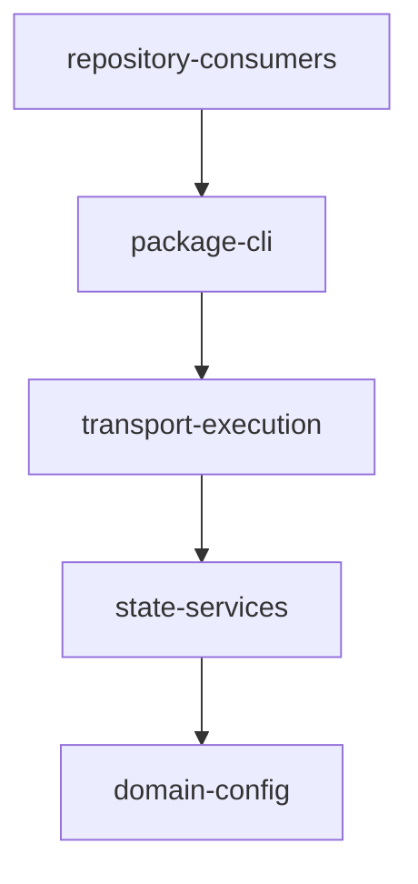
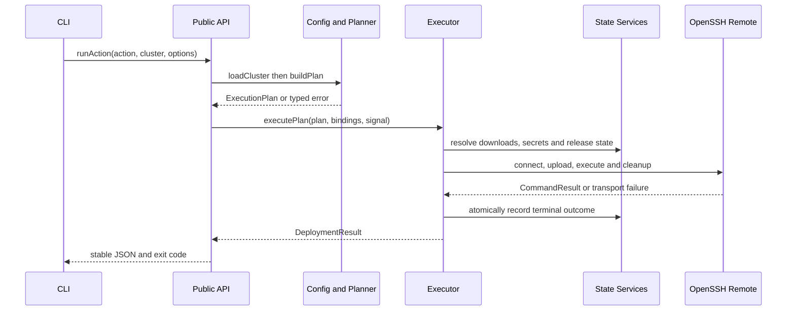
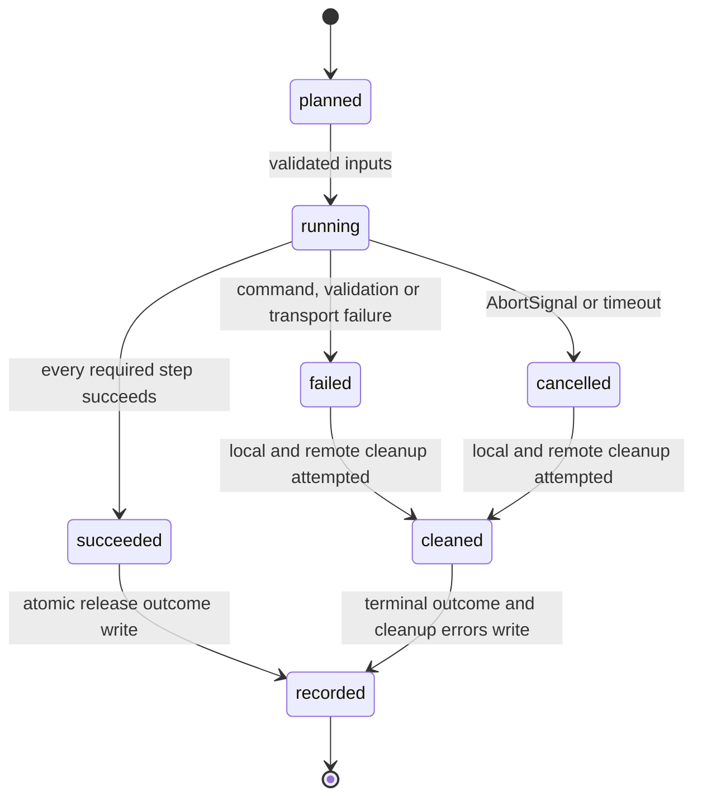

# sfo-deploy Deno TypeScript 迁移自动流水线计划

Workflow tier: high-risk

Risk profile: ./risk-profile.yaml

## Trigger

- Proposal: docs/versions/v0.1/modules/sfo-deploy/018-migrate-to-deno-typescript/proposal.md
- User launch confirmed: yes
- User launch statement: `确认，自动完成`
- Launch stage: proposal
- First auto stage: design
- Design source: pipeline/plan.md
- Per-stage user confirmation: skipped by explicit user auto-pipeline authorization
- Auto-confirm completed document stages: no design/testing Markdown documents generated;
  repository-local document extensions only
- Auto-pipeline document policy: stage-selective; automatic design uses pipeline plan; automatic
  testing uses runtime state; testplan.yaml required for automatic testing
- Version: v0.1
- Packet module: sfo-deploy
- Task name: 018-migrate-to-deno-typescript
- Target module(s): sfo-deploy
- change_id values: CHG-deno-package-entry, CHG-typescript-control-plane,
  CHG-deno-consumer-migration, CHG-deno-verification

## Acceptance Baseline

- 最终验收以用户已确认的 `proposal.md` 为唯一需求基线。
- 产品控制端、产品测试和仓库内产品消费者迁移到 Deno/TypeScript；Harness 的 Python 工具链保留。
- 现有 CLI 动作、参数、固定退出码、JSON 结果、集群 YAML、远端 Deno 生命周期脚本及 v1/v2/v3
  发布快照读取语义必须保持；Python 公共 API 采用明确的破坏性迁移，不提供伪兼容包装。
- 安装验证边界是从仓库路径或固定版本 URL 执行 `deno install --global --name sfo-deploy ...` 后，通过
  PATH 直接调用 `sfo-deploy`；真实注册表发布不在本任务中。

## Stage Graph

| Task ID | Stage          | Execution Mode | Responsibility                                                             | Scope                                                                                     | Parent Task | Depends On | Output                                                 | Done Condition                                                                          |
| ------- | -------------- | -------------- | -------------------------------------------------------------------------- | ----------------------------------------------------------------------------------------- | ----------- | ---------- | ------------------------------------------------------ | --------------------------------------------------------------------------------------- |
| D-1     | design         | auto-pipeline  | 固化 TypeScript 模块边界、接口、依赖、状态、失败语义、消费者迁移和文件顺序 | 本计划与 risk-profile.yaml                                                                | root        | none       | 通过结构、schema 与风险检查的设计映射                  | 四个 change_id 与任务 scope 精确绑定，未生成 design.md                                  |
| I-1     | implementation | auto-pipeline  | 建立 TypeScript 领域模型、错误、结果、严格配置与规划核心                   | `src/errors.ts`、`src/results.ts`、`src/models.ts`、`src/config.ts`、`src/planning.ts`    | root        | D-1        | 无 Python 运行时依赖的配置和计划核心                   | YAML 严格校验、计划顺序和公开值对象语义与既有合同一致                                   |
| I-2     | implementation | auto-pipeline  | 迁移下载、秘密、环境绑定与发布历史 codec                                   | `src/downloads.ts`、`src/secrets.ts`、`src/environment.ts`、`src/history.ts`              | root        | I-1        | Deno 原生的输入准备与持久发布状态实现                  | 下载与秘密失败关闭，既有 v1/v2/v3 快照只读兼容且新写入原子化                            |
| I-3     | implementation | auto-pipeline  | 迁移 OpenSSH 传输、远端运行时、执行协调和资源清理                          | `src/transport.ts`、`src/remote_runtime.ts`、`src/execution.ts`                           | root        | I-2        | Deno.Command 驱动的严格 SSH/执行链                     | known_hosts、超时、取消、退出码、目标隔离和临时资源清理语义闭合                         |
| I-4     | implementation | auto-pipeline  | 建立公共 TypeScript API、CLI、可安装入口与 Deno 包配置                     | `src/integration.ts`、`src/cli.ts`、`src/mod.ts`、`src/main.ts`、`deno.json`、`deno.lock` | root        | I-3        | 可导入包与可由 Deno 全局安装的 `sfo-deploy` 命令       | `import.meta.main` 入口、导出表、权限说明和安装后命令合同完整                           |
| I-5     | implementation | auto-pipeline  | 迁移仓库内消费者并移除产品侧 Python 包装、依赖与旧构建说明                 | `examples/**`、`src/sfo_deploy/**`、`pyproject.toml`、`uv.lock`、README 与配置指南        | root        | I-4        | TypeScript 示例消费者、Deno 文档和清理后的产品构建面   | 仓库内产品/示例不再导入 Python `sfo_deploy`，Harness Python 保持可用                    |
| T-1     | testing        | auto-pipeline  | 从提案、计划和交付代码派生 Deno 单元、DV、集成、兼容与安装验证             | `tests/**`、`examples/**/tests/**`、testplan、统一测试注册与运行态证据                    | root        | I-5        | Deno 测试、testplan.yaml、runner wiring 与任务运行制品 | `sfo-deploy/018-migrate-to-deno-typescript all` 成功并覆盖四个 change_id 和全部适用风险 |
| A-1     | acceptance     | auto-pipeline  | 独立证伪需求、设计、实现、兼容迁移、安全边界和测试充分性                   | 全部交付物、任务运行证据与安装产物                                                        | root        | T-1        | acceptance-report.md                                   | 独立验收结论 accepted                                                                   |

## Submodule Tasks

| Task ID | Stage | Execution Mode | Responsibility | Submodule | Parent Task | Depends On | Output | Done Condition |
| ------- | ----- | -------------- | -------------- | --------- | ----------- | ---------- | ------ | -------------- |

五个实现任务就是直接责任边界：上游类型和配置被后续状态模块消费，状态模块被执行链消费，执行链被公共入口装配，最后才迁移消费者并删除
Python 产品表面。它们在同一 `src/**`
与构建文件上存在严格依赖，不再创建会产生重复所有权的嵌套子任务；T-1
必须在完整生产迁移后独立派生测试，A-1 与实现和测试分离。

## Parallel Scheduling

- Strategy: dependency-ready-set
- Concurrency: use all runtime-available child-agent slots
- Shared artifact owner: parent-orchestrator
- Lock directory: `.harness/locks/`
- Dispatch rule: launch dependency-ready work with practical edit coordination and available
  capacity
- Serialization reasons: explicit dependency, edit coordination, or exhausted concurrency capacity
- Evidence: record launched task ids and serialization reasons in
  `.harness/pipelines/v0.1/sfo-deploy/018-migrate-to-deno-typescript/state.json` scheduler waves

## Dependency Graphs



| Level     | Parent     | Node                 | Depends On          |
| --------- | ---------- | -------------------- | ------------------- |
| submodule | sfo-deploy | domain-config        | none                |
| submodule | sfo-deploy | state-services       | domain-config       |
| submodule | sfo-deploy | transport-execution  | state-services      |
| submodule | sfo-deploy | package-cli          | transport-execution |
| submodule | sfo-deploy | repository-consumers | package-cli         |

关键调用固定为 CLI
解析请求，经公开集成入口加载配置并构建不可变计划，再由执行器按目标和步骤调用下载、秘密与 OpenSSH
传输，最后将结果和发布记录序列化。任何目标失败只终止该目标的剩余步骤；取消、超时或传输异常均进入统一清理路径，秘密不得出现在日志或
JSON 中。





## Exported Interfaces

| Interface                                                        | Owner               | Consumer                                                | Compatibility       | Affected Callers                                                                                                                                | Migration Path                                                                                                       |
| ---------------------------------------------------------------- | ------------------- | ------------------------------------------------------- | ------------------- | ----------------------------------------------------------------------------------------------------------------------------------------------- | -------------------------------------------------------------------------------------------------------------------- |
| `loadCluster`、`buildPlan` 与领域值类型从 `src/mod.ts` 导出      | domain-config       | CLI、示例项目与 Deno 测试                               | breaking            | `examples/eleph-server-multipass/src/eleph_server_deploy/cli.py`、`tests/unit/test_config_planning.py`、`tests/integration/test_project_cli.py` | Python import 改为从仓库固定版本 `src/mod.ts` 导入，调用转为 Promise 并保留值语义                                    |
| `ProjectBindings`、`executePlan` 与 `runAction`                  | package-cli         | `src/cli.ts` 和示例项目 CLI                             | breaking            | `examples/eleph-server-multipass/src/eleph_server_deploy/cli.py`、`tests/dv/test_execution.py`                                                  | 用 TypeScript 对象和 `AbortSignal` 替代 Python dataclass/callback，示例入口改为 Deno                                 |
| `createCli` 与 `main(args)`                                      | package-cli         | `src/main.ts`、安装后的 `sfo-deploy` 命令与嵌入式调用者 | migration-required  | `pyproject.toml`、`README.md`、`tests/integration/test_project_cli.py`                                                                          | 删除 Python console script，`deno install --global --name sfo-deploy` 指向 `src/main.ts`，库调用从 `src/mod.ts` 导入 |
| `RemoteSession`、`Transport`、`DownloadProvider` TypeScript 接口 | transport-execution | 执行器、内建实现及消费者自定义适配器                    | breaking            | `tests/unit/test_transport.py`、`tests/unit/test_downloads.py`、`tests/dv/test_execution.py`                                                    | Python Protocol/类替换为 TypeScript interface，异步返回 Promise，测试替身同步迁移                                    |
| execution-plan v1/v2/v3 与 release schema v1 codec               | state-services      | `ReleaseStore`、rollback 和历史兼容测试                 | backward-compatible | `tests/test_release_history.py`                                                                                                                 | 保留按版本严格分流、哈希和 lineage 校验；只用当前编码器写新记录，不原地改写旧快照                                    |

### TypeScript 文件级接口

`src/models.ts` 和 `src/config.ts` 是所有上层模块的类型边界；消费者为
`src/planning.ts`、`src/history.ts`、`src/execution.ts`，兼容决策为 migration-required，因为 Python
dataclass 调用者必须迁移而 YAML/JSON 外部合同保持。

```typescript
export type Action =
  | "install"
  | "configure"
  | "deploy"
  | "start"
  | "stop"
  | "restart"
  | "status"
  | "rollback";
export interface ClusterDefinition {
  readonly name: string;
  readonly machines: readonly Machine[];
}
export interface ExecutionPlan {
  readonly schemaVersion: 3;
  readonly action: Action;
  readonly targets: readonly ResolvedMachine[];
  readonly steps: readonly PlanStep[];
}
export async function loadCluster(path: string): Promise<ClusterDefinition>;
export function buildPlan(cluster: ClusterDefinition, request: PlanRequest): ExecutionPlan;
```

`src/downloads.ts`、`src/secrets.ts` 与 `src/history.ts` 由 `src/execution.ts` 和
`src/integration.ts` 消费；公共适配器接口是 breaking，持久 codec 是 backward-compatible。

```typescript
export interface DownloadProvider {
  fetch(request: DownloadRequest, signal?: AbortSignal): Promise<VerifiedArtifact>;
}
export interface ProjectBindings {
  secret(name: string): Promise<string>;
  fileSecret(name: string): Promise<Uint8Array>;
}
export interface ReleaseStore {
  readSnapshot(releaseId: string): Promise<ExecutionPlan>;
  writeOutcome(outcome: ReleaseOutcome): Promise<void>;
  resolveRollback(releaseId?: string): Promise<ExecutionPlan>;
}
```

`src/transport.ts` 和 `src/execution.ts` 由 `src/integration.ts` 消费；Python Paramiko 表面
breaking，CLI 的退出与结果合同 backward-compatible。

```typescript
export interface RemoteSession extends AsyncDisposable {
  upload(localPath: string, remotePath: string, signal?: AbortSignal): Promise<void>;
  run(argv: readonly string[], options: RemoteRunOptions): Promise<CommandResult>;
  removeTree(remotePath: string): Promise<void>;
}
export interface Transport {
  connect(machine: ResolvedMachine, signal?: AbortSignal): Promise<RemoteSession>;
}
export function executePlan(
  plan: ExecutionPlan,
  bindings: ProjectBindings,
  options?: ExecuteOptions,
): Promise<DeploymentResult>;
```

`src/mod.ts` 和 `src/cli.ts` 是公共包边界，分别由 Deno 导入者和 `src/main.ts` 消费；Python API
breaking，命令行合同 backward-compatible。

```typescript
export interface CliDependencies {
  readonly runAction: typeof runAction;
  readonly stdout: Writer;
  readonly stderr: Writer;
}
export function createCli(
  dependencies?: Partial<CliDependencies>,
): (args: readonly string[]) => Promise<number>;
export function main(args: readonly string[] = Deno.args): Promise<number>;
export { buildPlan, executePlan, loadCluster, runAction };
export type { ClusterDefinition, DeploymentResult, ExecutionPlan, ProjectBindings };
```

## External Runtime Dependencies

- 运行时固定为 Deno 2.x；`deno.json` 提供 `exports`、任务和 TypeScript 检查配置，`deno.lock`
  锁定所有远程/JSR 内容。
- YAML 仅使用固定版本的官方 `@std/yaml`，其输出立即进入本项目严格 schema
  校验；不引入可执行配置、动态插件加载或运行时 npm 安装。
- 本地 HTTP/HTTPS 下载使用 Deno `fetch`、Web Crypto
  与受控临时文件，不增加下载客户端依赖；协议、重定向、凭据、哈希与落盘路径继续失败关闭。
- SSH/SFTP 选择系统 OpenSSH `ssh`/`scp`，通过 `Deno.Command` 的 argv 数组调用并固定 strict
  host-key、known_hosts、超时和 batch 参数；拒绝新增未审计的 JavaScript SSH 实现，也不使用 shell
  字符串拼接。
- CLI 参数解析保持仓库内小型显式解析器，不为了本次既有命令集合引入 CLI 框架；安装权限明确列出必要的
  read、write、env、net 与限定 run 能力，不使用 `-A`。
- 安装源使用仓库路径或固定版本 URL；本任务不执行 JSR/npm
  发布，文档必须说明升级、覆盖安装和卸载方式。

## API and Build Surface Impact

- Public API impact: breaking
- Crate-root export change: yes
- Build-surface change: yes
- Documentation examples affected: yes

## Consumer Migration Closure

| Old Symbol                                  | New Path                                   | change_id                   | Consumer Path                                   | Consumer Kind      | Migration Status |
| ------------------------------------------- | ------------------------------------------ | --------------------------- | ----------------------------------------------- | ------------------ | ---------------- |
| `sfo_deploy` Python 公共导出                | `src/mod.ts` TypeScript 导出               | CHG-deno-consumer-migration | examples/eleph-server-multipass/src/cli.ts      | 示例项目绑定       | migrated         |
| Python console script `sfo_deploy.cli:main` | `src/main.ts` 的 `import.meta.main`        | CHG-deno-package-entry      | src/main.ts                                     | 根构建入口         | migrated         |
| 示例 Python console script                  | 示例 TypeScript CLI 入口                   | CHG-deno-consumer-migration | examples/eleph-server-multipass/src/cli.ts      | 示例构建入口       | migrated         |
| `from sfo_deploy import create_cli`         | `import { createCli } from .../src/mod.ts` | CHG-deno-consumer-migration | README.md                                       | 根文档示例         | migrated         |
| Python API 配置指南示例                     | TypeScript API 配置指南示例                | CHG-deno-consumer-migration | docs/guides/sfo-deploy-cluster-configuration.md | 指南消费者         | migrated         |
| Python 示例测试绑定                         | Deno 示例测试绑定                          | CHG-deno-verification       | none-found                                      | 示例测试消费者     | verified-none    |
| Python CLI 合同测试                         | Deno CLI 合同测试                          | CHG-deno-verification       | none-found                                      | 集成测试消费者     | verified-none    |
| Python 配置/规划测试                        | Deno 配置/规划测试                         | CHG-deno-verification       | tests/unit/config_planning.test.ts              | 单元测试消费者     | migrated         |
| Python 下载与秘密测试                       | Deno 下载/秘密测试                         | CHG-deno-verification       | tests/unit/downloads_secrets.test.ts            | 单元测试消费者     | migrated         |
| Python SSH 传输测试                         | Deno OpenSSH 传输测试                      | CHG-deno-verification       | tests/unit/transport_cli.test.ts                | 单元测试消费者     | migrated         |
| Python 执行器测试                           | Deno 执行器测试                            | CHG-deno-verification       | tests/dv/execution.test.ts                      | DV 测试消费者      | migrated         |
| Python 发布历史测试                         | Deno 历史兼容测试                          | CHG-deno-verification       | tests/unit/history.test.ts                      | 持久合同测试消费者 | migrated         |
| Python 产品依赖锁                           | Deno lockfile                              | CHG-deno-consumer-migration | none-found                                      | 根产品依赖表面     | verified-none    |

## State Ownership

| State                                 | Owner               | Access Interface                                      | Lifecycle                                                                 | Failure Transitions                                                            |
| ------------------------------------- | ------------------- | ----------------------------------------------------- | ------------------------------------------------------------------------- | ------------------------------------------------------------------------------ |
| 已解析集群定义与不可变执行计划        | domain-config       | `loadCluster` 与 `buildPlan`                          | YAML 输入经严格验证后生成只读值对象，单次请求内有效                       | 未知字段、缺失字段、循环依赖或不安全路径直接抛出类型化错误，不进入执行         |
| 下载制品与秘密物化                    | state-services      | `DownloadProvider` 与 `ProjectBindings`               | 在受控临时目录创建、校验、消费并于成功/失败/取消后清理                    | 协议、哈希、凭据、大小、路径或清理失败进入显式错误；秘密值禁止写入结果和日志   |
| 发布记录、计划快照与 rollback lineage | state-services      | `ReleaseStore`                                        | 读取 v1/v2/v3，当前版本通过临时文件加原子替换写入 intent 和终态           | 损坏、篡改、版本未知或 lineage 不一致失败关闭；不改写来源快照                  |
| SSH 会话、远端步骤工作区与子进程      | transport-execution | `Transport.connect`、`RemoteSession` 与 `executePlan` | 每目标建立会话，每步骤创建工作区，终态无条件释放进程、会话和工作区        | 连接、非零、超时、取消及清理失败归一化记录；目标内 fail-fast，其他目标隔离继续 |
| CLI 输出与进程退出状态                | package-cli         | `createCli` 与 `main`                                 | 单次调用从 argv 到 stdout/stderr/exit code 完成，不保留跨调用可变全局状态 | 参数或配置错误、取消、执行失败映射到既有固定退出码；JSON 输出不夹杂提示文本    |

## Failure Flows

| Flow                      | Boundary                              | Failure                                                       | Handling                                                                                    |
| ------------------------- | ------------------------------------- | ------------------------------------------------------------- | ------------------------------------------------------------------------------------------- |
| YAML 到执行计划           | 文件系统 -> domain-config             | YAML 语法、未知键、路径逃逸、依赖环或缺失资源                 | 抛出稳定错误类别并在建立网络/写持久状态前停止                                               |
| 下载与秘密准备            | state-services -> transport-execution | 非 HTTPS 策略违规、重定向越界、哈希不符、秘密缺失或临时写失败 | 删除部分制品、脱敏错误、阻止上传与执行，不记录成功发布                                      |
| OpenSSH 建连和命令        | transport-execution -> 系统 ssh/scp   | known_hosts 不匹配、argv 注入、认证失败、超时或取消           | 固定 argv 与严格 host-key 失败关闭，终止对应进程组，清理目标资源并保留分类错误              |
| 远端步骤执行              | executor -> Deno 生命周期脚本         | 预检失败、非零退出、超时、取消或清理失败                      | 当前目标剩余步骤 fail-fast；其他目标保持隔离；结果记录主错误与清理错误且不泄密              |
| 发布历史与回退            | executor -> ReleaseStore              | 原子写中断、旧快照损坏、哈希/lineage 不一致                   | 不覆盖有效旧记录，临时文件可清理；读取和 rollback 失败关闭且不执行可疑计划                  |
| Deno 全局安装与 PATH 调用 | deno install -> src/main.ts           | 权限遗漏、入口 URL 不可解析、命令未进入 PATH 或依赖锁漂移     | 安装冒烟在隔离 DENO_INSTALL_ROOT 中失败；文档给出固定版本命令、PATH、升级和卸载恢复步骤     |
| Python 消费者移除         | package-cli -> repository-consumers   | 先删 Python 产品包导致示例、文档或测试仍引用旧符号            | I-5 先迁移每个具体消费者并扫描旧导入，再删除产品 Python 文件和依赖；Harness Python 路径排除 |

## Rejected Alternatives

| Decision Type | Selected                                                        | Rejected                                                                   | Reason                                                                                             |
| ------------- | --------------------------------------------------------------- | -------------------------------------------------------------------------- | -------------------------------------------------------------------------------------------------- |
| boundary      | 产品控制端、产品测试与仓库内消费者完整迁移，Harness Python 保留 | 只增加 TypeScript CLI 包装并继续调用 Python，或顺带重写 Harness            | 包装不能满足安装后无需 Python；重写 Harness 超出用户目标并扩大流程风险                             |
| technical     | Deno 标准能力、官方固定版 YAML 与系统 OpenSSH argv 调用         | Node 兼容层、运行时 npm 安装、未审计 JS SSH 库或 `Deno.Command` shell 拼接 | 选定方案减少供应链并复用 OpenSSH known_hosts 语义，同时保留可审计的参数边界                        |
| collaboration | I-1 到 I-5 按依赖串行迁移，随后独立 T-1 与 A-1                  | 按 Python 文件机械并行翻译或一开始删除整个 Python 树                       | 跨文件类型、codec 和执行合同依赖紧密；机械并行易产生接口漂移与未迁移消费者，过早删除会丢失行为基线 |

## Implementation Scope Bindings

| change_id                    | target_module | proposal_id | design_coverage                                                                                        | scope_paths                                                                                                                    | design_rules_applied                                                    |
| ---------------------------- | ------------- | ----------- | ------------------------------------------------------------------------------------------------------ | ------------------------------------------------------------------------------------------------------------------------------ | ----------------------------------------------------------------------- |
| CHG-deno-package-entry       | sfo-deploy    | P-001       | package-cli 提供 `src/mod.ts` 与 `src/main.ts`、Deno 配置锁定、全局安装权限和版本化安装文档            | `deno.json`, `deno.lock`, `src/**`, `README.md`, `docs/guides/**`                                                              | 顶层分解、TypeScript 文件接口、导出消费者、构建影响、安装失败和回滚边界 |
| CHG-typescript-control-plane | sfo-deploy    | P-002       | domain-config、state-services、transport-execution 与 package-cli 覆盖全部 Python 控制端能力和兼容状态 | `src/**`                                                                                                                       | 无环依赖、单一状态所有者、关键调用序列、失败转换、外部依赖和逐文件顺序  |
| CHG-deno-consumer-migration  | sfo-deploy    | P-003       | repository-consumers 逐文件把示例、项目绑定、产品依赖和文档从 Python API 迁移到 Deno API               | `examples/**`, `deno.json`, `deno.lock`, `README.md`, `docs/guides/**`                                                         | breaking 消费者闭包、旧到新导出映射、具体调用路径、迁移状态和删除顺序   |
| CHG-deno-verification        | sfo-deploy    | P-004       | T-1 在完整实现后生成 Deno unit、DV、integration、安装冒烟、测试计划与统一 runner 证据                  | `tests/**`, `examples/**/tests/**`, `harness/scripts/test-run.py`, `harness/quality-gates.yaml`, `test-run.sh`, `test-run.bat` | 风险检查可达、API/build evidence inputs、任务级运行入口与独立验收依赖   |

## File-Level Implementation Sequence

| Sequence | Task ID | File-Level Module                                                                              | Action                | Depends On | change_id                    | target_module | Scope Paths                                                            | Context Sources                                                                                  |
| -------- | ------- | ---------------------------------------------------------------------------------------------- | --------------------- | ---------- | ---------------------------- | ------------- | ---------------------------------------------------------------------- | ------------------------------------------------------------------------------------------------ |
| 1        | I-1     | `src/errors.ts`, `src/results.ts`, `src/models.ts`, `src/config.ts`, `src/planning.ts`         | create                | none       | CHG-typescript-control-plane | sfo-deploy    | `src/**`                                                               | proposal P-002、Dependency Graphs、models/config TypeScript 接口、YAML 与计划 Failure Flows      |
| 2        | I-2     | `src/downloads.ts`, `src/secrets.ts`, `src/environment.ts`, `src/history.ts`                   | create                | I-1        | CHG-typescript-control-plane | sfo-deploy    | `src/**`                                                               | proposal P-002、State Ownership、state-services TypeScript 接口、持久与安全 Failure Flows        |
| 3        | I-3     | `src/transport.ts`, `src/remote_runtime.ts`, `src/execution.ts`                                | create                | I-2        | CHG-typescript-control-plane | sfo-deploy    | `src/**`                                                               | proposal P-002、执行 sequence、RemoteSession TypeScript 接口、OpenSSH 依赖和清理转换             |
| 4        | I-4     | `src/integration.ts`, `src/cli.ts`, `src/mod.ts`, `src/main.ts`, `deno.json`, `deno.lock`      | create                | I-3        | CHG-deno-package-entry       | sfo-deploy    | `deno.json`, `deno.lock`, `src/**`, `README.md`, `docs/guides/**`      | proposal P-001、package-cli 接口、API and Build Surface Impact、安装 Failure Flow                |
| 5        | I-5     | `src/sfo_deploy/**`, `examples/**`, `pyproject.toml`, `uv.lock`, `README.md`, `docs/guides/**` | migrate/remove/modify | I-4        | CHG-deno-consumer-migration  | sfo-deploy    | `examples/**`, `deno.json`, `deno.lock`, `README.md`, `docs/guides/**` | proposal P-003、Consumer Migration Closure、repository-consumers 边界与 Python 移除 Failure Flow |

## Return Rules

- 验收发现提案对兼容边界、安装目标或 Python 移除范围含糊、矛盾或不可安全判定时，以 `rejected`
  完成报告并停止流水线，请用户决策，不自动修改提案。
- 模块边界、依赖选择、接口兼容、状态/失败模型或文件顺序缺陷返回
  D-1；缺失行为、错误实现、未迁移消费者或安装入口缺陷返回对应 I-1 至
  I-5；测试覆盖、测试实现、统一入口或运行证据不足返回 T-1。
- 设计返回后重新验证本计划和 risk
  profile；实现返回从拥有缺陷的最早任务重开，并使其下游状态失效；测试返回必须重新生成匹配的任务运行制品后才能再次进入
  A-1。
- 同一阻断问题超过 5 次未成功修复时停止并报告用户。

执行状态、调度波次、测试证据、返回记录、迭代次数和最终验收仅存储在
`.harness/pipelines/v0.1/sfo-deploy/018-migrate-to-deno-typescript/state.json`，不写回此不可变设计与
scope 计划。
