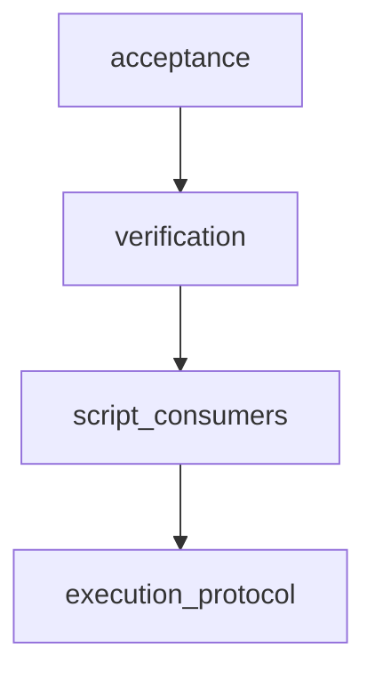
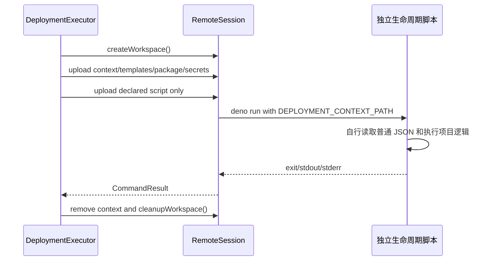

# 独立远端生命周期脚本自动流水线计划

Workflow tier: high-risk

Risk profile: ./risk-profile.yaml

## Trigger

- Proposal: docs/versions/v0.1/modules/sfo-deploy/019-independent-remote-scripts/proposal.md
- User launch confirmed: yes
- User launch statement: `确认，自动完成`
- Launch stage: proposal
- First auto stage: design
- Design source: pipeline/plan.md
- Per-stage user confirmation: skipped by explicit user auto-pipeline authorization
- Auto-confirm completed document stages: no design/testing Markdown documents generated;
  repository-local document extensions only
- Auto-pipeline document policy: stage-selective; automatic design uses pipeline plan; automatic
  testing uses runtime state; testplan.yaml required for automatic testing
- Version: v0.1
- Packet module: sfo-deploy
- Task name: 019-independent-remote-scripts
- Target module(s): sfo-deploy
- change_id values: CHG-independent-remote-scripts

## Acceptance Baseline

- 最终验收以 `proposal.md` 为唯一需求基线；本计划只细化实现结构，不扩大或缩小提案。

## Stage Graph

| Task ID | Stage          | Execution Mode | Responsibility                                                 | Scope                                          | Parent Task | Depends On | Output                       | Done Condition                                                            |
| ------- | -------------- | -------------- | -------------------------------------------------------------- | ---------------------------------------------- | ----------- | ---------- | ---------------------------- | ------------------------------------------------------------------------- |
| D-1     | design         | auto-pipeline  | 将零远端框架代码约束转换为接口、兼容性、状态、失败流与文件顺序 | 本任务包及当前生产调用链                       | root        | none       | 本计划设计映射与 risk checks | 计划和风险绑定通过结构检查，不生成 design.md                              |
| I-1     | implementation | auto-pipeline  | 删除辅助源码准备/上传并收紧 PreparedExecution 契约             | `src/execution.ts`、`src/remote_runtime.ts`    | root        | D-1        | 控制端执行链                 | 任一 Deno/Python 步骤都不生成或上传框架源码，既有上下文/权限/清理语义保持 |
| I-2     | implementation | auto-pipeline  | 将示例生命周期脚本和说明迁移为自包含普通程序                   | 示例脚本、README 与配置指南                    | root        | I-1        | 独立脚本与准确文档           | 当前脚本无框架导入，需上下文者自行解析普通 JSON，文档明确迁移边界         |
| T-1     | testing        | auto-pipeline  | 从提案、计划与交付代码设计并实现任务级测试                     | 专用测试、testplan 与 runtime testing evidence | root        | I-2        | 测试实现和成功制品           | 风险检查、unit/DV/integration 均可从任务级统一入口运行                    |
| A-1     | acceptance     | auto-pipeline  | 独立证伪需求、设计、实现和测试充分性                           | 全部当前主源与运行证据                         | root        | T-1        | acceptance-report.md         | 十类缺陷发现完成且无阻断，结论 accepted                                   |

## Submodule Tasks

| Task ID | Stage | Execution Mode | Responsibility | Submodule | Parent Task | Depends On | Output | Done Condition |
| ------- | ----- | -------------- | -------------- | --------- | ----------- | ---------- | ------ | -------------- |

合并理由：本任务只有一个 change_id；执行协议与脚本消费者按 I-1→I-2 串行闭合，分别建立同名
design/testing 子任务只会重复同一协议和证据，D-1 与 T-1 因而各自保留一个综合责任任务。

## Parallel Scheduling

- Strategy: dependency-ready-set
- Concurrency: use all runtime-available child-agent slots；在 available capacity 内调度就绪任务
- Shared artifact owner: parent-orchestrator
- Lock directory: `.harness/locks/`
- Dispatch rule: 按 practical edit coordination 处理共享文件；任务图是有意串行的，每个任务完成并更新
  runtime state 后才调度唯一的后继任务。
- Serialization reasons: 仅允许 explicit dependency, edit coordination, or exhausted concurrency
  capacity；本图中 I-1 依赖 D-1，I-2 依赖新执行协议，T-1 必须检查最终实现，A-1
  必须独立读取最终测试证据。
- Evidence: 调度波次记录在
  `.harness/pipelines/v0.1/sfo-deploy/019-independent-remote-scripts/state.json`。

## Dependency Graphs



| Level          | Parent     | Node               | Depends On         |
| -------------- | ---------- | ------------------ | ------------------ |
| responsibility | sfo-deploy | execution_protocol | none               |
| responsibility | sfo-deploy | script_consumers   | execution_protocol |
| responsibility | sfo-deploy | verification       | script_consumers   |
| responsibility | sfo-deploy | acceptance         | verification       |

## Key Call Flow



## Exported Interfaces

| Interface                                          | Owner              | Consumer                                      | Compatibility       | Affected Callers                                           | Migration Path                                                              |
| -------------------------------------------------- | ------------------ | --------------------------------------------- | ------------------- | ---------------------------------------------------------- | --------------------------------------------------------------------------- |
| `DEPLOYMENT_CONTEXT_PATH` 指向 schema v1 普通 JSON | execution-protocol | 当前所有需要步骤输入的生命周期脚本            | backward-compatible | 示例 configure/deploy/lifecycle 脚本                       | 脚本自行使用 Deno.env、JSON.parse 和普通对象访问，不导入框架代码            |
| `PreparedStep`（移除 `runtimeFile`）               | execution-protocol | `DeploymentExecutor` 及公开 TypeScript 消费者 | breaking            | `src/execution.ts`、可能直接检查 PreparedStep 的外部调用者 | 使用 `step.scripts` 和上下文协议；不再观察不存在的框架暂存文件              |
| `PreparedExecution`（移除 `runtimeFiles`）         | execution-protocol | `executePrepared` 及公开 TypeScript 消费者    | breaking            | `src/execution.ts`、可能直接检查 runtimeFiles 的外部调用者 | 使用 `plan`、`steps`、`localDirectory` 和 `close()`；框架运行库集合无替代物 |
| `writeRemoteRuntime` 与远端 `sfo_deploy.ts`        | execution-protocol | 仅当前 `src/execution.ts` 和旧脚本导入        | breaking            | `src/execution.ts`、仓库当前生命周期脚本                   | 删除生成器；执行器不上传替代源码，脚本迁移到普通输入协议                    |

```typescript
export interface PreparedStep {
  readonly step: PlanStep;
  readonly configValues: Readonly<Record<string, string>>;
  readonly fileDeployments: readonly FileSecretDeployment[];
  readonly artifact?: VerifiedArtifact;
  readonly redactor: Redactor;
}

export class PreparedExecution implements AsyncDisposable {
  readonly plan: ExecutionPlan;
  readonly steps: ReadonlyMap<string, PreparedStep>;
  readonly localDirectory: string;
  close(primary?: unknown): Promise<readonly string[]>;
}
```

脚本侧不提供框架接口；唯一输入是进程环境变量及其指向的普通 JSON 文件。纯动作脚本可以完全忽略该输入。

## API and Build Surface Impact

- Public API impact: breaking
- Crate-root export change: no
- Build-surface change: yes
- Documentation examples affected: yes

`PreparedStep` 与 `PreparedExecution` 由 `src/mod.ts` 公开，删除可观察字段属于
breaking；`src/remote_runtime.ts` 从发布源码集合删除属于 build surface 变化，但不改变 `deno.json`
顶层 exports。

## Consumer Migration Closure

| Old Symbol                            | New Path                                     | change_id                      | Consumer Path                                                                                         | Consumer Kind                     | Migration Status |
| ------------------------------------- | -------------------------------------------- | ------------------------------ | ----------------------------------------------------------------------------------------------------- | --------------------------------- | ---------------- |
| `PreparedStep.runtimeFile`            | 无；独立脚本不需要框架文件                   | CHG-independent-remote-scripts | src/execution.ts                                                                                      | 内部执行消费者                    | migrated         |
| `PreparedExecution.runtimeFiles`      | 无；保留 plan/steps/localDirectory/close     | CHG-independent-remote-scripts | tests/dv/execution.test.ts                                                                            | 公开行为 DV 消费者                | migrated         |
| `writeRemoteRuntime`                  | 无；删除远端源码生成                         | CHG-independent-remote-scripts | src/execution.ts                                                                                      | 内部运行时消费者                  | migrated         |
| `import ... from "./sfo_deploy.ts"`   | `DEPLOYMENT_CONTEXT_PATH` 普通 JSON 或无输入 | CHG-independent-remote-scripts | examples/eleph-server-multipass/cluster-template/apps/jx-server/scripts/configure.ts                  | App 配置脚本                      | migrated         |
| `DeploymentContext.fromEnvironment()` | 脚本本地 JSON 解析                           | CHG-independent-remote-scripts | examples/eleph-server-multipass/cluster-template/environments/eleph-server/mysql/scripts/configure.ts | 环境配置脚本                      | migrated         |
| `DeploymentContext.configSecret()`    | 对已校验普通对象显式取值                     | CHG-independent-remote-scripts | examples/eleph-server-multipass/cluster-template/environments/eleph-server/redis/scripts/configure.ts | 环境秘密消费者                    | migrated         |
| 其它仓库生命周期脚本的框架导入        | 无输入或脚本本地 JSON 解析                   | CHG-independent-remote-scripts | none-found                                                                                            | removed-symbol/compile 消费者闭包 | verified-none    |

## State Ownership

| State                                            | Owner                                | Access Interface                                          | Lifecycle                                                               | Failure Transitions                                                    |
| ------------------------------------------------ | ------------------------------------ | --------------------------------------------------------- | ----------------------------------------------------------------------- | ---------------------------------------------------------------------- |
| 本地准备目录中的脚本、模板、制品、秘密和 context | `PreparedExecution`                  | `prepareExecution` / `close`                              | 首次 SSH 前稳定复制，成功/失败/取消后统一清理                           | 输入变化、链接、下载、秘密或清理失败均显式失败；不生成 runtime 文件    |
| 每步骤远端工作区和 context JSON                  | `RemoteSession` 与当前 executor step | upload/execute/cleanupWorkspace                           | 0700 工作区、0600 context，脚本结束后删除 context，步骤终态删除整个目录 | 上传、执行、取消或删除失败进入步骤错误/cleanupErrors；不会遗留框架源码 |
| configure 秘密与模板映射                         | 当前 configure step                  | schema v1 JSON 的 `config_secrets` / `metadata.templates` | 只为声明的 configure 动作创建和上传，结果日志通过 Redactor 脱敏         | 缺失、类型错误或脚本拒绝时非零失败；其它动作不获得这些输入             |

## Failure Flows

| Flow                 | Boundary                            | Failure                                                  | Handling                                                                    |
| -------------------- | ----------------------------------- | -------------------------------------------------------- | --------------------------------------------------------------------------- |
| 本地计划到准备输入   | plan -> PreparedExecution           | 脚本不安全、运行时类型不支持、秘密/下载/模板准备失败     | 首次 SSH 前失败并清理已拥有资源；不创建任何远端辅助源码                     |
| 输入上传到独立脚本   | executor -> RemoteSession -> script | context/template/package/script 上传失败或解释器预检失败 | 当前步骤失败、工作区进入 finally 清理、同目标 fail-fast、其它目标隔离       |
| 独立脚本解析 JSON    | context file -> script              | 环境变量缺失、JSON/schema/字段类型或秘密缺失             | 脚本抛错/非零退出；执行器脱敏输出并清理 context/workspace，不回退到框架 SDK |
| 脚本命令与网络能力   | Deno -> allowlisted process/net     | 未声明命令/网络、FFI 或远程依赖请求                      | Deno 权限拒绝；固定 `--no-remote --no-npm --deny-ffi` 不放宽                |
| 旧脚本或历史快照回放 | current executor -> archived script | 脚本仍导入 `sfo_deploy.ts`/`.py`                         | 明确迁移型失败，不自动注入兼容 shim；错误可见且工作区清理                   |

## Invariants to Preserve

- 配置、脚本、模板、私钥、秘密和制品仍在首次 SSH 前稳定解析或复制。
- configure 以外步骤不携带配置密钥、file secrets 或模板映射。
- Deno 仍只直接读写登记工作区，默认拒绝 run/net/ffi，并禁止 remote/npm import。
- 一个脚本非零即停止该步骤剩余脚本；同目标 fail-fast，其他目标保持隔离。
- 成功、失败、超时和取消路径均关闭本地准备目录、远端工作区、会话与子进程。
- stdout/stderr 和清理错误继续通过当前 Redactor 脱敏。

## Rejected Alternatives

| Decision Type | Selected                                             | Rejected                                    | Reason                                                     |
| ------------- | ---------------------------------------------------- | ------------------------------------------- | ---------------------------------------------------------- |
| boundary      | 控制端传普通 JSON，独立脚本自行处理                  | 执行器解释业务配置并用固定 SSH 命令替代脚本 | 用户明确要求保留可编程集群配置；控制端不应吸收项目业务逻辑 |
| technical     | 完全停止辅助源码生成和上传                           | `deno eval`、stdin 或内联字符串注入同一 SDK | 这些方式仍会在集群执行框架代码，只是隐藏文件形态           |
| technical     | 旧依赖脚本明确迁移，不提供 shim                      | 按 import 文本动态选择是否上传旧 runtime    | 自动探测会永久保留隐式框架依赖并使历史行为难以审计         |
| collaboration | I-1 固化协议后 I-2 迁移消费者，再由独立 T-1/A-1 验证 | 执行器和脚本同时并行修改                    | 两端共享同一输入协议，并行修改会造成短暂契约漂移和重复返工 |

## Implementation Scope Bindings

| change_id                      | target_module | proposal_id  | design_coverage                                                                                                                      | scope_paths                                                                               | design_rules_applied                                                                    |
| ------------------------------ | ------------- | ------------ | ------------------------------------------------------------------------------------------------------------------------------------ | ----------------------------------------------------------------------------------------- | --------------------------------------------------------------------------------------- |
| CHG-independent-remote-scripts | sfo-deploy    | P-001, P-002 | execution-protocol 删除 runtime 源码生命周期；script-consumers 迁移为普通 JSON/环境变量协议；verification 覆盖兼容、安全、运行与清理 | `src/**`, `tests/**`, `examples/eleph-server-multipass/**`, `README.md`, `docs/guides/**` | 责任分解、无环依赖、TypeScript 文件接口、消费者迁移、单一状态所有者、失败流与逐文件顺序 |

## File-Level Implementation Sequence

| Sequence | Task ID | File-Level Module                                                                                                                                                               | Action                                                                                                  | Depends On | change_id                      | target_module | Scope Paths                                                         | Context Sources                                                                                 |
| -------- | ------- | ------------------------------------------------------------------------------------------------------------------------------------------------------------------------------- | ------------------------------------------------------------------------------------------------------- | ---------- | ------------------------------ | ------------- | ------------------------------------------------------------------- | ----------------------------------------------------------------------------------------------- |
| 1        | I-1     | `src/execution.ts`, `src/remote_runtime.ts`                                                                                                                                     | modify/remove：移除 runtimeFile/runtimeFiles、TS/Python helper 生成和上传，保留解释器预检与普通 context | none       | CHG-independent-remote-scripts | sfo-deploy    | `src/**`                                                            | proposal P-001、Exported Interfaces、State Ownership、Failure Flows、Consumer Migration Closure |
| 2        | I-2     | `examples/eleph-server-multipass/cluster-template/**/scripts/*.ts`, `README.md`, `docs/guides/sfo-deploy-cluster-configuration.md`, `examples/eleph-server-multipass/README.md` | modify：纯脚本移除 import；上下文消费者实现自包含 JSON 解析；说明独立脚本与迁移边界                     | I-1        | CHG-independent-remote-scripts | sfo-deploy    | `README.md`, `docs/guides/**`, `examples/eleph-server-multipass/**` | proposal P-002、普通输入协议、Invariants to Preserve、Compatibility、Security                   |

## Return Rules

- 提案对“独立”的含义、普通 JSON 是否允许、秘密/模板边界或历史兼容承诺若出现矛盾，A-1 先写 blocking
  requirement finding 与 rejected，再停止请用户决策。
- 执行接口、兼容性、状态/失败模型或文件顺序缺陷返回 D-1；缺失行为或实现错误返回
  I-1/I-2；覆盖、testplan、统一入口或证据不足返回 T-1。
- 每次 needs-changes 在 runtime state 记录 issue id、目标任务、原因和期望输出；同一问题超过 5
  次未关闭时停止并报告。

执行状态、测试证据、返回记录和最终验收仅存储在
`.harness/pipelines/v0.1/sfo-deploy/019-independent-remote-scripts/state.json`，不写回本设计计划。
