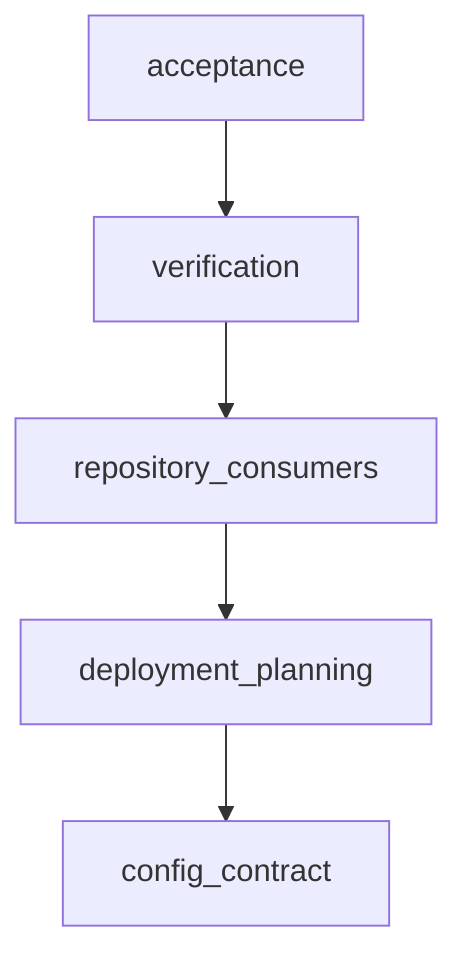
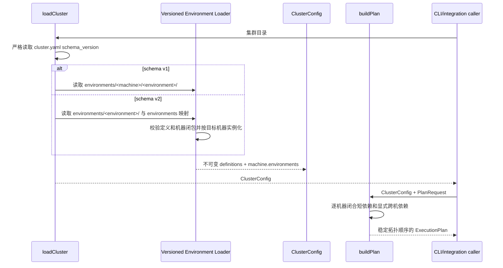

# Environment 集中放置配置自动流水线计划

Workflow tier: high-risk

Risk profile: ./risk-profile.yaml

## Trigger

- Proposal: docs/versions/v0.1/modules/sfo-deploy/020-environment-placement-config/proposal.md
- User launch confirmed: yes
- User launch statement: `确认，自动完成`
- Launch stage: proposal
- First auto stage: design
- Design source: pipeline/plan.md
- Per-stage user confirmation: skipped by explicit user auto-pipeline authorization
- Auto-confirm completed document stages: no design/testing Markdown documents generated;
  repository-local document extensions only
- Auto-pipeline document policy: stage-selective; automatic design uses pipeline plan; automatic
  testing uses runtime state; testplan.yaml required for automatic testing
- Version: v0.1
- Packet module: sfo-deploy
- Task name: 020-environment-placement-config
- Target module(s): sfo-deploy
- change_id values: CHG-environment-placement-config

## Acceptance Baseline

- 最终验收只以已确认的 `proposal.md` 为需求基线；本计划细化兼容迁移和实现结构，不扩大或缩小提案。

## Stage Graph

| Task ID | Stage          | Execution Mode | Responsibility                                                | Scope                                                                                                          | Parent Task | Depends On | Output                       | Done Condition                                                                              |
| ------- | -------------- | -------------- | ------------------------------------------------------------- | -------------------------------------------------------------------------------------------------------------- | ----------- | ---------- | ---------------------------- | ------------------------------------------------------------------------------------------- |
| D-1     | design         | auto-pipeline  | 将 v1/v2 配置兼容、共享定义实例化和消费者迁移转为完整设计映射 | 本任务包与当前配置/规划/历史消费者                                                                             | root        | none       | 本计划设计映射和 risk checks | 计划、风险绑定和 pre-edit 检查通过，不生成 design.md                                        |
| I-1     | implementation | auto-pipeline  | 实现版本化配置装载、Environment 放置解析、实例化和依赖校验    | `src/config.ts`；以 `src/types.ts`、`src/planning.ts`、`src/integration.ts`、`src/history.ts` 为只读兼容消费者 | root        | D-1        | 生产配置装载代码             | v1 旧布局和 v2 共享定义均归一化为现有不可变 ClusterConfig，公开类型、规划与历史 schema 不变 |
| I-2     | implementation | auto-pipeline  | 迁移仓库配置消费者、示例布局和用户文档                        | 测试夹具、multipass 模板、README 与配置指南                                                                    | root        | I-1        | v2 示例和准确迁移说明        | 仓库当前示例只生成 v2，文档准确说明新旧版本和依赖边界                                       |
| T-1     | testing        | auto-pipeline  | 从提案、计划和最终实现设计并实现任务级验证                    | 专用测试、testplan 与 runtime testing evidence                                                                 | root        | I-2        | 测试实现及成功测试制品       | contract/unit/DV/integration 从任务级统一入口成功且风险覆盖完整                             |
| A-1     | acceptance     | auto-pipeline  | 独立证伪需求、设计、实现、迁移兼容与测试充分性                | 全部当前源文件和运行证据                                                                                       | root        | T-1        | acceptance-report.md         | 全部缺陷发现类别完成、阻断项关闭且结论 accepted                                             |

## Submodule Tasks

| Task ID | Stage | Execution Mode | Responsibility | Submodule | Parent Task | Depends On | Output | Done Condition |
| ------- | ----- | -------------- | -------------- | --------- | ----------- | ---------- | ------ | -------------- |

合并理由：本任务只有一个 change_id。配置领域、规划领域和仓库消费者存在严格的 I-1→I-2
契约依赖；为它们重复建立 design/testing 子任务会拆散同一版本化配置契约，D-1 与 T-1
因而各保留一个综合责任任务。

## Parallel Scheduling

- Strategy: dependency-ready-set
- Concurrency: use all runtime-available child-agent slots；在 available capacity
  内调度依赖已满足的任务
- Shared artifact owner: parent-orchestrator
- Lock directory: `.harness/locks/`
- Dispatch rule: 按 practical edit coordination
  处理共享文件；任务图因配置类型、消费者迁移、最终测试和独立验收依次依赖而有意串行，每项完成并由父编排器更新
  runtime state 后再调度后继任务。
- Serialization reasons: 仅使用
  `explicit dependency, edit coordination, or exhausted concurrency capacity`；I-1 等待 D-1，I-2
  等待配置契约稳定，T-1 等待最终实现，A-1 等待测试证据。
- Evidence: 调度波次记录在
  `.harness/pipelines/v0.1/sfo-deploy/020-environment-placement-config/state.json`。

## Dependency Graphs



| Level          | Parent     | Node                 | Depends On           |
| -------------- | ---------- | -------------------- | -------------------- |
| responsibility | sfo-deploy | config_contract      | none                 |
| responsibility | sfo-deploy | deployment_planning  | config_contract      |
| responsibility | sfo-deploy | repository_consumers | deployment_planning  |
| responsibility | sfo-deploy | verification         | repository_consumers |
| responsibility | sfo-deploy | acceptance           | verification         |

## Key Call Flow



## Exported Interfaces

| Interface                                                                | Owner               | Consumer                                                  | Compatibility       | Affected Callers                                                        | Migration Path                                                                                |
| ------------------------------------------------------------------------ | ------------------- | --------------------------------------------------------- | ------------------- | ----------------------------------------------------------------------- | --------------------------------------------------------------------------------------------- |
| `cluster.yaml schema_version: 2` 的 `environments: {name: [machine...]}` | config-contract     | 集群维护者、`loadCluster`、CLI validate/plan              | new                 | README、配置指南、multipass 模板、测试夹具                              | 把每机重复目录合并为 `environments/{name}/`，并把目标机器列表写入 `cluster.yaml.environments` |
| `cluster.yaml schema_version: 1` 与 `environments/{machine}/{name}/`     | config-contract     | 现有集群与 `loadCluster`                                  | backward-compatible | 当前外部 v1 集群、v1 回归夹具                                           | 无需迁移即可继续读取；升级到 v2 时显式修改版本、目录和映射                                    |
| `ClusterConfig`、`Machine.environments`、`EnvironmentDefinition`         | config-domain       | `buildPlan`、integration、history、公开 TypeScript 消费者 | backward-compatible | `src/planning.ts`、`src/integration.ts`、`src/history.ts`、测试 fixture | 保持类型与每机实例语义；v2 在装载时派生与 v1 同形的 machine/environment definition key        |
| `app.yaml/environment.yaml depends_on` 短名与 `machine/name`             | deployment-planning | `validateDependencies`、`buildPlan`                       | backward-compatible | 当前 App、Environment 和计划测试                                        | 短名仍绑定当前机器；显式名称继续跨机器绑定，v2 增加逐放置校验                                 |

```typescript
export interface ClusterConfig {
  readonly name: string;
  readonly directory: string;
  readonly executorRegion: string;
  readonly machines: ReadonlyMap<string, Machine>;
  readonly environments: ReadonlyMap<string, EnvironmentDefinition>;
  readonly apps: ReadonlyMap<string, AppDefinition>;
  readonly placements: ReadonlyMap<string, readonly string[]>;
}

export async function loadCluster(directory: string | URL): Promise<ClusterConfig>;
export function buildPlan(cluster: ClusterConfig, request: PlanRequest): ExecutionPlan;
```

保持公开 TypeScript 类型签名不变，`placements` 仍仅表示 App 放置。`ClusterConfig.environments` 和
`Machine.environments` 继续使用 `machine/environment` 派生键；v2 的 Environment
放置只在装载边界消费，并按每个目标机器派生现有形状的定义和实例，不暴露新的可变放置状态。

`src/config.ts` 内部采用隔离的版本分支，接口边界如下；这些接口不从 `src/mod.ts` 导出：

```typescript
type ClusterSchemaVersion = 1 | 2;

interface LoadedEnvironments {
  readonly definitions: Map<string, EnvironmentDefinition>;
  readonly instances: Map<string, readonly EnvironmentInstance[]>;
}

async function loadV1MachineEnvironments(
  root: string,
  machines: ReadonlyMap<string, Machine>,
): Promise<LoadedEnvironments>;

async function loadV2PlacedEnvironments(
  root: string,
  machines: ReadonlyMap<string, Machine>,
  placementData: Readonly<Record<string, unknown>>,
): Promise<LoadedEnvironments>;
```

v2 每个 `environment.yaml` 只解析一次；装载器复用其已冻结的脚本、defaults、package
和规范资源目录，为每个目标机器派生名称为 `machine/environment` 的 `EnvironmentDefinition` 与
`EnvironmentInstance`。目标机器列表和定义目录均按稳定名称顺序处理，YAML
映射书写顺序不改变验证输出或计划顺序。

## API and Build Surface Impact

- Public API impact: backward-compatible
- Crate-root export change: no
- Build-surface change: yes
- Documentation examples affected: yes

TypeScript 导出签名保持不变；公开集群文件新增 v2，示例与文档迁移到 v2。旧 v1 继续兼容，因此没有现有
API 符号删除，但新示例不能由只支持 v1 的旧版本读取。

## Consumer Migration Closure

| Old Symbol                                                                                                                     | New Path                                                                                               | change_id                        | Consumer Path                                                 | Consumer Kind             | Migration Status |
| ------------------------------------------------------------------------------------------------------------------------------ | ------------------------------------------------------------------------------------------------------ | -------------------------------- | ------------------------------------------------------------- | ------------------------- | ---------------- |
| fixture 默认生成 `cluster.yaml` v1 且无 `environments` 字段                                                                    | fixture 默认生成 v2 完整映射，并保留显式 v1 兼容输入能力                                               | CHG-environment-placement-config | tests/_support/fixtures.ts                                    | 配置测试消费者            | migrated         |
| `environments/{machine}/{name}/environment.yaml` 示例布局及其中被忽略的 `__pycache__`、`*.py[cod]`、`.pytest_cache` 等生成缓存 | 规范模板只保留 `environments/{name}/environment.yaml` 及声明资源；物理删除旧机器层目录和全部生成缓存   | CHG-environment-placement-config | examples/eleph-server-multipass/cluster-template/cluster.yaml | 部署模板消费者            | migrated         |
| prepare 原样递归复制可能携带旧机器层目录或生成缓存                                                                             | 复制前拒绝有残留的源模板；从全新 staging 构造，完成变量/机器配置后以公开严格装载边界校验成功才原子发布 | CHG-environment-placement-config | examples/eleph-server-multipass/prepare-multipass.sh          | Shell 模板生成消费者      | migrated         |
| prepare 原样递归复制可能携带旧机器层目录或生成缓存                                                                             | 复制前拒绝有残留的源模板；从全新 staging 构造，完成变量/机器配置后以公开严格装载边界校验成功才原子发布 | CHG-environment-placement-config | examples/eleph-server-multipass/prepare-multipass.ps1         | PowerShell 模板生成消费者 | migrated         |
| 按机器目录配置说明                                                                                                             | 集中 Environment 定义与放置映射说明                                                                    | CHG-environment-placement-config | README.md                                                     | 公共文档消费者            | migrated         |
| 按机器目录配置指南                                                                                                             | v1 兼容与 v2 集中放置指南                                                                              | CHG-environment-placement-config | docs/guides/sfo-deploy-cluster-configuration.md               | 公共指南消费者            | migrated         |
| multipass 按机器目录说明                                                                                                       | multipass v2 集中定义与放置说明                                                                        | CHG-environment-placement-config | examples/eleph-server-multipass/README.md                     | 示例文档消费者            | migrated         |

`src/planning.ts`、`src/integration.ts`、`src/history.ts` 是只读兼容消费者：它们继续接收相同的
`ClusterConfig`/`ExecutionPlan` 形状，不需要 shim 或符号迁移；实施后由消费者扫描确认没有为 v2
引入分支或当前目录回读。

## External Dependencies

- 不新增依赖或导出。`src/config.ts` 继续通过 `jsr:@std/yaml` 的重复键拒绝能力解析 YAML，通过
  `jsr:@std/path` 与 Deno 文件系统 API 完成规范化和资源目录 containment 校验。
- v2 共享目录中的脚本、模板和包来源继续走现有 `scripts`、`contained`、`packageSpec`
  解析边界；共享定义不能绕过现有符号链接、普通文件、权限或资源路径检查。

## State Ownership

| State                                 | Owner                             | Access Interface                                | Lifecycle                                                       | Failure Transitions                                                              |
| ------------------------------------- | --------------------------------- | ----------------------------------------------- | --------------------------------------------------------------- | -------------------------------------------------------------------------------- |
| 用户集群 YAML 与 Environment 资源目录 | config-contract (`src/config.ts`) | `loadCluster`                                   | 每次命令在首次 SSH 前完整读取、版本选择、校验并冻结             | 版本、字段、目录、放置或路径错误抛 ConfigurationError，零远端连接且不改写配置    |
| v2 共享 Environment 原始定义          | config-contract (`src/config.ts`) | 内部 `loadV2PlacedEnvironments` 边界            | 每个目录读取一次；冻结资源字段后按 placement 派生每机定义和实例 | 缺失/多余映射、未知机器、空/重复目标或依赖缺失时整个集群装载失败，不缓存部分结果 |
| 归一化每机 Environment 实例           | ClusterConfig                     | `machine.environments` / `cluster.environments` | 装载完成后只读；规划按筛选条件消费                              | 无部分集群返回；任何闭包错误在 loadCluster/buildPlan 阶段失败                    |
| 发布历史实际计划                      | ReleaseStore/history codec        | 已归档 ExecutionPlan                            | deploy 成功/失败前按现有不可变快照协议保存并独立于当前目录读取  | 当前 v1/v2 配置变化不改写旧快照；非法或篡改快照继续失败关闭                      |

## Failure Flows

| Flow              | Boundary                                                          | Failure                                                                                                                            | Handling                                                                                                                           |
| ----------------- | ----------------------------------------------------------------- | ---------------------------------------------------------------------------------------------------------------------------------- | ---------------------------------------------------------------------------------------------------------------------------------- |
| 版本选择          | cluster.yaml -> loader                                            | 未知 schema、v1 含 v2 字段、v2 缺 environments                                                                                     | 抛带版本/字段上下文的 ConfigurationError；不猜测或回退另一布局                                                                     |
| v2 定义与放置合并 | environments directories + mapping -> ClusterConfig               | 定义缺失/多余、目标为空/重复/未知；映射为空但目录非空，或映射非空但目录缺失                                                        | 拒绝整个集群并列出具体 Environment/机器；`environments: {}` 仅在没有 Environment 定义时有效；不返回部分实例                        |
| 布局隔离          | schema version -> Environment loader                              | v1 出现 `environments` 字段或 v2 使用 `environments/{machine}/{environment}` 嵌套布局                                              | v1 字段校验或 v2 定义/目录闭包校验直接失败；不扫描另一版本布局，不按目录形状回退                                                   |
| v2 模板源升级残留 | cluster-template -> prepare staging                               | 规范模板仍存在 `environments/eleph-server/` 旧机器层级，或任意 `__pycache__`、`*.py[cod]`、`.pytest_cache` 等生成缓存              | 迁移时物理删除残留；Shell/PowerShell prepare 在复制前递归预检并失败关闭，不能靠 `.gitignore`、测试预清理或装载器忽略残留来掩盖错误 |
| v2 模板复制与发布 | clean cluster-template -> fresh staging -> cluster output         | 复制合并到旧输出、复制后出现旧层级/缓存，或完成 machines/secrets/占位替换后的 staging 不能被 `loadCluster`/`validate` 直接严格装载 | 每次从全新 staging 构造且不与旧输出合并；原子发布前对未预清理的完整 staging 运行公开严格装载，失败则保留旧已发布集群并清理 staging |
| 多机依赖闭合      | shared definition + per-machine placement -> dependency validator | 短依赖未放置到同机，或显式跨机目标不存在                                                                                           | 在配置装载阶段拒绝并指出 Environment/App、所在机器和缺失依赖                                                                       |
| 计划过滤          | ClusterConfig -> buildPlan                                        | 过滤排除依赖或未选中任何对象                                                                                                       | 保持现有 PlanningError 和 with-dependencies 行为，不隐式扩大用户机器过滤                                                           |
| 旧集群与历史      | v1 config / archived plan -> current binary                       | 旧目录读取或旧快照解码                                                                                                             | v1 走隔离兼容分支；历史继续从快照解码，不读取当前 Environment 目录                                                                 |
| 新配置降级        | v2 cluster -> v1-only binary                                      | 旧工具不认识 schema v2                                                                                                             | 明确的前向不兼容；用户保留/恢复 v1 配置才能降级，不自动双写                                                                        |

## Invariants to Preserve

- 所有 YAML、目录、脚本、模板、私钥和包来源在首次 SSH 前严格读取与校验。
- `machines.yaml` 仍不承载 Environment；App 放置仍只由 `cluster.yaml.apps` 决定。
- `Machine.environments` 对规划保持每机实例列表；步骤 ID 继续使用 `env:<machine>/<name>:<action>`。
- `ClusterConfig.placements` 继续只保存 App 放置；v2 Environment 放置不进入公开领域类型或发布计划
  schema。
- Environment/App 短依赖绑定同机，显式 `machine/name` 依赖保持跨机语义。
- 定向 App 默认只检查传递 Environment 依赖，`with-dependencies` 才执行完整环境动作。
- 计划拓扑、动作顺序、SSH 地址选择、秘密/模板/包投递和执行失败语义不因配置布局改变。
- 历史快照 codec 和 rollback 不读取当前资源目录，不因 v2 引入新计划 schema。

## Rejected Alternatives

| Decision Type | Selected                                            | Rejected                                      | Reason                                                                       |
| ------------- | --------------------------------------------------- | --------------------------------------------- | ---------------------------------------------------------------------------- |
| boundary      | cluster.yaml v2 显式选择共享定义布局                | 在 schema v1 中静默改变 environments 目录含义 | 同一版本对应两种互斥布局会让错误配置被猜测性解析，无法安全迁移和降级         |
| technical     | v1/v2 隔离装载后归一化为现有 ClusterConfig 形状     | 同时扫描两种布局并合并                        | 混合结果难以定义重复、覆盖与依赖优先级，也会隐藏迁移错误                     |
| technical     | v2 环境配置对所有目标机器一致                       | 在 placement 值中立即加入逐机 overrides       | 用户要求与 App 相同的简洁映射；overrides 会扩大 schema、合并优先级和测试矩阵 |
| collaboration | I-1 固化生产契约后 I-2 迁移消费者，最后独立 T-1/A-1 | 配置实现、示例迁移和测试同时改动              | 共享 fixture 和严格 schema 会在并行编辑中产生短暂契约漂移和冲突              |

## Implementation Scope Bindings

| change_id                        | target_module | proposal_id                       | design_coverage                                                                                                                               | scope_paths                                                                               | design_rules_applied                                                                        |
| -------------------------------- | ------------- | --------------------------------- | --------------------------------------------------------------------------------------------------------------------------------------------- | ----------------------------------------------------------------------------------------- | ------------------------------------------------------------------------------------------- |
| CHG-environment-placement-config | sfo-deploy    | P-001, P-002, P-003, P-004, P-005 | config-contract 版本选择和严格放置；deployment-planning 保持归一化实例与依赖；repository-consumers 迁移示例/文档；verification 覆盖兼容与历史 | `src/**`, `tests/**`, `examples/eleph-server-multipass/**`, `README.md`, `docs/guides/**` | 责任分解、无环依赖、TypeScript 接口、消费者迁移、单一状态所有者、失败流、不变量与逐文件顺序 |

## File-Level Implementation Sequence

| Sequence | Task ID | File-Level Module                                                                                                                                                                                                                                                                                                                                                                                                                                                                                                                                                                                   | Action                                                                                                                                                                                                                                                                                                                                                                                                                                                                       | Depends On | change_id                        | target_module | Scope Paths                                                                     | Context Sources                                                                            |
| -------- | ------- | --------------------------------------------------------------------------------------------------------------------------------------------------------------------------------------------------------------------------------------------------------------------------------------------------------------------------------------------------------------------------------------------------------------------------------------------------------------------------------------------------------------------------------------------------------------------------------------------------- | ---------------------------------------------------------------------------------------------------------------------------------------------------------------------------------------------------------------------------------------------------------------------------------------------------------------------------------------------------------------------------------------------------------------------------------------------------------------------------- | ---------- | -------------------------------- | ------------- | ------------------------------------------------------------------------------- | ------------------------------------------------------------------------------------------ |
| 1        | I-1     | `src/config.ts`                                                                                                                                                                                                                                                                                                                                                                                                                                                                                                                                                                                     | modify：按 `cluster.yaml.schema_version` 隔离 v1/v2 字段与目录装载；严格闭合定义/映射/机器；v2 只解析一次共享定义并归一化为现有每机模型                                                                                                                                                                                                                                                                                                                                      | none       | CHG-environment-placement-config | sfo-deploy    | `src/**`                                                                        | proposal P-001 至 P-004、Exported Interfaces、State Ownership、Failure Flows、Invariants   |
| 2        | I-2     | `tests/_support/fixtures.ts`；`examples/eleph-server-multipass/cluster-template/cluster.yaml`；`examples/eleph-server-multipass/cluster-template/environments/eleph-server/**` 旧层级及模板内全部生成缓存；`examples/eleph-server-multipass/cluster-template/environments/{jre,jx-runtime,mysql,redis}/` 下已列明的 `environment.yaml`、`scripts/*.ts`、`templates/*`；`examples/eleph-server-multipass/prepare-multipass.sh`；`examples/eleph-server-multipass/prepare-multipass.ps1`；`README.md`；`docs/guides/sfo-deploy-cluster-configuration.md`；`examples/eleph-server-multipass/README.md` | modify/move/delete，严格按此顺序：fixture 默认切至 v2 但保留显式 v1 输入；模板 cluster 映射升级并把四个 Environment 的声明资源提升到 `environments/{name}/`；物理删除 `environments/eleph-server/**` 旧层级及 `__pycache__`、`*.py[cod]`、`.pytest_cache` 等生成缓存；两套 prepare 增加源模板残留预检、全新 staging、完成配置后的公开 strict load/validate 与失败时不发布语义；最后同步三份文档。复制后和 prepare 发布后的完整集群必须无需调用方或测试预清理即可直接严格装载 | I-1        | CHG-environment-placement-config | sfo-deploy    | `tests/**`, `README.md`, `docs/guides/**`, `examples/eleph-server-multipass/**` | proposal P-001 至 P-005、Consumer Migration Closure、Failure Flows、Invariants、A020-F-002 |

## Return Rules

- 若提案对 schema 版本、v1 兼容、逐机 overrides 或依赖语义存在矛盾，A-1 先写 blocking requirement
  finding 与 rejected，再停止请用户决策。
- 配置接口、兼容/迁移、状态或失败模型缺陷返回 D-1；缺失行为或实现错误返回
  I-1/I-2；覆盖、testplan、统一入口或证据不足返回 T-1。
- 每次 needs-changes 在 runtime state 记录 issue id、目标任务、原因和期望输出；同一问题超过 5
  次未关闭时停止并报告。

执行状态、测试证据、return records 和最终验收只存储在
`.harness/pipelines/v0.1/sfo-deploy/020-environment-placement-config/state.json`，不写回本设计计划。
