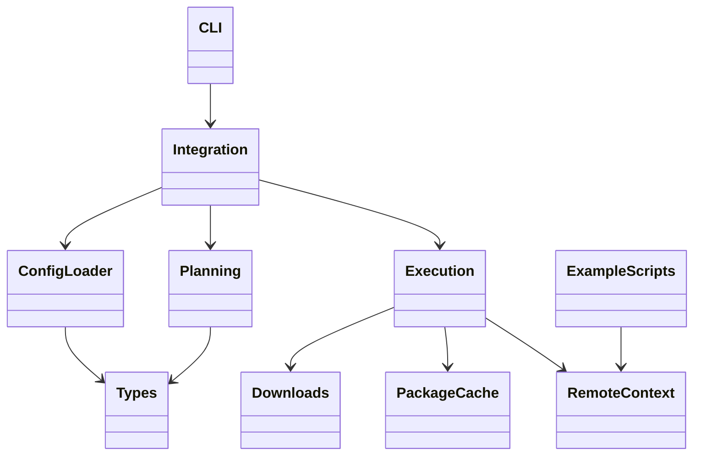
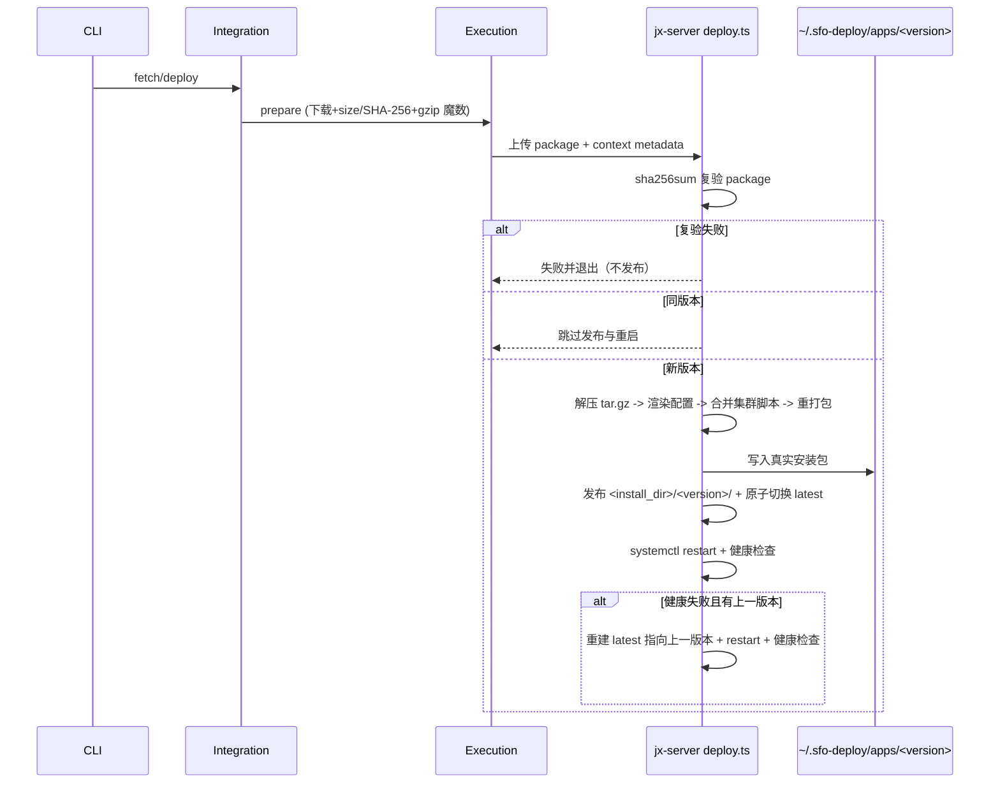
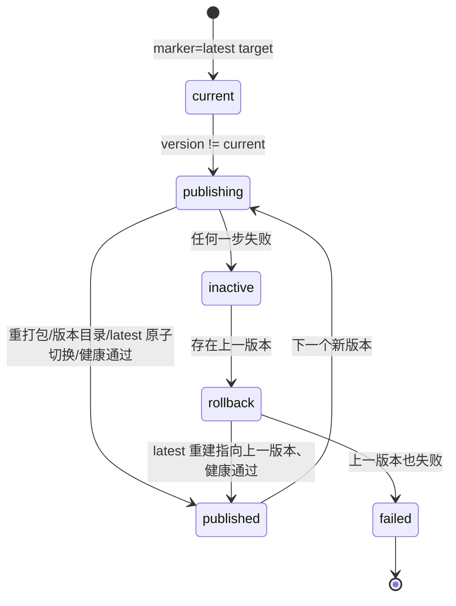

# App 版本配置、重打包与版本目录设计

Risk profile: ./risk-profile.yaml

## Design Scope

本设计覆盖 sfo-deploy 单模块的高风控执行面：集群配置装载（app_versions.yaml + app.yaml v2/v1）、
计划与执行 metadata 扩展（install_directory、package_hash、集群脚本映射、模板）、App 安装包 gzip
格式门禁，以及 jx-server 示例（模板与 live 集群副本）的版本目录、latest 软链、重打包与回滚脚本。
不改 CLI 动作集合、ExecutionPlan schemaVersion、发布历史结构与下载 provider 协议。

## Useful Context

- `src/config.ts` 的 `loadApps` 目前从 `apps/<App>/app.yaml` 读取 `version` 与 `package`；本任务
  改为：集群根 `app_versions.yaml` 统一声明两字段，app.yaml v2 只留稳定配置并必填
  `install_directory`，装载时合并；纯 v1 内联集群无 app_versions.yaml 时只读兼容。
- `src/planning.ts` 为 App 节点生成 configure/deploy 步骤，步骤携带 package、脚本与模板；本任务为
  App 步骤补充 installDirectory，并为 App deploy 步骤补充全部集群脚本引用供重打包使用。
- `src/execution.ts` 每次执行前把 App 安装包下载到临时工作区并上传，metadata 注入 `package_path` 与
  `parameters`；本任务扩展 metadata 并增加 gzip 魔数门禁。
- jx-server 示例当前使用固定目录 + `.previous` 备份模型，deploy.ts 直接复制 JAR；本任务重写为
  “sha256sum 复验 → 解压可执行包 → 渲染配置 → 合并集群脚本 → 重新打包 → 发布版本目录 → 原子切换
  latest → 健康检查 → 失败回滚”。
- 现有测试入口：`harness/scripts/test-run.py` 与根目录 `test-run.sh`；任务级计划后期注册到
  testplan.yaml，统一入口 <module>/<task-name> all。

## Overall Approach

采用“配置双文件合并 + 框架元数据扩展 + 示例脚本自管安装”的分层方案：

1. 配置层：`app_versions.yaml` 成为版本/下载/hash 的唯一来源；app.yaml v2 声明稳定结构并必填
   `install_directory`；装载器合并后保持既有 `AppDefinition` 形状，下游 planning/execution
   改动最小。
2. 计划层：App 步骤显式携带 `install_directory` 与重打包所需的集群脚本引用。
3. 执行层：SSH 前校验 App 安装包 gzip 魔数，metadata 提供 `package_hash`、`install_directory`、
   集群脚本映射（相对路径→远端文件）与模板；上传仍走临时工作区。
4. 示例层（jx-server）：configure 只准备安装目录与共享数据目录；deploy 完成校验、解压、渲染、
   合并脚本、重打包、版本目录发布、latest 切换、健康检查与失败回滚；systemd 单元从 latest 启动。
5. 文档与示例 live 副本逐字节保持一致。

## Layered Design Document Index

| level | parent_document | unit       | design_document | responsibility                                                                                                                             |
| ----- | --------------- | ---------- | --------------- | ------------------------------------------------------------------------------------------------------------------------------------------ |
| root  | design.md       | sfo-deploy | design.md       | 配置装载、计划、执行 metadata 与 jx-server 示例重打包流程的模块级设计（文件级模块在本文 “File-Level Interfaces” 定义，无独立业务子模块层） |

## Module Relationship UML



## File-Level Interfaces

```typescript
// src/types.ts
export interface ScriptInvocation {
  readonly source: string;
  readonly relativePath: string; // app.yaml/scripts 中声明的相对路径，重打包时按此写入安装包
  readonly permissions: ScriptPermissions;
}

export interface AppDefinition {
  readonly name: string;
  readonly directory: string;
  readonly installDirectory?: string; // app.yaml v2 必填；v1 无
  readonly version: string; // 来自 app_versions.yaml（v2）或内联（v1）
  readonly package: PackageSpec;
  readonly scripts: ScriptDefinition;
  readonly dependsOn: readonly string[];
}

export interface PlanStep {
  // ...既有字段
  readonly installDirectory?: string; // app 步骤携带
  readonly bundleScripts?: readonly ScriptInvocation[]; // app deploy 步骤：集群全部脚本引用
}

// src/downloads.ts 新增导出
export function assertGzipTar(path: string, label: string): Promise<void>;

// src/execution.ts 注入的 context metadata 扩展（仅新增键，不改变 schema_version）
type DeploymentMetadata = {
  package_path: string;
  parameters: Record<string, unknown>;
  package_hash?: { algorithm: string; value: string }; // needsPackage 步骤
  install_directory?: string; // app 步骤
  scripts?: Record<string, string>; // app deploy：相对路径 -> 远端脚本
  templates?: Record<string, string>; // app deploy 也提供模板
};
```

- Consumer:
  `src/config.ts`、`src/planning.ts`、`src/execution.ts`（框架侧）；`apps/jx-server/scripts/configure.ts`、`apps/jx-server/scripts/deploy.ts`（示例脚本侧）；`CHG-release-config`、`CHG-versioned-app-layout`、`CHG-repackage`。
- Compatibility: backward-compatible, new

说明：context schema 主版本不变、v1 app.yaml 只读兼容、既有导出 API 形状保持、旧快照忽略新增
metadata 字段，因此对既有消费者为 backward-compatible；types.ts 新增 readonly 字段与 `assertGzipTar`
导出为 new 接口。

## Key Flows



## State and Ownership

- Owner: jx-server deploy 脚本（示例）拥有远端 `<install_dir>/<version>/`、`latest` 软链、
  `.jx-server.version` 标记与 `~/.sfo-deploy/apps/<version>/` 安装包目录的生命周期；框架拥有本地
  包缓存、SSH 前校验与 metadata 注入；`app_versions.yaml` 由配置装载器拥有并只读合入 AppDefinition。



## Directly Mapped Change Items

| change_id                | target_module | proposal_id | design_coverage                                                                                                                                       | scope_paths                                                                                                                                                                                                                                                                                                                                                                                                             |
| ------------------------ | ------------- | ----------- | ----------------------------------------------------------------------------------------------------------------------------------------------------- | ----------------------------------------------------------------------------------------------------------------------------------------------------------------------------------------------------------------------------------------------------------------------------------------------------------------------------------------------------------------------------------------------------------------------- |
| CHG-versioned-app-layout | sfo-deploy    | P-001       | install_directory 必填并进入 AppDefinition/PlanStep/metadata；版本目录、latest 软链、systemd latest 启动与失败回滚；同名作为重打包的落位目标          | src/config.ts, src/types.ts, src/planning.ts, src/execution.ts, examples/eleph-server-multipass/cluster-template/apps/jx-server/app.yaml, examples/eleph-server-multipass/cluster-template/apps/jx-server/scripts/deploy.ts, examples/eleph-server-multipass/cluster-template/apps/jx-server/scripts/configure.ts, examples/eleph-server-multipass/cluster-template/environments/jx-runtime/templates/jx-server.service |
| CHG-remote-package-hash  | sfo-deploy    | P-002       | metadata 注入 package_hash（algorithm/value），deploy.ts 用 /usr/bin/sha256sum 复验，失败即停止；框架 SSH 前 size+SHA-256 不变                        | src/execution.ts, examples/eleph-server-multipass/cluster-template/apps/jx-server/scripts/deploy.ts                                                                                                                                                                                                                                                                                                                     |
| CHG-release-config       | sfo-deploy    | P-004       | 新增集群根 app_versions.yaml 装载与严格校验，app.yaml v2 移除 version/package、纯 v1 只读兼容，装载合并为 AppDefinition                               | src/config.ts, src/types.ts, src/planning.ts, examples/eleph-server-multipass/cluster-template/app_versions.yaml, examples/eleph-server-multipass/cluster-template/apps/jx-server/app.yaml, docs/guides/sfo-deploy-cluster-configuration.md, README.md                                                                                                                                                                  |
| CHG-repackage            | sfo-deploy    | P-005       | App 安装包 gzip 魔数门禁；App deploy 步骤携带 bundleScripts 与模板，metadata 提供 scripts/templates；deploy.ts 解压、渲染、合并集群脚本、重打包并发布 | src/downloads.ts, src/execution.ts, src/planning.ts, src/integration.ts, examples/eleph-server-multipass/cluster-template/apps/jx-server/scripts/configure.ts, examples/eleph-server-multipass/cluster-template/apps/jx-server/scripts/deploy.ts                                                                                                                                                                        |
| CHG-docs                 | sfo-deploy    | P-003       | README、集群配置指南、示例 README、change record 与模板/live 副本同步新配置与新部署语义                                                               | README.md, docs/guides/sfo-deploy-cluster-configuration.md, examples/eleph-server-multipass/README.md, docs/changes/026-versioned-app-layout.md                                                                                                                                                                                                                                                                         |

## Implementation Order

| phase | goal                                                                                                       | depends_on | output                                                 |
| ----- | ---------------------------------------------------------------------------------------------------------- | ---------- | ------------------------------------------------------ |
| 1     | 类型与配置装载：app_versions.yaml、app.yaml v2/v1、install_directory 校验、bundleScripts/relativePath 类型 | 无         | src/types.ts、src/config.ts 可编译                     |
| 2     | 计划层：PlanStep 携带 install_directory 与 bundleScripts，App deploy 步骤附带模板与密钥                    | phase 1    | src/planning.ts 计划正确                               |
| 3     | 执行层：gzip 断言、metadata 注入 package_hash/install_directory/scripts/templates，fetch 门禁              | phase 2    | src/downloads.ts、src/execution.ts、src/integration.ts |
| 4     | 示例改造：app_versions.yaml、app.yaml v2、configure/deploy 脚本、jx-server.service 与 live 副本            | phase 3    | 模板与 live 副本一致的可部署示例                       |
| 5     | 文档同步                                                                                                   | phase 4    | README、指南、示例 README、change record               |

## File-Level Implementation Sequence

| sequence | file_level_module                                                    | action | depends_on | change_id                                                          | scope_path                                                                                                                                      | implementation_task |
| -------- | -------------------------------------------------------------------- | ------ | ---------- | ------------------------------------------------------------------ | ----------------------------------------------------------------------------------------------------------------------------------------------- | ------------------- |
| 1        | src/types.ts                                                         | modify | -          | CHG-release-config / CHG-versioned-app-layout / CHG-repackage      | src/types.ts                                                                                                                                    | default             |
| 2        | src/config.ts                                                        | modify | 1          | CHG-release-config / CHG-versioned-app-layout                      | src/config.ts                                                                                                                                   | default             |
| 3        | src/planning.ts                                                      | modify | 2          | CHG-release-config / CHG-repackage                                 | src/planning.ts                                                                                                                                 | default             |
| 4        | src/downloads.ts                                                     | modify | 1          | CHG-repackage                                                      | src/downloads.ts                                                                                                                                | default             |
| 5        | src/execution.ts                                                     | modify | 3,4        | CHG-versioned-app-layout / CHG-remote-package-hash / CHG-repackage | src/execution.ts                                                                                                                                | default             |
| 6        | src/integration.ts                                                   | modify | 4,5        | CHG-repackage                                                      | src/integration.ts                                                                                                                              | default             |
| 7        | cluster-template app_versions.yaml                                   | create | 2          | CHG-release-config                                                 | examples/eleph-server-multipass/cluster-template/app_versions.yaml                                                                              | default             |
| 8        | cluster-template apps/jx-server/app.yaml                             | modify | 7          | CHG-release-config / CHG-versioned-app-layout                      | examples/eleph-server-multipass/cluster-template/apps/jx-server/app.yaml                                                                        | default             |
| 9        | cluster-template apps/jx-server/scripts/configure.ts                 | modify | 8          | CHG-versioned-app-layout / CHG-repackage                           | examples/eleph-server-multipass/cluster-template/apps/jx-server/scripts/configure.ts                                                            | default             |
| 10       | cluster-template apps/jx-server/scripts/deploy.ts                    | modify | 8,9        | CHG-versioned-app-layout / CHG-remote-package-hash / CHG-repackage | examples/eleph-server-multipass/cluster-template/apps/jx-server/scripts/deploy.ts                                                               | default             |
| 11       | cluster-template environments/jx-runtime/templates/jx-server.service | modify | 10         | CHG-versioned-app-layout                                           | examples/eleph-server-multipass/cluster-template/environments/jx-runtime/templates/jx-server.service                                            | default             |
| 12       | clusters/multipass 副本                                              | modify | 7-11       | CHG-release-config / CHG-versioned-app-layout / CHG-repackage      | examples/eleph-server-multipass/clusters/multipass                                                                                              | default             |
| 13       | README/指南/示例 README/change record                                | modify | 12         | CHG-docs                                                           | README.md, docs/guides/sfo-deploy-cluster-configuration.md, examples/eleph-server-multipass/README.md, docs/changes/026-versioned-app-layout.md | default             |

## API and Build Surface Impact

- Public API impact: none
- Crate-root export change: no
- Build-surface change: no
- Documentation examples affected: yes

说明：`src/mod.ts` 与 `src/cli.ts` 的导出接口不变，仅内部类型、集群配置 schema 与示例/文档契约
演进。

## Consumer Migration Closure

| old_symbol                            | new_path                                            | change_id                | consumer_kind          | consumer_path                                                                                        | migration_status |
| ------------------------------------- | --------------------------------------------------- | ------------------------ | ---------------------- | ---------------------------------------------------------------------------------------------------- | ---------------- |
| app.yaml 内联 version/package         | cluster-template/app_versions.yaml                  | CHG-release-config       | example-cluster-config | examples/eleph-server-multipass/cluster-template/apps/jx-server/app.yaml                             | migrated         |
| app.yaml 字段表（version/package）    | docs/guides/sfo-deploy-cluster-configuration.md     | CHG-docs                 | doc-example            | docs/guides/sfo-deploy-cluster-configuration.md                                                      | migrated         |
| README 版本/下载示例                  | README.md                                           | CHG-docs                 | doc-example            | README.md                                                                                            | migrated         |
| jx-server.service 平铺 ExecStart 路径 | environments/jx-runtime/templates/jx-server.service | CHG-versioned-app-layout | service-template       | examples/eleph-server-multipass/cluster-template/environments/jx-runtime/templates/jx-server.service | migrated         |
| deploy.ts 平铺复制 JAR 流程           | apps/jx-server/scripts/deploy.ts                    | CHG-repackage            | example-script         | examples/eleph-server-multipass/cluster-template/apps/jx-server/scripts/deploy.ts                    | migrated         |

## Design Notes

- 本任务在 sfo-deploy 模块下保持单层文件级分解，不建立独立业务子模块；理由：改动集中在配置装载、
  执行 metadata 与 jx-server 示例脚本三条既有职责线，无 3 个以上独立对外可见目录的新功能面。
- 配置兼容采用“全有或全无”：存在 app_versions.yaml 时所有 app.yaml 必须 v2（无内联字段）；缺失时
  所有 app.yaml 必须 v1 内联只读兼容。与 cluster schema v1/v2 排他风格一致，避免双来源。
- 重打包的“集群相关脚本”指 App 在 app.yaml scripts 中声明的全部脚本（含 start/stop/restart 等
  动作引用），由 App deploy 步骤统一上传并映射给 deploy 脚本打包进安装包。
- 渲染配置移入 deploy 阶段后，configure 步骤只负责安装目录与共享数据目录的准备；模板、密钥与
  redaction 语义不变。
- 失败回滚保留上一版本目录而非删除；软链切换使用临时目标 + `mv -Tf` 原子替换。

## Risks and Rollback

- 纯 v1 集群不回归：装载器按无 app_versions.yaml 分支走既有内联读法并保持校验；集成测试覆盖。
- 双文件一致性：app_versions.yaml 按 App 全量映射检查，缺失/多余/未知字段在 SSH 前失败。
- 安装包格式：非 gzip App 包在 fetch 与 deploy 准备阶段均被拒绝；目标机 sha256sum 复验失败的
  版本不发布。
- 回滚：发布后健康检查失败时恢复上一版本软链并重启；上一版本也失败时输出聚合错误并保留现场，
  便于人工介入；历史版本目录保留不清理。
