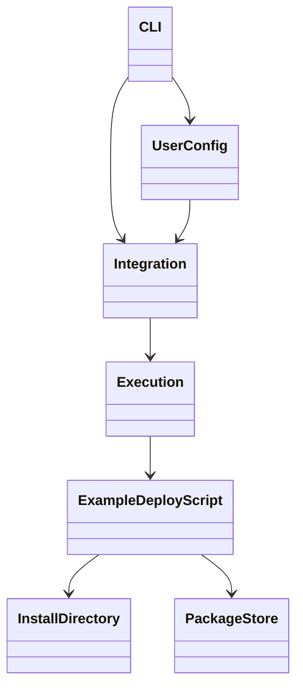
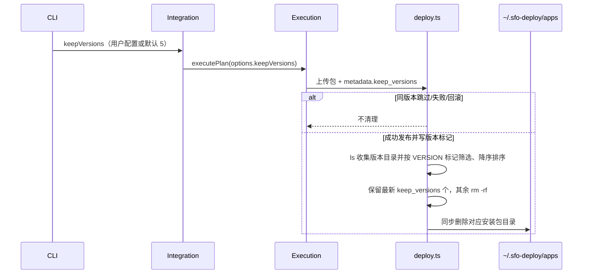
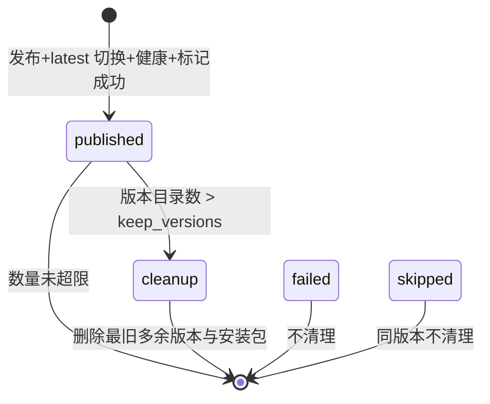

# 旧版本自动清理设计

Risk profile: ./risk-profile.yaml

## Design Scope

本设计覆盖 sfo-deploy 单模块的版本保留策略：用户配置 `keep_versions`（全局、默认 5）的装载与校验、
CLI/公共 API 透传、执行器 App deploy metadata 注入，以及 jx-server 示例部署成功后的旧版本目录与
`~/.sfo-deploy/apps/<version>/` 安装包清理。不改集群配置 schema、ExecutionPlan/PlanStep 持久格式、
发布历史结构与下载 provider 协议。

## Useful Context

- `src/user_config.ts` 目前只装载 `~/.sfo-deploy/config.yaml` 的 `packages_dir`（schema v1）；
  本任务在同一配置文件中新增可选 `keep_versions`，保持“缺失即默认值”的既有风格。
- `src/cli.ts` 已从用户配置读出 `packages_dir` 并经 `RunDependencies` 传给 `run()`；`keep_versions`
  走同一条依赖链进入执行器即可，无需触碰集群配置装载器。
- `src/execution.ts` 的 runStep 已为 App deploy 步骤注入 `package_hash`、`install_directory`、
  `scripts`、`templates`；本任务再注入全局运行参数 `keep_versions`，不改 PlanStep/历史 codec。
- jx-server deploy.ts 在成功发布并写版本标记后具备绝对时机点；清理需要列出安装目录子项并用外部
  命令完成（远端 Deno 只读/写步骤工作区）。

## Overall Approach

采用“全局配置 + 运行参数注入 + 脚本侧清理”的分层方案：

1. 配置层：`src/user_config.ts` 校验 `keep_versions`（可选、正整数、1-100、默认 5），公共 API
   在同一依赖链上对直接传入值做防御校验；
2. 执行层：`src/execution.ts` 在 App deploy 步骤 metadata 注入 `keep_versions`；
3. 脚本层：jx-server deploy.ts 在成功发布后列出安装目录版本目录（VERSION 标记匹配），按版本字符串
   降序保留最新 N 个，删除其余版本目录与对应 `~/.sfo-deploy/apps/<version>/` 安装包；
4. 文档与 live 副本同步，删除路径严格校验。

## Layered Design Document Index

| level | parent_document | unit       | design_document | responsibility                                                                                                        |
| ----- | --------------- | ---------- | --------------- | --------------------------------------------------------------------------------------------------------------------- |
| root  | design.md       | sfo-deploy | design.md       | 用户配置、执行 metadata 与示例清理流程的模块级设计（文件级模块在本文 File-Level Interfaces 定义，无独立业务子模块层） |

## Module Relationship UML



## File-Level Interfaces

```typescript
// src/user_config.ts
export const DEFAULT_KEEP_VERSIONS = 5;
export const MAX_KEEP_VERSIONS = 100;
export interface SfoDeployUserConfig {
  readonly schemaVersion: 1;
  readonly packagesDir: string;
  readonly keepVersions: number; // 默认 5，范围 1-100
}

// src/integration.ts RunDependencies 增补
readonly keepVersions?: number; // 未传时按 DEFAULT_KEEP_VERSIONS；非法值拒绝

// src/execution.ts ExecuteOptions 增补 + metadata 注入
readonly keepVersions?: number;
metadata.keep_versions = options.keepVersions ?? DEFAULT_KEEP_VERSIONS; // 仅 app deploy 步骤

// examples/.../scripts/deploy.ts 新增
function cleanupOldVersions(
  installDirectory: string,
  home: string,
  currentVersion: string,
  keep: number,
): Promise<void>;
```

- Consumer:
  `src/cli.ts`、`src/integration.ts`、`src/execution.ts`、`apps/jx-server/scripts/deploy.ts`；
  `CHG-version-retention-config`、`CHG-cleanup-execution`。
- Compatibility: backward-compatible, new

说明：context schema 主版本与集群配置 schema 不变；`keep_versions` 为可选新增配置字段，缺失按默认 5
执行；`new` 接口指新增函数与配置字段。

## Key Flows



## State and Ownership

- Owner: 用户配置 `~/.sfo-deploy/config.yaml` 由 `src/user_config.ts` 拥有并校验；`keep_versions`
  为运行参数由执行器注入；版本目录/安装包生命周期由 jx-server deploy 脚本（示例）拥有。



## Directly Mapped Change Items

| change_id                    | target_module | proposal_id | design_coverage                                                                                    | scope_paths                                                                                                                                                                                                           |
| ---------------------------- | ------------- | ----------- | -------------------------------------------------------------------------------------------------- | --------------------------------------------------------------------------------------------------------------------------------------------------------------------------------------------------------------------- |
| CHG-version-retention-config | sfo-deploy    | P-001       | 用户配置 keep_versions 装载/校验/默认值；CLI 与 RunDependencies 透传；执行器 metadata 注入         | src/user_config.ts, src/cli.ts, src/integration.ts, src/execution.ts, tests/unit/user_config.test.ts, tests/dv/execution.test.ts                                                                                      |
| CHG-cleanup-execution        | sfo-deploy    | P-002       | jx-server deploy.ts 成功后按版本字符串排序清理最旧版本目录与安装包；失败/回滚/跳过不清理；路径校验 | examples/eleph-server-multipass/cluster-template/apps/jx-server/scripts/deploy.ts, examples/eleph-server-multipass/clusters/multipass/apps/jx-server/scripts/deploy.ts, tests/integration/deploy_version_skip.test.ts |
| CHG-cleanup-docs             | sfo-deploy    | P-003       | README、指南、示例 README、change record 同步 keep_versions 与清理语义                             | README.md, docs/guides/sfo-deploy-cluster-configuration.md, examples/eleph-server-multipass/README.md, docs/changes/027-old-version-cleanup.md                                                                        |

## Implementation Order

| phase | goal                                    | depends_on | output                                                     |
| ----- | --------------------------------------- | ---------- | ---------------------------------------------------------- |
| 1     | 用户配置 keep_versions 装载与校验       | 无         | src/user_config.ts + 单元测试                              |
| 2     | CLI/公共 API 透传与执行器 metadata 注入 | phase 1    | src/cli.ts、src/integration.ts、src/execution.ts + DV 测试 |
| 3     | deploy.ts 清理流程与白名单              | phase 2    | 模板与 live 副本一致脚本 + 集成测试                        |
| 4     | 文档同步                                | phase 3    | README、指南、示例 README、change record                   |

## File-Level Implementation Sequence

| sequence | file_level_module                     | action | depends_on | change_id                    | scope_path                                                                                                                                     | implementation_task |
| -------- | ------------------------------------- | ------ | ---------- | ---------------------------- | ---------------------------------------------------------------------------------------------------------------------------------------------- | ------------------- |
| 1        | src/user_config.ts                    | modify | -          | CHG-version-retention-config | src/user_config.ts                                                                                                                             | default             |
| 2        | src/cli.ts                            | modify | 1          | CHG-version-retention-config | src/cli.ts                                                                                                                                     | default             |
| 3        | src/integration.ts                    | modify | 2          | CHG-version-retention-config | src/integration.ts                                                                                                                             | default             |
| 4        | src/execution.ts                      | modify | 3          | CHG-version-retention-config | src/execution.ts                                                                                                                               | default             |
| 5        | cluster-template deploy.ts            | modify | 4          | CHG-cleanup-execution        | examples/eleph-server-multipass/cluster-template/apps/jx-server/scripts/deploy.ts                                                              | default             |
| 6        | clusters/multipass deploy.ts          | modify | 5          | CHG-cleanup-execution        | examples/eleph-server-multipass/clusters/multipass/apps/jx-server/scripts/deploy.ts                                                            | default             |
| 7        | README/指南/示例 README/change record | modify | 6          | CHG-cleanup-docs             | README.md, docs/guides/sfo-deploy-cluster-configuration.md, examples/eleph-server-multipass/README.md, docs/changes/027-old-version-cleanup.md | default             |

## API and Build Surface Impact

- Public API impact: none
- Crate-root export change: no
- Build-surface change: no
- Documentation examples affected: yes

说明：`src/mod.ts` 与 `src/cli.ts` 导出接口不变；`RunDependencies` 增加可选字段（向后兼容），集群
配置文件与示例文档更新。

## Consumer Migration Closure

| old_symbol                | new_path                                                                          | change_id                    | consumer_kind  | consumer_path                                                                     | migration_status |
| ------------------------- | --------------------------------------------------------------------------------- | ---------------------------- | -------------- | --------------------------------------------------------------------------------- | ---------------- |
| 用户配置仅有 packages_dir | tests/unit/user_config.test.ts                                                    | CHG-version-retention-config | doc-example    | README.md                                                                         | migrated         |
| deploy 脚本无清理路径     | examples/eleph-server-multipass/cluster-template/apps/jx-server/scripts/deploy.ts | CHG-cleanup-execution        | example-script | examples/eleph-server-multipass/cluster-template/apps/jx-server/scripts/deploy.ts | migrated         |

## Design Notes

- `keep_versions` 是全局运行参数而非每 App 持久配置，因此不进 PlanStep/历史 codec，避免二次扩展快照
  格式；旧发布快照重放时不需要该参数（旧脚本行为不变）。
- 版本目录识别采用“目录名与目录内 VERSION 文件内容一致”的强标记：`data/uploadPath`、`latest`、
  隐藏文件等一律天然排除，避免误删业务目录。
- 版本排序使用字符串降序（文档要求版本号可排序）；删除顺序从最旧开始独立执行。
- 远端 Deno 权限不覆盖安装目录，列表与删除均通过白名单子进程完成；删除路径先验证版本名字符集
  （`^[A-Za-z0-9][A-Za-z0-9._+-]*$`）与 VERSION 标记一致。

## Risks and Rollback

- 数据删除不可恢复：清理只作用于保留数之外且 VERSION 标记匹配的版本；默认保留 5 个；文档明确
  被清理版本不可回滚。
- 误删：安装目录存在 `data` 等业务目录；标记校验排除；路径字符集与 `..`/绝对路径拒绝。
- 兼容：`keep_versions` 缺失/旧配置 → 默认 5；非法值在装载或公共 API 防御校验处失败关闭。
