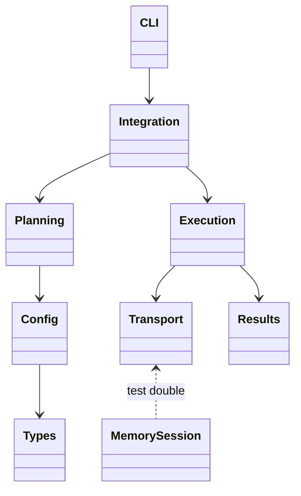
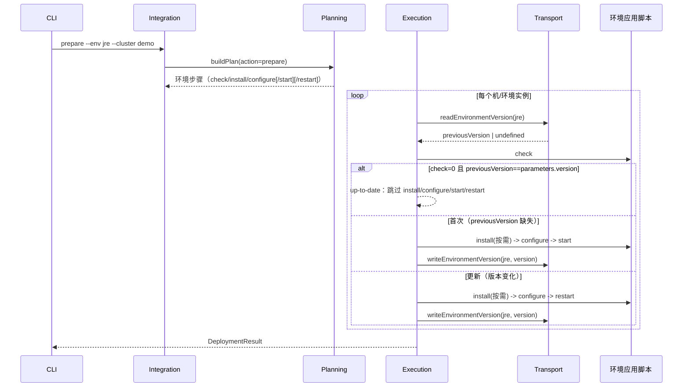
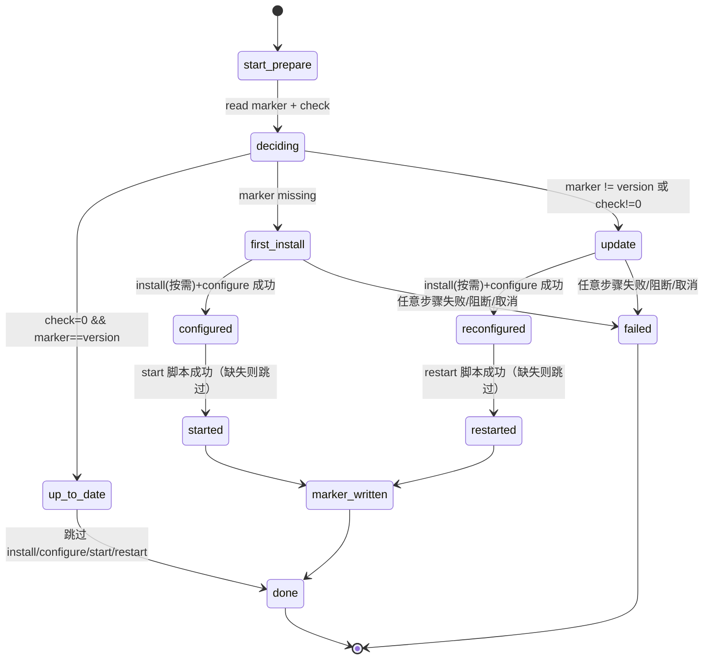

# 环境应用 prepare、更新判定与 App 前置门禁设计

Risk profile: ./risk-profile.yaml

## Design Scope

本设计覆盖 sfo-deploy 单模块的执行面：新增 `prepare` CLI 动作（只处理环境应用，即
`environments/<名称>/environment.yaml` 单元，如 jre、nginx、mysql、redis）；新增 `--env` 短参
（等价兼容 `--environment`）；prepare 的执行序列 `check → install(按需) → configure → start/restart`
与“同版本且健康跳过”；环境应用版本标记的 远端持久化与更新判定；App 部署（如
jx-server）前对依赖环境应用的就绪门禁提示。 不改 ExecutionPlan schemaVersion、发布历史结构、下载
provider 协议、环境/App 配置 schema 大版本、脚本权限模型与秘密/模板投递机制。

## Useful Context

- `src/integration.ts` 的 `CLI_ACTIONS` 固定动作集合，`run()` 对非 fetch/deploy/history 动作统一 走
  `loadCluster → buildRequestedPlan → executePlan`；`install` 缺省全量（未指定环境）时需要
  确认。`prepare` 复用这条路径并沿用同样的缺省全量确认。
- `src/planning.ts` 对环境节点生成动作序列：deploy/configure 为 `check → install → configure`， 定向
  App 且不带 `--with-dependencies` 时环境依赖收窄为 check-only；本任务新增 prepare 序列， 并把
  start/restart 作为“有脚本才出现”的后续步骤。
- `src/execution.ts` 已用 `EnvironmentCheckResult` 缓存每机/每环境的 check 结果，install 步骤在
  check 已满足时以 `check-satisfied` 跳过；本任务在此基础上增加 prepare 状态机（版本标记、
  首次安装/更新判定、生命周期步骤跳过）与 App 门禁提示文本。
- `src/transport.ts` 的 `RemoteSession` 是 SSH/内存传输的公共接口；版本标记的远端读写新增两个
  窄接口，OpenSSH 实现用严格 argv 的 `/usr/bin/env`、`/usr/bin/test`、`/usr/bin/cat`、 `mkdir`
  与既有 `uploadFile` 完成，不做 shell 拼接。
- 现有 CLI 参数解析（`src/cli.ts`）按选项名 switch，`--environment` 已存在；`--env` 作为同语义
  别名加入，不改变 `RunOptions.environments` 的形状。

## Overall Approach

1. CLI/集成层：`CLI_ACTIONS` 追加 `prepare`；`--env` 解析为 environments 筛选；prepare 拒绝 `--app`
   并允许 `--machine`/`--env`/`--executor-region`/`--address-kind`；缺省全量（未显式 指定环境）沿用
   install 的确认门禁。`prepare` 与其他环境动作一样返回 `DeploymentResult`。
2. 计划层：prepare 的环境节点生成步骤序列 `check → install → configure`，随后仅当环境声明了
   `start`/`restart` 脚本时追加对应步骤；未声明则不出现在计划中（“没有就跳过”）。
3. 执行层：对每个 prepare 目标先读取远端版本标记 `~/.sfo-deploy/environments/<环境名>.version`
   （缺失视为首次）；`check` 返回 0 且标记与 `metadata.parameters.version` 一致时整次准备判定为
   `up-to-date`，跳过 install/configure/start/restart；标记缺失或版本不同时按“首次安装→start、
   更新→restart”运行生命周期步骤；生命周期步骤成功后才更新远端标记，失败不更新，避免半成功状态。
4. App 门禁：定向 App 部署（无 `--with-dependencies`）时环境 check 失败的提示补充 “先运行 sfo-deploy
   prepare”，阻断语义不变；`--with-dependencies` 自动完整准备语义不变。
5. 文档/示例/测试：README、集群配置指南、示例 README 增加 prepare 与 `--env` 说明；单元/计划/
   DV/集成测试覆盖 CLI、计划过滤、执行状态机与标记生命周期。

## Layered Design Document Index

| level | parent_document | unit       | design_document | responsibility                                                                                                                    |
| ----- | --------------- | ---------- | --------------- | --------------------------------------------------------------------------------------------------------------------------------- |
| root  | design.md       | sfo-deploy | design.md       | CLI/集成、计划、执行状态机、传输标记接口与示例文档的模块级设计（文件级模块在本文 File-Level Interfaces 定义，无独立业务子模块层） |

## Module Relationship UML



## File-Level Interfaces

```typescript
// src/integration.ts
export const CLI_ACTIONS: readonly [ /* ...既有动作... */, "prepare"];

// run() 分发（既有模式）：prepare 与 install 共用
//   loadCluster -> buildRequestedPlan(cluster, request, "prepare")
//   -> executePlan(...) -> DeploymentResult
// RunOptions：prepare 与 check/install 同为环境动作，拒绝 apps 筛选。

// src/cli.ts
// 解析：case "--env": environments.push(optionValue(...)); // 与 --environment 同栈
// 帮助：prepare 使用 ENVIRONMENT_ONLY_OPTIONS（含 --env 项），
//       描述“部署/更新所选环境应用；缺省全量会请求确认”

// src/planning.ts
// buildPlan: action === "prepare" 时环境节点序列
//   ["check", "install", "configure"] + (声明 start 时追加 "start") + (声明 restart 时追加 "restart")
//   start/restart 未声明时不生成步骤；check/install/configure 缺失仍按既有规则失败

// src/transport.ts
export interface RemoteSession {
  // ...既有成员...
  readEnvironmentVersion(resource: string, signal?: AbortSignal): Promise<string | undefined>;
  writeEnvironmentVersion(resource: string, version: string, signal?: AbortSignal): Promise<void>;
}
// 实现：路径 = $HOME/.sfo-deploy/environments/<resource>.version（mode 0600）
// read：/usr/bin/test -f 存在后用 /usr/bin/cat 读取并 trim；不存在返回 undefined
// write：/usr/bin/mkdir -p 目录后 uploadFile 临时文件（mode 0600）覆盖写入

// src/execution.ts
// prepare 状态（每 machine\0env）：
//   { previousVersion?: string; upToDate: boolean; action: "start" | "restart" }
// 步骤跳过规则：
//   install   <- check SATISFIED || upToDate（skipReason 沿用 check-satisfied / 新增 up-to-date）
//   configure <- upToDate
//   start     <- upToDate || action !== "start"（skipReason: up-to-date / using-restart）
//   restart   <- upToDate || action !== "restart"（skipReason: up-to-date / using-start）
// 标记写入：prepare 目标最后一个步骤成功（或全部以可满足依赖的 skip 结束）后调用
//   session.writeEnvironmentVersion(resource, version)；任何失败/阻断/取消不写标记。
// Compatibility: backward-compatible（新增 prepare 动作、--env 别名与 RemoteSession
//   两个新方法；既有动作、参数、配置 schema、context metadata 与发布历史不变）
```

- Consumer: `src/integration.ts`、`src/cli.ts`、`src/planning.ts`、`src/execution.ts`、
  `src/transport.ts`、`tests/dv/execution.test.ts`（MemorySession）、示例脚本与文档。
- Compatibility: backward-compatible

说明：新增 `prepare` 动作、`--env` 别名与 `RemoteSession` 两个新方法；既有动作、参数、配置
schema、context metadata 与发布历史不变，旧 CLI 调用不受影响。

## Key Flows



## State and Ownership

- Owner: 执行器（`src/execution.ts`）拥有 prepare 状态判定与远端版本标记的读写时机；传输层
  （`src/transport.ts`）拥有标记文件的路径与 I/O 实现；环境应用脚本拥有安装、配置、健康检查与
  启动/重启的实际行为；`start`/`restart` 未声明时计划层不生成步骤，执行层不写失败。



## Directly Mapped Change Items

| change_id               | target_module | proposal_id | design_coverage                                                                                                      | scope_paths                                                                                                                                                  |
| ----------------------- | ------------- | ----------- | -------------------------------------------------------------------------------------------------------------------- | ------------------------------------------------------------------------------------------------------------------------------------------------------------ |
| CHG-env-prepare-command | sfo-deploy    | PI-1        | CLI_ACTIONS 追加 prepare；`--env` 别名；缺省全量确认；prepare 计划序列与只选 `--env jre` 的过滤                      | src/integration.ts, src/cli.ts, src/planning.ts, src/results.ts, tests/unit, tests/integration                                                               |
| CHG-env-app-lifecycle   | sfo-deploy    | PI-2        | start/restart 步骤生成条件；执行层 up-to-date/using-start/using-restart 跳过；缺脚本不生成步骤；生命周期成功才写标记 | src/planning.ts, src/execution.ts, src/results.ts, src/transport.ts, tests/dv, tests/integration                                                             |
| CHG-env-app-update      | sfo-deploy    | PI-3        | readEnvironmentVersion/writeEnvironmentVersion 接口与 OpenSSH/内存实现；版本比较与标记写入时机                       | src/transport.ts, src/execution.ts, tests/unit, tests/dv                                                                                                     |
| CHG-app-env-ready-gate  | sfo-deploy    | PI-4        | 定向 App 环境检查失败提示增加 prepare 指引；阻断与 `--with-dependencies` 语义不变                                    | src/execution.ts, src/cli.ts, tests/dv, tests/integration                                                                                                    |
| CHG-docs-tests          | sfo-deploy    | PI-5        | README、集群配置指南、示例 README 与统一测试入口覆盖新动作与更新语义                                                 | README.md, docs/guides/sfo-deploy-cluster-configuration.md, examples/eleph-server-multipass/README.md, docs/changes/028-env-prepare-deploy.md, testplan.yaml |

## Implementation Order

| phase | goal                                                                                           | depends_on | output                            |
| ----- | ---------------------------------------------------------------------------------------------- | ---------- | --------------------------------- |
| 1     | 传输层标记接口：RemoteSession 增加 read/writeEnvironmentVersion，OpenSSH 与 MemorySession 实现 | 无         | src/transport.ts 与测试替身可编译 |
| 2     | 计划层：prepare 动作序列与 start/restart 按声明生成                                            | phase 1    | src/planning.ts 计划正确          |
| 3     | 执行层：prepare 状态机、跳过规则、标记写入与 App 门禁提示                                      | phase 2    | src/execution.ts、src/results.ts  |
| 4     | CLI/集成层：prepare 动作、`--env` 别名、帮助与缺省全量确认                                     | phase 3    | src/integration.ts、src/cli.ts    |
| 5     | 测试、示例与文档：单测/DV/集成测试、README/指南、示例副本                                      | phase 4    | 测试与文档一致                    |

## File-Level Implementation Sequence

| sequence | file_level_module                       | action | depends_on | change_id                                                           | scope_path                                                                                                                                    | implementation_task |
| -------- | --------------------------------------- | ------ | ---------- | ------------------------------------------------------------------- | --------------------------------------------------------------------------------------------------------------------------------------------- | ------------------- |
| 1        | src/transport.ts                        | modify | -          | CHG-env-app-lifecycle / CHG-env-app-update                          | src/transport.ts                                                                                                                              | default             |
| 2        | src/planning.ts                         | modify | 1          | CHG-env-prepare-command / CHG-env-app-lifecycle                     | src/planning.ts                                                                                                                               | default             |
| 3        | src/execution.ts                        | modify | 2          | CHG-env-app-lifecycle / CHG-env-app-update / CHG-app-env-ready-gate | src/execution.ts                                                                                                                              | default             |
| 4        | src/results.ts                          | modify | 3          | CHG-env-app-lifecycle                                               | src/results.ts                                                                                                                                | default             |
| 5        | src/integration.ts                      | modify | 3          | CHG-env-prepare-command                                             | src/integration.ts                                                                                                                            | default             |
| 6        | src/cli.ts                              | modify | 5          | CHG-env-prepare-command / CHG-app-env-ready-gate                    | src/cli.ts                                                                                                                                    | default             |
| 7        | tests（unit/dv/integration 新增与修改） | modify | 6          | 全部 change_id                                                      | tests/**                                                                                                                                      | default             |
| 8        | README/指南/示例 README/change record   | modify | 7          | CHG-docs-tests                                                      | README.md, docs/guides/sfo-deploy-cluster-configuration.md, examples/eleph-server-multipass/README.md, docs/changes/028-env-prepare-deploy.md | default             |

## API and Build Surface Impact

- Public API impact: backward-compatible
- Crate-root export change: no
- Build-surface change: no
- Documentation examples affected: yes

说明：新增 CLI 动作 `prepare` 与 `--env` 选项别名；`RunResult` 复用 `DeploymentResult`，
无既有符号删除或重命名；README、指南、示例 README 增加 prepare 用法。

## Consumer Migration Closure

| old_symbol                            | new_path                            | change_id               | consumer_kind | consumer_path                            | migration_status |
| ------------------------------------- | ----------------------------------- | ----------------------- | ------------- | ---------------------------------------- | ---------------- |
| （无旧符号；新增动作与参数）          | 指南新增 `sfo-deploy prepare --env` | CHG-env-prepare-command | doc-example   | none-found                               | verified-none    |
| （无旧符号；新增 RemoteSession 方法） | src/transport.ts 接口方法           | CHG-env-app-update      | test-double   | tests/dv/execution.test.ts MemorySession | migrated         |

## Design Notes

- 本任务在 sfo-deploy 模块下保持单层文件级分解，不建立独立业务子模块；改动集中在 CLI/集成、
  计划、执行与传输四层且共享同一执行器状态机，拆子模块文档不会暴露额外职责边界。
- 版本标记放在远端 `~/.sfo-deploy/environments/<环境名>.version`，与 App 部署包
  `~/.sfo-deploy/apps/` 的既有持久目录约定一致；标记只含非空版本字符串（来自
  environment.yaml，装载时已按 stringValue 校验），不含秘密或用户路径输入，因此不扩大信任边界。
- “安装成功启动、更新成功重启”的判定不依赖脚本输出约定：以标记是否存在区分首次与更新，以 check
  退出码 + 标记版本比较判定 up-to-date；环境脚本无需新增协议，只需继续满足 “check
  0=已满足”的既有契约。
- 生命周期步骤失败（含阻断/取消）不写标记，下一轮 prepare 仍会看到旧版本并重试，避免半成功
  状态被误判为已完成。

## Risks and Rollback

- 标记读取失败采用 fail-closed：无法确认远端状态时 prepare 失败，不做假设；标记文件仅含版本
  字符串，不含秘密，回滚只需删除或覆盖该文件（不纳入 release 快照回放，与本提案 non-goal 一致）。
- 生命周期步骤缺失时按用户确认“跳过并提示”：计划不生成缺失步骤，prepare 仍成功并更新标记；
  这意味着缺失 start/restart 的环境应用不会自动启动，文档明确该边界。
- App 部署门禁只改失败提示文本与既有阻断语义一致；`--with-dependencies` 与历史快照回放逻辑
  不变，回滚边界不扩大。
