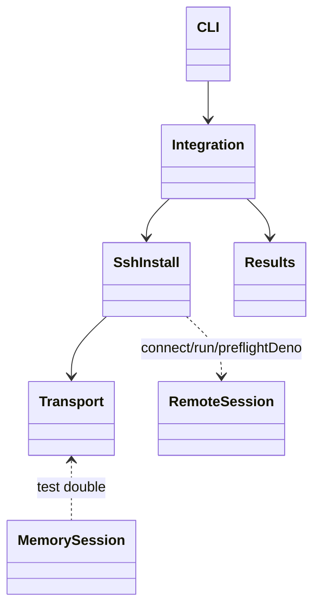
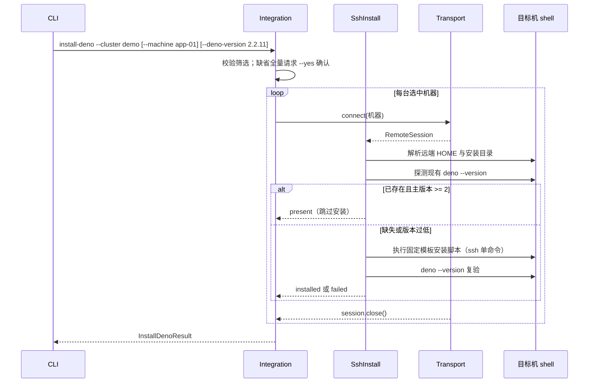

# 纯 SSH 安装 Deno 命令设计

Risk profile: ./risk-profile.yaml

## Design Scope

本设计覆盖 sfo-deploy 单模块的执行面：新增公开 CLI 动作 `install-deno`，通过既有
OpenSshTransport（本地 ssh/scp）直连所选机器，探测目标系统与已有 Deno 状态，使用固定 Deno 版本执行纯
SSH 安装并用 `deno --version` 复验。动作只支持 `--cluster`、`--machine`、
`--executor-region`、`--address-kind`、`--deno-version`、`--install-to` 与 `--yes`； 不改变
ExecutionPlan schema、发布历史、下载 provider 协议、环境/App 配置 schema、
脚本权限模型或既有动作语义。

## Useful Context

- `src/integration.ts` 的 `CLI_ACTIONS` 是固定动作集合；`run()` 对非 fetch/deploy/history 动作统一走
  `loadCluster`；本任务为 `install-deno` 增加独立分发 `runInstallDeno`。
- `src/cli.ts` 按选项名 switch 解析，`--machine`/`--address-kind`/`--executor-region`/ `--yes`
  已存在；`serializeResult` 按结果类输出 JSON，固定退出码 0/2/3/4/130。
- `src/transport.ts` 的 `RemoteSession` 提供 `run`（严格 argv、known_hosts/私钥/超时校验）、
  `preflightDeno`、`close`；OpenSSH 实现把每条命令作为单个 argv 传给 `ssh`，再由远端 shell
  执行，不拼接用户输入到 shell 字面量。
- `src/results.ts` 已有 DeploymentResult/FetchResult 等结果类对齐 CLI 序列化。
- 示例 `eleph-server-multipass` 的 `machines.yaml.tpl` 声明 `deno: /usr/local/bin/deno`， README
  当前要求手工“按组织批准的供应链流程”预装 Deno 2。

## Overall Approach

1. 新增 `src/ssh_install.ts` 作为唯一安装编排模块：解析/校验版本与安装目录、探测远端 HOME 与已装
   Deno、执行安装命令、验证版本，返回每台机器的独立结果；不持久化任何状态。
2. CLI/集成层：`CLI_ACTIONS` 追加 `install-deno`；`ParsedArguments`/`RunOptions` 增加
   `--deno-version`、`--install-to`；动作拒绝 apps/environments/withDependencies/releaseId；
   缺省全量（未指定 `--machine`）复用 `--yes` 确认门禁；`run()` 新分发返回 `InstallDenoResult`。
3. 传输复用：不扩展 `RemoteSession` 接口；安装命令使用 `session.run(["/bin/sh", "-c", script])` 且
   script 只由受控模板与严格的版本字符串构成（版本先经正则校验，路径先经安全路径校验），
   安装优先用户目录、非用户可写目录时经 `privileged` 提权路径。
4. 结果序列化：`src/results.ts` 新增 `InstallDenoResult`，包含每台机器的
   status（`present`/`installed`/`failed`）、deno 路径、版本与错误信息；CLI 序列化保持 现有 JSON
   风格与退出码映射。
5. 文档：README、集群配置指南与示例 README 说明命令用法、前提与 `machines.yaml.deno`
   路径约定。测试在 testing 阶段补齐。

## Layered Design Document Index

| level | parent_document | unit       | design_document | responsibility                                                                                             |
| ----- | --------------- | ---------- | --------------- | ---------------------------------------------------------------------------------------------------------- |
| root  | design.md       | sfo-deploy | design.md       | CLI/集成、安装编排、结果序列化与示例文档的模块级设计；功能规模小，文件级模块在本文定义，无独立业务子模块层 |

## Module Relationship UML



## File-Level Interfaces

```typescript
// src/ssh_install.ts（新增）
export const DEFAULT_DENO_VERSION = "2.2.11"; // 固定默认版本
export interface InstallDenoOptions {
  readonly version: string;          // 规范化后的 "2.x.y"
  readonly installTo?: string;       // 默认展开为远端 $HOME/.deno
  readonly signal?: AbortSignal;
}
export type MachineDenoStatus = "present" | "installed" | "failed";
export interface MachineDenoOutcome {
  readonly machine: string;
  readonly status: MachineDenoStatus;
  readonly denoPath: string;
  readonly version?: string;
  readonly errorCategory?: string;
  readonly message?: string;
}
export function normalizeDenoVersion(value: string): string;   // 接受 2.2.11 / v2.2.11
export function validateInstallTo(value: string | undefined): string | undefined;
export async function installDeno(
  session: RemoteSession,
  options: InstallDenoOptions,
): Promise<MachineDenoOutcome>;

// src/integration.ts（修改）
export const CLI_ACTIONS: readonly [/* 既有动作 */, "install-deno"];
export class RunOptions { /* + denoVersion?: string; installTo?: string */ }
async function runInstallDeno(request, transport, confirmPlan, signal): Promise<InstallDenoResult>;

// src/results.ts（修改）
export class InstallDenoResult {
  constructor(info: {
    cluster: string;
    machines: readonly MachineDenoOutcome[];
  });
  readonly succeeded: boolean;   // 全部 installed/present 时为 true
  readonly exitCode: number;     // 0 或 4
}

// src/cli.ts（修改）
export interface ParsedArguments { /* + denoVersion?, installTo? */ }
// 新增选项：--deno-version VERSION、--install-to PATH
// ACTION_DESCRIPTIONS.install-deno = "通过纯 SSH 安装固定版本 Deno 到目标机器"
// serializeResult：InstallDenoResult -> kind: "install-deno", machines: [...]
```

- Consumer: `src/cli.ts`、`src/integration.ts`、`src/results.ts`、`src/ssh_install.ts`、
  `src/mod.ts`、`tests/unit/transport_cli.test.ts`（MemorySession）、README 与指南文档。
- Compatibility: backward-compatible （新增 CLI 动作与可选参数；既有动作、参数、配置
  schema、传输接口与发布历史不变）

## Key Flows



## State and Ownership

- Owner: `src/ssh_install.ts` 拥有安装编排、版本/路径校验与结果构造；传输层拥有连接、
  命令执行与清理；集成层拥有筛选与确认门禁；CLI 拥有参数解析与输出。本任务不新增持久 数据、schema
  或共享状态。

## Directly Mapped Change Items

| change_id            | target_module | proposal_id | design_coverage                                  | scope_paths                                                                                           |
| -------------------- | ------------- | ----------- | ------------------------------------------------ | ----------------------------------------------------------------------------------------------------- |
| CHG-ssh-deno-install | sfo-deploy    | PI-1        | CLI 动作、参数、RunOptions、安装编排与结果序列化 | src/cli.ts, src/integration.ts, src/results.ts, src/ssh_install.ts, src/mod.ts                        |
| CHG-ssh-deno-docs    | sfo-deploy    | PI-2        | README、集群配置指南与示例 README 用法说明       | README.md, docs/guides/sfo-deploy-cluster-configuration.md, examples/eleph-server-multipass/README.md |

## Implementation Order

| phase    | goal                                  | depends_on              | output                  |
| -------- | ------------------------------------- | ----------------------- | ----------------------- |
| 结果类型 | 新增 InstallDenoResult 供 CLI 序列化  | 无                      | src/results.ts          |
| 安装编排 | 版本/路径校验与纯 SSH 安装流程        | 结果类型、RemoteSession | src/ssh_install.ts      |
| 集成分发 | CLI_ACTIONS/RunOptions/runInstallDeno | 安装编排、结果类型      | src/integration.ts      |
| CLI 接线 | 参数解析、帮助、序列化与退出码        | 集成分发                | src/cli.ts              |
| 公开导出 | 结果类型与动作入口一致对外            | CLI 接线                | src/mod.ts              |
| 文档同步 | 用户文档反映新命令与默认路径          | 实现完成                | README/指南/示例 README |

## API and Build Surface Impact

- Public API impact: backward-compatible
- Crate-root export change: no
- Build-surface change: no
- Documentation examples affected: yes

说明：新增 CLI 动作 `install-deno` 与可选参数 `--deno-version`/`--install-to`；新增
`InstallDenoResult` 结果类型；无既有符号删除或重命名；README、集群配置指南与示例 README
增加新命令用法。

## Consumer Migration Closure

| old_symbol                   | new_path                                   | change_id            | consumer_kind | consumer_path | migration_status |
| ---------------------------- | ------------------------------------------ | -------------------- | ------------- | ------------- | ---------------- |
| （无旧符号；新增动作与参数） | 指南/README 新增 `sfo-deploy install-deno` | CHG-ssh-deno-install | doc-example   | none-found    | verified-none    |

## File-Level Implementation Sequence

| sequence | file_level_module  | action                         | depends_on | change_id            | scope_path                                         | implementation_task                     |
| -------- | ------------------ | ------------------------------ | ---------- | -------------------- | -------------------------------------------------- | --------------------------------------- |
| 1        | src/results.ts     | 修改（新增 InstallDenoResult） | 无         | CHG-ssh-deno-install | src/results.ts                                     | 单个实现 child task（本任务内按序完成） |
| 2        | src/ssh_install.ts | 新增（安装编排与校验）         | 1          | CHG-ssh-deno-install | src/ssh_install.ts                                 | 单个实现 child task（本任务内按序完成） |
| 3        | src/integration.ts | 修改（动作注册与分发）         | 2          | CHG-ssh-deno-install | src/integration.ts                                 | 单个实现 child task（本任务内按序完成） |
| 4        | src/cli.ts         | 修改（参数/帮助/序列化）       | 3          | CHG-ssh-deno-install | src/cli.ts                                         | 单个实现 child task（本任务内按序完成） |
| 5        | src/mod.ts         | 修改（公开导出）               | 4          | CHG-ssh-deno-install | src/mod.ts                                         | 单个实现 child task（本任务内按序完成） |
| 6        | README/docs/示例   | 修改（文档同步）               | 5          | CHG-ssh-deno-docs    | README.md、docs/guides/...、examples/.../README.md | 单个实现 child task（本任务内按序完成） |

## Risks and Rollback

- 供应链：安装内容来自 deno.land HTTPS 官方安装器，版本固定并以安装后 `deno --version`
  主版本与固定版本复验为界；需要更强供应链约束的组织可改为把版本二进制放入私有源并手工
  预装，本任务不提供离线安装。
- 权限与注入：安装目录默认用户主目录免提权；非用户可写目录走既有权重提权路径；版本与路径
  先校验后进入固定命令模板，避免 shell 注入。
- 兼容与回滚：新增动作 backward-compatible；命令不写发布历史，失败只需重跑或手动检查远端
  目录；已满足版本时跳过安装，具备幂等重试语义。

## Design Notes

- 不新增 `RemoteSession` 接口成员；现有 `run`/`preflightDeno`/`close` 与提权原语足够。
- 安装脚本是仓库内固定模板：先用 `sh` 探测可用下载器（curl/wget）、创建安装目录，再执行 官方
  deno.land 安装器并固定版本；远端命令由严格 argv 传入，`--deno-version`/`--install-to`
  经正则或路径前缀校验后才进入模板。供应链残余风险（官方安装器内容以其 HTTPS 来源和最终
  `deno --version` 复验为界）在 risk-profile build 项记录，测试阶段固定为验证版本匹配。
- `install-deno` 与既有 `install` 命名区分清晰：前者是运行时引导动作，只接受机器筛选；
  后者是环境动作，不接受 `--app` 之外同时提供 `--deno-version`。
