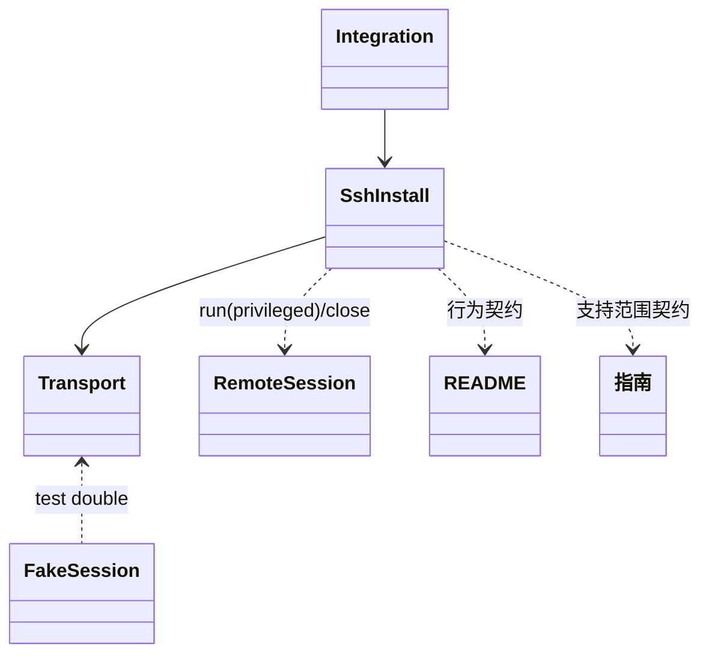
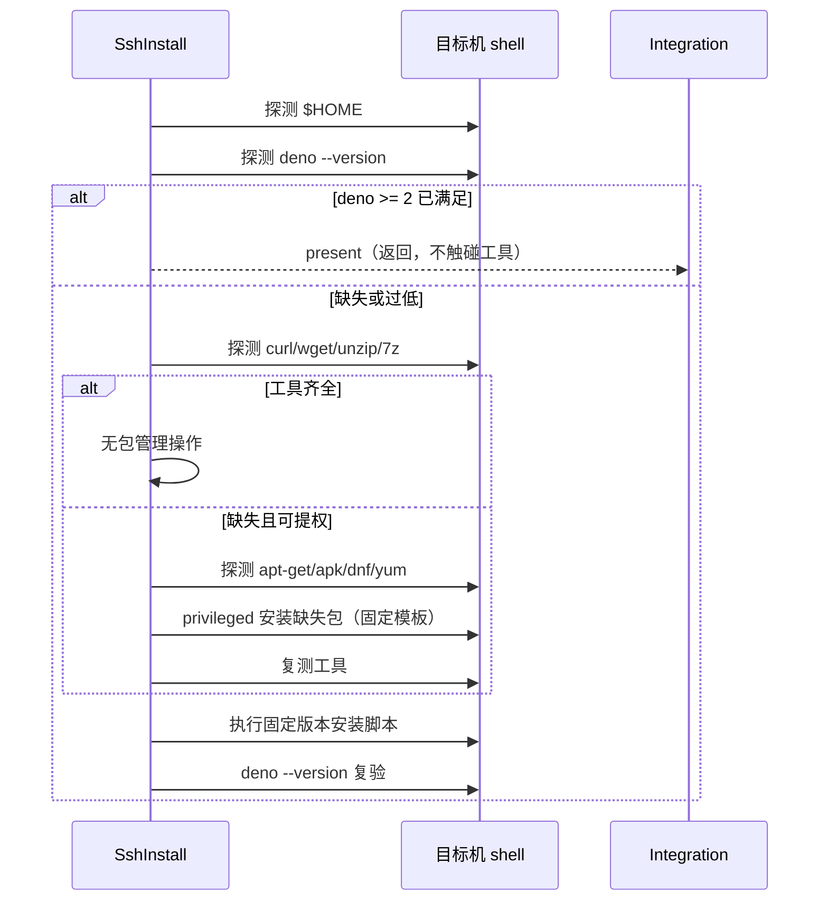

# install-deno 自动补齐远端 curl/unzip 设计

Risk profile: ./risk-profile.yaml

## Design Scope

为 `install-deno` 增加“远端工具补齐”步骤：探测目标机缺失的下载器（curl/wget）与解压器
（unzip/7z）后，用目标机包管理器（apt-get / apk / dnf / yum）以提权身份安装缺失的 curl 与
unzip，再继续原固定版本 Deno 安装。本设计只影响 `src/ssh_install.ts` 的安装
编排与三份用户文档，不改变 CLI 参数、结果 schema、传输接口与退出码契约。

## Useful Context

- 既有流程：`installDenoOnMachine` 先解析远端 HOME，探测 `deno --version`，已满足 版本直接返回
  `present`；否则把固定安装脚本作为 `/bin/sh -c` 单 argv 执行（任务 030
  已修复为单行脚本），安装后复验版本。
- 既有传输能力：`session.run(argv, { privileged, environment, signal })` 支持
  `preflightPrivilege`（root 或 `sudo -n`），命令都走严格 argv 校验，禁止控制字符。
- 示例目标机：eleph-server-multipass 是 Ubuntu，环境脚本已按 `/usr/bin/apt-get` 提权安装模式工作（见
  jre/redis/mysql install 脚本）。
- 现有远端最小依赖契约：需要 curl 或 wget，以及 unzip 或 7z；缺失时安装脚本 fail-closed
  给出中文错误。本设计把该契约升级为“缺失时自动补齐，失败仍 fail-closed”。

## Overall Approach

在 `installDenoOnMachine` 的“探测版本未满足”分支内、执行安装脚本之前插入 `ensureRemoteTools` 编排：

1. 探测远端已存在工具（curl/wget/unzip/7z），计算缺失集合：
   - 下载器缺失（curl 与 wget 都不存在）→ 待装包列表加 `curl`；
   - 解压器缺失（unzip 与 7z 都不存在）→ 待装包列表加 `unzip`。
2. 待装包列表为空则直接返回 true（无行为变化）。
3. 否则探测包管理器：固定顺序 apt-get → apk → dnf → yum，取第一个存在者；全部缺失 则抛
   TransportError（机器结果 `failed`，退出码 4），提示手工安装后重试。
4. 按包管理器固定模板、以 `privileged: true` 安装缺失包：
   - apt-get：`apt-get update` 后 `apt-get install -y --no-install-recommends <包>`;
   - apk：`apk add --no-cache <包>`；
   - dnf / yum：`dnf|yum install -y <包>`。
5. 安装完成后再探测一次；仍有缺失则抛 TransportError 并给出可行动提示。

提权失败延续既有 `PreflightError` 语义（机器结果 `failed`、preflight 类别、退出码 3）；
工具安装命令执行失败归为 transport（退出码 4）。包名、命令与探测模板全部为仓库内固定
常量，机器名、版本、安装路径等可变值不进入包管理命令。

## Layered Design Document Index

| level | parent_document | unit       | design_document | responsibility                                                                                    |
| ----- | --------------- | ---------- | --------------- | ------------------------------------------------------------------------------------------------- |
| root  | design.md       | sfo-deploy | design.md       | 功能规模小：仅扩展 ssh_install 的安装编排并同步用户文档；无独立业务子模块层，文件级模块在本文定义 |

## Module Relationship UML



## File-Level Interfaces

```typescript
// src/ssh_install.ts（修改，公开 API 不变）
export const DEFAULT_DENO_VERSION = "2.2.11"; // 不变
export interface InstallDenoOptions {/* 不变 */}
export async function installDenoOnMachine(
  session: RemoteSession,
  machine: string,
  options: InstallDenoOptions,
): Promise<MachineDenoOutcome>; // 新增 ensureRemoteTools 调用点，返回契约不变

// 新增私有模块内职责（不导出）
async function ensureRemoteTools(session: RemoteSession, signal?: AbortSignal): Promise<void>;
// 1) probeTools: 单行 sh 脚本返回已存在工具名列表
// 2) detectPackageManager: apt-get -> apk -> dnf -> yum 固定顺序
// 3) installPackagesThrough(manager, packages, session, signal): 固定模板 privileged run
// 4) 安装后二次 probe，仍有缺失抛 TransportError

// src/integration.ts / src/cli.ts / src/results.ts：不修改
// 三份用户文档（修改）：README、docs/guides/sfo-deploy-cluster-configuration.md、
// examples/eleph-server-multipass/README.md
// Compatibility: backward-compatible
```

- Consumer: `src/integration.ts`（唯一生产调用链）、三份用户文档；测试通过 FakeSession
  断言命令序列。
- Compatibility: backward-compatible
  说明：新增内部步骤与默认自动补齐行为，无符号删除、无参数/schema/退出码变化；行为只在
  “缺失工具且可提权”场景从报错变为自动安装。

## Key Flows



## State and Ownership

- Owner: `src/ssh_install.ts` 拥有远端工具补齐与 Deno 安装编排；传输层拥有连接、提权
  前缀缓存与命令执行；集成层拥有筛选与确认门禁。本任务不新增持久数据、schema 或
  共享状态；工具补齐是单次会话内顺序状态，失败即关闭会话并返回该机器 `failed`。

## Directly Mapped Change Items

| change_id                  | target_module | proposal_id | design_coverage                                                                                | scope_paths                                                                                           |
| -------------------------- | ------------- | ----------- | ---------------------------------------------------------------------------------------------- | ----------------------------------------------------------------------------------------------------- |
| CHG-deno-ensure-tools      | sfo-deploy    | PI-1        | `ensureRemoteTools` 探测/包管理器选择/固定模板安装/复测与失败映射，接入 `installDenoOnMachine` | src/ssh_install.ts, tests/unit/ssh_install.test.ts, tests/dv/install_deno.test.ts                     |
| CHG-deno-ensure-tools-docs | sfo-deploy    | PI-2        | README、集群配置指南与示例 README 描述自动补齐行为、提权前提、支持矩阵与供应链边界             | README.md, docs/guides/sfo-deploy-cluster-configuration.md, examples/eleph-server-multipass/README.md |

## Implementation Order

| phase        | goal                                       | depends_on        | output                                  |
| ------------ | ------------------------------------------ | ----------------- | --------------------------------------- |
| 工具补齐编排 | 实现探测、包管理器选择与固定模板安装       | RemoteSession.run | src/ssh_install.ts 内 ensureRemoteTools |
| 流程接入     | 在版本未满足分支插入补齐步骤并保持返回契约 | 工具补齐编排      | installDenoOnMachine 顺序调整           |
| 文档同步     | 用户文档反映默认自动补齐与支持边界         | 流程接入          | README/指南/示例 README                 |

## API and Build Surface Impact

- Public API impact: none 说明：只新增模块内部私有函数与默认行为变化；CLI、结果类型与导出符号不变。
- Crate-root export change: no
- Build-surface change: no
- Documentation examples affected: yes

说明：无既有符号删除或重命名；`InstallDenoOptions`、`MachineDenoOutcome`、CLI 参数、 JSON
结构与退出码语义保持不变，因此不需要 Consumer Migration Closure 行。

## Consumer Migration Closure

| old_symbol                               | new_path                  | change_id             | consumer_kind   | consumer_path | migration_status |
| ---------------------------------------- | ------------------------- | --------------------- | --------------- | ------------- | ---------------- |
| （无旧符号删除；行为变化仅新增默认步骤） | `src/ssh_install.ts` 内部 | CHG-deno-ensure-tools | production-call | none-found    | verified-none    |

## File-Level Implementation Sequence

| sequence | file_level_module                               | action                                            | depends_on | change_id                  | scope_path                                      | implementation_task                     |
| -------- | ----------------------------------------------- | ------------------------------------------------- | ---------- | -------------------------- | ----------------------------------------------- | --------------------------------------- |
| 1        | src/ssh_install.ts                              | 修改（新增 ensureRemoteTools 并在未满足分支接入） | 无         | CHG-deno-ensure-tools      | src/ssh_install.ts                              | 单个实现 child task（本任务内按序完成） |
| 2        | README.md                                       | 修改（install-deno 自动补齐说明）                 | 1          | CHG-deno-ensure-tools-docs | README.md                                       | 单个实现 child task（本任务内按序完成） |
| 3        | docs/guides/sfo-deploy-cluster-configuration.md | 修改（支持矩阵/提权/供应链边界）                  | 2          | CHG-deno-ensure-tools-docs | docs/guides/sfo-deploy-cluster-configuration.md | 单个实现 child task（本任务内按序完成） |
| 4        | examples/eleph-server-multipass/README.md       | 修改（示例行为同步）                              | 3          | CHG-deno-ensure-tools-docs | examples/eleph-server-multipass/README.md       | 单个实现 child task（本任务内按序完成） |

## Risks and Rollback

- 供应链：自动安装来自发行版软件源；包名固定（curl/unzip），apt 先 `update` 刷新索引。
  需要更强约束的组织可改为预装或在文档记录例外；本任务不开新的离线/私有源开关。
- 权限：包管理命令全部走既有 `privileged` 路径；提权不可用映射 preflight（退出码 3），
  不降级为无提示失败。
- 注入：包管理器、包名与探测脚本都是仓库内固定字符串；用户输入（版本、安装路径、
  机器名）不会进入包管理命令。
- 兼容与回滚：命令不写发布历史，失败可重跑（幂等：包管理器安装幂等，已满足版本仍跳过）；
  回滚只涉及文档与单文件实现，无持久状态需要迁移。

## Design Notes

- 之所以把工具补齐放在“版本未满足”之后而不是探测 Deno 之前：已满足版本的目标完全不需要
  curl/unzip，避免对已就绪机器做多余提权或联网操作。
- 包管理器探测用 `command -v` 固定顺序而非解析 `/etc/os-release`：更少解析面，且
  与“该机器真实可用包管理器”直接对应；不支持的发型版全部缺失时 fail-closed。
- 只安装缺失的裸包名 curl/unzip，不在缺失时安装 wget/7z：用户确认范围是 curl 与 unzip， wget/7z
  保留为原检测兜底；待装集合按“下载器缺一个补 curl、解压器缺一个补 unzip”
  计算，避免无谓扩大软件源接触面。
