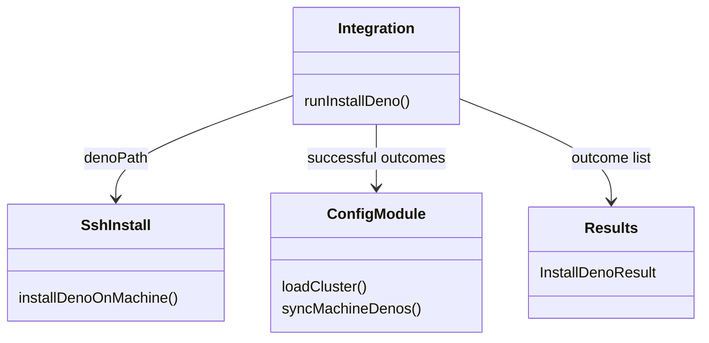
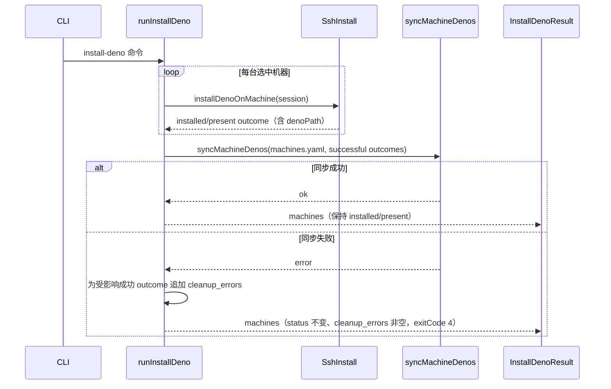
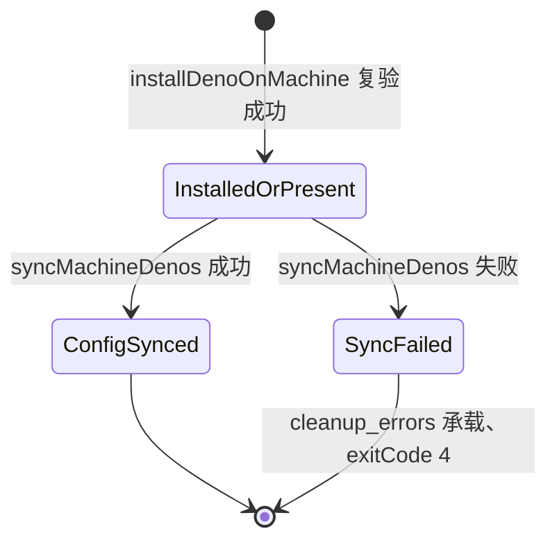

# install-deno 安装后同步 machines.yaml Deno 路径设计

Risk profile: ./risk-profile.yaml

## Design Scope

本设计覆盖 sfo-deploy 单模块执行面：在既有 `install-deno` 动作完成每台目标机的安装或
已满足版本探测后，把该机器在 `machines.yaml` 中的 `deno` 字段同步为安装后复验确定的 绝对路径，使后续
`prepare`/`deploy` 等动作无需用户手工改配置就能使用同一运行时。

不改变 CLI 动作集合、参数解析、确认门禁、Deno 缺省安装目录、版本来源、传输层或结果类
的公开外层结构。`install-deno` 的 JSON 仍保持 `kind`、`machines[]`、`status`、
`deno_path`、`version`、`message`、`cleanup_errors` 等既有字段；配置写失败通过既有 `cleanup_errors`
承载，不透传新的公开错误字段。

## Useful Context

- `src/config.ts` 的 `loadCluster`/`loadMachines` 严格装载 `machines.yaml`，机器 `deno` 字段经
  `validateScriptRuntimeExecutable` 校验；该文件已有私有 `remoteAbsolutePath`
  校验，可被同一文件内的写回函数复用。
- `src/integration.ts` 的 `runInstallDeno` 已经为每台机器收集 `MachineDenoOutcome`， 其中 `denoPath`
  来自 `installDenoOnMachine` 探测/安装后的复验，是本任务唯一的可信 来源。该模块持有
  `cluster.directory`，可以定位 `machines.yaml`。
- `src/results.ts` 的 `InstallDenoResult` 已把任何 `cleanupErrors` 视为整次动作失败 （exitCode
  4），但机器级 `status` 仍保持 `installed`/`present`；这正好表达“Deno 已安装成功但配置同步失败”。
- 示例与指南当前明确说明“install-deno 不修改 machines.yaml、安装后请手工同步”，这是
  用户报告断裂的文档与行为源头。

## Overall Approach

1. 在 `src/config.ts` 增加同一文件级模块内的写回函数 `syncMachineDenos`：只对传入的
   `{machine, denoPath}` 集合更新 `machines.yaml` 中对应机器的 `deno` 字段，不改其它
   字段；用行级替换保留注释与字段顺序，写入临时文件后原子替换。
2. `src/integration.ts` 在 `runInstallDeno` 的机器循环结束后收集全部成功 outcome （`status` 为
   `installed` 或 `present`），调用写回函数。
3. 写回失败时，为每个受影响成功 outcome 追加 `cleanupErrors` 消息；机器结果保留 `denoPath`
   与真实状态，整次动作按既有规则以退出码 4 返回，用户可重跑（重跑会探测 present 并重试同步）。
4. 文档同步更新为“自动同步”，并保留“同步失败会明确报错”的说明。

## Layered Design Document Index

| level | parent_document | unit       | design_document | responsibility                                                                                           |
| ----- | --------------- | ---------- | --------------- | -------------------------------------------------------------------------------------------------------- |
| root  | design.md       | sfo-deploy | design.md       | CLI/集成、配置写回、安装编排与文档同步的模块级设计；功能规模小，文件级模块在本文定义，无独立业务子模块层 |

## Module Relationship UML



同一 `ConfigModule` 自治节点表示 `src/config.ts` 文件级单元，`syncMachineDenos` 复用它 已有的严格
YAML 装载与路径校验，不创建第二个读写入口。

## File-Level Interfaces

```typescript
// src/config.ts（修改）
export interface MachineDenoUpdate {
  readonly machine: string;
  readonly denoPath: string;
}

/** 只更新 machines.yaml 中各机器 deno 字段；保留其它内容并以原子替换落盘。 */
export async function syncMachineDenos(
  machinesYamlPath: string,
  updates: readonly MachineDenoUpdate[],
): Promise<void>;

// src/integration.ts（修改，私有）
async function runInstallDeno(
  options: RunOptions,
  transport: Transport,
  confirmMachines?: (machines: readonly string[]) => boolean | Promise<boolean>,
  signal?: AbortSignal,
): Promise<InstallDenoResult>;
```

- Consumer: `src/integration.ts` 的 `runInstallDeno` 消费 `syncMachineDenos`；单元测试 直接通过
  `src/config.ts` 导入测试写回函数。`syncMachineDenos` 不从 `src/mod.ts` 再导出，保持公共 crate-root
  导出面不变。
- Compatibility: backward-compatible
- 兼容说明：只新增 `src/config.ts` 文件级导出函数，CLI/JSON/退出码保持不变； `cleanup_errors`
  是既有结果字段。

## Key Flows



## State and Ownership



- Owner: `src/config.ts` 的唯一写回函数 `syncMachineDenos` 拥有 `machines.yaml` 的全部
  任务内持久写入；`src/integration.ts` 只决定调用时机与结果合并，不在别处复制写入逻辑。
- 只有 `installed`/`present` outcome 进入同步集合；失败、取消或清理错误机器不更新。
- 写回是整文件原子替换；同一任务的多次机器成功只产生一次写文件，不产生半写状态。
- 若并发修改 `machines.yaml`，严格重载/落盘以前者为准，写入后再次 `loadMachines`
  校验失败则按同步失败返回；不做跨进程锁或乐观重试。

## Directly Mapped Change Items

| change_id                    | target_module | proposal_id | Design Coverage                                                           | Scope Paths                                                                                                                                                                                                       |
| ---------------------------- | ------------- | ----------- | ------------------------------------------------------------------------- | ----------------------------------------------------------------------------------------------------------------------------------------------------------------------------------------------------------------- |
| CHG-install-deno-sync-config | sfo-deploy    | PI-1        | File-Level Interfaces、Key Flows、State and Ownership、Risks and Rollback | src/config.ts, src/integration.ts, src/results.ts, src/mod.ts, tests/unit/install_deno_cli.test.ts, tests/unit/config_planning.test.ts, tests/dv/install_deno.test.ts, tests/integration/install_deno_cli.test.ts |
| CHG-install-deno-sync-docs   | sfo-deploy    | PI-2        | API and Build Surface Impact、Design Notes、Risks and Rollback            | README.md, docs/guides/sfo-deploy-cluster-configuration.md, examples/eleph-server-multipass/README.md, tests/contract/verify_install_deno_contract.ts                                                             |

## Implementation Order

| phase        | goal                                                       | depends_on | output                                                  |
| ------------ | ---------------------------------------------------------- | ---------- | ------------------------------------------------------- |
| 配置写回     | 新增 `syncMachineDenos` 与行级原子替换                     | 无         | src/config.ts                                           |
| 集成接线     | `runInstallDeno` 收集成功 outcome 并调用写回，合并同步失败 | 配置写回   | src/integration.ts                                      |
| 结果回归     | 确认 `InstallDenoResult` 对 cleanup_errors 的既有语义      | 集成接线   | src/results.ts（如无需修改则只回归）                    |
| 公开导出复核 | 确认 `src/mod.ts` 不新增/删除公开符号                      | 集成接线   | src/mod.ts（如无需修改则只回归）                        |
| 文档同步     | 三份文档与文档契约测试改为自动同步说明                     | 集成接线   | README.md、docs/guides、examples README、tests/contract |

## API and Build Surface Impact

- Public API impact: none
- Crate-root export change: no
- Build-surface change: no
- Documentation examples affected: yes

说明：README/指南/示例 README 的 install-deno 说明改为自动同步，示例命令本身仍有效。

说明：`syncMachineDenos` 是 `src/config.ts` 文件级导出，仅供 `src/integration.ts` 与
测试直接引用；`src/mod.ts` 的公共 re-export 面保持不变，因此没有 breaking 或 migration-required
变更。

## Consumer Migration Closure

| old_symbol                                                        | new_path                                        | change_id                  | consumer_path                                   | consumer_kind | migration_status |
| ----------------------------------------------------------------- | ----------------------------------------------- | -------------------------- | ----------------------------------------------- | ------------- | ---------------- |
| “install-deno 不修改 machines.yaml、安装后请手工同步”的旧文档说明 | README.md                                       | CHG-install-deno-sync-docs | README.md                                       | doc-example   | migrated         |
| “install-deno 不修改 machines.yaml、安装后请手工同步”的旧文档说明 | docs/guides/sfo-deploy-cluster-configuration.md | CHG-install-deno-sync-docs | docs/guides/sfo-deploy-cluster-configuration.md | doc-example   | migrated         |
| “install-deno 不修改 machines.yaml、安装后请手工同步”的旧文档说明 | examples/eleph-server-multipass/README.md       | CHG-install-deno-sync-docs | examples/eleph-server-multipass/README.md       | doc-example   | migrated         |

## File-Level Implementation Sequence

| sequence | file_level_module                               | action                 | depends_on | change_id                    | scope_path                                      | implementation_task                     |
| -------- | ----------------------------------------------- | ---------------------- | ---------- | ---------------------------- | ----------------------------------------------- | --------------------------------------- |
| 1        | src/config.ts                                   | 修改                   | 无         | CHG-install-deno-sync-config | src/config.ts                                   | 单个实现 child task（本任务内按序完成） |
| 2        | src/integration.ts                              | 修改                   | 1          | CHG-install-deno-sync-config | src/integration.ts                              | 单个实现 child task（本任务内按序完成） |
| 3        | src/results.ts                                  | 回归（不改或最小兼容） | 2          | CHG-install-deno-sync-config | src/results.ts                                  | 单个实现 child task（本任务内按序完成） |
| 4        | src/mod.ts                                      | 复核（不改或最小兼容） | 2          | CHG-install-deno-sync-config | src/mod.ts                                      | 单个实现 child task（本任务内按序完成） |
| 5        | README.md                                       | 修改                   | 2          | CHG-install-deno-sync-docs   | README.md                                       | 单个实现 child task（本任务内按序完成） |
| 6        | docs/guides/sfo-deploy-cluster-configuration.md | 修改                   | 2          | CHG-install-deno-sync-docs   | docs/guides/sfo-deploy-cluster-configuration.md | 单个实现 child task（本任务内按序完成） |
| 7        | examples/eleph-server-multipass/README.md       | 修改                   | 2          | CHG-install-deno-sync-docs   | examples/eleph-server-multipass/README.md       | 单个实现 child task（本任务内按序完成） |
| 8        | tests/contract/verify_install_deno_contract.ts  | 修改                   | 5-7        | CHG-install-deno-sync-docs   | tests/contract/verify_install_deno_contract.ts  | 单个实现 child task（本任务内按序完成） |

## Design Notes

- 行级写回只支持 block-style `machines.yaml`（指南与示例使用的 `machines:` 下 `- name:`
  列表格式）；遇到无法定位机器块或不安全文本时明确失败，不自动重排整个 YAML，
  以避免丢失用户注释或改变字段顺序。
- 写回路径复用 `remoteAbsolutePath` 校验：绝对 POSIX 路径、拒绝 `..`、反斜杠与控制 字符；`denoPath`
  还来自安装后 `deno --version` 复验，不是用户任意文本。
- 原子替换：在目标目录创建临时文件、写入内容并校验后 `rename` 覆盖原文件；失败清理
  临时文件，不破坏原文件。
- 写入后调用本文件内 `loadMachines` 严格重载以确认配置仍可解析；只有严格装载成功才算 完成。
- 并发写：本任务不引入锁；跨进程并发改同一 `machines.yaml` 时以后写者为准，严格装载 失败会
  fail-closed，不会静默接受损坏文件。

## Risks and Rollback

- 持久配置改写：行级替换可能破坏不支持的 YAML 风格 → 不支持时 fail-closed 并给出
  手工修改提示；支持风格下保留注释与顺序，原子替换避免半写。
- 行为契约变化：任务 029 曾承诺不自动改写 machines.yaml → 本任务作为新要求更新三份
  文档与文档契约测试，从文档到行为一致收口。
- 结果语义：把同步失败放入 cleanup_errors 使整次动作 exitCode 4，但机器级 status 仍 如实表示 Deno
  已安装；重跑幂等（present 跳过安装、重试同步）。
- 回滚：若用户不接受新行为，把受影响机器的 `deno` 字段改回原值即可；远程 Deno 安装
  本身不受配置写回影响，无发布历史或迁移数据。
