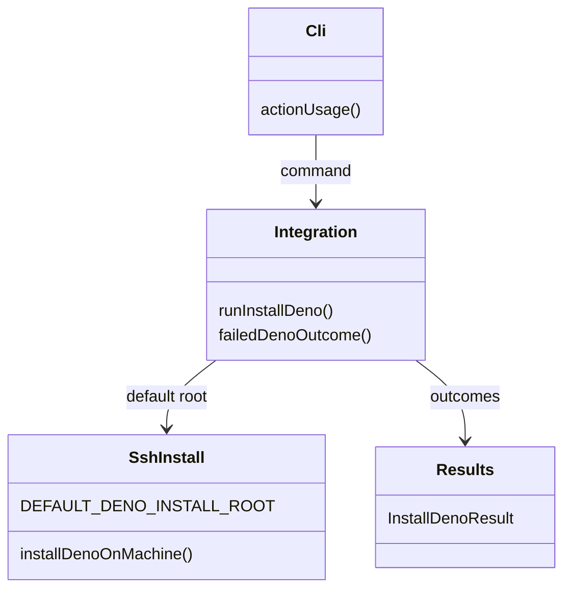
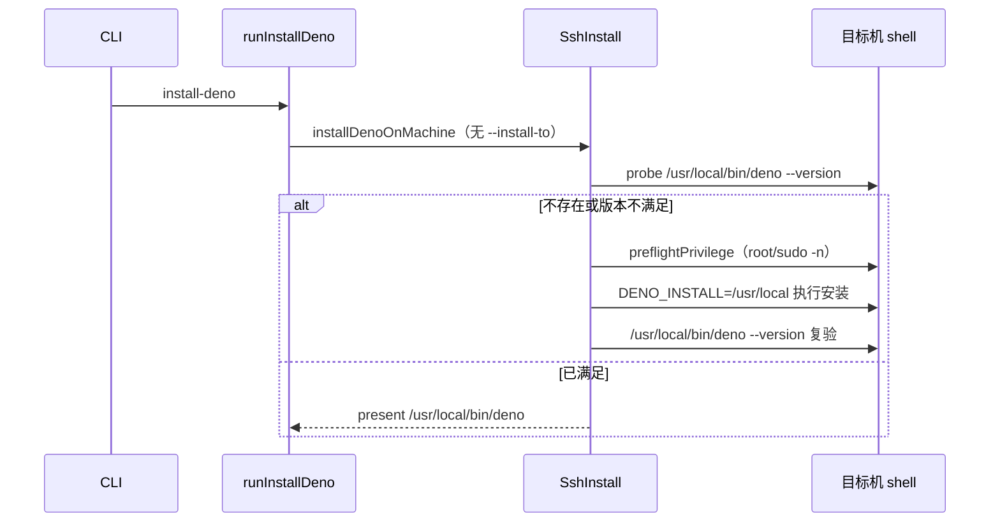

# install-deno 缺省安装到 PATH 目录设计

Risk profile: ./risk-profile.yaml

## Design Scope

本设计覆盖 sfo-deploy 单模块安装编排与公开帮助/文档。把 install-deno 的缺省安装根 目录从远端
`$HOME/.deno` 改为 `/usr/local`，使缺省安装后的可执行文件位于 `/usr/local/bin/deno`（Linux 默认 PATH
目录）。未写 `machines.yaml.deno` 时，后续 动作按裸命令 `deno` 经 PATH 找到该运行时。

不改变 CLI 动作/参数、确认门禁、`--install-to`/`--deno-version` 语义、JSON 外层结构 或退出码；不恢复
machines.yaml 自动写回，也不做运行时 PATH 兜底搜索。

## Useful Context

- `src/ssh_install.ts` 的 `installDenoOnMachine` 现在用 `requestedRoot ?? \`
  ${home}/.deno\`` 计算安装根，随后用
  `privileged = !root.startsWith(\`${home}/\`)`决定是否提权；`DEFAULT_DENO_VERSION` 是既有公开常量。
- `src/integration.ts` 的 `failedDenoOutcome` 在未传 `--install-to` 时把 denoPath
  记为“未确定”；本次应改为已知缺省 `/usr/local/bin/deno`。
- `src/cli.ts` 帮助文本明确写“缺省安装到远端 `$HOME/.deno/bin/deno`”，需要同步。
- README/指南/示例 README 与 `tests/contract/verify_install_deno_contract.ts` 固定了
  缺省安装路径与示例命令，需要一并更新。

## Overall Approach

1. 在 `src/ssh_install.ts` 新增公开常量 `DEFAULT_DENO_INSTALL_ROOT = "/usr/local"`， 未传
   `--install-to` 时使用该根目录；`denoPath` 为 `/usr/local/bin/deno`。
2. `/usr/local` 不在 `$HOME` 下，默认安装走既有 `privileged` 提权路径；远端身份必须 root 或可
   `sudo -n`，否则 `preflightPrivilege` 失败并按 preflight 退出码 3 返回。
3. `src/integration.ts` 的 `failedDenoOutcome` 使用同一缺省根计算失败路径。
4. CLI 帮助与三份文档同步“缺省 /usr/local/bin/deno”与提权前提；示例命令改为不传 `--install-to`
   的缺省形式。
5. 回归测试覆盖缺省安装、缺省提权、显式 `$HOME` 免提权、present 探测等路径。

## Layered Design Document Index

| level | parent_document | unit       | design_document | responsibility                                                             |
| ----- | --------------- | ---------- | --------------- | -------------------------------------------------------------------------- |
| root  | design.md       | sfo-deploy | design.md       | 安装编排、CLI 帮助与文档同步的模块级设计；功能规模小，文件级模块在本文定义 |

## Module Relationship UML



## File-Level Interfaces

```typescript
// src/ssh_install.ts
export const DEFAULT_DENO_INSTALL_ROOT = "/usr/local";

export interface InstallDenoOptions {
  readonly version: string;
  readonly installTo?: string;
  readonly signal?: AbortSignal;
}

// 未传 installTo 时 root = DEFAULT_DENO_INSTALL_ROOT，denoPath = /usr/local/bin/deno。
export async function installDenoOnMachine(
  session: RemoteSession,
  machine: string,
  options: InstallDenoOptions,
): Promise<MachineDenoOutcome>;

// src/integration.ts（私有）
async function runInstallDeno(
  options: RunOptions,
  transport: Transport,
  confirmMachines?: (machines: readonly string[]) => boolean | Promise<boolean>,
  signal?: AbortSignal,
): Promise<InstallDenoResult>;
```

- Consumer: `src/integration.ts` 消费 `DEFAULT_DENO_INSTALL_ROOT` 与安装结果；CLI 帮助
  与三份文档消费缺省路径说明。
- Compatibility: backward-compatible
- 兼容说明：公开符号只新增常量；CLI 参数/JSON/退出码/接口不删除不重命名；缺省行为
  变化由文档和测试收口。

## Key Flows



## State and Ownership

- Owner: `src/ssh_install.ts` 拥有缺省根目录常量、安装路径计算与提权判定； `src/integration.ts`
  只消费该常量填写失败结果。
- 本任务不新增持久状态；install-deno 不写发布历史、不写 machines.yaml。
- 提权失败发生在安装命令之前：远端未被修改，命令按 preflight 失败（退出码 3）。

## Directly Mapped Change Items

| change_id                     | target_module | proposal_id | Design Coverage                                                           | Scope Paths                                                                                                                                                                                        |
| ----------------------------- | ------------- | ----------- | ------------------------------------------------------------------------- | -------------------------------------------------------------------------------------------------------------------------------------------------------------------------------------------------- |
| CHG-install-deno-path-default | sfo-deploy    | PI-1        | File-Level Interfaces、Key Flows、State and Ownership、Risks and Rollback | src/ssh_install.ts, src/integration.ts, src/cli.ts, tests/unit/ssh_install.test.ts, tests/unit/install_deno_cli.test.ts, tests/dv/install_deno.test.ts, tests/integration/install_deno_cli.test.ts |
| CHG-install-deno-path-docs    | sfo-deploy    | PI-2        | API and Build Surface Impact、Design Notes、Risks and Rollback            | README.md, docs/guides/sfo-deploy-cluster-configuration.md, examples/eleph-server-multipass/README.md, tests/contract/verify_install_deno_contract.ts                                              |

## Implementation Order

| phase      | goal                                          | depends_on       | output                                   |
| ---------- | --------------------------------------------- | ---------------- | ---------------------------------------- |
| 缺省根常量 | 新增 DEFAULT_DENO_INSTALL_ROOT 并用于安装路径 | 无               | src/ssh_install.ts                       |
| 失败路径   | integration 失败结果使用缺省 /usr/local       | ssh_install 常量 | src/integration.ts                       |
| 帮助/契约  | CLI 帮助与三份文档/契约同步                   | 安装编排         | src/cli.ts、README、指南、示例、契约测试 |

## API and Build Surface Impact

- Public API impact: none
- Crate-root export change: no
- Build-surface change: no
- Documentation examples affected: yes

说明：新增 `DEFAULT_DENO_INSTALL_ROOT` 是扩展而非破坏；help/README/指南/示例的缺省
路径说明需要同步。

## Consumer Migration Closure

| old_symbol                              | new_path                            | change_id                  | consumer_path                                   | consumer_kind | migration_status |
| --------------------------------------- | ----------------------------------- | -------------------------- | ----------------------------------------------- | ------------- | ---------------- |
| 旧文档“缺省安装到 $HOME/.deno/bin/deno” | 缺省安装到 /usr/local/bin/deno 说明 | CHG-install-deno-path-docs | README.md                                       | doc-example   | migrated         |
| 旧文档“缺省安装到 $HOME/.deno/bin/deno” | 缺省安装到 /usr/local/bin/deno 说明 | CHG-install-deno-path-docs | docs/guides/sfo-deploy-cluster-configuration.md | doc-example   | migrated         |
| 旧文档/示例命令                         | 缺省命令去掉 --install-to           | CHG-install-deno-path-docs | examples/eleph-server-multipass/README.md       | doc-example   | migrated         |

## File-Level Implementation Sequence

| sequence | file_level_module                              | action | depends_on | change_id                     | scope_path                                     | implementation_task |
| -------- | ---------------------------------------------- | ------ | ---------- | ----------------------------- | ---------------------------------------------- | ------------------- |
| 1        | src/ssh_install.ts                             | 修改   | 无         | CHG-install-deno-path-default | src/ssh_install.ts                             | 单个实现 child task |
| 2        | src/integration.ts                             | 修改   | 1          | CHG-install-deno-path-default | src/integration.ts                             | 单个实现 child task |
| 3        | src/cli.ts                                     | 修改   | 1          | CHG-install-deno-path-docs    | src/cli.ts                                     | 单个实现 child task |
| 4        | README.md / 指南 / 示例 README                 | 修改   | 1-3        | CHG-install-deno-path-docs    | 三份文档                                       | 单个实现 child task |
| 5        | tests/contract/verify_install_deno_contract.ts | 修改   | 4          | CHG-install-deno-path-docs    | tests/contract/verify_install_deno_contract.ts | 单个实现 child task |

## Design Notes

- 缺省根使用固定 `/usr/local` 常量，不做 PATH 探测；需要其它目录的用户继续显式 `--install-to`。
- 默认提权依赖现有 `preflightPrivilege`；不新增传输接口。
- home 目录探测仍保留，用于判断显式 `--install-to $HOME/...` 是否免提权。
- 放心/已满足版本探测路径同步变为 `/usr/local/bin/deno`，与安装结果一致。

## Risks and Rollback

- 提权：缺省安装从免提权变为需 root/`sudo -n`；文档明确，失败按 preflight 退出码 3，
  不会改动远端。用户可显式 `--install-to $HOME/.deno` 回退到免提权路径。
- 行为兼容：旧 `$HOME/.deno` 安装不会被检测为 present；用户可继续显式 `--install-to`
  指向原目录，或在文档建议下重装到 /usr/local。
- 回滚：本任务不修改配置/发布历史；撤销只需把缺省常量改回或由用户显式安装目录。
