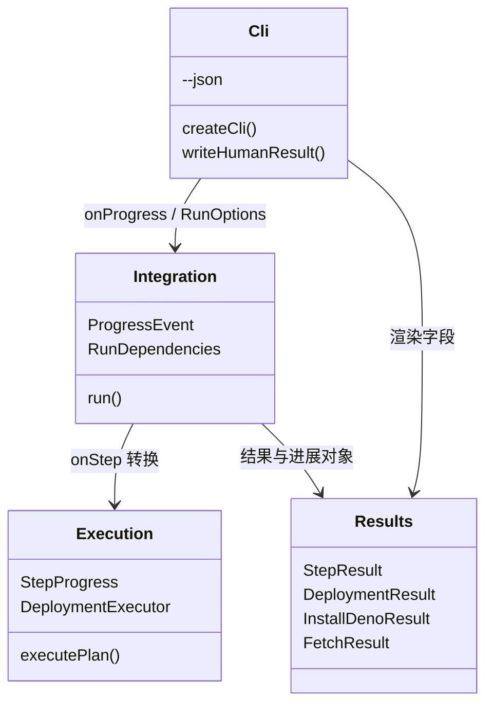
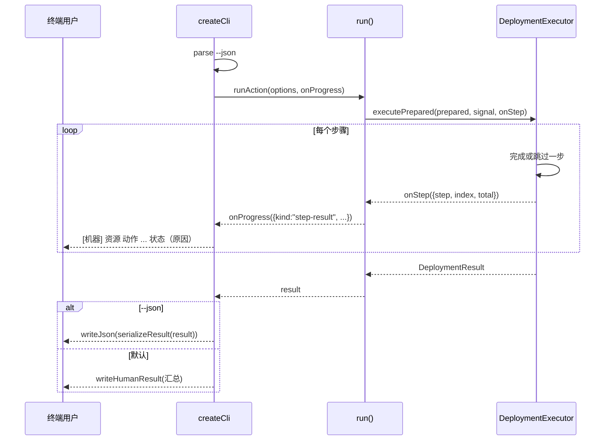

# CLI 按步骤输出人类可读信息设计

Risk profile: ./risk-profile.yaml

## Design Scope

本设计覆盖 sfo-deploy 模块的 CLI 输出层与执行进度事件。目标：默认（不带 `--json`）
时，命令在执行过程中按步骤打印中文人可读进度行，并在结束时输出简洁汇总；新增 `--json` 选项保留现有
`serializeResult` 的稳定 JSON 契约与退出码。不改变任何动作
语义、步骤顺序、远程行为、秘密脱敏或持久化格式。

## Useful Context

- `src/cli.ts` 目前只调用一次 `writeJson(stdout, serializeResult(result))`；错误一律
  `writeJson(stderr, { error: ... })`。README 与多个集成测试把“stdout 是 JSON”当作 公开契约。
- `src/execution.ts` 的 `DeploymentExecutor.executePrepared` 串行执行计划，步骤结果在 循环内最终化后
  `results.push(result)`；`DeploymentExecutor` 已通过 `ExecuteOptions` 注入 transport/bindings
  等依赖，是挂接步骤事件的唯一闭环。
- `src/integration.ts` 的 `RunDependencies` 是 `run()` 的公开依赖注入面；`runFetch`、
  `runInstallDeno` 各自是独立的逐项循环，需要各自的进度事件。
- `src/mod.ts` 公开导出 `RunDependencies`、`DeploymentExecutor`、`executePlan` 等，
  新增可选字段/参数属于向后兼容扩展。

## Overall Approach

1. 在 `src/execution.ts` 定义 `StepProgress`/`StepProgressListener`，`DeploymentExecutor` 与
   `executePlan`/`executePrepared` 接受可选 `onStep`；每完成一步（含跳过、失败、
   阻塞、取消）在结果入列时同步触发一次事件。
2. 在 `src/integration.ts` 定义统一 `ProgressEvent`（`step-result`/`machine-result`/
   `package-result`），`RunDependencies` 新增可选 `onProgress`；`run()` 把执行器的 `onStep` 与
   `runFetch`/`runInstallDeno` 的逐项结果转换为事件，缺省不改变公共行为。
3. `src/cli.ts` 新增 `--json` 解析；默认模式把事件渲染为 `[机器] 资源 动作 ... 状态
   （原因）`
   行，并输出人可读汇总；`--json` 模式保持现状（结果与错误均为 JSON）。
4. 同步 README 与帮助文本，把依赖 stdout JSON 的既有测试改为显式 `--json`。

## Layered Design Document Index

| level | parent_document | unit       | design_document | responsibility                                                 |
| ----- | --------------- | ---------- | --------------- | -------------------------------------------------------------- |
| root  | design.md       | sfo-deploy | design.md       | 输出层与进度事件的模块级设计；功能规模小，文件级模块在本文定义 |

## Module Relationship UML



## File-Level Interfaces

```typescript
// src/execution.ts
export interface StepProgress {
  readonly step: StepResult;
  readonly index: number;
  readonly total: number;
}

export type StepProgressListener = (progress: StepProgress) => void | Promise<void>;

export interface ExecuteOptions extends PrepareOptions {
  readonly transport?: Transport;
  readonly knownHosts?: string;
  readonly keepVersions?: number;
  readonly onStep?: StepProgressListener; // 新增，缺省不触发
}

// src/integration.ts
export type ProgressEvent =
  | {
    readonly kind: "step-result";
    readonly index: number;
    readonly total: number;
    readonly step: StepResult;
  }
  | {
    readonly kind: "machine-result";
    readonly index: number;
    readonly total: number;
    readonly machine: MachineDenoOutcome;
  }
  | {
    readonly kind: "package-result";
    readonly index: number;
    readonly total: number;
    readonly package: FetchPackageResult;
  };

export interface RunDependencies {
  // 既有字段保持；新增可选进度监听。
  readonly onProgress?: (event: ProgressEvent) => void | Promise<void>;
}

// src/cli.ts（私有渲染层）
function writeHumanResult(writer: Writer, result: RunResult): Promise<void>;
function humanStepLine(step: StepResult): string;
function humanMachineLine(machine: MachineDenoOutcome): string;
function humanPackageLine(package: FetchPackageResult): string;
```

- Consumer: `src/cli.ts` 消费 `ProgressEvent` 与结果对象渲染；`src/integration.ts` 消费
  `StepProgressListener` 与结果对象生成事件。
- Compatibility: backward-compatible
- 兼容说明：只新增可选字段与私有渲染函数；`serializeResult`、JSON 结构与退出码不变；
  缺省输出变化通过 README 迁移说明和 `--json` 收口。

## Key Flows



## State and Ownership

- Owner: 本任务不修改持久状态；进度事件类型与发射归 src/integration.ts 与
  src/execution.ts（各自边界内），人可读文本渲染归 src/cli.ts。
- 事件发射：`src/execution.ts` 拥有 `StepProgress` 类型与步骤完成事件； `src/integration.ts`
  拥有统一 `ProgressEvent` 与 `RunDependencies.onProgress`。
- 渲染：`src/cli.ts` 唯一拥有人可读文本渲染；`--json` 路径继续使用 `serializeResult`。
- 本任务不新增持久状态；进度事件是进程内一次性流式通知，事件在结果入列后同步等待 listener
  完成，保证与步骤顺序一致。

## Directly Mapped Change Items

| change_id                 | target_module | proposal_id | Design Coverage                                                           | Scope Paths                                                                                                                                     |
| ------------------------- | ------------- | ----------- | ------------------------------------------------------------------------- | ----------------------------------------------------------------------------------------------------------------------------------------------- |
| CHG-cli-step-human-output | sfo-deploy    | PI-1        | File-Level Interfaces、Key Flows、State and Ownership、Risks and Rollback | src/cli.ts, src/integration.ts, src/execution.ts, src/results.ts, tests/unit/env_prepare_cli.test.ts, tests/integration/env_prepare_cli.test.ts |
| CHG-cli-json-flag         | sfo-deploy    | PI-2        | File-Level Interfaces、Key Flows、API and Build Surface Impact            | src/cli.ts, tests/unit/install_deno_cli.test.ts, tests/integration/fetch_package.test.ts, tests/integration/install_deno_cli.test.ts            |
| CHG-cli-output-docs       | sfo-deploy    | PI-3        | API and Build Surface Impact、Consumer Migration Closure、Design Notes    | README.md, src/cli.ts                                                                                                                           |

## Implementation Order

| phase    | goal                                                    | depends_on     | output             |
| -------- | ------------------------------------------------------- | -------------- | ------------------ |
| 步骤事件 | execution 新增 StepProgress 与 onStep 发射              | 无             | src/execution.ts   |
| 事件转换 | integration 统一 ProgressEvent 并接入 run() 各路径      | execution 事件 | src/integration.ts |
| CLI 输出 | --json 解析、默认人可读渲染、进度行接入、帮助文本       | 事件转换       | src/cli.ts         |
| 文档     | README 输出契约说明同步                                 | CLI 输出       | README.md          |
| 回归     | 依赖 JSON 的测试切 --json，新增人可读与 --json 兼容测试 | CLI 输出       | tests/**           |

## API and Build Surface Impact

- Public API impact: backward-compatible
- Crate-root export change: no
- Build-surface change: no
- Documentation examples affected: yes

说明：`RunDependencies` 与 `ExecuteOptions` 只新增可选字段；`serializeResult` 与 `createCli`
的既有导出签名不变。CLI 默认输出从 JSON 变为人可读文本属于行为契约 变化，已有 JSON
消费方（测试与文档示例）迁移到显式 `--json`。

## Consumer Migration Closure

| old_symbol                           | new_path                             | change_id           | consumer_path                              | consumer_kind  | migration_status |
| ------------------------------------ | ------------------------------------ | ------------------- | ------------------------------------------ | -------------- | ---------------- |
| fetch stdout JSON（默认输出）        | fetch --json 输出 JSON               | CHG-cli-json-flag   | tests/integration/fetch_package.test.ts    | automated-test | migrated         |
| install-deno stdout JSON（默认输出） | install-deno --json 输出 JSON        | CHG-cli-json-flag   | tests/integration/install_deno_cli.test.ts | automated-test | migrated         |
| README「输出为 JSON」说明            | README 默认人可读 + --json 输出 JSON | CHG-cli-output-docs | README.md                                  | doc-example    | migrated         |

## File-Level Implementation Sequence

| sequence | file_level_module              | action    | depends_on | change_id                                                           | scope_path         | implementation_task           |
| -------- | ------------------------------ | --------- | ---------- | ------------------------------------------------------------------- | ------------------ | ----------------------------- |
| 1        | src/execution.ts               | 修改      | 无         | CHG-cli-step-human-output                                           | src/execution.ts   | 036-cli-human-readable-output |
| 2        | src/integration.ts             | 修改      | 1          | CHG-cli-step-human-output / CHG-cli-json-flag                       | src/integration.ts | 036-cli-human-readable-output |
| 3        | src/cli.ts                     | 修改      | 2          | CHG-cli-step-human-output / CHG-cli-json-flag / CHG-cli-output-docs | src/cli.ts         | 036-cli-human-readable-output |
| 4        | README.md                      | 修改      | 3          | CHG-cli-output-docs                                                 | README.md          | 036-cli-human-readable-output |
| 5        | tests/unit + tests/integration | 修改/新增 | 3          | CHG-cli-step-human-output / CHG-cli-json-flag                       | tests/**           | 036-cli-human-readable-output |

## Design Notes

- 事件粒度固定为“每步完成后一行”，不做开始/完成双行：满足用户对执行过程可跟踪的
  诉求，且不改变执行器内部状态机。
- 人可读行只使用 `StepResult.message/skipReason/status` 等已脱敏字段，绝不打印 `stdout/stderr`
  原文，避免绕过 `Redactor`。
- `--json` 下不输出任何人可读行：stdout 保持单个 JSON 文档，供脚本原样解析。
- 进度 listener 同步 `await`，保证取消、失败路径中事件与步骤顺序一致；listener 抛错视为执行失败，CLI
  内置渲染器不抛错。

## Risks and Rollback

- 公开契约：默认输出变化可能影响未迁移的 JSON 解析脚本；README 与 `--json` 提供
  迁移路径，测试同步切换。
- 执行路径侵入：事件挂在步骤结果入列点，不改变步骤状态机；失败、跳过、取消路径 均触发事件，由 unit
  覆盖。
- 回滚：撤销提交即可恢复默认 JSON；`--json` 与默认模式共用同一结果对象，无持久化 迁移。
