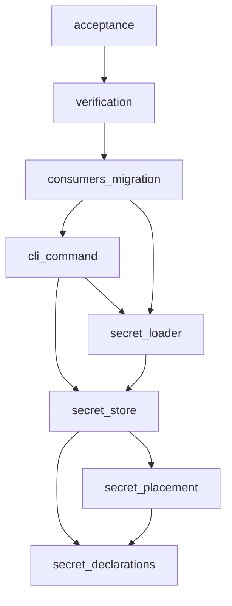
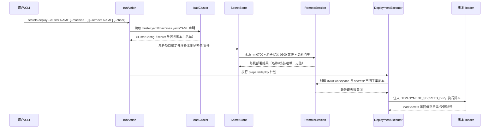

# 密钥独立部署与执行期受限装载自动流水线计划

Workflow tier: high-risk

Risk profile: ./risk-profile.yaml

## Trigger

- Proposal: docs/versions/v0.1/modules/sfo-deploy/037-secrets-env-delivery/proposal.md
- User launch confirmed: yes
- User launch statement: `确认，自动完成`（2026-09-03 提案确认）；`继续自动完成037任务`（2026-09-03
  流水线延续指令）
- Launch stage: proposal
- First auto stage: design
- Design source: pipeline/plan.md
- Per-stage user confirmation: skipped by explicit user auto-pipeline authorization
- Auto-confirm completed document stages: no design/testing Markdown documents generated;
  repository-local document extensions only
- Auto-pipeline document policy: stage-selective; automatic design uses pipeline plan; automatic
  testing uses runtime state; testplan.yaml required for automatic testing
- Version: v0.1
- Packet module: sfo-deploy
- Task name: 037-secrets-env-delivery
- Target module(s): sfo-deploy
- change_id values: CHG-secret-deploy-command, CHG-secret-env-loading, CHG-secret-declaration,
  CHG-secret-placement, CHG-secret-compat, CHG-secret-docs-example

## Acceptance Baseline

- 最终验收以已确认的 `proposal.md`
  为需求基线；本计划只细化密钥声明、放置、装载与移除的契约结构，不扩大或缩小提案范围。
- 用户已确定的方向（Q1=B、Q2=移除旧机制、Q3=项目绑定传入、Q4=默认
  `~/.sfo-deploy/secrets/`、Q5=整机共享目录、执行阶段不再按值脱敏）在本计划中固化为设计边界，不作为新的未决问题。

## Stage Graph

| Task ID | Stage          | Execution Mode | Responsibility                                                     | Scope                                                                                                         | Parent Task | Depends On | Output                                    | Done Condition                                                                         |
| ------- | -------------- | -------------- | ------------------------------------------------------------------ | ------------------------------------------------------------------------------------------------------------- | ----------- | ---------- | ----------------------------------------- | -------------------------------------------------------------------------------------- |
| D-1     | design         | auto-pipeline  | 将密钥声明、放置、存储、装载与兼容迁移转为完整设计映射             | 本任务包与 sfo-deploy 类型/配置/执行/传输消费者                                                               | root        | none       | 本计划设计映射和风险 required_checks      | 计划、风险绑定与 design pre-edit/completion 检查通过，不生成 design.md                 |
| I-1     | implementation | auto-pipeline  | 实现秘密声明类型与严格配置装载（值/文件两类名称与脚本声明）        | `src/types.ts`、`src/config.ts`、`src/secrets.ts`；只读兼容 `src/planning.ts`、`src/history.ts`               | root        | D-1        | 新声明类型与配置校验                      | validate 严格接受/拒绝新声明字段，公开类型保持冻结只读形状                             |
| I-2     | implementation | auto-pipeline  | 实现集群级放置映射、每机安全目录声明与计划步骤秘密字段             | `src/config.ts` 放置解析、`src/secrets.ts` 放置映射、`src/planning.ts`、`src/types.ts`                        | root        | I-1        | 放置映射与计划秘密字段                    | 显式机器列表、`*`、未知机器/冲突/非法名称失败关闭；计划步骤只携带声明子集              |
| I-3     | implementation | auto-pipeline  | 实现 `secrets-deploy` 存储客户端、`--remove`/`--check` 与 CLI 动作 | `src/secrets.ts`、`src/transport.ts`、`src/integration.ts`、`src/cli.ts`、`src/results.ts`                    | root        | I-2        | 远端安全目录部署/移除/校验能力与 CLI 命令 | 部署幂等、模式 0700/0600、清单哈希、未知机器与未绑定失败关闭；`--machine` 相交生效     |
| I-4     | implementation | auto-pipeline  | 实现执行期声明子集副本、loader 协议与运行时环境白名单              | `src/secret_loader/deno.ts`、`src/secret_loader/python.py`、`src/execution.ts`、`src/transport.ts`            | root        | I-3        | loader 资源与步骤装载集成                 | 脚本步骤前建立 0700 `secrets/` 副本，缺密钥立即失败；只注入 `DEPLOYMENT_SECRETS_DIR`   |
| I-5     | implementation | auto-pipeline  | 移除旧机制符号并迁移历史/快照契约                                  | `src/remote_context.ts`、`src/mod.ts`、`src/history.ts`、`src/config.ts`、`src/planning.ts`、`src/secrets.ts` | root        | I-4        | 旧符号无引用、新快照字段                  | 删除扫描无 `config_secrets`/`file_secrets`/context JSON 生产引用；历史读旧快照失败关闭 |
| I-6     | implementation | auto-pipeline  | 迁移 README、配置指南与 Multipass 示例到新机制                     | `README.md`、`docs/guides/sfo-deploy-cluster-configuration.md`、`examples/eleph-server-multipass/**`          | root        | I-5        | 文档与示例新流程                          | 示例只使用新声明与 loader；帮助/README/指南一致；示例脚本可编译                        |
| T-1     | testing        | auto-pipeline  | 从提案、计划和最终实现设计并实现任务级验证                         | 专用测试、testplan 与 runtime testing evidence                                                                | root        | I-6        | 测试实现及成功测试制品                    | contract/unit/DV/integration 从任务级统一入口成功且风险覆盖完整                        |
| A-1     | acceptance     | auto-pipeline  | 独立证伪需求、设计、实现、迁移兼容与测试充分性                     | 全部当前源文件和运行证据                                                                                      | root        | T-1        | acceptance-report.md                      | 全部缺陷发现类别完成、阻断项关闭且结论 accepted                                        |

## Submodule Tasks

| Task ID | Stage | Execution Mode | Responsibility | Submodule | Parent Task | Depends On | Output | Done Condition |
| ------- | ----- | -------------- | -------------- | --------- | ----------- | ---------- | ------ | -------------- |

合并理由：本任务只有一个目标模块且密钥声明、放置、存储、装载、兼容与文档之间存在严格契约链。I-1→I-6
依依赖顺序串行执行避免共享文件竞争；D-1 与 T-1 各保留一个综合责任任务，不建立嵌套子模块层。

## Parallel Scheduling

- Strategy: dependency-ready-set
- Concurrency: use all runtime-available child-agent slots；在 available capacity
  内调度依赖已满足的任务
- Shared artifact owner: parent-orchestrator
- Lock directory: `.harness/locks/`
- Dispatch rule: 按 practical edit coordination 处理共享文件；I-1→I-6 因共享
  `src/types.ts`、`src/config.ts`、`src/secrets.ts`、`src/execution.ts`
  与示例资源而有意串行，每项完成并由父编排器更新 runtime state 后再调度后继任务。
- Serialization reasons: 仅使用
  `explicit dependency, edit coordination, or exhausted concurrency capacity`；I-n
  等待前序变更固化契约，T-1 等待最终实现，A-1 等待任务级测试证据。
- Evidence: 调度波次记录在
  `.harness/pipelines/v0.1/sfo-deploy/037-secrets-env-delivery/state.json`。

## Dependency Graphs



| Level          | Parent     | Node                | Depends On                            |
| -------------- | ---------- | ------------------- | ------------------------------------- |
| responsibility | sfo-deploy | secret_declarations | none                                  |
| responsibility | sfo-deploy | secret_placement    | secret_declarations                   |
| responsibility | sfo-deploy | secret_store        | secret_declarations, secret_placement |
| responsibility | sfo-deploy | secret_loader       | secret_store                          |
| responsibility | sfo-deploy | cli_command         | secret_store, secret_loader           |
| responsibility | sfo-deploy | consumers_migration | cli_command, secret_loader            |
| responsibility | sfo-deploy | verification        | consumers_migration                   |
| responsibility | sfo-deploy | acceptance          | verification                          |

## Key Call Flow



## Exported Interfaces

| Interface                                                                                                                                  | Owner               | Consumer                                             | Compatibility | Affected Callers                                                                                                       | Migration Path                                                                          |
| ------------------------------------------------------------------------------------------------------------------------------------------ | ------------------- | ---------------------------------------------------- | ------------- | ---------------------------------------------------------------------------------------------------------------------- | --------------------------------------------------------------------------------------- |
| `sfo-deploy secrets-deploy` CLI 动作（`--machine`/`--remove`/`--check`/`--json`）                                                          | cli_command         | CLI 用户、自动化脚本、`runAction` 公共 API           | new           | 新增接口，无既有调用方                                                                                                 | 新增帮助文本、README、配置指南与示例命令                                                |
| cluster.yaml `secrets:` 放置声明（`kind` 为 `value` 或 `file`；`machines` 为具体名称列表或通配符 `*`）                                     | secret_declarations | `loadCluster`、`validate`、`secrets-deploy`          | new           | 新增接口，无既有调用方                                                                                                 | 示例 cluster.yaml 与配置指南新增说明                                                    |
| machines.yaml `secrets_dir`（可选，默认 `~/.sfo-deploy/secrets/`）                                                                         | secret_store        | `loadMachines`、`secrets-deploy`、执行装载           | new           | 新增接口，无既有调用方                                                                                                 | 示例 machines.yaml.tpl 与指南新增字段说明                                               |
| environment.yaml/app.yaml `secret_values`/`secret_files`（脚本声明）                                                                       | secret_declarations | `loadEnvironment`/`loadApps`、`buildPlan`、执行装载  | new           | 新增接口，无既有调用方                                                                                                 | 示例环境/App YAML 与指南迁移说明                                                        |
| `loadSecrets()`（Deno `sfo-secret-loader.ts`）与 `load_secrets()`（Python `sfo_secret_loader.py`）                                         | secret_loader       | 集群 lifecycle 脚本（每个声明步骤随 workspace 上传） | new           | 新增接口，无既有调用方                                                                                                 | 示例脚本与指南新增导入用法                                                              |
| `DEPLOYMENT_SECRETS_DIR` 环境变量（仅指向步骤副本目录）                                                                                    | secret_loader       | loader、脚本运行时                                   | new           | 新增接口，无既有调用方                                                                                                 | 执行器与 transport 白名单新增环境变量                                                   |
| `DEPLOYMENT_METADATA_PATH` 环境变量（0600 JSON，不含秘密）                                                                                 | secret_loader       | 集群 lifecycle 脚本读取步骤元数据                    | new           | 新增接口，无既有调用方                                                                                                 | 执行器写入步骤元数据并注入白名单；示例脚本迁移                                          |
| removed `DEPLOYMENT_CONTEXT_PATH`、`DeploymentContext`、`temporaryContextFile`、`withTemporaryContextFile`、`CONTEXT_ENVIRONMENT_VARIABLE` | secret_loader       | 全部旧 context/loader 消费方                         | breaking      | 见下方 Consumer Migration Closure：`src/execution.ts`、`src/mod.ts`、六个示例脚本、三个集成测试文件、README 与配置指南 | 迁移到 loader + `DEPLOYMENT_SECRETS_DIR`；不保留兼容路径                                |
| removed `config_secrets`/`file_secrets` YAML 字段与 `PlanStep.configSecrets/fileSecrets`                                                   | secret_declarations | 全部旧 YAML/计划/历史快照消费方                      | breaking      | 见下方 Consumer Migration Closure：`src/config.ts`、`src/planning.ts`、`src/history.ts`、示例 YAML/脚本、测试与文档    | 迁移到 `secret_values`/`secret_files` + cluster `secrets:` 放置声明；旧快照读取失败关闭 |

```typescript
export interface SecretDeclaration {
  readonly name: string;
  readonly kind: "value" | "file";
  readonly machines: readonly string[] | "*"; // 具体机器列表或全部节点
}

export interface SecretScriptDeclaration {
  readonly secretValues: readonly string[]; // 值密钥名称
  readonly secretFiles: readonly string[]; // 文件密钥名称
}

export interface SecretDeploymentEntry {
  readonly name: string;
  readonly kind: "value" | "file";
  readonly source: string; // 本地固定后的 0600 暂存源
  readonly sha256: string;
  readonly remotePath: string; // <secrets_dir>/<NAME>
}

export async function loadSecrets(options: {
  readonly values?: readonly string[];
  readonly files?: readonly string[];
  readonly dir: string;
}): Promise<
  {
    readonly values: Readonly<Record<string, string>>;
    readonly files: Readonly<Record<string, string>>;
  }
>;
```

`src/secret_loader/deno.ts` 与 `src/secret_loader/python.py` 是框架资产，执行时分别以远端文件名
`sfo-secret-loader.ts`/`sfo_secret_loader.py` 上传到当前步骤
workspace；脚本经与自身同目录的相对导入使用。文件密钥返回值是安全目录内副本的绝对路径，脚本按需以只读方式自行打开。

## API and Build Surface Impact

- Public API impact: breaking
- Crate-root export change: yes
- Build-surface change: no
- Documentation examples affected: yes

## Consumer Migration Closure

| Old Symbol                                                                       | New Path                                                                                    | Change ID         | Consumer Path                                                                                 | Consumer Kind | Migration Status |
| -------------------------------------------------------------------------------- | ------------------------------------------------------------------------------------------- | ----------------- | --------------------------------------------------------------------------------------------- | ------------- | ---------------- |
| `DEPLOYMENT_CONTEXT_PATH`/`DeploymentContext` 读取                               | `sfo-secret-loader.ts` `loadSecrets()` + `DEPLOYMENT_SECRETS_DIR`                           | CHG-secret-compat | examples/eleph-server-multipass/cluster-template/environments/mysql/scripts/configure.ts      | 集群脚本      | migrated         |
| `DEPLOYMENT_CONTEXT_PATH`/`DeploymentContext` 读取                               | `sfo-secret-loader.ts` `loadSecrets()` + `DEPLOYMENT_SECRETS_DIR`                           | CHG-secret-compat | examples/eleph-server-multipass/cluster-template/environments/redis/scripts/configure.ts      | 集群脚本      | migrated         |
| `DEPLOYMENT_CONTEXT_PATH`/`DeploymentContext` 读取                               | `sfo-secret-loader.ts` `loadSecrets()` + `DEPLOYMENT_SECRETS_DIR`                           | CHG-secret-compat | examples/eleph-server-multipass/cluster-template/environments/jx-runtime/scripts/configure.ts | 集群脚本      | migrated         |
| `DEPLOYMENT_CONTEXT_PATH`/`DeploymentContext` 读取                               | `sfo-secret-loader.ts` `loadSecrets()` + `DEPLOYMENT_SECRETS_DIR`                           | CHG-secret-compat | examples/eleph-server-multipass/cluster-template/apps/jx-server/scripts/configure.ts          | 集群脚本      | migrated         |
| `DEPLOYMENT_CONTEXT_PATH`/`DeploymentContext` 读取                               | `sfo-secret-loader.ts` `loadSecrets()` + `DEPLOYMENT_SECRETS_DIR`                           | CHG-secret-compat | examples/eleph-server-multipass/cluster-template/apps/jx-server/scripts/deploy.ts             | 集群脚本      | migrated         |
| `DEPLOYMENT_CONTEXT_PATH`/`DeploymentContext` 读取                               | `sfo-secret-loader.ts` `loadSecrets()` + `DEPLOYMENT_SECRETS_DIR`                           | CHG-secret-compat | examples/eleph-server-multipass/cluster-template/apps/jx-server/scripts/lifecycle.ts          | 集群脚本      | migrated         |
| `temporaryContextFile`/`withTemporaryContextFile`/`CONTEXT_ENVIRONMENT_VARIABLE` | 步骤 0700 workspace `secrets/` 副本 + `DEPLOYMENT_SECRETS_DIR` + `DEPLOYMENT_METADATA_PATH` | CHG-secret-compat | src/execution.ts                                                                              | 框架执行      | migrated         |
| `config_secrets`/`file_secrets` YAML 与 PlanStep 字段                            | `secret_values`/`secret_files` + cluster `secrets:`                                         | CHG-secret-compat | docs/guides/sfo-deploy-cluster-configuration.md                                               | 文档          | migrated         |
| `config_secrets`/`file_secrets` YAML 与配置断言                                  | `secret_values`/`secret_files` + cluster `secrets:`                                         | CHG-secret-compat | tests/unit/config_planning.test.ts                                                            | 测试          | migrated         |
| `config_secrets` YAML 字段                                                       | `secret_values` + cluster `secrets:`                                                        | CHG-secret-compat | examples/eleph-server-multipass/cluster-template/apps/jx-server/app.yaml                      | 示例配置      | migrated         |
| context JSON 读取（`DeploymentContext.fromEnvironment`）                         | loader `loadSecrets()`                                                                      | CHG-secret-compat | tests/integration/independent_remote_scripts.test.ts                                          | 测试          | migrated         |
| context JSON 读取（`DeploymentContext.fromEnvironment`）                         | loader `loadSecrets()`                                                                      | CHG-secret-compat | tests/dv/execution.test.ts                                                                    | 测试          | migrated         |

## State Ownership

| State                                                             | Owner                    | Access Interface                                        | Lifecycle                                                                              | Failure Transitions                                                                      |
| ----------------------------------------------------------------- | ------------------------ | ------------------------------------------------------- | -------------------------------------------------------------------------------------- | ---------------------------------------------------------------------------------------- |
| 节点安全目录 secrets_dir（默认 `~/.sfo-deploy/secrets/`，0700）   | secret-store（远程会话） | `secrets-deploy`、`--check`、`--remove`、步骤白名单复制 | 首次部署 `mkdir -m 0700` 创建；之后按名称幂等 upsert；`--remove` 删除；无轮换/加密功能 | 不存在→部署创建；已存在但权限过宽→部署与 `--check` 均失败关闭；损坏→`--check` 报错       |
| 节点 JSON 校验清单 `manifest.json`（0600，名称/kind/sha256/时间） | secret-store（远程会话） | `--check` 校验、`--remove` 更新；不暴露给脚本           | 每次部署原子重写；`--remove` 移除条目；`--check` 只读                                  | 缺失/解析失败→`--check` 失败关闭；条目与文件不一致→报 drift/missing                      |
| 步骤 0700 workspace `secrets/` 声明子集副本                       | execution（步骤准备）    | loader `DEPLOYMENT_SECRETS_DIR`                         | 每次脚本步骤开始前按声明复制，步骤结束随 workspace 清理                                | 任一声明密钥缺失/为空→脚本执行前 preflight 失败，错误只含名称                            |
| `DEPLOYMENT_SECRETS_DIR` 环境值与 Deno `--allow-read` 白名单      | execution + transport    | 脚本运行上下文                                          | 仅步骤生命周期内有效                                                                   | 未注入→脚本运行失败关闭；目录逃逸→loader 校验失败                                        |
| 发布历史计划快照的密钥字段                                        | history                  | encode/decode、rollback 装载                            | 新快照写 `secret_values`/`secret_files`；旧快照保留只读历史字段                        | 新快照字段缺失→解码失败；旧快照含 `config_secrets`/`file_secrets`→执行失败关闭并提示迁移 |

## Failure Flows

| Flow             | Boundary                            | Failure                                                       | Handling                                                        |
| ---------------- | ----------------------------------- | ------------------------------------------------------------- | --------------------------------------------------------------- |
| 配置校验         | cluster/env/app YAML 装载           | 未知机器、重复名称、kind 冲突、非法密钥名、声明引用未绑定秘密 | `validate`/`secrets-deploy` 在 SSH 前失败关闭，中文错误只含名称 |
| 本地秘密准备     | `ProjectBindings` 解析              | 值提供者缺失/空值、文件不存在/不可读                          | preflight 失败关闭；`secrets-deploy` 输出经 Redactor 脱敏       |
| 安全目录生命周期 | 远端目录创建/检查                   | `mkdir` 失败、已有目录 group/other 可读写、文件 mode 过宽     | 部署/`--check` 失败关闭且不落盘                                 |
| 原子投递         | scp 暂存→install 0600→原子 mv -T    | 上传/安装/移动部分失败                                        | 临时文件清理，目标文件不产生半成品；重试幂等                    |
| 执行期装载       | 步骤 workspace 副本复制             | 声明密钥在该节点未部署、文件缺失                              | 脚本执行前失败关闭，错误只含密钥名；未声明名称不可见            |
| 漂移审计         | `--check` 本地声明 vs 节点清单/文件 | 文件被改、缺失、extra 残留、清单不匹配                        | `--check` 非零退出并列出状态（缺失/漂移/extra），不输出值       |
| 移除             | `--remove NAME`                     | 名称未部署、清理失败                                          | 未部署名称明确报错；移除失败保留清单并失败关闭                  |
| 历史回滚         | 旧发布快照解码                      | 旧快照含 `config_secrets`/`file_secrets` 老字段               | 解码保留旧字段可查看；执行该快照失败关闭并提示重新部署          |

## Rejected Alternatives

| Decision Type | Selected                                                             | Rejected                                                              | Reason                                                                                                   |
| ------------- | -------------------------------------------------------------------- | --------------------------------------------------------------------- | -------------------------------------------------------------------------------------------------------- |
| boundary      | 脚本经受限 loader 从步骤副本按名读取                                 | 把密钥值直接注入远端 env 或长期进程环境                               | env 值会出现在本机 `ssh` argv 与目标机进程 cmdline（`ps` 可见）并被脚本子进程继承；用户 Q1 已选定 B 方案 |
| boundary      | 整机共享单一安全目录，节点隔离由放置声明保证                         | 按环境/App 分子目录或 `/etc/security`/systemd credential 等系统级路径 | 用户 Q4/Q5 已确定整机共享与默认 `~/.sfo-deploy/secrets/`；避免秘密副本按环境扩散                         |
| technical     | 远端 0700 workspace 内建立声明子集副本，loader 只读该副本            | 把整个安全目录加入 `--allow-read` 或开放无白名单读取                  | 同 uid 脚本只应看到本步骤显式声明的子集；安全目录整体进入权限面会扩大误读/误泄露面                       |
| technical     | 节点 JSON 校验清单（仅存名称/kind/sha256/时间）配 `--check` 漂移校验 | 只按文件存在性审计或运行期无清单                                      | 存在性无法发现文件被改或旧密钥残留；哈希清单提供可审计漂移信号                                           |
| collaboration | 密钥值必须经项目绑定（Q3=A），YAML 只声明名称/类型/放置              | out-of-band 直接向节点放置密钥                                        | 绕过绑定会破坏审计与“通用 CLI 无绑定失败关闭”边界；安全评审已确认                                        |

## Implementation Scope Bindings

| change_id                 | target_module | proposal_id | design_coverage                                                                       | scope_paths                                                                                                   | design_rules_applied                                             |
| ------------------------- | ------------- | ----------- | ------------------------------------------------------------------------------------- | ------------------------------------------------------------------------------------------------------------- | ---------------------------------------------------------------- |
| CHG-secret-declaration    | sfo-deploy    | PI-3        | Dependency Graphs secret_declarations、Exported Interfaces、File-Level I-1            | `src/types.ts`, `src/config.ts`, `src/secrets.ts`, `src/planning.ts`, `src/history.ts`                        | 文件级接口签名；严格校验；依赖方向业务→共享                      |
| CHG-secret-placement      | sfo-deploy    | PI-6        | Dependency Graphs secret_placement、State Ownership、Failure Flows、File-Level I-2    | `src/config.ts`, `src/planning.ts`, `src/secrets.ts`, `src/types.ts`                                          | 显式机器列表/`*`；未知机器与冲突失败关闭；`--machine` 相交在 CLI |
| CHG-secret-deploy-command | sfo-deploy    | PI-1        | Dependency Graphs secret_store、Key Call Flow、Failure Flows、File-Level I-3          | `src/secrets.ts`, `src/transport.ts`, `src/integration.ts`, `src/cli.ts`, `src/results.ts`                    | 原子投递原语复用；权限受限；命令输出按绑定值脱敏                 |
| CHG-secret-env-loading    | sfo-deploy    | PI-2        | Dependency Graphs secret_loader、Exported Interfaces、State Ownership、File-Level I-4 | `src/secret_loader/deno.ts`, `src/secret_loader/python.py`, `src/execution.ts`, `src/transport.ts`            | 值返回字符串/文件返回受限路径；仅注入目录副本变量；白名单收窄    |
| CHG-secret-compat         | sfo-deploy    | PI-4        | Consumer Migration Closure、File-Level I-5、Failure Flows 历史回滚                    | `src/remote_context.ts`, `src/mod.ts`, `src/history.ts`, `src/config.ts`, `src/planning.ts`, `src/secrets.ts` | 破坏性变更逐文件迁移；不保留兼容开关；旧快照失败关闭             |
| CHG-secret-docs-example   | sfo-deploy    | PI-5        | Consumer Migration Closure 文档行、File-Level I-6                                     | `README.md`, `docs/guides/sfo-deploy-cluster-configuration.md`, `examples/eleph-server-multipass/**`          | 帮助/README/指南与示例同步；示例只使用新机制                     |

## File-Level Implementation Sequence

| Sequence | Task ID | File-Level Module                                                                                 | Action                                                               | Depends On | Change ID                 | Target Module | Scope Paths                                                                                                   | Context Sources                                                           |
| -------- | ------- | ------------------------------------------------------------------------------------------------- | -------------------------------------------------------------------- | ---------- | ------------------------- | ------------- | ------------------------------------------------------------------------------------------------------------- | ------------------------------------------------------------------------- |
| 1        | I-1     | src/types.ts、src/config.ts、src/secrets.ts                                                       | 新增 `SecretDeclaration`/脚本秘密字段并严格装载                      | none       | CHG-secret-declaration    | sfo-deploy    | `src/types.ts`, `src/config.ts`, `src/secrets.ts`                                                             | proposal PI-3；Dependency Graphs secret_declarations；Exported Interfaces |
| 2        | I-2     | src/config.ts 放置映射、src/planning.ts、src/secrets.ts 归一化                                    | 解析 cluster `secrets:` 与每机 `secrets_dir`，计划步骤携带声明子集   | I-1        | CHG-secret-placement      | sfo-deploy    | `src/config.ts`, `src/planning.ts`, `src/secrets.ts`                                                          | proposal PI-6；State Ownership；Failure Flows                             |
| 3        | I-3     | src/secrets.ts、src/transport.ts、src/integration.ts、src/cli.ts、src/results.ts                  | 实现 secret-store 客户端、CLI `secrets-deploy`、`--remove`/`--check` | I-2        | CHG-secret-deploy-command | sfo-deploy    | `src/secrets.ts`, `src/transport.ts`, `src/integration.ts`, `src/cli.ts`, `src/results.ts`                    | proposal PI-1；Key Call Flow；Failure Flows                               |
| 4        | I-4     | src/secret_loader/deno.ts、src/secret_loader/python.py、src/execution.ts、src/transport.ts        | 步骤副本复制、loader 上传、`DEPLOYMENT_SECRETS_DIR` 与白名单         | I-3        | CHG-secret-env-loading    | sfo-deploy    | `src/secret_loader/deno.ts`, `src/secret_loader/python.py`, `src/execution.ts`, `src/transport.ts`            | proposal PI-2；Exported Interfaces；State Ownership                       |
| 5        | I-5     | src/remote_context.ts、src/mod.ts、src/history.ts、src/config.ts、src/planning.ts、src/secrets.ts | 删除旧 context 与旧字段路径；历史读写新快照字段                      | I-4        | CHG-secret-compat         | sfo-deploy    | `src/remote_context.ts`, `src/mod.ts`, `src/history.ts`, `src/config.ts`, `src/planning.ts`, `src/secrets.ts` | proposal PI-4；Consumer Migration Closure；Failure Flows                  |
| 6        | I-6     | README.md、docs/guides/sfo-deploy-cluster-configuration.md、examples/eleph-server-multipass/**    | 文档与示例迁移到新声明/loader/命令                                   | I-5        | CHG-secret-docs-example   | sfo-deploy    | `README.md`, `docs/guides/sfo-deploy-cluster-configuration.md`, `examples/eleph-server-multipass/**`          | proposal PI-5；Consumer Migration Closure 文档行                          |

## Design Notes

- `secret_values`/`secret_files` 只在配置步骤（environment/app `configure`）与 App `deploy`
  步骤生效，沿用现有 `config_secrets`/`file_secrets` 的动作语义；`secrets-deploy` 本身是独立 CLI
  动作，不改变 check→install→configure→start/restart 的既有步骤顺序。
- 旧 context JSON 与 `DEPLOYMENT_CONTEXT_PATH`
  整体移除；脚本步骤的非秘密元数据（机器/资源/动作/参数/模板远端路径/包路径/安装目录/keep_versions）改由新环境变量
  `DEPLOYMENT_METADATA_PATH` 指向的 0600 JSON 提供，该文件不含任何秘密；密钥一律经 loader
  从步骤副本读取。
- 值密钥由 `ProjectBindings.configSecrets` 的字符串或零参函数解析；文件密钥由
  `ProjectBindings.fileSecrets` 解析本地普通文件。部署前固定为 0600 本地暂存，再随 SSH
  上传；`secrets-deploy` 输出与错误经 Redactor 按绑定值脱敏。
- Python 运行时无沙箱且部分脚本带 `--allow-net`，loader
  是受信脚本模型的约定边界；文档在配置指南中明示脚本禁止输出秘密（安全评审第三类控制）。
- `*` 放置每次显式执行 `secrets-deploy` 时按当前 machines.yaml
  解析，不自动跟随未来新增节点；`--check` 对照节点清单报告缺失/漂移/extra。
