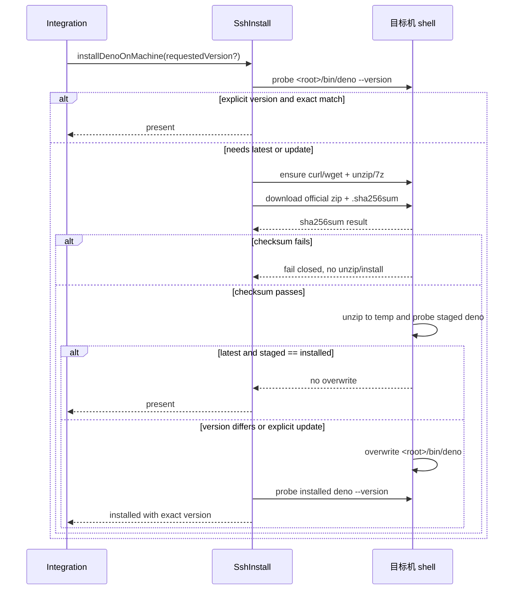

# install-deno 最新稳定版与发布包校验设计

Risk profile: ./risk-profile.yaml

## Design Scope

### Goals

- 缺省安装 Deno 当前最新稳定版，并在远端已有旧版本时升级。
- 保留 `--deno-version` 的显式精确版本语义。
- 直接使用 Deno 官方 GitHub Release 的 `deno-<target>.zip` 与同名
  `.sha256sum`，校验通过后再解压/覆盖，不再执行远程 install.sh。

### Non-goals

- 不新增 CLI 参数、结果字段或退出码。
- 不支持 Windows/macOS 远端目标，也不引入镜像、代理或离线缓存。
- 不自动安装预发布版。

## Useful Context

- `src/ssh_install.ts` 现在以 `version: string` 驱动 install.sh，并用主版本 `>=2` 判定
  `present`，这是本次要替换的核心行为。
- `src/integration.ts` 当前把缺省 `denoVersion` 填成固定常量，导致 CLI 无法
  表达“未显式请求版本，跟踪最新稳定版”。
- 远端工具探测已统一处理 curl/wget 和 unzip/7z；提权仍由安装根是否位于 `$HOME` 之下决定。
- GitHub `latest/download` 解析最新稳定 Release；同一资产的 `.sha256sum` 使用同名
  `<asset>.sha256sum`。

## Overall Approach

把 `InstallDenoOptions.version` 改为可选：`undefined` 表示缺省最新稳定版， 非空值仍由
`normalizeDenoVersion` 强制为 Deno 2+ 的 x.y.z。远端安装脚本根 据该模式选择 latest 或 pinned
官方发布资产，先在临时目录验证 `.sha256sum`，
再解压并探测待装版本。缺省模式比较远端已有版本和待装版本，相同则不覆盖；
不同则安装。显式模式在前置探测时精确匹配即跳过。外部复验仍要求实际版本与 预期一致。

## Layered Design Document Index

| level | parent_document | unit       | design_document | responsibility                                                                                     |
| ----- | --------------- | ---------- | --------------- | -------------------------------------------------------------------------------------------------- |
| root  | design.md       | sfo-deploy | design.md       | 远端 Deno 引导、CLI 集成与文档契约的模块级设计；变更集中在单一远端引导子模块，文件级模块在本文定义 |

## Module Relationship UML

```mermaid
classDiagram
  direction LR
  class SshInstall {
    +releaseArchiveName(target: string) string
    +installerScript(version: string | undefined, existingVersion: string | undefined) string
    +installDenoOnMachine(session: RemoteSession, machine: string, options: InstallDenoOptions) Promise<MachineDenoOutcome>
  }
  class Integration {
    +runInstallDeno(options: RunOptions, transport: Transport) Promise<InstallDenoResult>
  }
  class Cli {
    +actionUsage() string
  }
  class RemoteSession {
    <<interface>>
    +run(argv: readonly string[], options?: RemoteRunOptions) Promise<CommandResult>
  }
  Integration --> SshInstall : passes optional requested version
  SshInstall --> RemoteSession : probes, verifies checksum, installs
  Cli --> Integration : documents default semantics
```



## File-Level Interfaces

```typescript
// src/ssh_install.ts
export interface InstallDenoOptions {
  readonly version?: string; // undefined = latest stable; otherwise exact x.y.z
  readonly installTo?: string;
  readonly signal?: AbortSignal;
}

export async function installDenoOnMachine(
  session: RemoteSession,
  machine: string,
  options: InstallDenoOptions,
): Promise<MachineDenoOutcome>;

function releaseArchiveName(target: string): string;
function installerScript(
  version: string | undefined,
  existingVersion: string | undefined,
): string;

// src/integration.ts（私有调用面）
async function runInstallDeno(
  options: RunOptions,
  transport: Transport,
  confirmMachines?: (machines: readonly string[]) => boolean | Promise<boolean>,
  onProgress?: ProgressListener,
  signal?: AbortSignal,
): Promise<InstallDenoResult>;
```

- Consumer: `runInstallDeno` 消费 `InstallDenoOptions.version`；CLI 帮助与 README 消费缺省语义。
- Compatibility: backward-compatible

  `--deno-version` 参数名、结果结构和退出码不变；缺省行为改变为最新稳定版。 `DEFAULT_DENO_VERSION`
  只是内部源码符号，移除后无公开导出迁移。

## API and Build Surface Impact

- Public API impact: none
- Crate-root export change: no
- Build-surface change: no
- Documentation examples affected: yes

## Consumer Migration Closure

| old_symbol             | new_path                              | change_id                        | consumer_path      | consumer_kind     | migration_status |
| ---------------------- | ------------------------------------- | -------------------------------- | ------------------ | ----------------- | ---------------- |
| `DEFAULT_DENO_VERSION` | `InstallDenoOptions.version?: string` | CHG-install-deno-latest-verified | src/integration.ts | production-caller | migrated         |
| `DEFAULT_DENO_VERSION` | 缺省最新稳定版帮助文本                | CHG-install-deno-latest-verified | src/cli.ts         | production-caller | migrated         |
| 旧 install.sh 信任说明 | 官方 Release + `.sha256sum` 说明      | CHG-install-deno-latest-verified | README.md          | doc-example       | migrated         |

## Key Flows



## State and Ownership

- Owner: `src/ssh_install.ts` 拥有远端探测、版本比较、URL 构造、下载/校验/ 安装脚本和提权判定。
- 本任务不新增持久状态；远端只有 `<install-root>/bin/deno` 这一个受控输出。
- 校验与解压使用远端临时目录，脚本退出时清理；安装失败不得留下待装目录的 半校验二进制。

## Directly Mapped Change Items

| change_id                        | target_module | proposal_id | Design Coverage                                                                             | Scope Paths                                                                                                                                                                                                                                       | Interface / Boundary Impact                | Notes                            |
| -------------------------------- | ------------- | ----------- | ------------------------------------------------------------------------------------------- | ------------------------------------------------------------------------------------------------------------------------------------------------------------------------------------------------------------------------------------------------- | ------------------------------------------ | -------------------------------- |
| CHG-install-deno-latest-verified | sfo-deploy    | PI-1        | Overall Approach、File-Level Interfaces、Key Flows、State and Ownership、Risks and Rollback | src/ssh_install.ts, src/integration.ts, src/cli.ts, tests/unit/ssh_install.test.ts, tests/unit/install_deno_cli.test.ts, tests/dv/install_deno.test.ts, tests/_support/fake_session.ts, tests/contract/verify_install_deno_contract.ts, README.md | 缺省版本语义改变；CLI 参数/JSON/退出码保持 | 单一 change 覆盖实现、集成和契约 |

## Implementation Order

| phase | goal                                                                          | depends_on | output                                                                                                                                                                             |
| ----- | ----------------------------------------------------------------------------- | ---------- | ---------------------------------------------------------------------------------------------------------------------------------------------------------------------------------- |
| 1     | 引导器支持 optional version、latest URL、SHA-256 校验、升级比较和临时目录清理 | 无         | src/ssh_install.ts                                                                                                                                                                 |
| 2     | 集成层不再注入固定默认版本，保留显式版本归一化                                | 1          | src/integration.ts                                                                                                                                                                 |
| 3     | 帮助与 README 同步最新稳定版、升级和校验语义                                  | 1-2        | src/cli.ts, README.md                                                                                                                                                              |
| 4     | 更新替身、单元、DV 和契约测试                                                 | 1-3        | tests/unit/ssh_install.test.ts, tests/unit/install_deno_cli.test.ts, tests/dv/install_deno.test.ts, tests/_support/fake_session.ts, tests/contract/verify_install_deno_contract.ts |

## File-Level Implementation Sequence

| sequence | file_level_module                              | action | depends_on | change_id                        | scope_path                                     | implementation_task |
| -------- | ---------------------------------------------- | ------ | ---------- | -------------------------------- | ---------------------------------------------- | ------------------- |
| 1        | src/ssh_install.ts                             | modify | none       | CHG-install-deno-latest-verified | src/ssh_install.ts                             | 单个实现步骤        |
| 2        | src/integration.ts                             | modify | 1          | CHG-install-deno-latest-verified | src/integration.ts                             | 单个实现步骤        |
| 3        | src/cli.ts                                     | modify | 2          | CHG-install-deno-latest-verified | src/cli.ts                                     | 单个实现步骤        |
| 4        | README.md                                      | modify | 3          | CHG-install-deno-latest-verified | README.md                                      | 单个实现步骤        |
| 5        | tests/_support/fake_session.ts                 | modify | 1          | CHG-install-deno-latest-verified | tests/_support/fake_session.ts                 | 单个实现步骤        |
| 6        | tests/unit/ssh_install.test.ts                 | modify | 5          | CHG-install-deno-latest-verified | tests/unit/ssh_install.test.ts                 | 单个实现步骤        |
| 7        | tests/unit/install_deno_cli.test.ts            | modify | 3          | CHG-install-deno-latest-verified | tests/unit/install_deno_cli.test.ts            | 单个实现步骤        |
| 8        | tests/dv/install_deno.test.ts                  | modify | 1-5        | CHG-install-deno-latest-verified | tests/dv/install_deno.test.ts                  | 单个实现步骤        |
| 9        | tests/contract/verify_install_deno_contract.ts | modify | 4          | CHG-install-deno-latest-verified | tests/contract/verify_install_deno_contract.ts | 单个实现步骤        |

## Design Notes

- 选择 `latest/download` 而不是先调用 GitHub API：目标机只需 curl/wget，不 依赖 JSON 解析，也不受
  API 匿名限额影响；两次下载之间的新版竞态会因为哈 希不匹配失败，可安全重跑。
- 不把版本号写入 latest URL，因此待装版本由校验后的二进制自报；只有显式参 数才使用 pinned URL。
- 校验工具要求远端存在 `sha256sum`；缺失时直接失败，不静默降级为未校验安 装。
- Test-stage details: intentionally omitted; testing-stage owns test-case design and test
  implementation.

## Risks and Rollback

- 动态 latest 可能在不同时间安装不同版本；这是用户确认的默认语义。需要确定 性部署可显式传
  `--deno-version`。
- GitHub 或目标机网络不可用时，安装失败；不会从非官方镜像回退。
- 新 Release 与官方二进制的行为差异需要运维在部署前了解；回滚方式是对目标 机显式安装先前版本。
