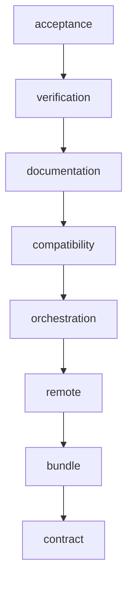

# App 配置、部署包与服务管理自动流水线计划

Workflow tier: high-risk

Risk profile: ./risk-profile.yaml

## Trigger

- Proposal: docs/versions/v0.1/modules/sfo-deploy/046-app-service-management/proposal.md
- User launch confirmed: yes
- User launch statement: `确认，自动完成`
- Launch stage: proposal
- First auto stage: design
- Design source: pipeline/plan.md
- Per-stage user confirmation: skipped by explicit user auto-pipeline authorization
- Auto-confirm completed document stages: no design/testing Markdown documents generated;
  repository-local document extensions only
- Auto-pipeline document policy: stage-selective; automatic design uses pipeline plan; automatic
  testing uses runtime state; testplan.yaml required for automatic testing
- Version: v0.1
- Packet module: sfo-deploy
- Task name: 046-app-service-management
- Target module(s): sfo-deploy
- change_id values: CHG-app-management-contract, CHG-app-file-delivery, CHG-app-managed-runtime,
  CHG-app-management-validation

## Acceptance Baseline

- 最终验收只以用户批准的 `proposal.md`
  为需求基线；本计划细化边界，不缩小四种配置格式、受限脚本、单部署包、systemd 和兼容承诺。

## Stage Graph

| Task ID | Stage          | Execution Mode | Responsibility                                                                       | Scope                                                             | Parent Task | Depends On | Output                                 | Done Condition                                                                                            |
| ------- | -------------- | -------------- | ------------------------------------------------------------------------------------ | ----------------------------------------------------------------- | ----------- | ---------- | -------------------------------------- | --------------------------------------------------------------------------------------------------------- |
| D-1     | design         | auto-pipeline  | 固化契约、模块、接口、状态、失败流和文件顺序                                         | 本任务包与当前 TypeScript 执行主链                                | root        | none       | pipeline plan 与 risk checks           | 计划、风险和 schema 通过，不生成 design.md                                                                |
| I-1     | implementation | auto-pipeline  | 新增 App 内置管理类型和严格配置装载                                                  | 类型、app.yaml schema、必填非 root `management.run_as` 与公共导出 | root        | D-1        | 公共契约实现                           | v1/v2 兼容；v3 缺失/非法/root 身份、危险或冲突声明均在 SSH 前失败                                         |
| I-2     | implementation | auto-pipeline  | 生成无秘密骨架、manifest、确定性单部署包并固定离线 parser 依赖                       | 控制端配置、归档构建与目标 updater 构建输入                       | root        | I-1        | 已固定本地部署包及离线 parser 载荷     | 原始包、脚本、骨架、清单和四格式 parser 形成可复验单一 tar.gz，节点无需动态取依赖                         |
| I-3     | implementation | auto-pipeline  | 实现单包上传、内外层安全校验、固定 updater、身份降权、远端锁与候选配置原子发布       | transport 与远端框架运行时                                        | root        | I-2        | 受限远端原语                           | 外层及内层 tar、锁、身份、格式复解析或候选失败时旧配置和目标边界保持，超时/取消释放锁及临时资源           |
| I-4     | implementation | auto-pipeline  | 编排 planning/execution/systemd/通知、逐消费者秘密、输出脱敏并修复 packageCache 接线 | 计划和运行状态机                                                  | root        | I-3        | 完整 managed 执行链                    | deploy/configure/start/stop/restart 共用锁与 attempt；每个脚本只见其声明秘密，输出安全脱敏且补偿闭合      |
| I-5     | implementation | auto-pipeline  | 闭合全生命周期 release attempt、历史 codec、结果和 API 兼容                          | history/results/integration/mod                                   | root        | I-4        | plan-v4、统一 attempt 与兼容接口       | configure/start/stop/restart/deploy/rollback 都在控制端 attempt 中运行；v1-v3 可读、v4 可写且旧消费者兼容 |
| I-6     | implementation | auto-pipeline  | 更新示例和中文文档                                                                   | README、指南和 nginx 示例                                         | root        | I-5        | 可操作示例与迁移说明                   | 文档明确 run_as、逐消费者秘密、全操作锁、内层 tar、离线 parser 与输出脱敏责任并与实现一致                 |
| T-1     | testing        | auto-pipeline  | 依据提案、计划和最终代码设计并实现任务级测试                                         | unit/DV/integration/contract/testplan/runner                      | root        | I-6        | 测试实现、testplan 与 runtime evidence | 四个 change_id 和适用风险由统一入口覆盖并通过                                                             |
| A-1     | acceptance     | auto-pipeline  | 独立证伪需求、设计、实现和测试充分性                                                 | 当前交付及机器证据                                                | root        | T-1        | acceptance-report.md                   | 完成全部缺陷发现类别且结论 accepted                                                                       |

## Submodule Tasks

| Task ID | Stage | Execution Mode | Responsibility | Submodule | Parent Task | Depends On | Output | Done Condition |
| ------- | ----- | -------------- | -------------- | --------- | ----------- | ---------- | ------ | -------------- |

合并理由：四个 change_id 共享同一 `AppDefinition -> PlanStep -> PreparedExecution -> RemoteSession`
协议；按 I-1 至 I-6 串行切分可独立交付文件级输出并避免并发修改公共类型、执行器和历史
codec。设计与测试分别由 D-1/T-1 综合拥有，不创建重复子模块文档。

## Parallel Scheduling

- Strategy: dependency-ready-set
- Concurrency: use all runtime-available child-agent slots；本任务因公共协议依赖按就绪集串行推进。
- Shared artifact owner: parent-orchestrator
- Lock directory: `.harness/locks/`
- Dispatch rule: use practical edit coordination and launch ready tasks with available capacity.
- Serialization reasons: only explicit dependency, edit coordination, or exhausted concurrency
  capacity；本计划各实现任务显式依赖前序协议。
- Evidence: waves and serialization reasons are recorded in
  `.harness/pipelines/v0.1/sfo-deploy/046-app-service-management/state.json`.

## Dependency Graphs

| Level          | Parent     | Node          | Depends On    |
| -------------- | ---------- | ------------- | ------------- |
| responsibility | sfo-deploy | contract      | none          |
| responsibility | sfo-deploy | bundle        | contract      |
| responsibility | sfo-deploy | remote        | bundle        |
| responsibility | sfo-deploy | orchestration | remote        |
| responsibility | sfo-deploy | compatibility | orchestration |
| responsibility | sfo-deploy | documentation | compatibility |
| responsibility | sfo-deploy | verification  | documentation |
| responsibility | sfo-deploy | acceptance    | verification  |

## Key Call Flows

- `loadCluster` 严格装载 App v3 managed 配置、服务、文件和必填 `run_as`；该值必须是规范且非 `root`
  的用户名称，v1/v2 继续得到 legacy 脚本定义。
- `buildPlan` 为 opt-in App 生成 managed 配置/服务动作；`prepareExecution` 固定原始包与 App
  输入、生成骨架、manifest 和外层 tar.gz，并携带目标端离线可用的 YAML/JSON/TOML/INI parser。
- `configure/start/stop/restart/deploy/rollback` 先在控制端创建统一 release
  attempt，再连接每个目标；目标会话以规范 App/目标锁键获取 `flock`，持锁完成
  bundle、配置、脚本和服务状态转换，成功、失败、超时或取消均在清理后释放。
- `DeploymentExecutor` 每目标上传部署包一次；`RemoteSession` 先用固定 argv
  验证外层摘要和成员，再对内层 App gzip tar 执行只读 list，拒绝非规范相对路径、链接/设备等非
  regular/dir 类型、重复/超量成员及总展开大小越界，之后才解压到 attempt 隔离目录。
- SSH 身份为 root 时，`RemoteSession` 用固定 `getent passwd` 与 `id` argv 验证 `run_as` 存在且 UID
  非 0，再以 `sudo -n -u <run_as> --` 执行配置 updater 和 App 生命周期脚本；非 root SSH 身份必须与
  `run_as` 身份一致，否则失败关闭。
- 每个固定/script config updater 和每次生命周期脚本调用分别创建自己的 0700
  秘密目录，只复制该消费者声明的秘密为 0600
  文件；目录不复用、不共享，并在该消费者返回、失败、超时或取消后立即清理。
- 固定 updater 从部署包读取离线 parser，注入秘密后对 YAML/JSON/TOML/INI
  候选按声明格式完整复解析；显式 script updater 仍只生成候选。框架随后执行残留标记检查、可选
  validator、备份和原子发布，并合并一次 systemd 动作。
- 生命周期 stdout/stderr 在进入进度、结果、CLI、JSON 或历史前，使用本次操作已解析的秘密全集构造
  redactor；无法证明安全脱敏时丢弃 stdout/stderr，只保留无敏感内容的结构化状态和固定错误类别。
- 任一失败执行有界补偿和清理；结果记录 changed/unchanged/service/recovery
  状态，但不记录秘密、最终配置内容、未脱敏输出或锁的目标端内部路径。

## Exported Interfaces

| Interface                                                                   | Owner               | Consumer                               | Compatibility       | Affected Callers                                       | Migration Path                                                                          |
| --------------------------------------------------------------------------- | ------------------- | -------------------------------------- | ------------------- | ------------------------------------------------------ | --------------------------------------------------------------------------------------- |
| `AppDefinition.management`、必填 `runAs` 与配置/service/binding 类型        | config-contract     | planning、公开 TypeScript 用户         | backward-compatible | none                                                   | v1/v2 字段保持可选；app.yaml v3 声明 management 时必须给出非 root `run_as`              |
| `PlanStep.management`、`deliveryInputs`                                     | planning            | execution、history codec               | backward-compatible | none                                                   | 旧计划解码为空 managed 输入，新计划写 plan-v4                                           |
| `PreparedStep.deliveryBundle`                                               | delivery-builder    | DeploymentExecutor                     | new                 | none                                                   | managed/legacy packaged App deploy 使用单包，非 App 步骤保持原路径                      |
| `RemoteSession.stageDeploymentBundle` 与 managed config/service 原语        | remote-runtime      | OpenSshRemoteSession、测试 FakeSession | new                 | none                                                   | 实现类和测试替身新增显式方法，不用 shell 拼接                                           |
| `RemoteSession` 的 App 身份验证、目标操作锁、内层归档验证与逐消费者秘密原语 | remote-runtime      | DeploymentExecutor、统一生命周期入口   | new                 | none                                                   | 仅 managed App 使用固定 argv/`flock`/独立秘密目录；legacy App 保留既有契约              |
| `StepResult` 可选配置/service/recovery 字段                                 | execution-results   | CLI、JSON、history                     | backward-compatible | none                                                   | 未使用 managed 模式时字段缺省且现有输出不变                                             |
| 生命周期命令统一 release attempt 与安全输出策略                             | integration/history | CLI、JSON、history、DeploymentExecutor | backward-compatible | 现有 configure/start/stop/restart/deploy/rollback 入口 | 命令参数与成功字段不变；新增共同 attempt/锁生命周期，stdout/stderr 仅在可安全脱敏时返回 |

## API and Build Surface Impact

- Public API impact: backward-compatible
- Crate-root export change: yes
- Build-surface change: yes
- Documentation examples affected: yes

## Consumer Migration Closure

| Old Symbol                                | New Path                                                | change_id                     | Consumer Path                                                        | Consumer Kind  | Migration Status |
| ----------------------------------------- | ------------------------------------------------------- | ----------------------------- | -------------------------------------------------------------------- | -------------- | ---------------- |
| `AppDefinition` 无 management             | `AppDefinition.management?`（managed 时含必填 `runAs`） | CHG-app-management-contract   | src/planning.ts                                                      | 内部计划消费者 | migrated         |
| `PlanStep` schema v3                      | schema v4 可选 managed/delivery 字段及 managed `runAs`  | CHG-app-managed-runtime       | src/history.ts                                                       | 持久计划 codec | migrated         |
| 逐项 package/templates/bundleScripts 上传 | `PreparedStep.deliveryBundle` 单包暂存                  | CHG-app-file-delivery         | src/execution.ts                                                     | 执行消费者     | migrated         |
| nginx configure/restart 脚本所有权        | app.yaml managed config/systemd 声明                    | CHG-app-management-validation | examples/eleph-server-multipass/cluster-template/apps/nginx/app.yaml | 示例消费者     | migrated         |

## External Runtime Dependencies

- 控制端 Deno 使用固定版本的标准 YAML/TOML/INI/归档能力或仓库实现；任何新增 JSR 依赖必须写入
  `deno.json`/`deno.lock` 并可 `--frozen` 解析。
- 目标端继续要求 OpenSSH、App 声明的 Deno/Python 运行时以及 GNU/Linux
  `tar`、`sha256sum`、`install`、`mv`；systemd 模式额外要求 `systemctl`。
- 上传的框架 updater 必须随当前 sfo-deploy 源码固定并以 `--no-remote --no-npm`
  运行，节点不动态下载模块。
- YAML/JSON/TOML/INI parser 必须作为固定 updater
  的离线构建输入随部署包交付；目标端候选复解析不能访问网络、npm、JSR 或宿主未声明模块。
- managed App 在 root SSH 下只允许通过固定 `getent`、`id` 和 `sudo -n -u <run_as> --` 降权运行
  updater/生命周期脚本；`systemctl` 和持久配置发布仍由框架受控的提权路径拥有。

## State Ownership

| State                                                | Owner                                  | Access Interface                               | Lifecycle                                                                                | Failure Transitions                                                               |
| ---------------------------------------------------- | -------------------------------------- | ---------------------------------------------- | ---------------------------------------------------------------------------------------- | --------------------------------------------------------------------------------- |
| App v3 normalized management declaration             | config-contract                        | `loadCluster` / `AppDefinition.management`     | SSH 前创建并随计划冻结                                                                   | 未知字段、冲突模式、危险路径或 selector 立即失败                                  |
| controller prepared bundle and manifest              | `PreparedExecution`                    | delivery builder / `close`                     | 首次 SSH 前生成，执行结束删除                                                            | 输入变化、摘要或归档失败清理并终止，不连接节点                                    |
| target release-attempt staging root and ready marker | `RemoteSession`                        | `stageDeploymentBundle` / cleanup              | 上传、外层校验、安全解包、逐成员校验后 ready                                             | 任何异常不写 ready、不可消费并递归清理登记目录                                    |
| controller release attempt and target operation lock | integration/history 与 `RemoteSession` | `beginAttempt` / target `flock` lease          | 六类生命周期命令进入执行前创建 attempt，每目标持锁覆盖全部状态转换                       | 获取超时不执行副作用；成功、失败、超时、取消都在 finally 释放目标锁并关闭 attempt |
| per-consumer secret copy                             | `DeploymentExecutor`                   | scoped secret exposure/cleanup                 | 每个 config updater 或生命周期调用前独立创建 0700 目录和 0600 声明秘密，调用完成立即销毁 | 复制不完整不启动消费者；清理失败进入脱敏 cleanup error，不把目录交给下一消费者    |
| validated inner App archive                          | `RemoteSession`                        | list/validate/extract                          | 外层 ready 后先只读列举内层 gzip tar，再解到 attempt 隔离目录                            | 路径、类型、重复、成员数或总展开量违规时不解压、不执行生命周期脚本并清理          |
| candidate/backup/final managed configs               | managed-config executor                | update/validate/publish/restore                | 候选全成功后备份并原子发布，服务收敛后删备份                                             | 更新/验证失败旧文件不变；服务失败恢复，恢复失败标 partial                         |
| systemd enable/active state                          | service-management                     | fixed systemctl argv                           | 动作前读取、合并通知、动作后确认                                                         | timeout/失败触发有界配置及 enable 补偿并报告实际状态                              |
| release plan-v4 and result metadata                  | history                                | codec/snapshot API                             | 成功或部分结果持久化无秘密声明                                                           | 旧版本缺省 managed；未知未来版本失败关闭                                          |
| operation secret redactor                            | execution                              | resolved-secret-set / redacted result boundary | attempt 准备期从本次操作秘密全集建立，所有脚本输出离开执行器前应用                       | redactor 不可构造或输出不可安全判定时清空 stdout/stderr，仅返回固定分类和状态     |

## Failure Flows

| Flow                     | Boundary                                             | Failure                                                                       | Handling                                                                          |
| ------------------------ | ---------------------------------------------------- | ----------------------------------------------------------------------------- | --------------------------------------------------------------------------------- |
| app.yaml 到计划          | config -> planning                                   | 格式、路径、秘密绑定、脚本与内置所有权冲突                                    | SSH 前 ConfigurationError/PlanningError，不隐式退回脚本                           |
| provider 到控制端 bundle | cache -> delivery builder                            | cache 未传递、原始摘要错、输入变化或封装失败                                  | deploy 强制 local-only 同一 artifact，清理本地 attempt 并失败                     |
| bundle 上传与解包        | executor -> RemoteSession                            | SCP、外层/成员摘要、路径、类型、数量或大小异常                                | 不生成 ready，不执行脚本/安装，清理目标 attempt                                   |
| 内层 App tar 消费        | staged bundle -> lifecycle workspace                 | gzip/tar list 失败、绝对或非规范路径、链接/设备、重复、成员数或总展开大小越界 | 解压前失败关闭，不创建可消费安装树，释放锁并清理 attempt                          |
| App 运行身份             | SSH session -> updater/lifecycle                     | `run_as` 不存在、UID 为 0、非 root SSH 身份不匹配或 `sudo -n -u` 失败         | 不执行 App 代码；不退回 root，释放锁并关闭失败 attempt                            |
| 配置秘密注入             | scoped secret copy -> updater                        | 缺失、类型不符、残留 token、脚本越界/超时或读取其他消费者秘密                 | 不触碰最终路径，脱敏错误并清理该消费者候选与独立秘密副本；不复用目录              |
| 配置格式确认             | fixed updater -> candidate                           | 离线 parser 缺失、注入后 YAML/JSON/TOML/INI 复解析失败                        | 候选不发布，保留旧文件并清理候选；禁止降级为文本检查或联网加载 parser             |
| 候选发布                 | updater -> privileged filesystem                     | validation/chown/chmod/rename 中途失败                                        | 保留或恢复旧文件；无法恢复时结构化 partial/recovery 错误                          |
| systemd 收敛             | execution -> systemctl                               | daemon-reload/reload/restart/start/stop/enable 失败或超时                     | 至多一次通知，读取实际状态，尝试有界补偿并目标 fail-fast                          |
| 生命周期互斥             | CLI/integration -> release attempt -> target `flock` | 控制端 attempt 创建失败、锁获取超时、取消或持锁执行失败                       | 无锁不执行副作用；关闭 attempt，并在 finally 释放已持目标锁且不自动重试副作用动作 |
| 生命周期输出             | script process -> result/CLI/history                 | 输出含任一秘密、redactor 初始化失败或无法安全证明已脱敏                       | 丢弃 stdout/stderr，返回固定错误类别和结构化状态；任何原始输出不离开执行器        |
| 历史回放                 | history -> current execution                         | v1-v3 缺新字段或 v4 节点秘密变化                                              | 旧计划按 legacy 执行；v4 只保存骨架并从当前节点秘密重新注入                       |

## Invariants to Preserve

- 未声明 management 的 v1/v2 App 计划、脚本权限、失败和 CLI/JSON 行为不变。
- App 原始 tar.gz 保持字节与强摘要；外层部署包不包含秘密，同一目标/release/digest 只消费完整 ready
  内容。
- 配置脚本只能生成 workspace 候选文件，不能直接发布最终配置或操作 systemd；内置更新器不使用
  sed、正则或 shell 插值。
- secret value 不进入控制端、manifest、bundle、argv、普通环境、日志、结果和历史；最终配置不回传。
- changed 为 false 时不触发服务；多个文件的 restart 优先于 reload 且同一操作最多执行一次。
- 每个 managed App 必须声明非 root `run_as`；任何 App updater 或生命周期脚本都不以 UID 0 运行，root
  SSH 也不得成为回退路径。
- 每个 config updater 和每次生命周期脚本调用只可读取自己声明的独立秘密副本；0700 目录和 0600
  文件不跨消费者共享或复用。
- configure/start/stop/restart/deploy/rollback 都拥有控制端 release attempt，并在目标端同一
  App/目标锁域内串行；未持锁不产生配置、安装或服务副作用，所有终态释放锁。
- 内层 App gzip tar 只有在完整 list 验证规范相对路径、regular/dir
  类型、无重复、成员数和总展开大小后才可解压到隔离目录。
- 固定 updater 的四格式 parser 离线随包交付；注入后的 YAML、JSON、TOML、INI
  候选必须按声明格式复解析成功才可发布。
- 生命周期 stdout/stderr
  只有经本次操作秘密全集安全脱敏后才可观察；不能安全脱敏时返回空输出而非原文。

## Rejected Alternatives

| Decision Type | Selected                                            | Rejected                                  | Reason                                        |
| ------------- | --------------------------------------------------- | ----------------------------------------- | --------------------------------------------- |
| boundary      | App 显式 opt-in，框架拥有候选校验/发布和 systemd    | 根据脚本名或 unit 文件自动接管            | 隐式接管会改变旧 App 并造成重复启停           |
| technical     | 原始包、声明脚本和无秘密骨架组成单一外层 tar.gz     | 每步骤分别 SCP 或目标端重新下载           | 无法保证同一输入且增加往返和 provider 漂移    |
| technical     | YAML/JSON/TOML/INI 结构化更新，特殊格式显式受限脚本 | sed/envsubst/任意远端 configure           | 转义、注入、秘密泄漏和最终路径所有权不可审计  |
| collaboration | I-1 至 I-6 按共享协议串行，再独立 T-1/A-1           | 同时修改 types/planning/execution/history | 公共字段和 codec 并行会产生契约漂移和重复返工 |

## Implementation Scope Bindings

| change_id                     | target_module | proposal_id | design_coverage                                                                                                         | scope_paths                                                                                                                                                                                        | design_rules_applied                                     |
| ----------------------------- | ------------- | ----------- | ----------------------------------------------------------------------------------------------------------------------- | -------------------------------------------------------------------------------------------------------------------------------------------------------------------------------------------------- | -------------------------------------------------------- |
| CHG-app-management-contract   | sfo-deploy    | PI-1        | v3 opt-in schema、必填非 root run_as、四格式 selector、script/systemd/hook 冲突校验与公共类型                           | `src/types.ts`, `src/config.ts`, `src/mod.ts`, `README.md`, `docs/guides`, `examples/eleph-server-multipass`                                                                                       | 模块分解、接口消费者、兼容迁移、安全边界                 |
| CHG-app-file-delivery         | sfo-deploy    | PI-2        | 控制端骨架/manifest/外层 tar.gz、离线 parser、内层 tar list 验证、PreparedExecution 所有权、目标 ready 校验和完整包复用 | `src/config_generation.ts`, `src/deployment_bundle.ts`, `src/remote_deployment.ts`, `src/remote_runtime`, `src/transport.ts`, `src/package_cache.ts`, `src/execution.ts`, `deno.json`, `deno.lock` | 状态所有权、构建输入、内外层完整性、失败清理             |
| CHG-app-managed-runtime       | sfo-deploy    | PI-3        | 计划动作、逐消费者秘密、非 root 执行、全生命周期 attempt/目标锁、四格式复解析、systemd 补偿、输出脱敏、结果和 plan-v4   | `src/planning.ts`, `src/execution.ts`, `src/service_management.ts`, `src/integration.ts`, `src/results.ts`, `src/history.ts`, `src/cli.ts`, `src/transport.ts`, `src/remote_runtime`               | 调用流、生命周期、并发互斥、安全输出、失败补偿、持久兼容 |
| CHG-app-management-validation | sfo-deploy    | PI-4        | 四格式/脚本/归档/systemd/兼容测试、示例指南及统一 runner                                                                | `tests`, `harness/scripts/test-run.py`, `README.md`, `docs/guides`, `examples/eleph-server-multipass`                                                                                              | 风险到测试映射、消费者闭包、独立验收                     |

## File-Level Implementation Sequence

| Sequence | Task ID | File-Level Module                                                                                      | Action                                                                                                              | Depends On | change_id                     | target_module | Scope Paths                                                                                            | Context Sources                                       |
| -------- | ------- | ------------------------------------------------------------------------------------------------------ | ------------------------------------------------------------------------------------------------------------------- | ---------- | ----------------------------- | ------------- | ------------------------------------------------------------------------------------------------------ | ----------------------------------------------------- |
| 1        | I-1     | `src/types.ts`, `src/config.ts`, `src/mod.ts`                                                          | modify：定义并严格装载 v3 management/config/service/script 与必填非 root run_as 契约                                | none       | CHG-app-management-contract   | sfo-deploy    | `src/types.ts`, `src/config.ts`, `src/mod.ts`                                                          | proposal PI-1、Exported Interfaces、Invariants        |
| 2        | I-2     | `src/config_generation.ts`, `src/deployment_bundle.ts`, `src/remote_runtime`, `deno.json`, `deno.lock` | create/modify：控制端生成骨架、manifest、确定性外层 tar.gz，并把四格式 parser 固定为目标端离线输入                  | I-1        | CHG-app-file-delivery         | sfo-deploy    | `src/config_generation.ts`, `src/deployment_bundle.ts`, `src/remote_runtime`, `deno.json`, `deno.lock` | proposal PI-2、State Ownership、External Dependencies |
| 3        | I-3     | `src/remote_deployment.ts`, `src/remote_runtime`, `src/transport.ts`                                   | create/modify：内外层归档校验、隔离解包、离线四格式复解析、run_as 验证/降权、目标 flock、逐消费者秘密和原子配置原语 | I-2        | CHG-app-file-delivery         | sfo-deploy    | `src/remote_deployment.ts`, `src/remote_runtime`, `src/transport.ts`                                   | proposal PI-2/PI-3、Failure Flows、安全 checks        |
| 4        | I-4     | `src/planning.ts`, `src/execution.ts`, `src/service_management.ts`, `src/package_cache.ts`             | create/modify：接入单包、managed 动作、独立秘密作用域、目标锁、systemd、输出全集脱敏、通知/补偿及 packageCache      | I-3        | CHG-app-managed-runtime       | sfo-deploy    | `src/planning.ts`, `src/execution.ts`, `src/service_management.ts`, `src/package_cache.ts`             | proposal PI-3、Key Call Flows、runtime checks         |
| 5        | I-5     | `src/history.ts`, `src/results.ts`, `src/integration.ts`, `src/cli.ts`                                 | modify：六类命令统一控制端 release attempt、plan-v4 run_as codec、脱敏兼容结果和公共执行入口                        | I-4        | CHG-app-managed-runtime       | sfo-deploy    | `src/history.ts`, `src/results.ts`, `src/integration.ts`, `src/cli.ts`                                 | Consumer Migration Closure、data checks               |
| 6        | I-6     | `README.md`, `docs/guides`, `examples/eleph-server-multipass`                                          | modify：记录 run_as、独立秘密、全操作锁、内层 tar、离线复解析、输出脱敏及可运行 nginx managed 示例                  | I-5        | CHG-app-management-validation | sfo-deploy    | `README.md`, `docs/guides`, `examples/eleph-server-multipass`                                          | proposal PI-4、最终公共契约                           |

## Return Rules

- 提案对格式、脚本信任、单包内容、服务动作或回退边界若有矛盾，A-1 写 rejected 并停止请用户决策。
- 接口、状态、失败补偿或实现顺序缺陷返回 D-1；生产行为缺陷返回对应 I-*；覆盖或证据不足返回 T-1。
- 每次 needs-changes 写入 runtime `return_records`；同一问题超过 5 次仍未关闭时停止并报告。

执行状态、测试证据、return records 和最终验收只写
`.harness/pipelines/v0.1/sfo-deploy/046-app-service-management/state.json`。
