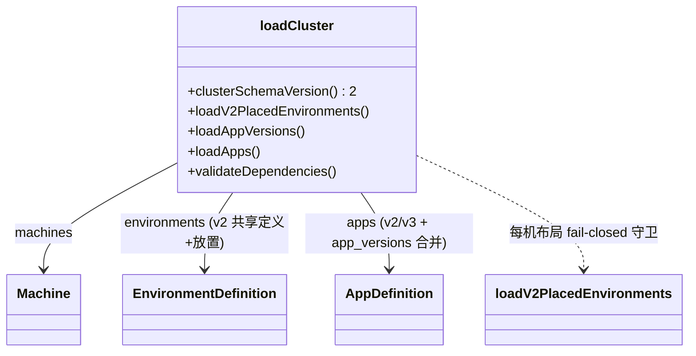

# 设计：删除 v1 配置形态（app.yaml schema v1 与 cluster v1 环境布局）

Risk profile: ./risk-profile.yaml

## Design Scope

本设计覆盖 sfo-deploy 模块的集群配置装载层（`src/config.ts` 的 `loadCluster` 输入面）删除两条 legacy
读入分支：app.yaml `schema_version: 1` 内联 version/package，以及 cluster.yaml `schema_version: 1`
的每机环境布局
`environments/<机器名>/<环境名>/`。删除后受支持配置形态收敛为唯一现代形态：`cluster.yaml` 只支持
schema_version 2（共享环境定义 + `cluster.yaml.environments` 集中放置），`app.yaml` 只支持
schema_version 2/3（version/package 一律来自集群根 `app_versions.yaml`），`environment.yaml` 保持
schema_version 1。

`environment.yaml` 自身的 `schema_version: 1` 校验不在删除范围（已由提案确认固定）。

## Useful Context

- task.yaml 顶层 `changed_paths_file` 与三个 change 共用同一份 `Scope Paths`，全部落在 `sfo-deploy`
  单模块。
- `loadCluster` 现有结构（src/config.ts:1717）：`clusterSchemaVersion` 三目选择 v1/v2 clusterFields
  与环境装载分支；`loadApps` 内按 `schemaVersion === 1` 走内联 branch，否则经 `app_versions.yaml`
  合并。
- 删除 v1 分支后若 `appVersions` 无值，`loadApps` 对任何 app 都会按既有 v2/v3 校验报「缺少
  app_versions.yaml」，无需新增逻辑。
- 公开 TypeScript 形状 `AppDefinition.version`/`package` 已是可选，删除 v1 分支不需要类型变更。

## Overall Approach

- 在入口收窄版本：`clusterSchemaVersion` 仅接受 2、`appSchemaVersion` 仅接受 2/3，让所有 v1
  配置在版本判断处即被拒收。
- 删除 `loadV1MachineEnvironments`、`APP_V1_FIELDS` 与 `loadApps` v1 分支，删除 `loadCluster` 的 v1
  clusterFields/clusterRequired 三目。
- 保留 `loadV2PlacedEnvironments` 的 `legacyDirectories` fail-closed 检测（v2 cluster.yaml
  出现每机布局目录仍明确报错）。
- 夹具与测试从「v1 可读」改写为「v1 拒收」负例；文档收敛 v1 兼容/迁移/降级表述。

## Layered Design Document Index

| level | parent_document    | unit                  | design_document | responsibility                                       |
| ----- | ------------------ | --------------------- | --------------- | ---------------------------------------------------- |
| task  | 无（任务级设计根） | sfo-deploy 配置装载层 | design.md       | `src/config.ts` 删除 v1 读入分支、夹具/测试/文档收敛 |

## Module Relationship UML



关系说明：删除后 `loadCluster` 不再依赖 v1 放置分支；Environment 与 App 均只有单一路径产出定义。

## File-Level Interfaces

`src/config.ts` 删除后保留的装载入口（TypeScript 签名，与当前实现一致，仅版本宽度收窄）：

```typescript
// cluster.yaml schema_version：只接受 2。
function clusterSchemaVersion(data: StringRecord): 2;

// app.yaml schema_version：只接受 2 或 3。
function appSchemaVersion(data: StringRecord, label: string): 2 | 3;

// 共享定义 + 集中放置的环境装载（保留既有 v2 逻辑与其 v1-布局守卫）。
async function loadV2PlacedEnvironments(
  root: string,
  machines: ReadonlyMap<string, Machine>,
  placementData: Readonly<StringRecord>,
): Promise<LoadedEnvironments>;

// App 装载：强制走 app_versions.yaml 合并路径，删除 v1 内联分支。
async function loadApps(
  root: string,
  appVersions: ReadonlyMap<string, AppVersionEntry> | undefined,
): Promise<Map<string, AppDefinition>>;
```

接口消费者与兼容决策：

- Consumer:
  loadCluster（src/config.ts:1717）——clusterSchemaVersion/loadV2PlacedEnvironments/loadApps
  的唯一调用方；删除其 v1 分支调用与 v1 clusterFields/clusterRequired 常量。
- Consumer: loadCluster（src/config.ts:1717）——loadApps 唯一调用方；`appVersions` 现在恒为必填。
- Consumer: src/mod.ts、src/types.ts——公开导出消费者；无形状变化。
- Compatibility: breaking / backward-compatible
- 兼容说明：对 v1 配置属 breaking，对 v2/v3 配置属 backward-compatible；受影响的既有调用者是外部 v1
  集群配置，仓库内迁移矩阵见 Consumer Migration Closure。

## Key Flows

- not-applicable: 本任务为纯装载期静态分支删除，不改变任何跨进程/跨
  SSH/控制端-目标端运行时交互，无序列图可描述；相关流程见 Module Relationship UML 的装载分流说明。

## State and Ownership

- Owner: loadCluster（src/config.ts:1717）——装载结果的唯一生产者；本次不触碰任何持久数据或共享状态。
- State: 执行计划、发布历史、秘密目录的读写路径不变（risk-profile `data` 不适用）；`ClusterConfig`
  产物形状不变。

## Directly Mapped Change Items

| change_id                        | target_module | proposal_id | design_coverage                                                                                                                 | scope_paths                                                                                                                                                                                                                                                                                                                                                                                                |
| -------------------------------- | ------------- | ----------- | ------------------------------------------------------------------------------------------------------------------------------- | ---------------------------------------------------------------------------------------------------------------------------------------------------------------------------------------------------------------------------------------------------------------------------------------------------------------------------------------------------------------------------------------------------------- |
| CHG-drop-app-v1                  | sfo-deploy    | P-001       | `appSchemaVersion` 仅接受 2/3；删除 `APP_V1_FIELDS` 与 `loadApps` v1 分支；app_versions.yaml 恒必填                             | src/config.ts, README.md, docs/guides/sfo-deploy-cluster-configuration.md, tests/unit/config_planning.test.ts, tests/unit/app_management_config.test.ts, tests/_support/fixtures.ts                                                                                                                                                                                                                        |
| CHG-drop-cluster-v1-environments | sfo-deploy    | P-002       | `clusterSchemaVersion` 仅接受 2；删除 `loadV1MachineEnvironments` 与 `loadCluster` v1 分支；保留 v2 的每机布局 fail-closed 守卫 | src/config.ts, README.md, docs/guides/sfo-deploy-cluster-configuration.md, tests/unit/environment_placement.test.ts, tests/integration/environment_placement.test.ts, tests/contract/verify_environment_placement_config.ts, tests/_support/environment_placement.ts                                                                                                                                       |
| CHG-v1-doc-tests                 | sfo-deploy    | P-003       | 夹具/用例改写为 v1 拒收负例；README、集群配置指南、示例 README 收敛 v1 兼容/迁移/降级表述                                       | tests/_support/fixtures.ts, tests/_support/environment_placement.ts, tests/unit/config_planning.test.ts, tests/unit/app_management_config.test.ts, tests/unit/environment_placement.test.ts, tests/integration/environment_placement.test.ts, tests/contract/verify_environment_placement_config.ts, README.md, docs/guides/sfo-deploy-cluster-configuration.md, examples/eleph-server-multipass/README.md |

## Implementation Order

| phase        | goal                                                                                                                 | depends_on | output                            |
| ------------ | -------------------------------------------------------------------------------------------------------------------- | ---------- | --------------------------------- |
| I-1 版本收窄 | 入口 `appSchemaVersion`/`clusterSchemaVersion` 只接受 2/2-3，v1 配置立即拒收，杜绝中间态静默读入                     | 无         | src/config.ts 版本校验收窄        |
| I-2 分支删除 | 移除 `APP_V1_FIELDS`、`loadApps` v1 分支、`loadV1MachineEnvironments` 与 `loadCluster` v1 分支；保留 v2 每机布局守卫 | I-1        | src/config.ts 单一 v2/v3 装载路径 |
| I-3 夹具收敛 | `fixtures.ts`/`environment_placement.ts` 删除 v1 选项，收敛为 v2 + app_versions 单路径                               | I-2        | 无 v1 分支的测试夹具              |
| I-4 用例改写 | unit/integration/contract 中 v1 可读用例改为 v1 拒收负例并对照错误文案                                               | I-3        | v1 拒收负例测试                   |
| I-5 文档收敛 | README、集群配置指南、示例 README 删除 v1 兼容/迁移/降级表述                                                         | I-4        | 文档与新契约一致                  |
| I-6 全量回归 | `deno task check` 全绿，v2/v3 装载结果与删除前逐字段一致                                                             | I-5        | 可交付的代码与证据                |

## File-Level Implementation Sequence

| sequence | file_level_module                                     | action | depends_on | change_id                                          | scope_path                                            | implementation_task |
| -------- | ----------------------------------------------------- | ------ | ---------- | -------------------------------------------------- | ----------------------------------------------------- | ------------------- |
| 1        | src/config.ts                                         | 修改   | -          | CHG-drop-app-v1, CHG-drop-cluster-v1-environments  | src/config.ts                                         | 版本收窄 + 分支删除 |
| 2        | tests/_support/fixtures.ts                            | 修改   | 1          | CHG-drop-app-v1, CHG-v1-doc-tests                  | tests/_support/fixtures.ts                            | 夹具收敛            |
| 3        | tests/_support/environment_placement.ts               | 修改   | 1          | CHG-drop-cluster-v1-environments, CHG-v1-doc-tests | tests/_support/environment_placement.ts               | 夹具收敛            |
| 4        | tests/unit/config_planning.test.ts                    | 修改   | 2          | CHG-drop-app-v1, CHG-v1-doc-tests                  | tests/unit/config_planning.test.ts                    | v1 拒收负例         |
| 5        | tests/unit/app_management_config.test.ts              | 修改   | 2          | CHG-drop-app-v1, CHG-v1-doc-tests                  | tests/unit/app_management_config.test.ts              | v1 拒收负例         |
| 6        | tests/unit/environment_placement.test.ts              | 修改   | 3          | CHG-drop-cluster-v1-environments, CHG-v1-doc-tests | tests/unit/environment_placement.test.ts              | v1 拒收负例         |
| 7        | tests/integration/environment_placement.test.ts       | 检查   | 6          | CHG-drop-cluster-v1-environments, CHG-v1-doc-tests | tests/integration/environment_placement.test.ts       | 文案对照            |
| 8        | tests/contract/verify_environment_placement_config.ts | 检查   | 6          | CHG-drop-cluster-v1-environments, CHG-v1-doc-tests | tests/contract/verify_environment_placement_config.ts | 文案对照            |
| 9        | README.md                                             | 修改   | 8          | CHG-v1-doc-tests                                   | README.md                                             | 文档收敛            |
| 10       | docs/guides/sfo-deploy-cluster-configuration.md       | 修改   | 9          | CHG-v1-doc-tests                                   | docs/guides/sfo-deploy-cluster-configuration.md       | 文档收敛            |
| 11       | examples/eleph-server-multipass/README.md             | 修改   | 10         | CHG-v1-doc-tests                                   | examples/eleph-server-multipass/README.md             | 文档收敛            |

所有文件依赖单向、无环；`src/config.ts` 先行，测试与文档依赖其行为。

## API and Build Surface Impact

- Public API impact: breaking
- Crate-root export change: no
- Build-surface change: no
- Documentation examples affected: yes
- 说明：公开 TypeScript 类型与 `src/mod.ts` 导出不变；接受配置的契约收窄，app.yaml/cluster.yaml v1
  形态不再被装载（对 v1 配置属 breaking，对 v2/v3
  配置无变化）。README、docs/guides/sfo-deploy-cluster-configuration.md、examples/eleph-server-multipass/README.md
  中 v1 兼容/迁移/降级小节改写；示例集群（纯 v2/v3）无需功能改动。

## Consumer Migration Closure

| old_symbol                                             | new_path                                                              | change_id                        | consumer_path                                   | consumer_kind | migration_status |
| ------------------------------------------------------ | --------------------------------------------------------------------- | -------------------------------- | ----------------------------------------------- | ------------- | ---------------- |
| app.yaml schema v1（内联 version/package）             | app_versions.yaml 拆出版本/包，app.yaml 升 v2/v3                      | CHG-drop-app-v1                  | tests/_support/fixtures.ts                      | 测试夹具      | migrated         |
| app.yaml schema v1                                     | 同上                                                                  | CHG-drop-app-v1                  | tests/unit/config_planning.test.ts              | 单元测试      | migrated         |
| app.yaml schema v1                                     | 同上                                                                  | CHG-drop-app-v1                  | tests/unit/app_management_config.test.ts        | 单元测试      | migrated         |
| cluster.yaml schema v1 + `environments/<机器>/<环境>/` | 合并共享定义 + cluster.yaml.environments 集中放置，cluster.yaml 升 v2 | CHG-drop-cluster-v1-environments | tests/_support/environment_placement.ts         | 测试夹具      | migrated         |
| cluster.yaml schema v1 布局                            | 同上                                                                  | CHG-drop-cluster-v1-environments | tests/unit/environment_placement.test.ts        | 单元测试      | migrated         |
| v1 只读兼容叙述（README）                              | 改写为「不再支持，升级迁移」                                          | CHG-v1-doc-tests                 | README.md                                       | 文档          | migrated         |
| v1 只读兼容叙述（集群配置指南）                        | 改写为「不再支持，升级迁移」                                          | CHG-v1-doc-tests                 | docs/guides/sfo-deploy-cluster-configuration.md | 文档          | migrated         |
| v1 只读兼容叙述（示例 README）                         | 改写为「不再支持，升级迁移」                                          | CHG-v1-doc-tests                 | examples/eleph-server-multipass/README.md       | 文档          | migrated         |
| v1 布局 fail-closed 检测                               | 保留（cluster v2 + 每机目录 → 拒绝）                                  | CHG-drop-cluster-v1-environments | tests/integration/environment_placement.test.ts | 集成测试      | migrated         |
| 示例集群 v1 文件                                       | 已 v2/v3，无需迁移                                                    | CHG-v1-doc-tests                 | none-found                                      | 示例配置      | verified-none    |

## Design Notes

- `environment.yaml` 的 `schema_version: 1` 是唯一受支持版本，不在删除范围（提案确认）。
- 不新增迁移工具或降级后门；v2 装载的 v1-布局目录守卫是仅剩的兼容拒绝路径，避免静默歧义。
- `app_versions.yaml` 恒必填由既有校验自然成立：删除 v1 后无 appVersions 时 `loadApps`
  直接报错，无需新分支。

## Risks and Rollback

- 兼容性：删除只读兼容后外部 v1 集群需人工迁移；以文档与错误信息缓解，不提供回退后门。
- 测试面：夹具 v1 选项调用点分散；逐一收敛并以负例断言兜底。
- 边界遗漏：其它版本分支可能被误伤；以全量测试与独立缺陷扫描验证。
- 回滚：本变更可整体 revert；期间 v2/v3 装载结果必须与删除前逐字段一致（contract 检查保障）。
