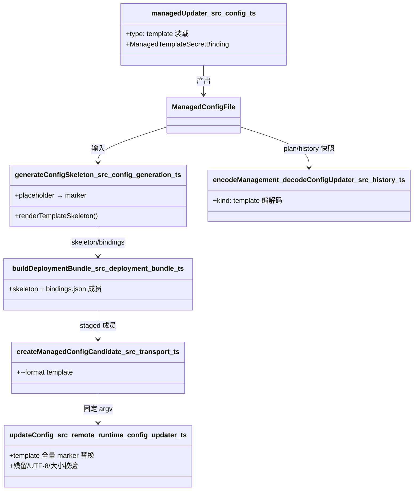
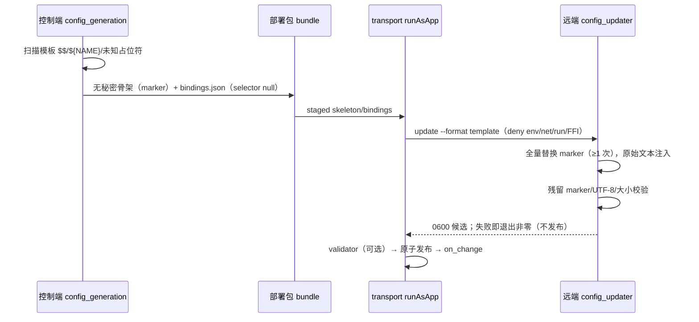

# 设计：management.configs 内置 template 占位符更新器

Risk profile: ./risk-profile.yaml

## Design Scope

本设计覆盖 sfo-deploy 模块的 managed 配置链路，为 app.yaml schema v3 `management.configs[].updater`
新增 `type: template`（App 自定义文本格式 + `${NAME}` 秘密占位符替换）：

- 装载层：`src/config.ts` 的 `managedUpdater` 接受 `type: template`，绑定声明映射秘密 → 占位符名。
- 控制端骨架：`src/config_generation.ts` 为 template 生成无秘密骨架，把 `${NAME}`
  占位符转换为内部确定性 marker，`$$` 转义在生成期收敛为字面 `$`。
- 持久快照：`src/history.ts` 的 plan/history 编解码支持 `kind: "template"` 绑定（无 selector）。
- 远端执行：`src/remote_runtime/config_updater.ts` 及其 bundle 接受 `--format template`，按 marker
  全量替换真实秘密文本，保留失败关闭校验。
- 文档与测试：集群配置指南、README、unit/integration/contract 测试。

## Useful Context

- 既有链路（本设计只插一个格式分支，不改链路）：装载（`managedUpdater`，src/config.ts:963）→
  骨架（`generateConfigSkeleton`，src/config_generation.ts:54）→
  部署包成员（src/deployment_bundle.ts:233 骨架 + `.bindings.json`，`updater` 字段取
  `skeleton.updaterKind`）→ 执行（src/execution.ts:966 非 script 一律走
  `createBuiltinCandidate`，`format` 直传 `config.updater.kind`）→ 远端
  bundle（src/remote_runtime/config_updater.ts:47 `updateConfig`）→ 校验/发布（transport
  `#assertCandidate` + `publishManagedConfigs`）。
- 绑定清单 JSON 已对缺省字段输出
  `type: null`/`selector: null`（src/deployment_bundle.ts:249-255）；远端 `parseManifest` 目前拒绝
  `selector === null`，template 分支需显式放行固定值。
- `history.ts` 编码（:1238）与解码（:1454）按 `kind === "script"` 二分；template 若落入 structured
  分支会在 `binding.selector.kind` 处崩溃，必须先行分流。
- 已确认裁定：挂载点为 management.configs 内置 updater；占位符语法仅 `${NAME}` +
  `$$`；首版仅值秘密（kind: value、utf8、type: string）。

## Overall Approach

- template 是 `ManagedConfigUpdater` 联合的新成员 `ManagedTemplateConfigUpdater`，与
  structured/script 并列；绑定
  `ManagedTemplateSecretBinding { secret, placeholder }`，`secret_kind/encoding/value_type` 固定为
  value/utf8/string，不进入 YAML 声明。
- 装载期：`placeholder` 缺省等于 `secret` 名；两者都须匹配 `[A-Z][A-Z0-9_]*`；重复 placeholder
  拒绝；秘密须已在 App 顶层 `secret_values` 声明；template 与非空 `variables` 互斥。
- 生成期：扫描源文本，`$$` → `$`、`${NAME}` → 对应 marker、其余 `$` 保持字面（不支持裸 `$NAME`
  替换）；`${` 后不匹配 NAME 语法的占位符直接报错；每个声明占位符至少出现一次；任何 `__SFO_`
  保留前缀拒绝。
- 远端：template 分支对 marker 做全量替换（≥1 次，不做结构化标量转义、不重解析），保留残留
  marker、UTF-8、大小上限校验与原子发布。
- 既有四种结构化格式与 script updater 的装载、骨架、远端行为逐字段不变。

## Layered Design Document Index

| level | parent_document    | unit                        | design_document | responsibility                                                     |
| ----- | ------------------ | --------------------------- | --------------- | ------------------------------------------------------------------ |
| task  | 无（任务级设计根） | sfo-deploy managed 配置链路 | design.md       | template updater 的装载、骨架生成、快照编解码、远端替换与文档/测试 |

## Module Relationship UML



依赖单向：装载 → 骨架 → bundle → transport → 远端；history 独立消费装载产物，无环。

## File-Level Interfaces

```typescript
// src/types.ts（新增/扩展；消费者：config.ts、config_generation.ts、history.ts、execution.ts、remote_deployment.ts）
export type ManagedConfigFormat = "yaml" | "json" | "toml" | "ini";
export type ManagedConfigUpdaterFormat = ManagedConfigFormat | "template";

/** template updater 的秘密绑定：值/文件内容永不进入声明。 */
export interface ManagedTemplateSecretBinding {
  readonly secret: string;
  readonly placeholder: string; // 缺省等于 secret；[A-Z][A-Z0-9_]*
}

export interface ManagedTemplateConfigUpdater {
  readonly kind: "template";
  readonly bindings: readonly ManagedTemplateSecretBinding[];
}

export type ManagedConfigUpdater =
  | StructuredConfigUpdater
  | ManagedTemplateConfigUpdater
  | ScriptConfigUpdater;

// src/remote_deployment.ts（BuiltinConfigCandidateRequest.format 收宽为 ManagedConfigUpdaterFormat）
```

接口消费者与兼容决策：

- Consumer: `managedUpdater`（src/config.ts:963）——新增 template 分支与错误文案更新。Compatibility:
  backward-compatible（加法）。
- Consumer: `generateConfigSkeleton`（src/config_generation.ts:54）——新增 template
  骨架路径；既有路径不变。Compatibility: backward-compatible。
- Consumer: `encodeManagement`/`decodeConfigUpdater`（src/history.ts:1238/:1454）——template
  编解码分支。Compatibility: backward-compatible（新二进制读旧快照不变；旧二进制不能解码含 template
  的新快照，随文档说明）。
- Consumer: `createBuiltinCandidate` 调用点（src/execution.ts:982）与
  `BuiltinConfigCandidateRequest.format`（src/remote_deployment.ts:57）。Compatibility:
  backward-compatible。
- Consumer:
  `updateConfig`/`parseManifest`/`parseArgs`（src/remote_runtime/config_updater.ts）。Compatibility:
  backward-compatible（新增 format 分支）。
- Compatibility: backward-compatible
- 兼容说明：联合类型与 format 分支均为加法扩展；无删除、无重命名；唯一边界是旧二进制不能解码含
  template 绑定的新 plan/history 快照，回滚前需先回滚集群配置，随文档说明。

## Key Flows



失败语义：任一步失败即失败关闭，秘密只存在于受限目录副本且用后清理；候选不落 target。

## State and Ownership

- Owner: plan/history 快照（src/history.ts）——唯一持久化 template
  绑定的存储；编解码为加法扩展，旧快照不受影响。
- State: 部署包成员与远端候选均为临时工作区状态，沿用既有清理路径；无新增持久数据。

## Directly Mapped Change Items

| change_id                       | target_module | proposal_id | design_coverage                                                                                                                                                                                                                                                                                                                                                                                                                                      | scope_paths                                                                                                                                                                                                                                                                                              |
| ------------------------------- | ------------- | ----------- | ---------------------------------------------------------------------------------------------------------------------------------------------------------------------------------------------------------------------------------------------------------------------------------------------------------------------------------------------------------------------------------------------------------------------------------------------------- | -------------------------------------------------------------------------------------------------------------------------------------------------------------------------------------------------------------------------------------------------------------------------------------------------------- |
| CHG-template-updater-control    | sfo-deploy    | P-001       | 类型新增 `ManagedTemplateConfigUpdater`/`ManagedTemplateSecretBinding` 与 `ManagedConfigUpdaterFormat`；`managedUpdater` template 分支（placeholder 缺省/校验/互斥 variables）与错误文案；`generateConfigSkeleton` template 骨架（占位符扫描、marker 映射、出现次数校验）；history 编解码 template 分支；`BuiltinConfigCandidateRequest.format` 收宽；CLI 计划序列化与 planning 最小秘密集合对 template 绑定归一（`kind: value`）；mod.ts 导出新类型 | src/types.ts, src/mod.ts, src/config.ts, src/config_generation.ts, src/history.ts, src/remote_deployment.ts, src/execution.ts, src/deployment_bundle.ts, src/cli.ts, src/planning.ts, tests/unit/app_management_config.test.ts, tests/unit/managed_config_generation.test.ts, tests/unit/history.test.ts |
| CHG-template-updater-remote     | sfo-deploy    | P-002       | 远端 `config_updater.ts` 接受 `--format template`：绑定校验分支（value/utf8/string/selector null）、marker 全量替换、跳过结构化重解析、保留残留/UTF-8/大小校验；重编译 bundle                                                                                                                                                                                                                                                                        | src/remote_runtime/config_updater.ts, src/remote_runtime/config_updater.bundle.js, tests/integration/config_updater.test.ts                                                                                                                                                                              |
| CHG-template-updater-docs-tests | sfo-deploy    | P-003       | 集群配置指南与 README 新增 template updater 声明/语法/失败关闭语义；contract 校验文档与 bundle 形态；测试夹具覆盖端到端                                                                                                                                                                                                                                                                                                                              | README.md, docs/guides/sfo-deploy-cluster-configuration.md, tests/contract/verify_app_management_contract.ts, tests/                                                                                                                                                                                     |

## Implementation Order

| phase          | goal                                                                | depends_on | output                     |
| -------------- | ------------------------------------------------------------------- | ---------- | -------------------------- |
| I-1 类型与装载 | types.ts 新类型、config.ts template 装载分支与互斥校验              | 无         | 装载面支持 type: template  |
| I-2 骨架生成   | config_generation.ts template 扫描/替换/校验                        | I-1        | 无秘密 template 骨架与绑定 |
| I-3 快照编解码 | history.ts encode/decode template 分支                              | I-1        | plan/history 支持 template |
| I-4 执行面收宽 | remote_deployment.ts format 类型、execution.ts 直传                 | I-1        | 执行链类型闭合             |
| I-5 远端替换   | config_updater.ts template 分支 + `deno task bundle:remote-runtime` | I-2        | 远端支持 --format template |
| I-6 测试与文档 | unit/integration/contract 用例、指南与 README                       | I-5        | 证据与契约文档一致         |
| I-7 全量回归   | `deno task check` + 既有四种格式/script 回归全绿                    | I-6        | 可交付状态                 |

## File-Level Implementation Sequence

| sequence | file_level_module                                | action   | depends_on | change_id                       | scope_path                                       | implementation_task                    |
| -------- | ------------------------------------------------ | -------- | ---------- | ------------------------------- | ------------------------------------------------ | -------------------------------------- |
| 1        | src/types.ts                                     | 修改     | -          | CHG-template-updater-control    | src/types.ts                                     | 新增 template 类型                     |
| 2        | src/config.ts                                    | 修改     | 1          | CHG-template-updater-control    | src/config.ts                                    | 装载分支                               |
| 3        | src/config_generation.ts                         | 修改     | 2          | CHG-template-updater-control    | src/config_generation.ts                         | 骨架生成                               |
| 4        | src/history.ts                                   | 修改     | 1          | CHG-template-updater-control    | src/history.ts                                   | 快照编解码                             |
| 5        | src/remote_deployment.ts                         | 修改     | 1          | CHG-template-updater-control    | src/remote_deployment.ts                         | format 类型收宽                        |
| 6        | src/execution.ts                                 | 修改     | 5          | CHG-template-updater-control    | src/execution.ts                                 | format 直传闭合                        |
| 7        | src/deployment_bundle.ts                         | 检查     | 3          | CHG-template-updater-control    | src/deployment_bundle.ts                         | 确认绑定 JSON 对 template 输出固定字段 |
| 8        | src/remote_runtime/config_updater.ts             | 修改     | 6          | CHG-template-updater-remote     | src/remote_runtime/config_updater.ts             | template 替换分支                      |
| 9        | src/remote_runtime/config_updater.bundle.js      | 重新生成 | 8          | CHG-template-updater-remote     | src/remote_runtime/config_updater.bundle.js      | deno task bundle:remote-runtime        |
| 10       | tests/unit/app_management_config.test.ts         | 修改     | 2          | CHG-template-updater-control    | tests/unit/app_management_config.test.ts         | 装载用例                               |
| 11       | tests/unit/managed_config_generation.test.ts     | 修改     | 3          | CHG-template-updater-control    | tests/unit/managed_config_generation.test.ts     | 骨架用例                               |
| 12       | tests/unit/history.test.ts                       | 修改     | 4          | CHG-template-updater-control    | tests/unit/history.test.ts                       | 快照往返用例                           |
| 13       | tests/integration/config_updater.test.ts         | 修改     | 9          | CHG-template-updater-remote     | tests/integration/config_updater.test.ts         | 远端替换用例                           |
| 14       | tests/contract/verify_app_management_contract.ts | 修改     | 9          | CHG-template-updater-docs-tests | tests/contract/verify_app_management_contract.ts | 文档/形态契约                          |
| 15       | docs/guides/sfo-deploy-cluster-configuration.md  | 修改     | 9          | CHG-template-updater-docs-tests | docs/guides/sfo-deploy-cluster-configuration.md  | 指南更新                               |
| 16       | README.md                                        | 修改     | 15         | CHG-template-updater-docs-tests | README.md                                        | 文档收敛                               |
| 17       | src/cli.ts                                       | 修改     | 1          | CHG-template-updater-control    | src/cli.ts                                       | 计划序列化 template 绑定分支           |
| 18       | src/planning.ts                                  | 修改     | 1          | CHG-template-updater-control    | src/planning.ts                                  | 最小秘密集合 template 绑定归一         |
| 19       | src/mod.ts                                       | 修改     | 1          | CHG-template-updater-control    | src/mod.ts                                       | 导出 template 类型                     |

依赖单向、无环；类型先行，装载/生成/快照并行于类型之后，远端依赖骨架语义，文档与契约最后。

## API and Build Surface Impact

- Public API impact: backward-compatible
- Crate-root export change: no
- Build-surface change: yes
- Documentation examples affected: yes
- 说明：`src/mod.ts` 导出形状不变，仅联合类型加法扩展（新成员与 `ManagedConfigUpdaterFormat`
  别名）。Build-surface 变化为提交产物 `src/remote_runtime/config_updater.bundle.js`
  重新生成（`deno task bundle:remote-runtime`，无新依赖、deno.lock 不变）。指南与 README 新增
  template 示例。

## Consumer Migration Closure

| old_symbol                                                  | new_path                                                       | change_id                       | consumer_path                                   | consumer_kind  | migration_status |
| ----------------------------------------------------------- | -------------------------------------------------------------- | ------------------------------- | ----------------------------------------------- | -------------- | ---------------- |
| 旧远端 bundle（format 仅 yaml/json/toml/ini）               | `deno task bundle:remote-runtime` 重新生成，新增 template 分支 | CHG-template-updater-remote     | src/remote_runtime/config_updater.bundle.js     | 提交构建产物   | migrated         |
| 远端 `parseArgs`/`parseManifest` 仅接受四种 format          | 新增 template 校验与替换分支                                   | CHG-template-updater-remote     | src/remote_runtime/config_updater.ts            | 远端运行时     | migrated         |
| plan/history 快照 updater 编解码二分（script/structured）   | 新增 kind: template 编解码分支                                 | CHG-template-updater-control    | src/history.ts                                  | 持久快照编解码 | migrated         |
| `BuiltinConfigCandidateRequest.format: ManagedConfigFormat` | 收宽为 `ManagedConfigUpdaterFormat`                            | CHG-template-updater-control    | src/remote_deployment.ts                        | 会话请求类型   | migrated         |
| 指南/README updater 章节仅列四种格式与 script               | 新增 template 声明、语法与失败关闭语义                         | CHG-template-updater-docs-tests | docs/guides/sfo-deploy-cluster-configuration.md | 文档           | migrated         |
| 同上                                                        | 同上                                                           | CHG-template-updater-docs-tests | README.md                                       | 文档           | migrated         |

## Design Notes

- 占位符语法（已确认裁定）：`$$` → 字面 `$`；`${NAME}`（`[A-Z][A-Z0-9_]*`）→ 占位符；`${`
  后不匹配语法的内容报错；其余 `$` 保持字面。不支持裸 `$NAME` 替换，故裸大写变量不会被误判也未替换。
- 秘密 marker 全量替换（≥1
  次），与结构化格式的「完整值恰好一次」不同：文本格式无完整值概念，多次出现是合法需求；声明占位符一次都未出现仍报错（声明/使用不匹配）。
- template 绑定固定 value/utf8/string：文件秘密（任意字节）与 base64
  首版不支持（提案裁定）；`variables` 与 template 互斥，普通参数替换继续走既有 marker 机制。
- 绑定清单 JSON 复用既有键集（type/selector 输出固定值或 null），远端 template
  分支显式校验固定值，清单 schema_version 不变。
- 不为 template 引入新的 CLI、plan 步骤或 systemd 行为；on_change/validator/原子发布沿用。

## Risks and Rollback

- 安全：原始文本注入不受语法约束，秘密值进入错误位置只能由 App 的 validator
  兜底；通过失败关闭校验、秘密不进 argv/env/stdout、副本用后清理缓解。
- 协议：远端 bundle 变更需回归既有四种格式与 script updater；以全量测试与 contract 检查兜底。
- 快照兼容：旧二进制无法解码含 template 绑定的 plan/history
  快照；回滚二进制前先回滚集群配置（文档说明），新二进制读旧快照不受影响。
- 回滚：变更可整体 revert；bundle 重新生成即恢复；无数据迁移。
