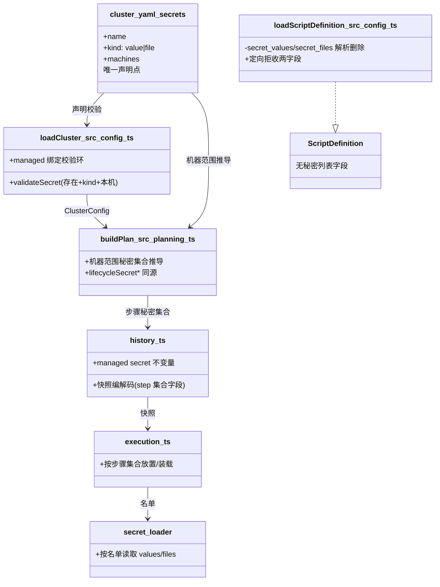
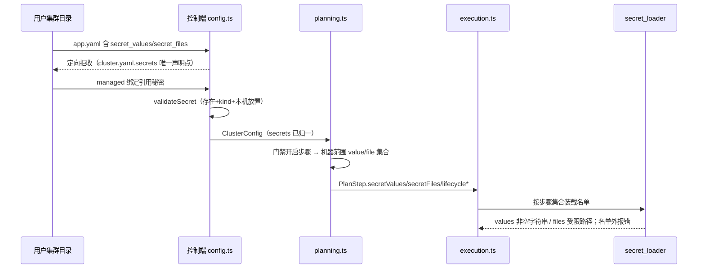

# 设计：删除 App 顶层秘密声明，绑定直接引用 cluster.yaml 秘密

Risk profile: ./risk-profile.yaml

## Design Scope

- 依据已批准提案 049-drop-app-secret-declaration（P-001/P-002/P-003），删除 app.yaml 与环境定义顶层
  `secret_values`/`secret_files` 声明契约，`cluster.yaml.secrets` 成为秘密唯一声明点。
- 已确认裁定：问题 1 采用方案 A（App/环境步骤按机器范围交付秘密，脚本 loader 零声明全量可见）；问题
  2 环境定义同型列表一并移除；问题 3 schema v3 内收窄（两个字段拒收 + 定向迁移错误文案）。
- 不改 cluster.yaml.secrets 语义、远端协议、plan schema 形状与 048 template updater 行为。

## Useful Context

- 现状三处重复：cluster.yaml 声明（name/kind/machines）→ app.yaml
  顶层声明（`secret_values`/`secret_files`）→ managed
  绑定引用；`declaredManagedSecret`（src/config.ts:839-851）强制绑定 ∈ 顶层列表。
- `loadScriptDefinition`（src/config.ts:788-795）被 App
  与环境定义共享，顶层列表解析与两列表互斥检查在同处；`loadCluster` 的
  `validateSecret`（1619-1634）已做「存在 + kind + 本机放置」校验，绑定消费环在 1698-1711。
- planning.ts:382-403 的步骤秘密集合当前 = 顶层列表 ∪
  绑定归一集合（`managedSecrets`，planning.ts:114-135）；下游
  execution.ts:652/1199-1200、cli.ts:787-788、history.ts:1170-1171 只消费 step 级字段。
- `machines: "*"`
  在装载期归一为全部已知机器名（src/config.ts:379-391），`declaration.machines.includes(machineName)`
  可统一判定机器范围。

## Overall Approach

- 装载面：`loadScriptDefinition` 停止解析顶层秘密列表并从 `ScriptDefinition` 移除两字段；App
  与环境定义装载在 `fields()` 之前对这两个键给出定向拒收错误（指明「秘密由 cluster.yaml.secrets
  唯一声明，绑定与脚本直接引用本机已声明秘密」）；删除 `declaredManagedSecret`
  及其三处调用；`loadCluster` 删除针对 `definition.scripts`/`app.scripts` 顶层列表的校验环，保留
  managed 绑定对 cluster 的 `validateSecret` 环。
- 交付面（方案 A）：planning 步骤秘密集合在既有门禁（脚本暴露或 managed
  配置步骤）内改为机器范围推导——`cluster.secrets` 中 `machines` 包含步骤机器的全部 value/file
  秘密；`lifecycleSecret*` 同为机器范围集合；删除不再被消费的 `managedSecrets`。
- 一致性：`machines: "*"`
  已在装载期展开，推导无需特殊分支；绑定引用秘密必然已放置本机（validateSecret
  保证），机器范围集合恒覆盖绑定集合，history 不变量自然成立。

## Layered Design Document Index

| level | parent_document    | unit                          | design_document | responsibility                                                   |
| ----- | ------------------ | ----------------------------- | --------------- | ---------------------------------------------------------------- |
| task  | 无（任务级设计根） | sfo-deploy 秘密声明与交付链路 | design.md       | 顶层声明删除、绑定直连 cluster 校验、机器范围交付推导与文档/测试 |

## Module Relationship UML



## File-Level Interfaces

```typescript
// src/types.ts（收窄；消费者：config.ts、planning.ts）
export interface ScriptDefinition {
  readonly actions: ReadonlyMap<string, readonly ScriptInvocation[]>;
  readonly templates: readonly ConfigTemplate[];
  // 删除：readonly secretValues / readonly secretFiles
}

// src/planning.ts（新增；消费者：buildPlan 步骤构造）
function machineScopedSecrets(
  cluster: ClusterConfig,
  machineName: string,
): { readonly values: readonly string[]; readonly files: readonly string[] };
// cluster.secrets 中 declaration.machines.includes(machineName) 的秘密，
// 按 kind 分集并按名称排序；machines: "*" 已在装载期归一为显式列表。

// src/config.ts（定向拒收；App 与环境定义装载在 fields() 之前）
// data.secret_values !== undefined || data.secret_files !== undefined
//   → ConfigurationError("...secret_values/secret_files 已移除：秘密由 cluster.yaml.secrets
//      唯一声明，managed 绑定与脚本直接引用本机已声明秘密")
```

接口消费者与兼容决策：

- Consumer: `buildPlan` 步骤构造（src/planning.ts:382-403）——推导来源替换为机器范围。Compatibility:
  breaking（集合内容变化；字段形状不变，plan schema 不变版本）。
- Consumer: `loadScriptDefinition`（src/config.ts:788）与 App/环境定义 fields
  白名单（src/config.ts:1318/1481）——删除两字段并定向拒收。Compatibility:
  breaking（含顶层声明的既有文件装载失败，定向文案指引迁移）。
- Consumer: `declaredManagedSecret`
  调用点（managedSecretBinding/managedTemplateBindings/managedScriptSecrets）——删除调用，唯一校验点收敛为
  `loadCluster.validateSecret`。Compatibility: breaking（App 级 allowlist 语义移除）。
- Consumer: `validatePersistedManagementStep`（src/history.ts:2005）/
  `serializePlanStep`（src/cli.ts:787）/ `encodePlanStep`（src/history.ts:1170）——仅消费 step
  级字段，形状不变。Compatibility: backward-compatible（预期零改动）。
- Compatibility: breaking
- 兼容说明：plan/history/远端协议形状零变化；破坏面集中在配置文件合法字段集与步骤秘密集合推导来源（方案
  A 已确认）；无自动迁移。

## Key Flows



失败语义：装载期绑定引用失败关闭（未知秘密/kind
冲突/未放置本机）；运行期名单外读取报「不存在」；秘密值不进日志与错误信息。

## State and Ownership

- Owner: 秘密声明与交付推导的状态属主——cluster.yaml.secrets
  是唯一声明存储（name/kind/machines），planning.ts 按机器范围推导步骤集合，history.ts
  仅持久化结果集合（形状不变）。
- State: 无新增持久化状态；顶层声明从装载模型删除，无兼容读取、无自动迁移。

## Directly Mapped Change Items

| change_id                    | target_module | proposal_id | design_coverage                                                                                                                                                                                       | scope_paths                                                                                                                                                                                                                                                                                                                                                                 |
| ---------------------------- | ------------- | ----------- | ----------------------------------------------------------------------------------------------------------------------------------------------------------------------------------------------------- | --------------------------------------------------------------------------------------------------------------------------------------------------------------------------------------------------------------------------------------------------------------------------------------------------------------------------------------------------------------------------- |
| CHG-cluster-secret-bindings  | sfo-deploy    | P-001       | `ScriptDefinition` 收窄；`loadScriptDefinition` 停止解析顶层列表；App/环境定义定向拒收两字段；删除 `declaredManagedSecret` 与三处调用；`loadCluster` 删除脚本列表校验环、保留绑定 `validateSecret` 环 | src/types.ts, src/config.ts                                                                                                                                                                                                                                                                                                                                                 |
| CHG-secret-delivery-planning | sfo-deploy    | P-002       | 方案 A 机器范围推导替换顶层列表∪绑定归一；删除 `managedSecrets`；`lifecycleSecret*` 同源；cli/history/mod 消费面确认闭合                                                                              | src/planning.ts, src/cli.ts, src/history.ts, src/mod.ts                                                                                                                                                                                                                                                                                                                     |
| CHG-secret-docs-tests        | sfo-deploy    | P-003       | 夹具与用例删除顶层声明并新增直连 cluster 正负例与机器范围集合断言；README 与集群配置指南收敛为唯一声明点模型；contract 断言更新                                                                       | README.md, docs/guides/sfo-deploy-cluster-configuration.md, tests/_support/fixtures.ts, tests/unit/app_management_config.test.ts, tests/unit/config_planning.test.ts, tests/unit/cli_human_output.test.ts, tests/unit/environment_placement.test.ts, tests/unit/history.test.ts, tests/unit/secrets_deploy_config.test.ts, tests/contract/verify_app_management_contract.ts |

## Implementation Order

| phase          | goal                                              | depends_on | output                       |
| -------------- | ------------------------------------------------- | ---------- | ---------------------------- |
| I-1 类型收窄   | types.ts `ScriptDefinition` 删除两字段            | 无         | 公开类型闭合目标形态         |
| I-2 装载面删除 | config.ts 解析/门禁/校验环删除 + 定向拒收文案     | I-1        | 绑定直连 cluster 装载语义    |
| I-3 交付面推导 | planning.ts 机器范围推导与 lifecycle 同源         | I-2        | 方案 A 步骤秘密集合          |
| I-4 消费面确认 | cli/history/mod 类型与行为闭合检查                | I-3        | 计划/快照/CLI 零形状变化确认 |
| I-5 测试与文档 | 夹具、unit/contract 用例、指南与 README、全量回归 | I-4        | 全绿证据与契约文档一致       |

## File-Level Implementation Sequence

| sequence | file_level_module                                | action | depends_on | change_id                    | scope_path                                       | implementation_task                                        |
| -------- | ------------------------------------------------ | ------ | ---------- | ---------------------------- | ------------------------------------------------ | ---------------------------------------------------------- |
| 1        | src/types.ts                                     | 修改   | -          | CHG-cluster-secret-bindings  | src/types.ts                                     | ScriptDefinition 删除 secretValues/secretFiles             |
| 2        | src/config.ts                                    | 修改   | 1          | CHG-cluster-secret-bindings  | src/config.ts                                    | 解析删除、定向拒收、declaredManagedSecret 删除、校验环调整 |
| 3        | src/planning.ts                                  | 修改   | 2          | CHG-secret-delivery-planning | src/planning.ts                                  | 机器范围推导 + managedSecrets 删除                         |
| 4        | src/cli.ts                                       | 检查   | 3          | CHG-secret-delivery-planning | src/cli.ts                                       | 确认计划序列化仅消费 step 字段                             |
| 5        | src/history.ts                                   | 检查   | 3          | CHG-secret-delivery-planning | src/history.ts                                   | 确认快照编解码与不变量成立                                 |
| 6        | src/mod.ts                                       | 检查   | 1          | CHG-secret-delivery-planning | src/mod.ts                                       | 确认导出类型闭合                                           |
| 7        | tests/_support/fixtures.ts                       | 修改   | 2          | CHG-secret-docs-tests        | tests/_support/fixtures.ts                       | 夹具与新语义支撑                                           |
| 8        | tests/unit/app_management_config.test.ts         | 修改   | 2          | CHG-secret-docs-tests        | tests/unit/app_management_config.test.ts         | 装载正负例与定向拒收文案                                   |
| 9        | tests/unit/secrets_deploy_config.test.ts         | 修改   | 3          | CHG-secret-docs-tests        | tests/unit/secrets_deploy_config.test.ts         | 顶层声明拒收 + 机器范围集合断言                            |
| 10       | tests/unit/config_planning.test.ts               | 修改   | 3          | CHG-secret-docs-tests        | tests/unit/config_planning.test.ts               | 集合推导断言更新                                           |
| 11       | tests/unit/environment_placement.test.ts         | 修改   | 3          | CHG-secret-docs-tests        | tests/unit/environment_placement.test.ts         | 环境步骤集合断言更新                                       |
| 12       | tests/unit/cli_human_output.test.ts              | 修改   | 4          | CHG-secret-docs-tests        | tests/unit/cli_human_output.test.ts              | 序列化回归                                                 |
| 13       | tests/unit/history.test.ts                       | 修改   | 5          | CHG-secret-docs-tests        | tests/unit/history.test.ts                       | 快照往返回归                                               |
| 14       | tests/contract/verify_app_management_contract.ts | 修改   | 8          | CHG-secret-docs-tests        | tests/contract/verify_app_management_contract.ts | 契约断言更新                                               |
| 15       | docs/guides/sfo-deploy-cluster-configuration.md  | 修改   | 14         | CHG-secret-docs-tests        | docs/guides/sfo-deploy-cluster-configuration.md  | 指南收敛新模型                                             |
| 16       | README.md                                        | 修改   | 15         | CHG-secret-docs-tests        | README.md                                        | README 收敛                                                |

## Design Notes

- 定向拒收错误在 `fields()`
  之前判定，避免「包含未知字段」泛化文案；两个键命中即报「secret_values/secret_files 已移除：秘密由
  cluster.yaml.secrets 唯一声明，managed 绑定与脚本直接引用本机已声明秘密」。
- 机器范围推导排序：value/file 各自按秘密名排序，保持计划确定性（同输入同计划）。
- 门禁沿用
  `exposesScriptSecrets || managedConfiguring`：纯安装步骤（无脚本、无配置）不交付秘密，与现状一致。
- `machines: "*"` 已归一为显式机器名列表，推导用 `includes(machineName)` 统一判定，不新增通配语义。
- 方案 A 的安全模型表述：机器是秘密可见性的隔离边界，同机多 App
  共享本机秘密；指南需明确写出该取舍（用户已知情确认）。

## API and Build Surface Impact

- Public API impact: breaking
- Crate-root export change: no
- Build-surface change: no
- Documentation examples affected: yes
- 说明：`ScriptDefinition` 公开类型删除 `secretValues`/`secretFiles`
  两字段（breaking，已确认契约收窄）；`PlanStep`/`AppManagementDefinition` 与 `mod.ts`
  导出面形状不变。无依赖、bundle、deno.lock 变化；无 plan schema version 变化。指南与 README
  示例收敛为新模型。

## Consumer Migration Closure

| old_symbol                                       | new_path                                              | change_id                    | consumer_path                                   | consumer_kind | migration_status |
| ------------------------------------------------ | ----------------------------------------------------- | ---------------------------- | ----------------------------------------------- | ------------- | ---------------- |
| app.yaml/环境定义顶层 secret_values/secret_files | 删除；绑定直连 cluster.yaml.secrets、脚本机器范围可见 | CHG-cluster-secret-bindings  | README.md                                       | 契约文档      | migrated         |
| app.yaml/环境定义顶层 secret_values/secret_files | 删除；绑定直连 cluster.yaml.secrets、脚本机器范围可见 | CHG-secret-docs-tests        | docs/guides/sfo-deploy-cluster-configuration.md | 契约文档      | migrated         |
| app.yaml/环境定义顶层 secret_values/secret_files | 删除；绑定直连 cluster.yaml.secrets、脚本机器范围可见 | CHG-secret-docs-tests        | tests/_support/fixtures.ts                      | 测试夹具      | migrated         |
| `declaredManagedSecret` App 级 allowlist         | 删除；`loadCluster.validateSecret` 唯一校验点         | CHG-cluster-secret-bindings  | src/config.ts                                   | 装载校验      | migrated         |
| planning 顶层列表∪绑定归一集合                   | 机器范围推导（方案 A）                                | CHG-secret-delivery-planning | src/planning.ts                                 | 计划推导      | migrated         |

## Risks and Rollback

- 契约破坏：既有含顶层声明的 v3
  集群装载失败（定向文案指引手工迁移）；无自动迁移、无降级读取（已确认）。
- 交付面扩大：方案 A 使脚本步骤可见本机全部秘密（同机共享），以 cluster.yaml machines
  放置为隔离旋钮；文档明确安全模型。
- 回滚：单任务内代码回退即可恢复旧模型（无持久化格式变化；快照仅记录集合，新旧计划互不兼容由部署时重新计划生成）。
- 风险档案 required_checks 映射：contract→I-2/I-5 装载正负例与文档契约；data→I-4
  快照与不变量；security→I-2 失败关闭与 I-4 loader 回归；runtime→I-3/I-4 交付路径回归；harness→I-5
  统一入口与覆盖映射。
