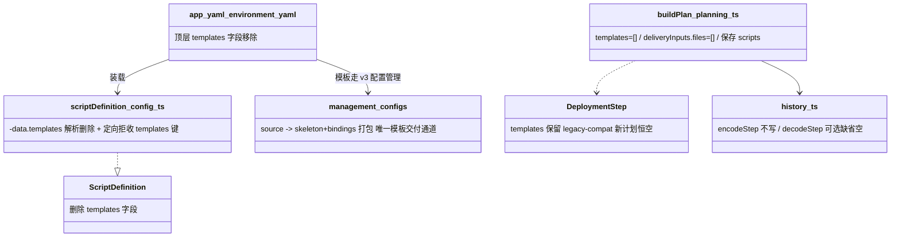
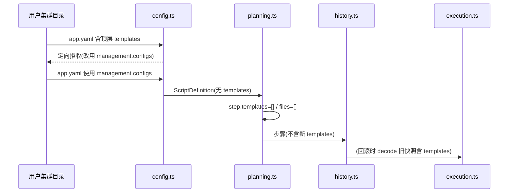

# 设计：删除 app.yaml / environment.yaml 顶层 templates 字段

Risk profile: ./risk-profile.yaml

## Design Scope

- 依据已批准提案 050-drop-app-templates-field（P-001/P-002/P-003），删除
  app.yaml（`APP_V2_FIELDS`）与 environment.yaml 顶层 `templates`
  字段声明契约；`management.configs`（v3 内置配置管理）成为模板文件交付的唯一通道。
- 已确认裁定：问题 1 方案 A——`decodeStep` 对 step `templates`
  保留读取且改为可选（缺省空数组），plan-v1/2/3 与旧 v4 快照仍可解码回滚；新计划 emit
  面不再写入。问题 2 tier=high-risk。
- 不改 `ConfigTemplate` 类型、`deliveryInputs`/management.configs 通道、远端 config_updater
  协议、plan schema 主版本。

## Useful Context

- 顶层 `templates` 由 `scripts()`（src/config.ts:767-815，App 与环境共用）读为
  `ScriptDefinition.templates`，把额外资源文件随脚本捆绑进部署包；同时出现在 App 的
  `APP_V2_FIELDS`（config.ts:1464）与环境允许字段（config.ts:1303）。
- v3 的 `management.configs[].source`（040/045/048）在装载期把模板渲染为 skeleton 内容并作为
  `configs/...` 成员打包进部署包（deployment_bundle.ts:233-268），本地 updater 渲染绑定——顶层
  `templates` 旁路在 v3 已无必要。
- 计划通过 `buildPlan` 写 `step.templates = scriptDefinition.templates`（planning.ts:385）与
  `deliveryInputs.files = scriptDefinition.templates`（planning.ts:365）；execution.ts:167-172/194/795-809
  暂存并上传 step.templates；history.ts encode 写（1177-1182）、decode 要求存在（1882）；cli.ts
  只序列化 `delivery_inputs.files`（795-796）。
- 关键区别：`deliveryInputs.files` 与 step.templates 的**唯一来源是顶层
  `templates`**；management.configs 走独立的 skeleton/bindings 打包路径，不依赖该字段。

## Overall Approach

- 装载面：`scripts()` 停止解析 `data.templates`；`ScriptDefinition` 删除 `templates`；从
  `APP_V2_FIELDS` 与环境允许字段移除 key；App/环境装载在 `fields()` 之前对命中该键定向拒收（指引改用
  management.configs）。
- 类型面：删除 `ScriptDefinition.templates`；`DeploymentStep.templates` **保留为 legacy-compat
  字段**——新计划恒空，仅用于解码/回滚旧快照与旧执行器 fallback 交付（方案 A 回滚兼容落点，属提案
  P-002 措辞的细化修正）。
- 发射面：`buildPlan` 新步骤
  `templates=freezeArray([])`、`deliveryInputs.files=freezeArray([])`（`deliveryInputs.scripts`
  保持，供 app deploy 重打包）；`encodeStep` 停止写 `templates`；`decodeStep` 可选缺省空。
- 执行面：execution.ts 的 templates 暂存/上传/fallback
  **零改动**——新步骤空数组无行为，解码出的旧步骤仍交付模板（回滚兼容）；cli.ts 零改动。

## Layered Design Document Index

| level | parent_document    | unit                    | design_document | responsibility                                           |
| ----- | ------------------ | ----------------------- | --------------- | -------------------------------------------------------- |
| task  | 无（任务级设计根） | 顶层 templates 字段删除 | design.md       | 装载/类型/发射/decode 收敛，execution 兼容确认，文档测试 |

## Module Relationship UML



## File-Level Interfaces

```typescript
// src/types.ts（删除；消费者：config.ts、planning.ts）
export interface ScriptDefinition {
  readonly actions: ReadonlyMap<string, readonly ScriptInvocation[]>;
  // 删除：readonly templates: readonly ConfigTemplate[];
}
// 保留（legacy-compat，新计划恒空；decode 旧快照填充）
// DeploymentStep.templates: readonly ConfigTemplate[];

// src/config.ts（定向拒收；App/环境装载在 fields() 之前）
// data.templates !== undefined
//   → ConfigurationError("...顶层 templates 已移除：模板文件交付请改用 management.configs")

// src/planning.ts（发射恒空）
// templates: freezeArray([]),
// deliveryInputs: { scripts: allAppScripts!, files: freezeArray([]) }

// src/history.ts（decode 兼容）
// const templates = value.templates === undefined ? [] : await Promise.all(...);
```

接口消费者与兼容决策：

- Consumer: `buildPlan`（src/planning.ts:365,385）——来源替换恒空数组。Compatibility:
  breaking（config 契约）/ backward（新快照）。
- Consumer: `scripts()`/`scriptDefinition`（config.ts:767-815）与 fields
  白名单（1303/1464）——删除解析并定向拒收。Compatibility: breaking（含顶层 templates
  的既有文件装载失败，定向文案指引迁移）。
- Consumer: `encodeStep`（history.ts:1177）/`decodeStep`（1882）——encode 不写、decode
  可选缺省空。Compatibility: backward-compatible。
- Consumer: `execution.ts`（167-172/194/795-809）——零改动。Compatibility: backward-compatible。
- Consumer: `cli.ts`——零改动。Compatibility: backward-compatible。
- Compatibility: breaking, backward-compatible
- 兼容说明：配置文件合法字段集收窄属 breaking；新计划快照 decode 可选为
  backward-compatible。管理配置打包走 skeleton/bindings，与顶层 `templates`
  无耦合；破坏面仅剩「含顶层 `templates` 的 v2/v3 配置装载失败（定向文案）」，与 047/049
  一致，无自动迁移。

## Key Flows



失败语义：装载期含顶层 `templates` 即定向拒绝关闭；decode
缺省空数组，含该字段的旧快照仍可解码回滚，不报错。

## State and Ownership

- Owner: 模板交付状态属主收敛为 `management.configs`（skeleton + bindings）。
- State: 无新增持久化状态；新发布快照不再带 step `templates` 键，旧快照保留该键且可读。

## Directly Mapped Change Items

| change_id                            | target_module | proposal_id | design_coverage                                                                                                                          | scope_paths                                                                                                                                                                                                                                                                                                            |
| ------------------------------------ | ------------- | ----------- | ---------------------------------------------------------------------------------------------------------------------------------------- | ---------------------------------------------------------------------------------------------------------------------------------------------------------------------------------------------------------------------------------------------------------------------------------------------------------------------- |
| CHG-templates-config-load            | sfo-deploy    | P-001       | `ScriptDefinition` 删除 templates；`scripts()` 停止解析；`APP_V2_FIELDS` 与环境允许字段移除 key；命中该键定向拒收                        | src/types.ts, src/config.ts                                                                                                                                                                                                                                                                                            |
| CHG-templates-planning-serialization | sfo-deploy    | P-002       | `buildPlan` templates/files 恒空；encodeStep 不写；decodeStep 可选缺省空；DeploymentStep.templates legacy-compat；execution/cli 兼容确认 | src/planning.ts, src/history.ts, src/execution.ts, src/cli.ts                                                                                                                                                                                                                                                          |
| CHG-templates-docs-tests             | sfo-deploy    | P-003       | 夹具/用例去 templates 声明与断言，新增顶层拒收与旧快照兼容断言；README 与指南收敛                                                        | README.md, docs/guides/sfo-deploy-cluster-configuration.md, tests/_support/fixtures.ts, tests/_support/environment_placement.ts, tests/unit/environment_placement.test.ts, tests/unit/app_management_config.test.ts, tests/dv/execution.test.ts, tests/dv/app_management_execution.test.ts, tests/unit/history.test.ts |

## Implementation Order

| phase              | goal                                                                               | depends_on | output                           |
| ------------------ | ---------------------------------------------------------------------------------- | ---------- | -------------------------------- |
| I-1 类型与装载删除 | types.ts 删 ScriptDefinition.templates；config.ts 停止解析 + 定向拒收 + 白名单移除 | 无         | 配置装载拒绝顶层 templates       |
| I-2 发射与 decode  | planning 恒空；history encode/decode 调整；DeploymentStep legacy-compat            | I-1        | 新快照无 templates、旧快照可解码 |
| I-3 消费面确认     | execution/cli 零改动确认                                                           | I-2        | 回滚路径与 CLI 闭合              |
| I-4 测试与文档     | 夹具、unit/dv 用例、指南、README、全量回归                                         | I-3        | 全绿证据与契约文档一致           |

## File-Level Implementation Sequence

| sequence | depends_on | scope_path                                      | file_level_module         | action | change_id                            | implementation_task             |
| -------- | ---------- | ----------------------------------------------- | ------------------------- | ------ | ------------------------------------ | ------------------------------- |
| 1        | -          | src/types.ts                                    | scriptDefinition 公开类型 | 改     | CHG-templates-config-load            | ScriptDefinition 删除 templates |
| 2        | 1          | src/config.ts                                   | 配置装载                  | 改     | CHG-templates-config-load            | 停止解析、定向拒收、白名单移除  |
| 3        | 2          | src/planning.ts                                 | 计划发射                  | 改     | CHG-templates-planning-serialization | templates/files 恒空            |
| 4        | 2          | src/history.ts                                  | 持久化                    | 改     | CHG-templates-planning-serialization | encode 不写 / decode 可选       |
| 5        | 3          | src/execution.ts                                | 执行器                    | 查     | CHG-templates-planning-serialization | 确认零改动兼容                  |
| 6        | 3          | src/cli.ts                                      | CLI 序列化                | 查     | CHG-templates-planning-serialization | 确认仅 delivery_inputs.files    |
| 7        | 2          | tests/_support/fixtures.ts                      | 测试夹具                  | 改     | CHG-templates-docs-tests             | 夹具去 templates                |
| 8        | 2          | tests/_support/environment_placement.ts         | 测试夹具                  | 改     | CHG-templates-docs-tests             | 环境夹具去 templates            |
| 9        | 8          | tests/unit/environment_placement.test.ts        | 单元测试                  | 改     | CHG-templates-docs-tests             | 去步骤 templates 断言           |
| 10       | 2          | tests/unit/app_management_config.test.ts        | 单元测试                  | 改     | CHG-templates-docs-tests             | 顶层字段拒收用例                |
| 11       | 4          | tests/unit/history.test.ts                      | 单元测试                  | 改     | CHG-templates-docs-tests             | 旧快照 decode 兼容断言          |
| 12       | 3          | tests/dv/execution.test.ts                      | dv 测试                   | 改     | CHG-templates-docs-tests             | step.templates 用例调整         |
| 13       | 3          | tests/dv/app_management_execution.test.ts       | dv 测试                   | 改     | CHG-templates-docs-tests             | 去 templates 断言               |
| 14       | 10         | docs/guides/sfo-deploy-cluster-configuration.md | 契约文档                  | 改     | CHG-templates-docs-tests             | 指南收敛                        |
| 15       | 14         | README.md                                       | 契约文档                  | 改     | CHG-templates-docs-tests             | README 收敛                     |

## Design Notes

- `DeploymentStep.templates` 保留为 legacy-compat（提案 P-002 措辞细化）：新计划恒 `[]`，decode
  旧快照填充，execution fallback（execution.ts:181-182）对无 `delivery_inputs` 的旧 schema 步骤仍按
  `original.templates` 交付；这是方案 A「旧快照回滚可执行」的必要条件，绝非重新允许 app.yaml
  顶层字段。
- 定向拒收错误在 `fields()` 之前判定，避免「包含未知字段」泛化文案；命中 `templates` 键即报「顶层
  templates 已移除：模板文件交付请改用 management.configs」。
- 新快照 encode 不写 `templates`、decode 缺省空数组，往返稳定；旧 plan-v1/2/3 与旧 v4 快照 fixture
  保留 `templates` 键验证兼容解读。
- `deliveryInputs.scripts`（app deploy 重打包）与 management.configs skeleton
  路径不受影响；`deliveryInputs.files` 恒空仅为形状稳定。

## API and Build Surface Impact

- Public API impact: breaking
- Crate-root export change: no
- Build-surface change: no
- Documentation examples affected: yes
- 说明：`ScriptDefinition` 公开类型删除
  `templates`（breaking，已确认收窄）；`DeploymentStep.templates`
  保留（legacy-compat）。无依赖/bundle/deno.lock/plan schema 版本变化。指南与 README 模板交付收敛到
  management.configs。

## Consumer Migration Closure

| old_symbol                                          | new_path                           | change_id                            | consumer_path   | consumer_kind | migration_status |
| --------------------------------------------------- | ---------------------------------- | ------------------------------------ | --------------- | ------------- | ---------------- |
| app.yaml / environment.yaml 顶层 templates 字段声明 | 删除；改用 management.configs 交付 | CHG-templates-config-load            | src/config.ts   | 配置装载      | migrated         |
| ScriptDefinition.templates                          | 删除                               | CHG-templates-config-load            | src/types.ts    | 公开类型      | migrated         |
| buildPlan 新步骤 templates 发射                     | 恒空（不再装载注入）               | CHG-templates-planning-serialization | src/planning.ts | 计划发射      | migrated         |
| encodeStep templates 写入                           | 不再写；decode 可选缺省空          | CHG-templates-planning-serialization | src/history.ts  | 持久化        | migrated         |
| decodeStep 旧快照 templates 兼容                    | 保留读取用于回滚                   | CHG-templates-planning-serialization | src/history.ts  | 回滚兼容      | migrated         |

## Risks and Rollback

- 契约破坏：既有含顶层 templates 的 v2/v3
  集群装载失败（定向文案指引手工迁移）；无自动迁移、无降级读取（已确认）。
- 回滚兼容：方案 A 依赖 decode 保留读取 + execution fallback；若被移除则旧快照回滚失败，I-2/I-3
  必须以 fixture 全绿验证。
- 交付旁路：必须确认 management.configs 的 skeleton/bindings
  打包路径与顶层字段零耦合；`deno task check`（contract repository-compile-closure）覆盖类型收窄。
- 风险档案映射：contract→I-1 装载拒收 + 文档契约；data→I-2/I-4 快照往返与兼容 fixture；runtime→I-3
  execution fallback；harness→I-4 统一入口与 testplan 覆盖。
