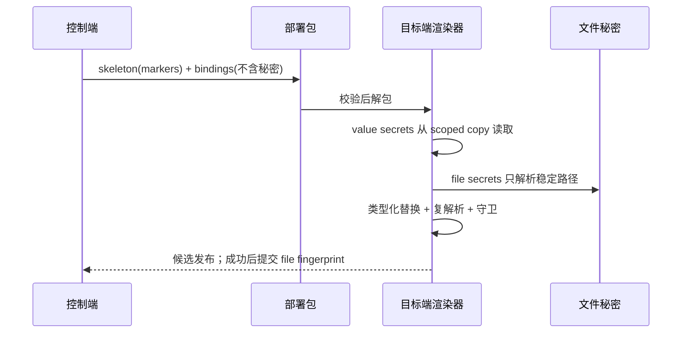
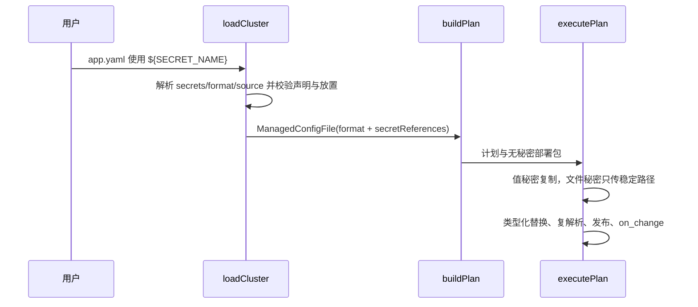

# 设计：App 配置秘密占位符化

Risk profile: ./risk-profile.yaml

## Design Scope

- 依据已批准提案 P-001/P-002/P-003/P-004，将 managed 结构化配置从 selector 式 `updater.bindings`
  收敛为源配置内 `${SECRET_NAME}` 占位符。
- `cluster.yaml.secrets` 是秘密类型和放置授权的唯一定义点；`kind: value` 的 `type` 可选并缺省
  `string`，`kind: file` 固定注入部署后的稳定路径。
- `management.configs[].updater` 从公开 schema 删除；新增必填
  `format: yaml|json|toml|ini`。内部仍保留无秘密的 marker/bindings
  清单作为远端渲染协议，但不暴露给用户配置。
- `updater.type: script/template` 不进入新契约；旧快照中含 updater 的 managed 配置 decode
  时定向拒收。

## Useful Context

- 当前 `ManagedConfigFile` 的 `updater` 同时承载格式和绑定，配置装载在 `src/config.ts`，骨架生成在
  `src/config_generation.ts`，远端替换在 `src/remote_runtime/config_updater.ts`。
- 当前秘密声明只含 `kind` 和 `machines`；结构化绑定的类型在
  `updater.bindings[].type`，文件秘密注入内容/base64。
- 当前计划 v4 将 management 配置和 updater 绑定持久化；回滚执行依赖该快照。

## Overall Approach

装载阶段先解析秘密声明，再装载 App。App 配置装载按 `format` 解析源文件并收集 `${NAME}`，生成内部
`secretReferences`；所有名字必须在集群秘密声明中存在。执行阶段再次解析源配置，先把普通参数替换为值，再把
`${NAME}` 替换为无秘密 marker；远端按 bindings
清单读取值秘密副本或计算文件路径，完成类型化替换、复解析、校验和原子发布。

文件秘密的变更判断使用目标配置旁边的框架指纹状态文件。发布事务先比较候选配置和文件秘密
hash；服务动作成功后通过现有 `commitManagedConfigs`
原子提交新指纹。失败时不提交指纹，下一次部署会重试服务收敛。

## Layered Design Document Index

| level | parent_document    | unit               | design_document | responsibility                         |
| ----- | ------------------ | ------------------ | --------------- | -------------------------------------- |
| task  | 无（任务级设计根） | 秘密占位符配置契约 | design.md       | 装载、渲染、远端执行、持久化和文档收敛 |

## Module Relationship UML

```mermaid
classDiagram
    class cluster_yaml_secrets { type 缺省 string / file 固定路径 }
    class app_yaml_management { format + ${SECRET_NAME}，updater 删除 }
    class config_ts { 装载/收集/校验 secretReferences }
    class config_generation_ts { 解析源配置 / 普通 variables / 秘密 marker }
    class remote_config_updater_ts { value 读取 / file 路径 / 类型化替换 / 复解析 }
    class execution_transport { scoped values + stable file paths / publish / fingerprint }
    class history_ts { 新计划 encode/decode；旧 updater 拒收 }
    cluster_yaml_secrets --> config_ts : SecretDeclaration
    app_yaml_management --> config_ts : ManagedConfigFile
    config_ts --> config_generation_ts : 结构化解析/占位符收集
    config_generation_ts --> remote_config_updater_ts : skeleton + bindings
    execution_transport --> remote_config_updater_ts : scoped secrets + secretRoot
    history_ts --> execution_transport : 回滚计划
```



## File-Level Interfaces

- Compatibility: breaking

```typescript
// src/types.ts
export type ManagedConfigValueType = "string" | "integer" | "number" | "boolean";

export interface SecretDeclaration {
  readonly name: string;
  readonly kind: SecretKind;
  readonly valueType: ManagedConfigValueType;
  readonly machines: readonly string[];
}

export interface ManagedSecretReference {
  readonly kind: SecretKind;
  readonly valueType: ManagedConfigValueType;
}

export interface ManagedConfigFile {
  readonly name: string;
  readonly relativePath: string;
  readonly source: string;
  readonly target: string;
  readonly owner?: string;
  readonly group?: string;
  readonly mode: number;
  readonly variables: readonly ManagedConfigVariableBinding[];
  readonly format: ManagedConfigFormat;
  readonly secretReferences: ReadonlyMap<string, ManagedSecretReference>;
  readonly validator?: ManagedConfigValidator;
  readonly onChange: ManagedConfigChangeAction;
  // 删除：readonly updater: ManagedConfigUpdater;
}
```

```typescript
// src/config_generation.ts
export function parseManagedStructured(
  format: ManagedConfigFormat,
  text: string,
  name: string,
): unknown;

export function collectManagedSecretPlaceholders(
  value: unknown,
  name: string,
): ReadonlySet<string>;

export async function generateConfigSkeleton(
  config: ManagedConfigFile,
  parameters: Readonly<Record<string, unknown>>,
): Promise<GeneratedConfigSkeleton>;
```

```typescript
// src/remote_deployment.ts
export interface BuiltinConfigCandidateRequest {
  readonly format: ManagedConfigFormat;
  readonly skeleton: string;
  readonly bindings: string;
  readonly secretDir: string;
  readonly secretRoot: string;
  readonly fileSecrets: readonly string[];
  // 删除：readonly updaterScript? 保留框架 guard 成员名不变。
}

export interface ManagedConfigPublishRequest {
  readonly secretFiles: readonly string[];
}

export interface ManagedConfigPublication {
  readonly changed: boolean;
  readonly serviceChange?: boolean;
  readonly secretFingerprintPath?: string;
  readonly secretFingerprints?: Readonly<Record<string, string>>;
}
```

接口消费者与兼容决策：

- Consumer:
  `managedConfigFiles`/`validateDependencies`（src/config.ts）——装载占位符引用和类型。Compatibility:
  breaking。
- Consumer: `generateConfigSkeleton`（src/config_generation.ts）——从 selector 渲染改为占位符 marker
  渲染。Compatibility: breaking。
- Consumer: `createManagedConfigCandidate`（src/transport.ts）与远端 bundle——新增 `secret_root`
  参数、file path binding 和双 marker。Compatibility: breaking。
- Consumer: `encodeManagement`/`decodeManagement`（src/history.ts）——新快照使用
  format/secretReferences；旧 updater 快照定向拒收。Compatibility: breaking。
- Consumer: README、集群指南、examples 和 contract 测试——迁移到 format/占位符。Compatibility:
  migration-required。

## Key Flows



失败语义：装载期拒绝未知字段和非法类型；执行前拒绝缺失秘密副本或文件；渲染器拒绝非法占位符、残留
marker、无效值和无法复解析的候选。任何失败都不会提交文件指纹或伪报成功。

## State and Ownership

- Owner: `cluster.yaml.secrets` 的类型/放置由 `src/config.ts` 装载和校验。
- Owner: 目标配置内容发布与备份由 `src/transport.ts` 的 managed config 事务拥有。
- Owner: 文件秘密变更指纹状态文件由 `src/transport.ts` 拥有，路径为目标文件同目录下
  `.<basename>.sfo-secret-hashes.json`，root 拥有且模式 0600。内容只保存秘密名和
  SHA-256，不保存秘密值。

## Directly Mapped Change Items

| change_id                         | target_module | proposal_id | Design Coverage                                                                                                                | Scope Paths                                                                                                                                                          |
| --------------------------------- | ------------- | ----------- | ------------------------------------------------------------------------------------------------------------------------------ | -------------------------------------------------------------------------------------------------------------------------------------------------------------------- |
| CHG-secret-placeholder-schema     | sfo-deploy    | P-001       | SecretDeclaration 增加 valueType；value type 可选缺省 string；file 固定路径并禁用 type；装载期实际值校验                       | src/types.ts, src/config.ts                                                                                                                                          |
| CHG-placeholder-rendering-runtime | sfo-deploy    | P-002       | ManagedConfigFile 改为 format/secretReferences；生成 marker skeleton；远端双 marker、value copy、file path、复解析、发布和指纹 | src/types.ts, src/config_generation.ts, src/deployment_bundle.ts, src/remote_deployment.ts, src/remote_runtime/config_updater.ts, src/execution.ts, src/transport.ts |
| CHG-placeholder-plan-history-cli  | sfo-deploy    | P-003       | 计划/快照 encode/decode 新形状；旧 updater 快照定向拒收；CLI 展示 format 和引用名                                              | src/planning.ts, src/history.ts, src/cli.ts, src/mod.ts                                                                                                              |
| CHG-placeholder-docs-tests        | sfo-deploy    | P-004       | 文档、示例、夹具、contract/unit/integration/DV 测试同步；testplan 覆盖契约、安全、运行时和兼容                                 | README.md, docs/guides/sfo-deploy-cluster-configuration.md, examples/**, tests/**                                                                                    |

## Implementation Order

| phase              | goal                                            | depends_on | output                           |
| ------------------ | ----------------------------------------------- | ---------- | -------------------------------- |
| I-1 类型与装载     | 秘密类型、占位符收集、format 装载、updater 拒收 | 无         | 新集群/应用配置装载契约          |
| I-2 骨架与远端渲染 | marker 生成、bundle、transport、remote updater  | I-1        | 四格式候选生成与发布             |
| I-3 执行与持久化   | execution、file fingerprint、history/cli        | I-2        | 执行事务、服务变更判断和计划闭环 |
| I-4 文档与测试     | 迁移文档、示例、全层测试                        | I-3        | 全绿契约证据                     |

## File-Level Implementation Sequence

| sequence | depends_on | scope_path                                      | file_level_module   | action | change_id                         | implementation_task                   |
| -------- | ---------- | ----------------------------------------------- | ------------------- | ------ | --------------------------------- | ------------------------------------- |
| 1        | -          | src/types.ts                                    | managed/secret 类型 | 改     | CHG-secret-placeholder-schema     | 新类型并删除 updater 类型             |
| 2        | 1          | src/config.ts                                   | 集群/应用装载       | 改     | CHG-secret-placeholder-schema     | type/占位符/format/updater 拒收       |
| 3        | 2          | src/config_generation.ts                        | 结构化骨架渲染      | 改     | CHG-placeholder-rendering-runtime | 解析、变量、双 marker、bindings       |
| 4        | 3          | src/deployment_bundle.ts                        | 部署包              | 改     | CHG-placeholder-rendering-runtime | 新 binding JSON 形状                  |
| 5        | 4          | src/remote_runtime/config_updater.ts            | 固定渲染器          | 改     | CHG-placeholder-rendering-runtime | value/file/类型化替换                 |
| 6        | 5          | src/remote_deployment.ts                        | 远端协议类型        | 改     | CHG-placeholder-rendering-runtime | secretRoot/fileSecrets                |
| 7        | 6          | src/transport.ts                                | 远端会话            | 改     | CHG-placeholder-rendering-runtime | 权限、file path、指纹事务             |
| 8        | 7          | src/execution.ts                                | 执行器              | 改     | CHG-placeholder-rendering-runtime | scoped values、stable files、提交指纹 |
| 9        | 8          | src/history.ts                                  | 发布快照            | 改     | CHG-placeholder-plan-history-cli  | encode/decode 与旧快照拒收            |
| 10       | 9          | src/planning.ts                                 | 计划                | 改     | CHG-placeholder-plan-history-cli  | 移除 updater script 分支              |
| 11       | 10         | src/cli.ts                                      | CLI 序列化          | 改     | CHG-placeholder-plan-history-cli  | format/引用名展示                     |
| 12       | 11         | src/mod.ts                                      | 公共导出            | 改     | CHG-placeholder-plan-history-cli  | 类型导出闭包                          |
| 13       | 11         | tests/**                                        | 测试与夹具          | 改     | CHG-placeholder-docs-tests        | 全层回归                              |
| 14       | 13         | docs/guides/sfo-deploy-cluster-configuration.md | 配置指南            | 改     | CHG-placeholder-docs-tests        | 新契约文档                            |
| 15       | 14         | README.md                                       | README              | 改     | CHG-placeholder-docs-tests        | 新契约摘要                            |
| 16       | 15         | examples/**                                     | 示例                | 改     | CHG-placeholder-docs-tests        | 删除 updater 示例                     |

## Design Notes

- 内部 marker 分为 whole marker 和 text
  marker：整值占位符按声明类型注入；嵌入字符串占位符只做字符串替换。binding 清单同时携带两种
  marker，秘密名不重复出现多个 binding。
- 值秘密继续通过逐消费者 0700/0600
  副本读取；文件秘密不复制，只允许读取稳定源文件用于存在性检查，候选内容只包含路径。
- 普通参数继续使用现有 `variables` 声明和完整值 marker，不与 `${SECRET_NAME}` 混用。
- 旧 v4 快照中 `updater` 属于已删除契约；decode
  定向拒收比伪造兼容更明确。只有部署新版本前完成的旧回滚需求需在升级前处理。
- 无真实替代设计需要记录；selector 绑定是被替代的现状。

## API and Build Surface Impact

- Public API impact: breaking
- Crate-root export change: yes
- Build-surface change: yes
- Documentation examples affected: yes
- 说明：删除 updater 相关公开类型，新增 `ManagedSecretReference`；远端 config_updater bundle
  和部署包 binding JSON 是构建产物；指南与示例同步。

## Consumer Migration Closure

| old_symbol                                 | new_path                                         | change_id                         | consumer_path                                   | consumer_kind | migration_status         |
| ------------------------------------------ | ------------------------------------------------ | --------------------------------- | ----------------------------------------------- | ------------- | ------------------------ |
| `management.configs[].updater`             | `management.configs[].format` + `${SECRET_NAME}` | CHG-placeholder-rendering-runtime | src/config.ts                                   | 配置装载      | migrated                 |
| `ManagedConfigUpdater` / selector bindings | 删除；内部 marker bindings                       | CHG-placeholder-rendering-runtime | src/types.ts                                    | 公开类型      | migrated                 |
| `updater.type: script`                     | 不支持                                           | CHG-placeholder-rendering-runtime | src/planning.ts                                 | 计划/执行     | migrated                 |
| `updater.type: template`                   | 不支持自定义文本格式                             | CHG-placeholder-rendering-runtime | src/config.ts                                   | 配置装载      | migrated                 |
| 旧 v4 updater 快照                         | decode 定向拒收                                  | CHG-placeholder-plan-history-cli  | src/history.ts                                  | 回滚兼容      | migrated                 |
| updater.type: script                       | 定向拒收文案中的迁移提示                         | CHG-placeholder-docs-tests        | README.md                                       | 迁移文档      | allowed-negative-fixture |
| updater.type: script                       | 定向拒收文案中的迁移提示                         | CHG-placeholder-docs-tests        | docs/guides/sfo-deploy-cluster-configuration.md | 迁移文档      | allowed-negative-fixture |
| README/指南 updater 示例                   | format + 占位符示例                              | CHG-placeholder-docs-tests        | README.md                                       | 文档示例      | migrated                 |

## Risks and Rollback

- 升级会破坏旧 app.yaml updater 配置；定向错误要求手工迁移。
- 旧发布快照含 updater 时不能回滚；必须在升级前完成旧回滚。
- 文件路径必须持久且 run_as 可读；secret-deploy 目标目录权限或身份不匹配时失败关闭。
- 指纹文件损坏/漂移按缺失处理并重新比较；提交失败保持步骤失败。
