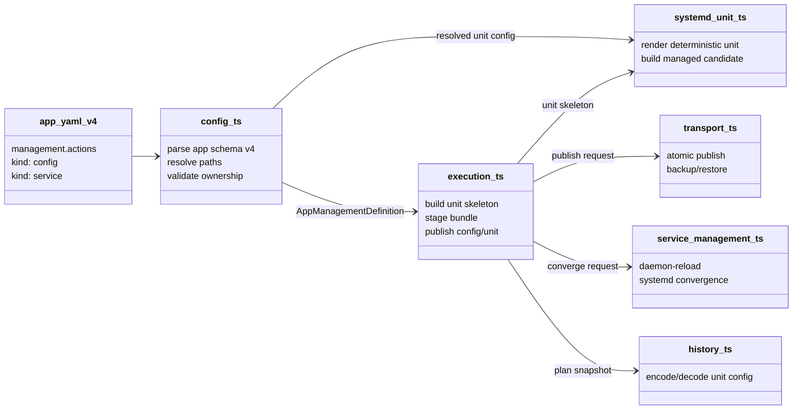
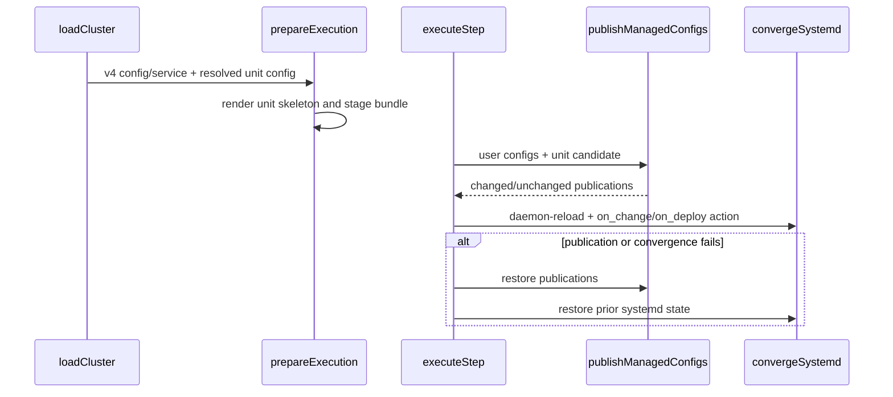
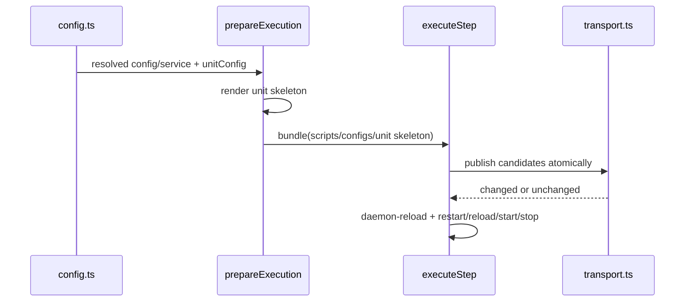

# 设计：App managed 资源统一声明

Risk profile: ./risk-profile.yaml

## Design Scope

### Goals

- 新增 `app.yaml schema_version: 4`，用 `management.actions` 列表承载 `config` 和 `service` 两类
  managed 资源。
- `kind: service` 可通过 `unit_config` 声明 systemd unit 的
  `working_directory`、固定启动命令和参数；未声明 `unit_config` 时只控制已有 unit。
- 装载期把相对 `working_directory`、相对可执行路径和 unit target
  解析成远端绝对路径；启动参数保持字面值。
- 复用现有 managed config 原子发布、备份/恢复、daemon-reload、systemd 收敛、计划快照和错误恢复路径。

### Non-goals

- 不支持 managed hook、任意脚本 action、systemd 以外的 service manager。
- 不引入部署后 facts 或启动参数变量替换。
- 不自动迁移 v2/v3 配置；v3 的 `configs/service/hooks` 保持原样。

## Useful Context

- v3 装载在 `src/config.ts` 中解析 `management.configs`、`management.service` 和
  `management.hooks`，并检查动作所有权。
- `src/execution.ts` 在 App deploy/configure 阶段为 managed config 生成骨架、创建候选、调用
  `publishManagedConfigs`，随后 `convergeSystemd` 执行服务动作。
- `src/transport.ts`
  的配置发布事务已提供目标类型检查、权限/属主、备份、原子替换、失败恢复和指纹提交。
- `src/history.ts` 持久化 plan v4 的 management/service；回滚会解码旧发布快照。
- systemd 的 `ExecStart` 要求绝对路径或裸命令名；为避免 PATH
  漂移，框架把相对可执行路径渲染为绝对路径。

## Overall Approach

`app.yaml` v4 在装载期解析 `management.actions`。`kind: config` 复用现有 managed config
装载；`kind: service` 解析为现有 `SystemdServiceManagement`，可选 `unit_config` 归一为
`SystemdUnitConfig`。v4 禁止 `management.configs/service/hooks` 旧字段。

新增 `src/systemd_unit.ts` 负责从已解析的 unit 配置渲染确定性 systemd unit 文本，并生成一个内部
`ManagedConfigFile` 候选描述。执行器把这个候选与用户 config 候选一起交给现有发布事务；unit
候选不调用结构化配置 updater，也没有秘密引用。unit 的 `on_change` 固定为 `restart`，配合 service 的
`daemon_reload` 在内容变化时完成 daemon-reload/restart。

`working_directory` 是唯一的安装相关目录基准。`command`
可以是绝对路径或相对该目录的路径；参数固定且不转义改写，仅做 systemd 安全性校验/引用。unit target
缺省为 `/etc/systemd/system/<unit>`，文件 owner/group 固定为 root/root、mode 0644。

## Layered Design Document Index

| level | parent_document | unit                             | design_document | responsibility                         |
| ----- | --------------- | -------------------------------- | --------------- | -------------------------------------- |
| task  | 无              | sfo-deploy App managed resources | design.md       | v4 schema、unit 渲染、执行与持久化闭环 |

## Module Relationship UML





## File-Level Interfaces

### `src/types.ts`

```typescript
export type ManagedFileFormat = ManagedConfigFormat | "systemd";

export interface SystemdUnitConfig {
  readonly target: string;
  readonly workingDirectory: string;
  readonly command: string;
  readonly args: readonly string[];
}

export interface SystemdServiceManagement {
  readonly kind: "systemd";
  readonly unit: string;
  readonly enabled?: boolean;
  readonly daemonReload: boolean;
  readonly onDeploy: SystemdDeployAction;
  readonly timeoutMs: number;
  readonly unitConfig?: SystemdUnitConfig;
}

export interface ManagedConfigFile {
  // ...
  readonly format: ManagedFileFormat;
}
```

- Consumer: `config.ts` / CHG-unified-app-action-schema。
- Compatibility: backward-compatible
- 新增 v4 是新契约；`ManagedFileFormat` 扩展会要求穷举 format 的内部消费者处理 `systemd`。
- Migration path: loader 拒收用户 config 的 `systemd` format；unit 候选只由 `systemd_unit.ts`
  生成，内部执行分支按 format 分派。

### `src/systemd_unit.ts`

```typescript
export function serviceUnitManagedConfig(
  resource: string,
  service: SystemdServiceManagement,
): ManagedConfigFile | undefined;

export function generateSystemdUnitSkeleton(
  config: ManagedConfigFile,
  runAs: string,
): GeneratedConfigSkeleton;
```

- Consumer: `prepareExecution`/`DeploymentExecutor` / CHG-unified-app-action-consumers。
- Compatibility: new
- 该模块只接受已通过 loader 校验的绝对 `working_directory`/`command`/`target`；渲染失败抛出
  `PreflightError`。

### `src/config.ts`

```typescript
function appSchemaVersion(data: StringRecord, label: string): 2 | 3 | 4;

async function appManagementV4(
  value: unknown,
  directory: string,
  definition: ScriptDefinition,
  label: string,
  secrets: ReadonlyMap<string, SecretDeclaration>,
): Promise<AppManagementDefinition | undefined>;
```

- Consumer: `loadApps` / CHG-unified-app-action-schema。
- Compatibility: backward-compatible
- v4 是新声明面；v2/v3 装载结果保持不变。

## API and Build Surface Impact

- Public API impact: backward-compatible
- Crate-root export change: yes
- Build-surface change: yes
- Documentation examples affected: yes

## Consumer Migration Closure

| Old Symbol                                                    | New Path                               | change_id                         | Consumer Path                                                        | Consumer Kind        | Migration Status |
| ------------------------------------------------------------- | -------------------------------------- | --------------------------------- | -------------------------------------------------------------------- | -------------------- | ---------------- |
| `app.yaml schema_version: 3 management.configs/service/hooks` | `schema_version: 4 management.actions` | CHG-unified-app-action-schema     | src/config.ts                                                        | configuration loader | migrated         |
| `SystemdServiceManagement`（无 unit config）                  | `SystemdServiceManagement.unitConfig?` | CHG-unified-app-action-schema     | src/types.ts                                                         | public type          | migrated         |
| v3 nginx managed app                                          | v4 actions example                     | CHG-unified-app-action-docs-tests | examples/eleph-server-multipass/cluster-template/apps/nginx/app.yaml | example config       | migrated         |
| v3 service management docs                                    | v4 actions/unit_config docs            | CHG-unified-app-action-docs-tests | README.md                                                            | documentation        | migrated         |
| v3 service management docs                                    | v4 actions/unit_config docs            | CHG-unified-app-action-docs-tests | docs/guides/sfo-deploy-cluster-configuration.md                      | documentation        | migrated         |

## Key Flows



失败语义：loader 先拒绝未知字段、重复 action、路径越界、目标冲突和所有权冲突；prepare
阶段渲染失败阻止 SSH 副作用；发布或服务收敛失败时复用现有配置恢复和 systemd 状态恢复。

## State and Ownership

- Owner: `management.actions` 的公共 schema 和路径解析由 `src/config.ts` 拥有。
- Owner: unit 文本渲染由 `src/systemd_unit.ts` 拥有。
- Owner: unit 发布、备份和恢复由 `src/transport.ts` 的 managed config 事务拥有；unit target 与用户
  config target 不允许重复。
- Owner: 发布快照中的 unitConfig 由 `src/history.ts` encode/decode 拥有。
- Invariants to preserve:
  - v2/v3 装载行为不变。
  - v4 管理动作所有权唯一。
  - unit 变更必须 daemon-reload 后再服务动作。
  - 发布失败不得伪报成功。

## Directly Mapped Change Items

| change_id                         | target_module | proposal_id | Design Coverage                                                     | Scope Paths                                                                                 | Interface / Boundary Impact              | Notes                            |
| --------------------------------- | ------------- | ----------- | ------------------------------------------------------------------- | ------------------------------------------------------------------------------------------- | ---------------------------------------- | -------------------------------- |
| CHG-unified-app-action-schema     | sfo-deploy    | P-001       | File-Level Interfaces; Module Relationship UML; State and Ownership | src/types.ts, src/config.ts, src/mod.ts, src/systemd_unit.ts                                | 新增 v4 配置契约和 unitConfig 类型       | loader 拒收 v4 旧别名和未知 kind |
| CHG-unified-app-action-consumers  | sfo-deploy    | P-002       | Overall Approach; Key Flows; State and Ownership                    | src/systemd_unit.ts, src/execution.ts, src/history.ts, src/cli.ts, src/remote_deployment.ts | unit 候选进入配置发布/服务收敛和回滚快照 | 不改变锁或 systemd 提权协议      |
| CHG-unified-app-action-docs-tests | sfo-deploy    | P-003       | Useful Context; Consumer Migration Closure                          | README.md, docs/guides/**, examples/**, tests/**                                            | 用户契约、示例和测试同步                 | jx-server 可保留 v3 作为兼容示例 |

## Implementation Order

| Phase | Goal                     | Depends On | Output                        |
| ----- | ------------------------ | ---------- | ----------------------------- |
| 1     | 类型和 systemd unit 渲染 | 无         | v4 内部模型与确定性 unit 文本 |
| 2     | v4 loader 和所有权校验   | 1          | 配置装载 fail closed          |
| 3     | 执行、发布、历史和 CLI   | 2          | deploy/configure 闭环         |
| 4     | 文档、示例和测试         | 3          | 契约一致性证据                |

## File-Level Implementation Sequence

| sequence | depends_on | scope_path                                                           | file_level_module                  | action | change_id                         | implementation_task                         |
| -------- | ---------- | -------------------------------------------------------------------- | ---------------------------------- | ------ | --------------------------------- | ------------------------------------------- |
| 1        | -          | src/types.ts                                                         | managed format/systemd unit types  | modify | CHG-unified-app-action-schema     | add `ManagedFileFormat`/`SystemdUnitConfig` |
| 2        | 1          | src/systemd_unit.ts                                                  | deterministic unit renderer        | create | CHG-unified-app-action-schema     | render and build candidate                  |
| 3        | 2          | src/mod.ts                                                           | public exports                     | modify | CHG-unified-app-action-schema     | export new types                            |
| 4        | 3          | src/config.ts                                                        | app v4 loader                      | modify | CHG-unified-app-action-schema     | actions/path/ownership validation           |
| 5        | 4          | src/execution.ts                                                     | prepare and execute unit candidate | modify | CHG-unified-app-action-consumers  | bundle/static candidate/publish             |
| 6        | 5          | src/history.ts                                                       | plan snapshot                      | modify | CHG-unified-app-action-consumers  | encode/decode unitConfig                    |
| 7        | 6          | src/cli.ts                                                           | management serialization           | modify | CHG-unified-app-action-consumers  | show service unit config                    |
| 8        | 7          | src/remote_deployment.ts                                             | protocol docs/types                | modify | CHG-unified-app-action-consumers  | note static candidate if interface changes  |
| 9        | 8          | tests/_support/fixtures.ts                                           | shared fixtures                    | modify | CHG-unified-app-action-docs-tests | v4 managed fixture                          |
| 10       | 9          | tests/unit/app_management_config.test.ts                             | schema tests                       | modify | CHG-unified-app-action-docs-tests | v4 positive/negative                        |
| 11       | 10         | tests/unit/systemd_unit.test.ts                                      | unit renderer tests                | create | CHG-unified-app-action-docs-tests | deterministic rendering/safety              |
| 12       | 11         | tests/dv/app_management_execution.test.ts                            | execution tests                    | modify | CHG-unified-app-action-docs-tests | unit publish/convergence                    |
| 13       | 12         | tests/unit/history.test.ts                                           | snapshot tests                     | modify | CHG-unified-app-action-docs-tests | encode/decode round trip                    |
| 14       | 13         | examples/eleph-server-multipass/cluster-template/apps/nginx/app.yaml | v4 example                         | modify | CHG-unified-app-action-docs-tests | migrate nginx                               |
| 15       | 14         | docs/guides/sfo-deploy-cluster-configuration.md                      | configuration guide                | modify | CHG-unified-app-action-docs-tests | document v4                                 |
| 16       | 15         | README.md                                                            | framework README                   | modify | CHG-unified-app-action-docs-tests | summarize v4                                |

## Design Notes

- `ManagedConfigFile.format` 扩展为内部 `ManagedFileFormat`，但用户 config 装载仍只接受
  yaml/json/toml/ini；`systemd` 只用于框架生成的 unit 候选。
- unit 候选不使用 remote config updater，因为 systemd unit
  不是结构化业务配置；执行器从部署包骨架创建静态候选。
- unit 文件固定 root/root/0644，减少 App 用户可篡改 unit 的风险。
- v4 不支持 hook；jx-server 的 hook 场景保留为 v3 legacy 示例，nginx 迁移为 v4 正例。
- 回滚采用“旧快照可继续 decode、新快照增加 unitConfig”的兼容策略；没有 unit_config 的旧 service
  快照解码为只控制已有 unit。

## Risks and Rollback

- v4 是破坏性 schema 边界；旧 v3 配置不会自动迁移。
- unit 渲染器必须避免 systemd 变量展开和控制字符注入；不安全字符 fail closed。
- unit 发布失败时依赖现有备份恢复；如果目标原本不存在则删除新 unit。
- 升级前旧发布快照仍可回滚；升级后新快照可 decode unitConfig。
