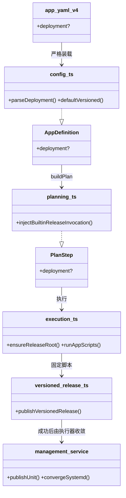
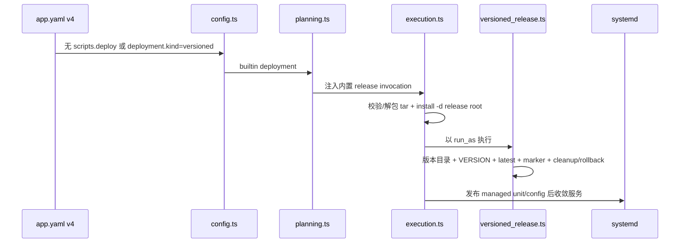

# 设计：带包 App 内置 versioned 发布

Risk profile: ./risk-profile.yaml

## Design Scope

- 依据已批准提案，实现 App v4 的 `deployment.kind: versioned`；普通带包 App 没有 `scripts.deploy`
  时默认使用内置发布，显式声明仅作为可读性标注。
- `jx-server` 与 `jx-web` 删除自定义 deploy 脚本，统一使用 `<install_directory>/<version>`
  发布根、`<install_directory>/latest` 原子引用和 `.<app>.version` 当前版本标记。
- `jx-server` 保留 managed service；`jx-web` 只需要 `management.run_as`，不声明
  service/config/hook。自定义 `scripts.deploy` 继续支持特殊制品流程。
- 不改变 packageless App、下载 provider、包哈希、managed config、service-management 和发布历史
  schema 主版本。

## Useful Context

- `loadApps` 严格要求带包 App 有 `scripts.deploy`；`buildPlan` 把 App deploy 脚本放入
  `scripts`、`deliveryInputs.scripts` 和 `bundleScripts`。
- 执行器已在 SSH 前校验 gzip tar，并在远端 workspace 用 `extractAppPackage` 安全解包为
  `validated-directory`；App 脚本通过 metadata 的
  `package_path`、`package_kind`、`install_directory`、`parameters.version` 和 `keep_versions`
  消费结果。
- managed App 的 `run_as` 身份校验和 `executeDeno` 沙箱已经存在；远端脚本只能读/写步骤
  workspace，外部命令必须逐项列入 run 白名单。
- managed config/unit 候选在 deploy 脚本成功后发布；service 收敛与回滚由现有
  `convergeSystemd`/`restoreSystemd` 拥有。

## Overall Approach

- 类型层新增 `DeploymentDefinition`，只允许 `kind: versioned`；`AppDefinition` 与 `PlanStep`
  保存可选 `deployment`。
- 配置层在 App v4 装载时解析 `deployment`；若带包 App 未声明 `scripts.deploy`，自动填入
  `{ kind: "versioned" }`。声明 deployment 时禁止 `scripts.deploy`、`packageless` 和缺失
  `management.run_as`。
- 规划层在 builtin deploy 步骤注入框架内置远端脚本 invocation，而不是要求 App
  提供脚本；用户自定义脚本和 management hooks 仍按原逻辑保留。
- 执行层在运行内置脚本前用固定 `install -d -m 0750 -o <run_as>`
  准备发布根；脚本继续获得既有安全解包结果和 metadata，负责版本目录、latest、标记、清理和回滚。
- 内置脚本不重复做哈希和 tar 成员校验；它只消费执行器已验证的
  `package_kind: validated-directory`。service/config 仍在脚本成功后由框架发布和收敛。

## Layered Design Document Index

| level | parent_document    | unit                 | design_document | responsibility                                 |
| ----- | ------------------ | -------------------- | --------------- | ---------------------------------------------- |
| task  | 无（任务级设计根） | versioned deployment | design.md       | 配置、计划、执行、内置脚本、示例迁移和文档测试 |

## Module Relationship UML



## File-Level Interfaces

```typescript
// src/types.ts
export type DeploymentKind = "versioned";
export interface DeploymentDefinition {
  readonly kind: DeploymentKind;
}
// AppDefinition.deployment?: DeploymentDefinition;
// PlanStep.deployment?: DeploymentDefinition;

// src/config.ts
// APP_V4_FIELDS 增加 "deployment"；
// deployment 与 scripts.deploy/packageless/缺失 management.run_as 冲突时 ConfigurationError；
// v4 带包 App 且无 scripts.deploy 时默认 deployment={kind:"versioned"}。

// src/remote_runtime/artifact.ts
export const REMOTE_VERSIONED_RELEASE_SOURCE: string;
export const REMOTE_VERSIONED_RELEASE_BUNDLE_PATH: string;
export const VERSIONED_RELEASE_PERMISSIONS: ScriptPermissions;

// src/planning.ts
// builtin deploy 使用 REMOTE_VERSIONED_RELEASE_SOURCE 注入 scripts.deploy invocation；
// PlanStep.deployment=resource.deployment。

// src/history.ts
// plan-v4 emit: deployment = step.deployment ?? null；
// decode: 旧快照缺省 undefined，新快照校验 kind 与 run_as。
```

接口消费者与兼容决策：

- Consumer: `buildPlan`。Compatibility: backward-compatible；旧自定义 deploy 步骤不变。
- Consumer: `OpenSshRemoteSession.executeDeno`。Compatibility: backward-compatible；内置脚本仍按普通
  Deno App 脚本沙箱执行。
- Consumer: `ReleaseStore` 旧快照。Compatibility: backward-compatible；`deployment`
  可选，缺失表示旧行为。
- Compatibility: backward-compatible

## Key Flows



失败语义：release root 不是可用目录时预检失败；版本名、包类型或路径非法时内置脚本失败关闭；`latest`
切换后写标记失败会先恢复上一 `latest` 和标记；service/config 失败继续使用现有 managed 恢复。

## State and Ownership

- Owner: `<install_directory>` 内的 version 目录、`latest` 软链和 `.<app>.version` 标记由内置
  versioned release 拥有。
- State: `VERSION` 存于每个版本目录；当前版本标记存于发布根；`latest` 始终指向版本目录名。旧自定义
  App 的状态仍由其脚本拥有。
- 迁移：旧布局不在本任务自动转换；若 `install_directory`
  是符号链接或不可用目录，框架失败关闭并要求人工迁移。

## Directly Mapped Change Items

| change_id                            | target_module | proposal_id | design_coverage                                                     | scope_paths                                                                                                                                                     |
| ------------------------------------ | ------------- | ----------- | ------------------------------------------------------------------- | --------------------------------------------------------------------------------------------------------------------------------------------------------------- |
| CHG-versioned-deployment-schema      | sfo-deploy    | P-001       | DeploymentDefinition 类型、App v4 字段/默认/冲突校验、PlanStep 绑定 | src/types.ts, src/config.ts, src/planning.ts                                                                                                                    |
| CHG-versioned-deployment-execution   | sfo-deploy    | P-002       | 内置脚本、发布根准备、plan/history 序列化、执行结果输出             | src/remote_runtime/artifact.ts, src/remote_runtime/versioned_release.ts, src/execution.ts, src/history.ts, src/cli.ts                                           |
| CHG-packaged-app-versioned-migration | sfo-deploy    | P-003       | jx-server/jx-web 删除自定义 deploy，统一配置与路径                  | examples/eleph-server-multipass/cluster-template/apps/**, examples/eleph-server-multipass/clusters/multipass/apps/**, examples/eleph-server-multipass/README.md |
| CHG-versioned-deployment-docs-tests  | sfo-deploy    | P-004       | 契约文档、schema/execution/history/example 测试和统一入口           | README.md, docs/guides/sfo-deploy-cluster-configuration.md, tests/**                                                                                            |

## Implementation Order

| phase              | goal                                         | depends_on | output                           |
| ------------------ | -------------------------------------------- | ---------- | -------------------------------- |
| I-1 类型与配置     | deployment 类型、装载、默认和冲突校验        | 无         | v4 配置可严格装载                |
| I-2 规划与持久化   | 注入内置 invocation；plan/history round-trip | I-1        | builtin deploy 计划可持久化/回滚 |
| I-3 执行与内置脚本 | release root、脚本算法、managed 顺序         | I-2        | 同版本跳过、发布、回滚、清理可用 |
| I-4 示例迁移       | jx-server/jx-web 配置与路径                  | I-3        | 示例 plan 与 service 契约一致    |
| I-5 测试与文档     | 契约、单元、DV、integration 和指南           | I-4        | 全绿证据                         |

## File-Level Implementation Sequence

| sequence | depends_on | scope_path                                                                 | file_level_module   | action | change_id                            | implementation_task                   |
| -------- | ---------- | -------------------------------------------------------------------------- | ------------------- | ------ | ------------------------------------ | ------------------------------------- |
| 1        | -          | src/types.ts                                                               | 领域类型            | 改     | CHG-versioned-deployment-schema      | 新增 DeploymentDefinition             |
| 2        | 1          | src/config.ts                                                              | 配置装载            | 改     | CHG-versioned-deployment-schema      | 解析/默认/冲突校验                    |
| 3        | 2          | src/remote_runtime/artifact.ts                                             | 远端运行时 identity | 改     | CHG-versioned-deployment-execution   | 内置脚本路径/权限                     |
| 4        | 3          | src/remote_runtime/versioned_release.ts                                    | 内置发布脚本        | 改     | CHG-versioned-deployment-execution   | 通用发布算法                          |
| 5        | 2          | src/planning.ts                                                            | 计划发射            | 改     | CHG-versioned-deployment-schema      | 注入内置 invocation                   |
| 6        | 5          | src/history.ts                                                             | 发布历史            | 改     | CHG-versioned-deployment-execution   | deployment codec                      |
| 7        | 6          | src/execution.ts                                                           | 执行器              | 改     | CHG-versioned-deployment-execution   | release root 准备                     |
| 8        | 7          | src/cli.ts                                                                 | CLI 输出            | 改     | CHG-versioned-deployment-execution   | deployment 展示                       |
| 9        | 8          | examples/eleph-server-multipass/cluster-template/apps/jx-server/app.yaml   | jx-server 配置      | 改     | CHG-packaged-app-versioned-migration | builtin + service current             |
| 10       | 8          | examples/eleph-server-multipass/cluster-template/apps/jx-web/app.yaml      | jx-web 配置         | 改     | CHG-packaged-app-versioned-migration | builtin v4                            |
| 11       | 10         | examples/eleph-server-multipass/cluster-template/apps/**/scripts/deploy.ts | 示例脚本            | 删     | CHG-packaged-app-versioned-migration | 删除重复发布逻辑                      |
| 12       | 11         | examples/eleph-server-multipass/clusters/multipass/apps/**                 | live 集群           | 改     | CHG-packaged-app-versioned-migration | 同步 template                         |
| 13       | 12         | README.md                                                                  | 契约文档            | 改     | CHG-versioned-deployment-docs-tests  | 布局与生命周期收敛                    |
| 14       | 13         | docs/guides/sfo-deploy-cluster-configuration.md                            | 配置指南            | 改     | CHG-versioned-deployment-docs-tests  | 字段与算法说明                        |
| 15       | 14         | tests/**                                                                   | 测试                | 改     | CHG-versioned-deployment-docs-tests  | schema/plan/history/execution/example |

## Design Notes

- 内置脚本通过普通 App 脚本执行面获得 run_as、metadata 和 Deno
  沙箱；这避免在执行器中新增第二个复杂远端协议。
- 发布根由执行器以 root/`sudo -n` 准备并归属 `run_as`；脚本自身不嵌套 sudo，适配 root SSH 与非 root
  `sudo -n` SSH 两种模型。
- 自定义 deploy 是显式逃生门；内置默认仅在 v4 带包 App 且没有 `scripts.deploy` 时启用。
- 显式 `deployment.kind` 与 `scripts.deploy` 同时存在时失败关闭，避免“谁拥有 deploy”歧义。

## API and Build Surface Impact

- Public API impact: backward-compatible
- Crate-root export change: yes
- Build-surface change: no
- Documentation examples affected: yes
- 说明：新增字段是可选扩展；旧自定义 deploy 配置不需要迁移。`jx-web`
  示例路径语义变化记录在提案/文档，但不影响公共模块导出。

## Consumer Migration Closure

| old_symbol                  | new_path                        | change_id                            | consumer_path                                                            | consumer_kind       | migration_status |
| --------------------------- | ------------------------------- | ------------------------------------ | ------------------------------------------------------------------------ | ------------------- | ---------------- |
| jx-server scripts/deploy.ts | REMOTE_VERSIONED_RELEASE_SOURCE | CHG-packaged-app-versioned-migration | examples/eleph-server-multipass/cluster-template/apps/jx-server          | 示例 App            | migrated         |
| jx-web scripts/deploy.ts    | REMOTE_VERSIONED_RELEASE_SOURCE | CHG-packaged-app-versioned-migration | examples/eleph-server-multipass/cluster-template/apps/jx-web             | 示例 App            | migrated         |
| `latest/app/...` 启动路径   | `latest/...`                    | CHG-packaged-app-versioned-migration | examples/eleph-server-multipass/cluster-template/apps/jx-server/app.yaml | systemd unit_config | migrated         |
| 缺失 deploy 脚本的配置错误  | builtin versioned deployment    | CHG-versioned-deployment-schema      | src/config.ts, src/planning.ts                                           | 配置/规划           | migrated         |

## Risks and Rollback

- 发布根必须先完成人工迁移；框架对符号链接/不可写目录失败关闭，不会静默替换旧布局。
- 内置清理只处理含匹配 `VERSION` 的版本目录，且保留当前版本；无法确认的条目不会删除。
- 若 latest 已切换但标记失败，脚本恢复旧 latest 和标记；若复制阶段失败，只清理临时目录。
- service/config 失败继续使用既有 managed 恢复，不在内置脚本内重启服务。
- 风险档案映射：contract→I-1/I-4 schema 与示例契约；data→I-2/I-5 codec 与 release 状态；security→I-3
  权限/路径；runtime→I-3/I-5 执行顺序与回归；harness→I-5 统一入口。
