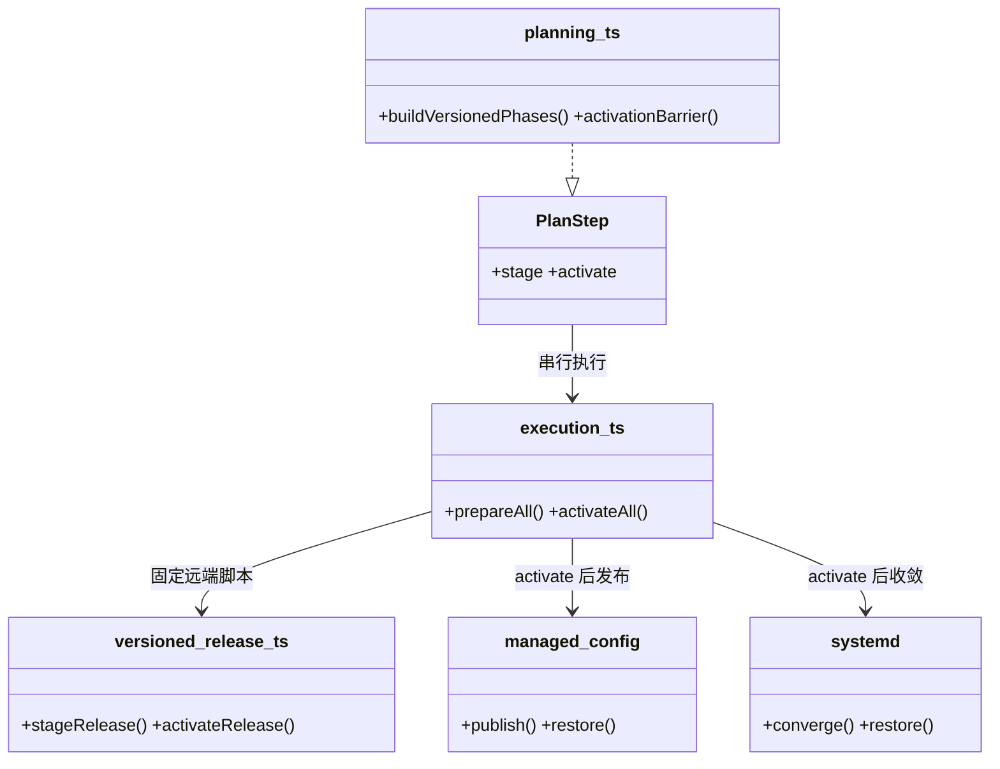
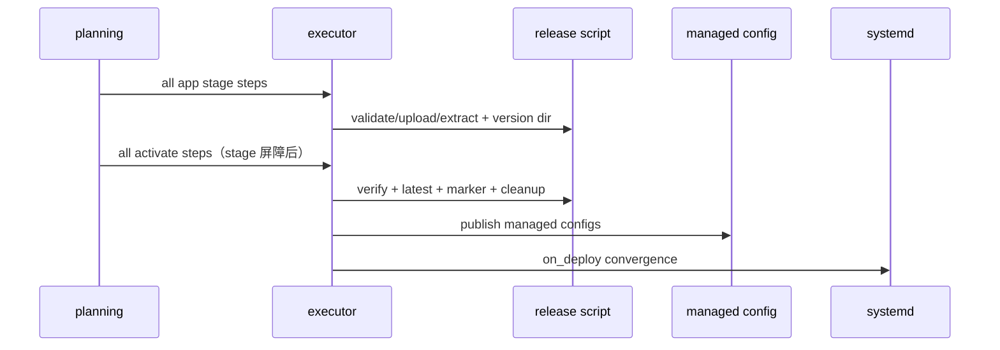

# 设计：App deploy 分阶段准备与统一激活

Risk profile: ./risk-profile.yaml

## Design Scope

- 内置 versioned App 的 deploy 计划从单步 `deploy` 拆为 `stage` 与 `activate`。
  - 所有 versioned `stage` 步骤构成准备屏障；任一 stage 失败时所有 `activate/restart` 被阻止。
  - `activate` 完成版本目录切换、`latest`/版本标记更新和 managed config/unit 发布。
  - 全部 activate 成功后，有 managed service 的目标统一进入 `restart` 收敛阶段。
- 自定义 `scripts.deploy`、packageless App、环境 prepare 和 CLI 过滤语义保持不变。
- 不实现跨机器分布式事务；失败结果继续明确报告 partial/recovery，不做隐式成功。

## Useful Context

- 当前 versioned 脚本在 App deploy 步骤内完成解包、版本目录、latest、标记、清理和回滚。
- 执行器已具备安全包解包、managed config 事务、systemd 收敛、目标锁和计划快照。
- 发布历史 v4 快照可扩展步骤 action；旧 v1/v2/v3 和旧 v4 快照必须继续可解码。

## Overall Approach

- `PlanAction` 新增内部动作 `stage` 和 `activate`；它们不是新增 CLI 命令。
- planning 为内置 versioned App 注入同一个自包含远端脚本，并生成 `stage`、`activate` 两个步骤。
- 在步骤图完成后，把所有 `activate` 步骤依赖到全部 versioned `stage` 步骤，形成全局准备屏障。
- stage 步骤只消费 package 并建立 `<install_directory>/<version>` 与 `VERSION`；不切
  latest、不写当前标记、不清旧版本、不发布配置、不重启。
- activate 步骤校验 stage 结果后发布配置/unit、切 latest/标记、清理旧版本并按 `on_deploy` 收敛服务。
- 远端脚本保留旧 `deploy` 行为，用于历史快照回放；新快照使用 stage/activate。

## Layered Design Document Index

| level | parent_document    | unit              | design_document | responsibility                       |
| ----- | ------------------ | ----------------- | --------------- | ------------------------------------ |
| task  | 无（任务级设计根） | phased deployment | design.md       | 类型、计划、执行、内置脚本和历史兼容 |

## Module Relationship UML



## File-Level Interfaces

```typescript
// src/types.ts
export type PlanAction =
  | "check"
  | "install"
  | "configure"
  | "deploy"
  | "start"
  | "stop"
  | "restart"
  | "stage"
  | "activate";
// PlanStep 仍复用 package/installDirectory/deployment/management/runAs，无新增公共字段。

// src/planning.ts
function isBuiltinVersioned(resource: AppDefinition): boolean;
function builtinPhaseScripts(): readonly ScriptInvocation[];
// builtin versioned actionSequence = ["stage", "activate"]；
// 所有 activate.dependsOn 包含全部 builtin versioned stage step id。

// src/history.ts
const STEP_ACTIONS: ReadonlySet<string>; // + stage/activate
const PLAN_STEP_ACTIONS; // deploy/rollback 的 app 集合 + stage/activate
// stage: package/deployment/install_directory/run_as；activate: management/deployment/install_directory/run_as
```

接口消费者与兼容决策：

- Consumer: `buildPlan`、`confirmExecutionPlan`。Compatibility: backward-compatible。
- Consumer: `ReleaseStore`。Compatibility: backward-compatible；旧快照不改写。
- Consumer: `OpenSshRemoteSession.executeDeno`。Compatibility: backward-compatible。
- Compatibility: backward-compatible

## Key Flows



失败语义：任一 stage 失败时所有 activate 阻止；activate 内部失败保留脚本既有的 latest/marker
自恢复；managed config/service 失败继续使用现有恢复，结果不伪报成功。取消和目标 fail-fast 语义不变。

## State and Ownership

- Owner: version 目录和 `VERSION` 由 stage 拥有；`latest`、当前版本标记和旧版本清理由 activate
  拥有。
- State: 新计划不新增远端持久状态；历史快照继续拥有完整可回放步骤。
- 迁移：旧 deploy 快照继续按原单步脚本执行；新快照不会写给旧二进制承诺的语义。

## Directly Mapped Change Items

| change_id                    | target_module | proposal_id | design_coverage                                                       | scope_paths                                                                                         |
| ---------------------------- | ------------- | ----------- | --------------------------------------------------------------------- | --------------------------------------------------------------------------------------------------- |
| CHG-phased-deploy-planning   | sfo-deploy    | P-001       | PlanAction、builtin phase planning、activation barrier、CLI plan 文本 | src/types.ts, src/planning.ts, src/cli.ts                                                           |
| CHG-phased-deploy-execution  | sfo-deploy    | P-002       | stage/activate 执行路由、远端脚本分相、history codec 和 rollback      | src/execution.ts, src/remote_deployment.ts, src/remote_runtime/versioned_release.ts, src/history.ts |
| CHG-phased-deploy-docs-tests | sfo-deploy    | P-003       | 生命周期文档、CLI/contract/unit/dv/integration 测试                   | README.md, docs/guides/**, examples/**, tests/**                                                    |

## Implementation Order

| phase          | goal                                          | depends_on | output                        |
| -------------- | --------------------------------------------- | ---------- | ----------------------------- |
| I-1 类型与计划 | PlanAction、builtin phase、activation barrier | 无         | 多 App plan 形成阶段屏障      |
| I-2 执行与脚本 | stage/activate 路由和脚本分相                 | I-1        | 准备不生效，激活统一发布/重启 |
| I-3 历史与 CLI | 快照、rollback 和确认输出                     | I-2        | 新旧快照兼容                  |
| I-4 文档与测试 | 契约、单元、集成、文档                        | I-3        | 全部行为可验证                |

## File-Level Implementation Sequence

| sequence | depends_on | scope_path                                      | file_level_module | action | change_id                    | implementation_task          |
| -------- | ---------- | ----------------------------------------------- | ----------------- | ------ | ---------------------------- | ---------------------------- |
| 1        | -          | src/types.ts                                    | 领域类型          | 改     | CHG-phased-deploy-planning   | 扩展内部 PlanAction          |
| 2        | 1          | src/planning.ts                                 | 计划发射          | 改     | CHG-phased-deploy-planning   | stage/activate 和 barrier    |
| 3        | 2          | src/remote_runtime/versioned_release.ts         | 远端发布脚本      | 改     | CHG-phased-deploy-execution  | stage/activate/legacy deploy |
| 4        | 3          | src/execution.ts                                | 执行器            | 改     | CHG-phased-deploy-execution  | 分相路由和恢复               |
| 5        | 4          | src/history.ts                                  | 发布历史          | 改     | CHG-phased-deploy-execution  | action/deployment codec      |
| 6        | 5          | src/cli.ts                                      | CLI 输出          | 改     | CHG-phased-deploy-planning   | plan/确认输出                |
| 7        | 6          | README.md                                       | 文档              | 改     | CHG-phased-deploy-docs-tests | 两阶段语义                   |
| 8        | 7          | docs/guides/sfo-deploy-cluster-configuration.md | 文档              | 改     | CHG-phased-deploy-docs-tests | 发布边界                     |
| 9        | 8          | tests/**                                        | 测试              | 改     | CHG-phased-deploy-docs-tests | 行为与兼容                   |

## Design Notes

- 使用两个普通计划步骤而不是新并发执行器，保留现有串行、锁、取消、历史和结果模型。
- 激活阶段在全局 stage 屏障后仍按稳定顺序串行执行；这是多机部署的协调发布，不是分布式原子事务。
- 自定义 deploy 不拆分，因为框架无法知道脚本中的副作用边界。
- rejected alternative: 并发执行 stage。当前
  SSH/锁和结果模型均按串行设计，并发会扩大风险且不是本需求必需。

## API and Build Surface Impact

- Public API impact: backward-compatible
- Crate-root export change: no
- Build-surface change: no
- Documentation examples affected: yes
- 说明：`stage`/`activate` 是计划内部动作，不新增 CLI 命令；现有配置和历史快照继续可用。

## Consumer Migration Closure

| old_symbol                 | new_path                         | change_id                   | consumer_path                           | consumer_kind | migration_status           |
| -------------------------- | -------------------------------- | --------------------------- | --------------------------------------- | ------------- | -------------------------- |
| builtin App deploy step    | builtin stage + activate steps   | CHG-phased-deploy-planning  | src/planning.ts                         | 计划生成      | migrated                   |
| versioned release deploy() | stageRelease()/activateRelease() | CHG-phased-deploy-execution | src/remote_runtime/versioned_release.ts | 远端脚本      | migrated                   |
| 旧 deploy 快照             | versioned_release deploy branch  | CHG-phased-deploy-execution | src/history.ts                          | 发布历史      | allowed-compatibility-shim |

## Risks and Rollback

- stage 已建立版本目录但 activate 未执行时，旧 `latest`/标记不变；不会影响当前运行服务。
- activate 失败时脚本只回滚当前目标的 latest/marker；managed config/service
  失败继续使用既有单目标恢复。多目标不承诺跨机原子。
- 版本名与当前版本相同时 stage/activate 均跳过；发布快照仍保留审计记录。
- 风险档案映射：contract/data→plan/history
  和新旧快照；security→远端脚本权限；runtime→阶段顺序与失败；harness→统一测试入口。
