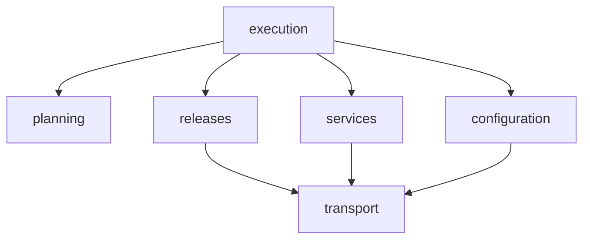

# Pipeline Plan

Workflow tier: high-risk

Risk profile: ./risk-profile.yaml

## Trigger
- Proposal: docs/versions/v0.1/modules/sfo-deploy/069-switch-latest-before-restart/proposal.md
- User launch confirmed: yes
- User launch statement: “确认，自动完成”（用户原话；确认当前修订提案并授权自动完成）
- Launch stage: proposal
- First auto stage: design
- Design source: pipeline/plan.md
- Per-stage user confirmation: 用户明确授权自动完成，不逐阶段重复确认
- Auto-confirm completed document stages: 自动设计/测试不生成独立 Markdown 阶段文档
- Auto-pipeline document policy: stage-selective; automatic design uses pipeline plan; automatic testing uses runtime state; testplan.yaml required for automatic testing
- Version: v0.1
- Packet module: sfo-deploy
- Task name: 069-switch-latest-before-restart
- Target module(s): sfo-deploy
- change_id values: CHG-configure-before-switch

## Acceptance Baseline
- 最终验收依据：
  - `proposal.md`

## Stage Graph
| Task ID | Stage | Execution Mode | Responsibility | Scope | Parent Task | Depends On | Output | Done Condition |
|---------|-------|----------------|----------------|-------|-------------|------------|--------|----------------|
| D-1 | design | auto-pipeline | 将用户确认意图转为可执行结构 | 本任务包 | root | none | 流水线设计映射与范围绑定 | 完成设计映射和规则检查 |
| I-1 | implementation | auto-pipeline | 交付确认范围内生产改动 | 本任务包 | root | D-1 | 生产代码 | 实现完成 |
| T-1 | testing | auto-pipeline | 依据提案、设计和实现设计测试并接入统一入口 | 本任务包 | root | I-1 | 测试、testplan.yaml、统一入口及运行证据 | 统一测试入口可运行 |
| A-1 | acceptance | auto-pipeline | 独立审查需求实现、设计正确性和测试充分性 | 本任务包 | root | T-1 | 验收报告 | 验收通过 |

## Submodule Tasks
<!-- 本任务没有独立拥有的产品子模块，保留空表。 -->
| Task ID | Stage | Execution Mode | Responsibility | Submodule | Parent Task | Depends On | Output | Done Condition |
|---------|-------|----------------|----------------|-----------|-------------|------------|--------|----------------|

## Parallel Scheduling
- Strategy: dependency-ready-set
- Concurrency: use all runtime-available child-agent slots
- Shared artifact owner: parent-orchestrator
- Lock directory: `.harness/locks/`
- Dispatch rule: launch dependency-ready work with practical edit coordination and available capacity
- Serialization reasons: explicit dependency, edit coordination, or exhausted concurrency capacity
- Evidence: 记录已启动任务及串行理由于 `.harness/pipelines/v0.1/sfo-deploy/069-switch-latest-before-restart/state.json` 调度波次

## Dependency Graphs

| Level | Parent | Node | Depends On |
|-------|--------|------|------------|
| submodule | sfo-deploy | execution | planning, configuration, services, releases |
| submodule | sfo-deploy | planning | none |
| submodule | sfo-deploy | configuration | transport |
| submodule | sfo-deploy | services | transport |
| submodule | sfo-deploy | releases | transport |
| submodule | sfo-deploy | transport | none |

本任务是一个协调的部署事务，不拆独立产品子模块。I-1 统一持有执行器与辅助模块集成，按服务准备、版本管理、计划/执行器、文档顺序推进。消费者迁移表记录兼容过渡，I-1 完成前核实实际迁移。

ConfigPublicationRequest 增加可选 releaseRoot，transport 验证真实路径包含关系，拒绝软链根和父目录逃逸；缺父目录在切换前失败。内置 deploy 把 install/latest/ 后缀映射至 install/version/；独立 configure 保留原目标。配置提交、workspace 和 lease 清理延后至服务成功。恢复按配置、软链/标记、旧服务顺序执行，原 active 服务强制 restart；恢复忽略已取消 signal，逐项尝试并汇总失败。同版本保留备份恢复，但不承诺文件更新不可见。

版本接口精确定义：prepareVersionedRelease 返回 PreparedVersionedRelease，switchVersionedRelease 仅完成最终 mv，随后立即 executePreparedSystemd；finalizeVersionedRelease 提交标记，最后 cleanupVersionedRelease 执行保留策略和临时文件清理。标记失败仍可恢复，清理失败只报告清理问题，不回滚已成功的服务。完整接口约定见本计划末尾设计说明。

## Exported Interfaces
| Interface | Owner | Consumer | Compatibility | Affected Callers | Migration Path |
|-----------|-------|----------|---------------|------------------|----------------|
| prepareSystemd / executePreparedSystemd | services | src/execution.ts | new | src/execution.ts | 保留 convergeSystemd 包装，兼容独立命令和自定义部署 |
| prepareVersionedRelease / switchVersionedRelease / restoreVersionedRelease | releases | src/execution.ts | new | src/execution.ts | 新增版本管理模块持有 latest 与版本标记操作 |
| versioned 部署 stage/activate 计划 | planning | src/execution.ts | backward-compatible | src/execution.ts | stage 完成准备，activate 提交并启动，移除独立 restart |
| 受管配置部署目标绑定 | configuration | src/execution.ts | backward-compatible | src/execution.ts | 部署解析 latest 前缀到候选版本，独立 configure 保留当前目标 |

## API and Build Surface Impact
- Public API impact: backward-compatible
- Crate-root export change: no
- Build-surface change: no
- Documentation examples affected: yes

公开 TypeScript 符号和已有调用签名保留，新接口增量提供；阶段顺序及旧单步历史计划的运行时迁移边界在下表和兼容说明中记录，不存在需要扫描移除的公开符号。

## Consumer Migration Closure
| Old Symbol | New Path | change_id | Consumer Path | Consumer Kind | Migration Status |
|------------|----------|-----------|---------------|---------------|------------------|
| 原 versioned restart 步骤 | src/planning.ts | CHG-configure-before-switch | src/execution.ts | 内部部署计划消费者 | allowed-compatibility-shim |
| latest 配置部署目标 | src/execution.ts | CHG-configure-before-switch | docs/guides/sfo-deploy-cluster-configuration.md | 部署配置指南 | allowed-compatibility-shim |

## State Ownership
| State | Owner | Access Interface | Lifecycle | Failure Transitions |
|-------|-------|------------------|-----------|---------------------|
| 暂存 workspace、操作 lease 与配置发布事务 | execution | 按目标保存的准备状态映射 | stage 获取，跨准备屏障保留，提交或恢复后释放 | 任一 stage 失败恢复暂存配置并释放全部 lease，不切换 latest |
| latest 软链、发布标记与保留版本 | releases | 版本准备、提交与恢复接口 | 快照旧状态、准备临时软链、提交、完成元数据后清理 | 切换失败不执行服务动作；动作失败恢复软链和标记并保留旧版本 |
| systemd unit 与部署前服务快照 | services | prepareSystemd / executePreparedSystemd | 切换前快照、发布 unit、daemon-reload 和 enable；切换后立即执行服务动作 | 准备失败中止；重启失败恢复旧服务并明确报告补偿错误 |

## Failure Flows
| Flow | Boundary | Failure | Handling |
|------|----------|---------|----------|
| 全部目标准备 | planning 至 execution | 配置发布、父目录或 unit 准备失败 | 在任何激活前中止并恢复已准备配置 |
| 绑定配置到候选版本 | configuration 至远端文件系统 | 路径穿越或软链逃逸版本根 | 发布前拒绝并保留 latest |
| 切换与服务动作 | releases 至 services | 原子软链替换失败 | 不执行 start/restart 并报告失败 |
| 提交后服务动作 | services 至 execution | start/restart 或验证失败 | 恢复旧软链、配置和 unit 快照；补偿服务并汇总恢复失败 |
| 发布收尾 | execution 至 releases | 标记或清理失败 | 标记失败保留恢复输入并补偿；清理失败明确报告但不回滚已成功服务 |
| 独立操作 | execution 至 services | configure/start/restart 失败 | 保留独立命令生命周期；configure 不激活候选版本 |

## Rejected Alternatives
| Decision Type | Selected | Rejected | Reason |
|---------------|----------|----------|--------|
| boundary | 全部目标准备屏障后，按依赖逐目标提交和服务动作 | 全局分离 activate 和 restart 阶段 | 其他目标操作会插入 latest 切换与实际重启之间 |
| technical | 执行器持有激活接口并紧接已准备服务动作 | 复用隔离 activate 脚本调用 | 调用清理会在切换与服务动作间插入远端命令 |
| collaboration | 单一实现事务负责人协调辅助模块 | 独立无协调修改执行生命周期 | 共享补偿与 lease 状态需要一致所有权 |

## Implementation Scope Bindings
| change_id | target_module | proposal_id | design_coverage | scope_paths | design_rules_applied |
|-----------|---------------|-------------|-----------------|-------------|----------------------|
| CHG-configure-before-switch | sfo-deploy | P-001, P-002, P-003 | 上述配置与 systemd 准备屏障、紧邻提交和动作、状态所有权与补偿 | `src/**`, `tests/**`, `docs/guides/**`, `README.md` | 模块分解、无环依赖、消费者、兼容性、状态与失败流 |

## File-Level Implementation Sequence
| Sequence | Task ID | File-Level Module | Action | Depends On | change_id | target_module | Scope Paths | Context Sources |
|----------|---------|-------------------|--------|------------|-----------|---------------|-------------|-----------------|
| 1 | I-1 | src/service_management.ts, src/versioned_release_management.ts, src/planning.ts, src/execution.ts, src/remote_runtime/versioned_release.ts | 先修改辅助模块，再集成计划、执行器和框架指南 | none | CHG-configure-before-switch | sfo-deploy | `src/**`, `tests/**`, `docs/guides/**`, `README.md` | proposal.md；本计划接口、状态和失败流；受影响源码 |

## Return Rules
- 验收发现需求歧义时停止并向用户澄清，不自动改写已确认提案。
- 实现缺陷返回 implementation；设计缺陷返回 design；测试不足返回 testing。
- 同一问题超过 5 次仍未解决时停止并报告。

运行状态、证据、返工及验收结论存放在 `.harness/pipelines/v0.1/sfo-deploy/069-switch-latest-before-restart/state.json`。

## 设计接口与调用约定

# 详细约定

## 最小结构

保留内部 `stage`、`activate` 两阶段，去掉额外 `restart`。所有目标 stage 完成版本目录、配置发布、unit 发布及 systemd 准备后，依赖顺序执行 activate。stage 对其他应用的依赖指向其 stage；activate 依赖全部 stage 及业务直接依赖应用的 activate。不能保留 stage 对未来 activate/restart 的依赖。

stage 需要带 management；当前 execution 的配置及 service 事务从局部提升为执行级状态，以 machine/resource 为键。保存配置 publications、systemd 原状态/准备结果、版本提交状态、workspace 与 lease。workspace 中有回滚备份，不能步骤结束即清理；操作锁必须持续到提交/补偿结束。屏障失败、取消、跳过 activate 的目标均在结束前补偿，恢复失败进入结果。

## 文件与接口依赖

1. `service_management.ts`：新增 `PreparedSystemdConvergence`（before、daemonReloaded、enableAction、action），`prepareSystemd(session, service, request, before, signal?)` 执行 daemon-reload/enable，`executePreparedSystemd(session, service, prepared, signal?)` 首条远端命令执行 action，随后读取并校验状态。已有 `convergeSystemd` 包装两者，保留其他操作兼容。`restoreSystemd` 末尾新增可选 forceRestart 参数，恢复旧版本时原 active 服务必须强制重启，不能只比较 active 布尔值。
2. 新 `versioned_release_management.ts`：使用现有 RemoteSession.run，不添加 transport 能力。导出 VersionedReleaseRequest（installDirectory、resource、version、runAs、keepVersions?）、PreparedVersionedRelease（request、releasePath、latestPath、markerPath、previousVersion?、previousTarget?、temporaryLatest、temporaryMarker、previousMarkerBackup、switched、finalized）。`prepareVersionedRelease(session, request, signal?)` 完成路径/目录/VERSION/旧软链和标记校验、准备临时软链及 marker；`switchVersionedRelease(session, prepared, signal?)` 只执行最终 mv 后更新内存；`finalizeVersionedRelease` 提交标记，之后独立调用 cleanup 执行保留策略和临时资源清理；`restoreVersionedRelease` 恢复实际旧软链及标记；`cleanupVersionedRelease` 清理临时资源。
3. execution 的 activate 不调用旧 Deno activate invocation：其 scope/metadata cleanup 会在切换后插入远端命令。改为 prepareVersionedRelease → switchVersionedRelease → executePreparedSystemd。二者之间仅本地赋值，无钩子、状态检查、元数据、清理、其他目标操作。privileged run 的 preflightPrivilege 有缓存，准备阶段先完成特权预检。
4. `remote_runtime/versioned_release.ts` 的 stage 继续负责安全建版本目录；旧 activate/deploy 运行时入口若保留，仅作为内部历史代码；单步骤 deploy 历史计划在 SSH 前明确拒绝，新版执行器不使用该提前激活入口。新版执行器不得意外调用提前激活分支。
5. `planning.ts` 与 `execution.ts` 最后集成前述接口；测试及文档随后依赖最终实现。

## 配置路径与兼容

仅内置部署 stage 将精确 installDirectory/latest/ 前缀映射成 installDirectory/version/，其余绝对路径保持现有含义。显式 configure 不映射、不激活。无需新增 YAML 字段；独立测试 app 使用 latest/resources 声明。映射后必须在发布前验证真实 release 根不是 symlink，配置父目录真实路径位于该根内；拒绝路径穿越和资源目录 symlink 逃逸。缺 resources 可严格预检失败，不必增添自动创建目录功能。

首次发布执行 start，已有版本执行 restart，与此前强制附加 restart 的实际行为一致；配置通知只合并一次。无 service 仅提交 latest。同版本 stage 可更新当前版本文件，保留配置事务恢复，不宣称同版零可见变化。

## 失败边界

准备失败不切换任何目标；已准备其他目标恢复配置、unit/systemd 状态并释放资源。切换失败不执行新服务命令。服务失败后恢复配置和实际旧软链/marker，再补偿旧服务（原 active 时强制 restart，原 inactive 时恢复 inactive）。首次失败恢复 latest 和 marker 原先不存在的状态。恢复使用非取消 signal，逐项 best effort 并聚合失败。已成功提交其他目标不承诺跨机器原子回滚。

标记提交成功且服务状态通过后才清理旧目录；清理失败须作为清理问题呈现，不能在删掉旧目录后尝试回滚。应保留旧版本直至恢复不再需要它。读取 previousTarget 必须基于实际 readlink，不能只用 marker 推导；非法或矛盾状态在准备阶段拒绝。

## 实现集成补充：历史计划与恢复证据

旧单步骤 versioned `deploy` 历史计划无法提供全部目标准备屏障，在连接 SSH 前明确拒绝，并提示重新生成 `stage`/`activate` 计划。旧三阶段快照规范化时保留原步骤 ID 与引用，以新两阶段语义执行，跳过多余 `restart`，不重复重启服务。此兼容边界不改变自定义 deploy 协议，也不扩大任务范围。

恢复失败时保留 workspace 内配置备份与恢复证据，不能在 finally 中无条件删除；只有恢复或成功提交后的清理成功，才删除对应备份。失败状态应记录保留位置并汇总恢复失败，以便后续恢复。取消同样不能提前销毁仍被恢复使用的备份。

辅助模块实现已覆盖 `src/versioned_release_management.ts`、`src/service_management.ts` 和 `src/transport.ts`；执行器与计划集成及文档同步均已完成，独立验收发现的标记所有权缺陷已补充真实降权回归。本段说明兼容和恢复边界，任务完成状态以运行 state 为准。

版本标记所有权：VersionedReleaseRequest 必须携带已验证的 runAs，临时标记通过 install -m 0640 -o runAs 创建，保证后续以应用用户执行的 stage 可以读取成功版本标记；恢复保留原标记权限与属主。
