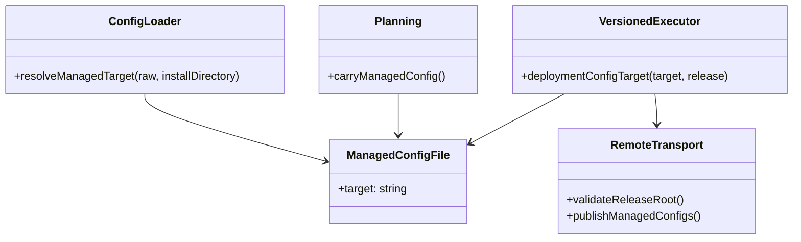
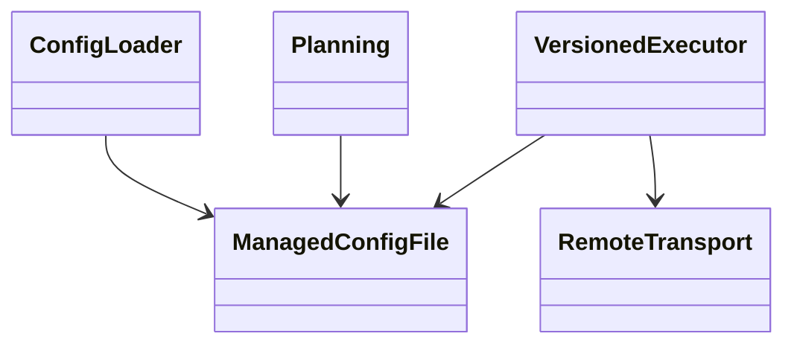
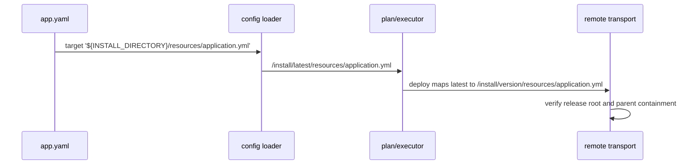

# App 安装目录变量设计

Risk profile: ./risk-profile.yaml

## Design Scope

为 App managed config 的 `target` 增加内置前缀变量 `${INSTALL_DIRECTORY}/`。装载器把该变量绑定到同一 App 的 `install_directory`，并生成版本发布根下的 `latest` 选择路径；内置部署在准备完候选版本后把 `latest` 前缀映射为真实版本路径，独立 configure 通过当前 `latest` 写入当前版本。旧绝对路径不重新解释。

不展开任意环境变量、不在配置内容中做字符串替换、不扩展 `service.unit_config.target`、不改变秘密占位符语义。

## Useful Context

`src/config.ts` 已在 App 装载时读取并校验 `install_directory`，随后把 v4 `management.actions[].config` 归一为 `ManagedConfigFile`。`src/execution.ts` 的 `deploymentConfigTarget` 已把精确 `<install_directory>/latest/` 前缀映射为候选 `<install_directory>/<version>/`，并由 `src/transport.ts` 验证发布根不是符号链接且目标父目录真实位于发布根内。因此变量只需要在配置装载层引入，不需要新增远端执行协议。

## Overall Approach



新增 `managedConfigTarget` 作为 managed config 专用解析入口。它识别且仅识别字符串前缀 `${INSTALL_DIRECTORY}/`，缺 `install_directory` 时在本地失败；变量后必须跟一个非空、规范、不含 `..` 的相对片段。命中变量时解析为 `<install_directory>/latest/<relative>`。未命中时保持既有 `managedTargetPath` 行为。

内置 deploy/stage/activate 继续用候选版本 release 把 latest 前缀映射到真实版本路径并设置 release root；独立 configure 保持 latest 目标，写入当前版本。绝对路径目标不会被执行器重新映射。

## Module Relationship UML



## Layered Design Document Index

| level | parent_document | unit | design_document | responsibility |
| --- | --- | --- | --- | --- |
| not-applicable: 本任务只修改单一配置路径契约，不拆子级设计 | design.md | not-applicable: 无独立子级模块 | not-applicable: 本任务不拆分子级设计文档 | not-applicable: 本任务不引入独立业务子模块 |

## File-Level Interfaces

- Consumer: sfo-deploy config loader and versioned executor; change_id: CHG-install-directory-variable
- Compatibility: backward-compatible

```typescript
// src/config.ts
// Consumer: managedConfigFiles -> loadApps; compatibility: backward-compatible
function managedConfigTarget(
  value: unknown,
  installDirectory: string | undefined,
  label: string,
): string;

// src/config.ts
// Consumer: appManagement/appManagementV4 -> managedConfigFiles; compatibility: backward-compatible
async function managedConfigFiles(
  value: unknown,
  directory: string,
  installDirectory: string | undefined,
  label: string,
  secrets: ReadonlyMap<string, SecretDeclaration>,
): Promise<readonly ManagedConfigFile[]>;
```

`ManagedConfigFile.target` 继续是归一后的远端绝对路径；不新增计划 JSON 字段，历史计划保持可读。App YAML 的目标变量只存在于装载输入，不进入历史快照。

## Key Flows



独立 configure 时没有候选 release，executor 保留 latest 目标；transport 校验父目录存在后原子发布。

## State and Ownership

- Owner: sfo-deploy config loader owns variable binding; versioned release management owns latest-to-release resolution.

| State | Owner | Boundary |
| --- | --- | --- |
| `install_directory` | config loader | 只在装载期绑定变量，不读取控制机环境 |
| `ManagedConfigFile.target` | plan/executor | 归一后绝对路径；latest 是版本选择器，不是变量占位符 |
| 版本目录与 latest | versioned release management | deploy 映射候选版本；失败时沿用既有恢复事务 |

## Directly Mapped Change Items

| change_id | target_module | proposal_id | design_coverage | scope_paths |
| --- | --- | --- | --- | --- |
| CHG-install-directory-variable | sfo-deploy | P-001, P-002 | managed target 变量装载校验、候选版本路径映射、jx-server 示例、文档同步与针对性行为测试 | `src/**`, `tests/**`, `docs/guides/**`, `README.md`, `examples/eleph-server-multipass/**`, `skills/sfo-deploy-cluster/**` |

## API and Build Surface Impact

- Public API impact: backward-compatible
- Crate-root export change: no
- Build-surface change: no
- Documentation examples affected: yes

现有绝对 `target` 与计划格式保持兼容。新 YAML 目标写法是增量配置契约，不要求迁移。

## Consumer Migration Closure

| old_symbol | new_path | change_id | consumer_path | consumer_kind | migration_status |
| --- | --- | --- | --- | --- | --- |
| `${install_directory}/latest/resources/...` target 写法 | `${INSTALL_DIRECTORY}/resources/...` | CHG-install-directory-variable | README.md | 配置契约文档 | allowed-compatibility-shim |
| `${install_directory}/latest/resources/...` target 写法 | `${INSTALL_DIRECTORY}/resources/...` | CHG-install-directory-variable | examples/eleph-server-multipass/cluster-template/apps/jx-server/app.yaml | 本地示例配置 | migrated |
| `${install_directory}/latest/resources/...` target 写法 | `${INSTALL_DIRECTORY}/resources/...` | CHG-install-directory-variable | docs/guides/sfo-deploy-cluster-configuration.md | 配置指南 | allowed-compatibility-shim |

## Implementation Order

| phase | goal | depends_on | output |
| --- | --- | --- | --- |
| 1 | 装载变量并失败关闭 | none | config loader 与装载测试 |
| 2 | 同步本地 jx-server 目标 | 1 | 示例 app.yaml |
| 3 | 同步文档边界 | 1 | README、指南、技能参考、模块边界 |
| 4 | 运行针对性与部署路径验证 | 1, 2, 3 | 通过的测试与 validate/plan 证据 |

## File-Level Implementation Sequence

| sequence | file_level_module | action | depends_on | change_id | scope_path | implementation_task |
| --- | --- | --- | --- | --- | --- | --- |
| 1 | src/config.ts | modify | none | CHG-install-directory-variable | `src/**` | root |
| 2 | tests/unit/app_management_config.test.ts | modify | 1 | CHG-install-directory-variable | `tests/**` | root |
| 3 | examples/eleph-server-multipass/cluster-template/apps/jx-server/app.yaml | modify | 1 | CHG-install-directory-variable | `examples/eleph-server-multipass/**` | root |
| 4 | README.md, docs/guides/sfo-deploy-cluster-configuration.md, docs/modules/sfo-deploy.md, skills/sfo-deploy-cluster/references/app.md, examples/eleph-server-multipass/README.md | modify | 1 | CHG-install-directory-variable | `README.md`, `docs/guides/**`, `docs/modules/sfo-deploy.md`, `skills/sfo-deploy-cluster/**`, `examples/eleph-server-multipass/**` | root |

## Design Notes

变量解析保留 `latest` 作为中间选择器，是为了复用 069 已经验证过的候选版本映射、恢复顺序和路径边界。这样不会在计划快照中保存未确定的版本号，也避免独立 configure 在装载期猜测当前版本。

`service.unit_config.target` 是 systemd unit 文件路径，不属于业务配置资源目标；本任务不扩展它。重复目标检查在变量展开后执行，因此两个变量路径展开为同一路径时会本地拒绝。

## Risks and Rollback

- 变量后片段若允许 `..` 或多余分隔符会造成路径逃逸；装载器在 join 前拒绝，展开后仍走既有路径校验。
- 独立 configure 通过 latest 写入，latest 指向异常目标时会被远端父目录/普通文件检查阻止；本任务不改变 latest 生命周期。
- 如需回退，App 配置可改回绝对路径；代码回退只移除变量解析分支和文档示例。
