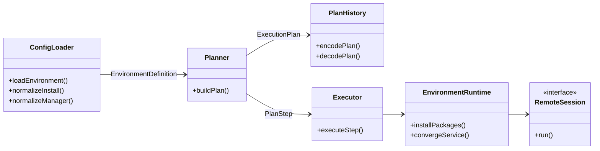
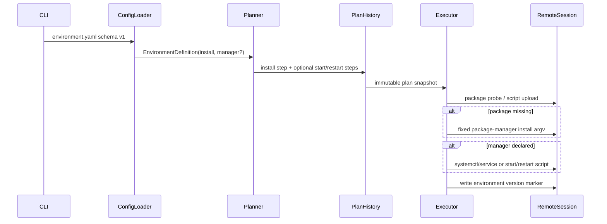

# Design：Environment 顶层 install/manager 生命周期

Risk profile: ./risk-profile.yaml

## Design Scope

本次在 sfo-deploy 配置装载、计划生成、计划持久化、远端执行和文档之间实现 Environment 的顶层 `install` 与可选 `manager` 契约。`install` 支持 `package` 与 `script`；`manager` 支持 `system` 与 `script`，缺省时只安装依赖，不管理应用运行。新的契约不引入 `check` 步骤；package 安装通过包管理器查询实现幂等，script 安装要求脚本自身可重复执行。现有顶层 `scripts` 是兼容路径，不迁移。

## Useful Context

当前 Environment 装载器要求顶层 `scripts`，计划器把 `prepare` 展开为 check/install/configure，App managed service 只支持 systemd。现有包管理器探测已经用于 install-deno，但不会执行环境包安装。本设计复用现有脚本执行、计划快照和远端会话边界，不改变 App 管理模型。

## Overall Approach

装载器把顶层 `install` 和可选 `manager` 归一为强类型值对象；计划器据此生成 `install`，并在声明 `manager` 时生成 start/restart 两个候选步骤；执行器选择 start 或 restart 并调用固定远端命令或已上传脚本。历史模块把这些值作为 plan v4 的可选字段持久化。包安装用包管理器查询完成幂等判断；服务动作后校验状态。所有失败路径保持 fail-fast。

## Layered Design Document Index

| level | parent_document | unit | design_document | responsibility |
|-------|-----------------|------|-----------------|----------------|
| sfo-deploy | design.md | sfo-deploy | design.md | 顶层模块边界、数据流、兼容性和实现顺序 |
| environment-lifecycle | design.md | environment-lifecycle | design/environment-lifecycle.md | install/manager 的类型、装载、计划与执行分解 |

## Module Relationship UML



## Key Flows



失败路径：包管理器探测、包查询、安装命令、服务工具探测或服务动作非零时，install/manager 步骤失败；执行器沿用同机 fail-fast。缺省 `manager` 不生成服务步骤，也不读取或改变服务状态。

## State and Ownership

- Owner: `EnvironmentDefinition` 与 `PlanStep` 分别拥有装载期生命周期声明和可重放计划数据；服务状态由目标节点拥有。

`EnvironmentDefinition` 在装载期唯一拥有 `install` 和 `manager` 的归一形态；`ExecutionPlan` 的 `PlanStep.environmentInstall` 与 `PlanStep.environmentManager` 拥有可重放的计划数据。环境版本标记仍由执行器在最后一个 prepare 步骤后写入，所有者不变。服务启用/active 状态由目标节点拥有，框架只通过固定远端命令查询和收敛，不在控制端持久化。

## API and Build Surface Impact

- Public API impact: backward-compatible
- Crate-root export change: no
- Build-surface change: yes
- Deno CLI/执行器新增环境运行时模块；计划快照编码新增可选字段。
- Documentation examples affected: yes
- 受影响文档为 `README.md`、`docs/guides/sfo-deploy-cluster-configuration.md`、`skills/sfo-deploy-cluster/references/environment.md`。

新增字段是 additive schema v1 扩展，不属于 breaking。旧 YAML、旧 plan v3/v4 和现有 App managed service 语义保持不变。

## environment-lifecycle

详细设计见 [environment-lifecycle.md](design/environment-lifecycle.md)。

## Consumer Migration Closure

| old_symbol | new_path | change_id | consumer_path | consumer_kind | migration_status |
|------------|----------|-----------|---------------|---------------|------------------|
| Environment scripts-based install docs | Environment `install`/`manager` docs | CHG-declarative-environment-install | README.md | documentation | migrated |
| Environment scripts-based install guide | Environment `install`/`manager` guide | CHG-declarative-environment-install | docs/guides/sfo-deploy-cluster-configuration.md | documentation | migrated |
| Environment scripts-based skill reference | Environment `install`/`manager` skill reference | CHG-declarative-environment-install | skills/sfo-deploy-cluster/references/environment.md | documentation | migrated |

## File-Level Interfaces

- Consumer: `src/config.ts`, `src/planning.ts`, `src/history.ts`, `src/execution.ts`；change_id `CHG-declarative-environment-install`
- Compatibility: backward-compatible

```typescript
// src/types.ts
// consumer: src/config.ts, src/planning.ts, src/history.ts, src/execution.ts; CHG-declarative-environment-install
export type EnvironmentInstallKind = "package" | "script";
export type EnvironmentPackageManagerKind = "auto" | "apt-get" | "yum";
export type EnvironmentServiceManagerKind = "system" | "script";
export type EnvironmentServiceTool = "auto" | "systemctl" | "service";

export interface EnvironmentPackageInstall {
  readonly kind: "package";
  readonly manager: EnvironmentPackageManagerKind;
  readonly packages: readonly string[];
  readonly updateCache: boolean;
}

export interface EnvironmentScriptInstall {
  readonly kind: "script";
  readonly invocation: ScriptInvocation;
}

export type EnvironmentInstallDefinition =
  | EnvironmentPackageInstall
  | EnvironmentScriptInstall;

export interface EnvironmentSystemManager {
  readonly kind: "system";
  readonly name: string;
  readonly tool: EnvironmentServiceTool;
  readonly enabled?: boolean;
  readonly startAfterInstall: boolean;
  readonly timeoutMs: number;
}

export interface EnvironmentScriptManager {
  readonly kind: "script";
  readonly start: ScriptInvocation;
  readonly restart: ScriptInvocation;
}

export type EnvironmentManagerDefinition =
  | EnvironmentSystemManager
  | EnvironmentScriptManager;

export interface EnvironmentDefinition {
  // ...existing fields...
  readonly install?: EnvironmentInstallDefinition;
  readonly manager?: EnvironmentManagerDefinition;
}

export interface PlanStep {
  // ...existing fields...
  readonly environmentInstall?: EnvironmentInstallDefinition;
  readonly environmentManager?: EnvironmentManagerDefinition;
}
```

```typescript
// src/environment_runtime.ts
// consumer: src/execution.ts; CHG-declarative-environment-install
export async function installEnvironmentPackages(
  session: RemoteSession,
  install: EnvironmentPackageInstall,
  signal?: AbortSignal,
): Promise<CommandResult>;

export async function convergeEnvironmentService(
  session: RemoteSession,
  manager: EnvironmentSystemManager,
  operation: "start" | "restart",
  signal?: AbortSignal,
): Promise<void>;
```

```typescript
// src/planning.ts
// consumer: src/execution.ts and PlanHistory; CHG-declarative-environment-install
function environmentActionsFor(
  action: string,
  definition: EnvironmentDefinition,
): readonly string[];
```

```typescript
// src/history.ts
// consumer: release snapshot replay; CHG-declarative-environment-install
function encodeEnvironmentInstall(
  install: EnvironmentInstallDefinition,
  archive: ArchiveWriter,
): Promise<JsonObject>;
function encodeEnvironmentManager(
  manager: EnvironmentManagerDefinition,
  archive: ArchiveWriter,
): Promise<JsonObject>;
function decodeEnvironmentInstall(
  raw: unknown,
  snapshot: string,
): Promise<EnvironmentInstallDefinition>;
function decodeEnvironmentManager(
  raw: unknown,
  snapshot: string,
): Promise<EnvironmentManagerDefinition>;
```

## Directly Mapped Change Items

| change_id | proposal_id | target_module | design_coverage | scope_paths |
|-----------|-------------|---------------|-----------------|-------------|
| CHG-declarative-environment-install | P-001 | sfo-deploy | `## File-Level Interfaces`、`design/environment-lifecycle.md` | `src/types.ts`, `src/config.ts`, `src/planning.ts`, `src/history.ts`, `src/execution.ts`, `src/environment_runtime.ts`, `tests/**`, `README.md`, `docs/**`, `skills/sfo-deploy-cluster/**` |
| CHG-declarative-environment-service | P-002 | sfo-deploy | `## File-Level Interfaces`、`design/environment-lifecycle.md` | `src/types.ts`, `src/config.ts`, `src/planning.ts`, `src/history.ts`, `src/execution.ts`, `src/environment_runtime.ts`, `tests/**`, `README.md`, `docs/**`, `skills/sfo-deploy-cluster/**` |
| CHG-declarative-environment-conflicts | P-003 | sfo-deploy | `## Design Scope`、`design/environment-lifecycle.md` | `src/types.ts`, `src/config.ts`, `src/planning.ts`, `src/history.ts`, `src/execution.ts`, `tests/**`, `docs/**`, `skills/sfo-deploy-cluster/**` |
| CHG-declarative-environment-docs | P-004 | sfo-deploy | `## API and Build Surface Impact`、`## File-Level Implementation Sequence` | `README.md`, `docs/**`, `skills/sfo-deploy-cluster/**` |

## Implementation Order

| phase | goal | depends_on | output |
|-------|------|------------|--------|
| 1 | 建立类型和配置契约 | none | 可通过 validate 的 environment.yaml |
| 2 | 生成并持久化计划 | 1 | schema v4 可重放环境生命周期步骤 |
| 3 | 实现远端安装/服务运行时 | 1 | 固定命令模板和状态确认 |
| 4 | 接入执行器与文档 | 2, 3 | prepare/install/start/restart 行为与配置指南 |

## File-Level Implementation Sequence

| sequence | file_level_module | action | depends_on | change_id | scope_path | implementation_task |
|----------|-------------------|--------|------------|-----------|------------|---------------------|
| 1 | `src/types.ts` | modify | none | CHG-declarative-environment-install | `src/types.ts` | parent |
| 2 | `src/config.ts` | modify | 1 | CHG-declarative-environment-install | `src/config.ts` | parent |
| 3 | `src/planning.ts` | modify | 2 | CHG-declarative-environment-install | `src/planning.ts` | parent |
| 4 | `src/history.ts` | modify | 3 | CHG-declarative-environment-install | `src/history.ts` | parent |
| 5 | `src/environment_runtime.ts` | create | 1 | CHG-declarative-environment-install | `src/environment_runtime.ts` | parent |
| 6 | `src/execution.ts` | modify | 3, 5 | CHG-declarative-environment-install | `src/execution.ts` | parent |
| 7 | tests/documentation | create/modify | 6 | CHG-declarative-environment-install | `tests/**`, `README.md`, `docs/**`, `skills/**` | parent |

## Design Notes

顶层 `manager` 的内部字段使用 `tool`，避免 `manager.manager`。新契约保持 schema v1，是因为这是 additive 字段扩展而不是格式重写。`check` 不进入新生命周期：包安装幂等性由包管理器查询保证，脚本安装的可重复执行是显式用户契约。包管理器 `auto` 按 apt-get、yum 顺序探测；服务工具 `auto` 按 systemctl、service 顺序探测。所有探测失败都在副作用前结束。

## Risks and Rollback

- 包管理器探测只接受固定绝对路径和已知名称，探测失败时 fail-closed。
- 包名在装载期白名单校验，远端命令使用固定 argv，不拼接 shell 字符串。
- service/systemctl 的退出码差异封装在 `environment_runtime.ts`；动作后必须确认 active/enabled 状态。
- 回滚以代码回退为准；旧配置不使用新字段，旧 plan 快照不包含新字段，因此可直接回退而不迁移数据。
