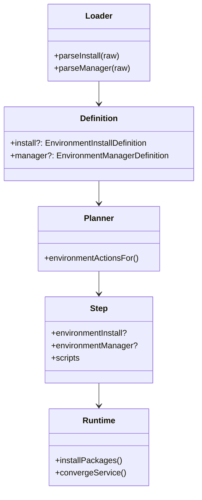

# Environment 生命周期设计

Risk profile: ./risk-profile.yaml

## 职责

该子模块负责 schema v1 Environment 的归一化 `install` 与可选 `manager` 声明。配置装载器校验 YAML 并解析脚本路径；计划器物化步骤；历史模块保证计划可重放；执行器调用用户脚本或环境运行时。

## 模块关系



## 配置形态

### 系统包安装与系统服务

```yaml
schema_version: 1
name: nginx
version: "1.24"
requires_privilege: true
install:
  kind: package
  manager: auto
  packages: [nginx]
  update_cache: false
manager:
  kind: system
  name: nginx
  tool: auto
  enabled: true
  start_after_install: true
  timeout_ms: 300000
```

### 脚本安装与脚本服务管理

```yaml
schema_version: 1
name: nginx
version: "1.24"
requires_privilege: true
install:
  kind: script
  path: scripts/install.ts
  permissions:
    run: [/usr/bin/apt-get]
    net: []
manager:
  kind: script
  start:
    path: scripts/start.ts
    permissions:
      run: [/usr/bin/systemctl]
      net: []
  restart:
    path: scripts/restart.ts
    permissions:
      run: [/usr/bin/systemctl]
      net: []
```

`manager` 可以缺省。缺省表示不计划、不执行任何应用运行管理动作。

## 校验规则

- `schema_version` 仍为 `1`。
- 新顶层字段只能是 `install` 和可选 `manager`。
- 顶层 `scripts` 与 `install` 或 `manager` 冲突；旧环境继续使用 `scripts`，装载行为不变。
- 新生命周期必须声明 `install`；其 `kind` 为 `package` 或 `script`，包名必须匹配 `[A-Za-z0-9][A-Za-z0-9+._-]*`。
- `install.manager` 为 `auto`、`apt-get` 或 `yum`。
- `manager.kind` 为 `system` 或 `script`；`manager.tool` 为 `auto`、`systemctl` 或 `service`。
- 脚本路径和权限复用现有资源目录包含校验与权限校验。

## 计划契约

对新契约执行 `prepare` 时，计划 `install`；若存在 `manager`，还计划 `start` 和 `restart`。执行器根据既有的环境版本标记选择实际服务操作：不存在则 start，存在则 restart。直接的 `install`、`start`、`restart` 请求使用同名动作。新生命周期不支持 `check`，因为没有 check 实现，必须失败关闭。

## 执行契约

- `install.kind: script` 使用现有脚本执行路径，并要求脚本自身可重复执行。
- `install.kind: package` 探测指定或可用包管理器，查询已安装包，只在缺少包时运行固定安装 argv。
- `manager.kind: script` 通过现有脚本路径使用上传后的 start/restart 脚本。
- `manager.kind: system` 探测指定或可用服务工具，执行 start 或 restart，应用 enabled/disabled 状态，并在动作后确认状态。
- 包管理器 `auto` 顺序是 apt-get，然后 yum；服务工具 `auto` 顺序是 systemctl，然后 service。
- 未知或缺失工具在副作用前失败关闭。命令使用固定 argv，并沿用步骤现有提权处理。

## 回滚

该特性是 additive 扩展。回滚时还原代码并重新生成计划。旧脚本环境和旧计划快照不携带新字段。
