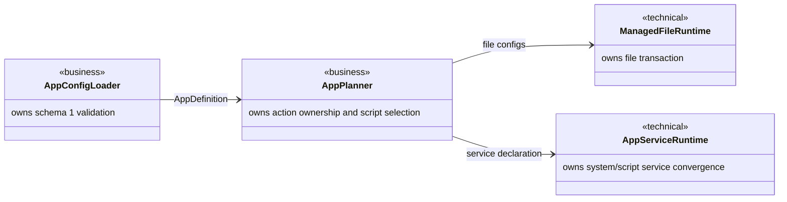
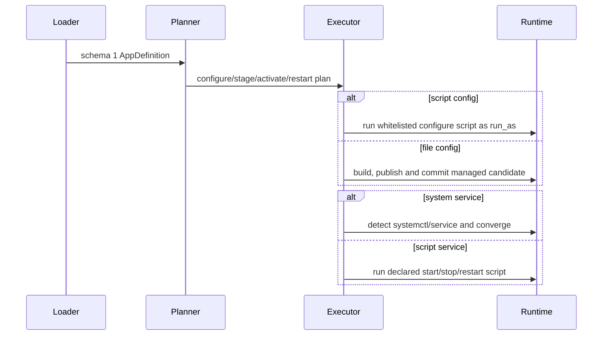

# sfo-deploy App schema 1 设计

Risk profile: ./risk-profile.yaml

## Design Scope

### Goals

- 只装载 `app.yaml schema_version: 1`，移除 App v2/v3/v4 装载路径。
- 使用顶层 `configs` 支持多个配置条目；条目不含 `name`，以 `kind: script|file` 区分类型。
- 使用 `management.service` 支持 `kind: system` 与 `kind: script` 两种服务管理。
- 系统服务通过 `tool: auto|systemctl|service` 覆盖 Ubuntu/CentOS。
- 保留受管文件事务、权限白名单、非 root `run_as`、秘密隔离和失败关闭边界。

### Non-goals

- 不兼容旧 App schema，不提供迁移器或兼容 shim。
- 不调整 cluster/machine/environment schema。
- 不执行真实 SSH 或服务操作。
- 不引入非 Linux 服务管理器。

## Useful Context

当前 App v4 只在 `management.actions` 中声明受管文件与 systemd 服务；执行器假设服务原语固定为
systemd。Environment 已经有 `install/manager` 和 `system/script` 的运行时模式。新设计复用这些
经验，但只在 App 配置契约内生效。

## Overall Approach

装载层是唯一 schema 边界。YAML 中的顶层 `configs` 解析为两类内部表示：受管文件继续进入现有配置
事务；脚本配置变成带权限的脚本调用，并在 `configure` 生命周期执行。`management.service` 归一为
systemd/system 或 script 服务。system 服务映射到现有 systemd 编排并新增发行版工具选择；script
服务提供固定 `start/stop/restart` 调用。

## Layered Design Document Index

| level | parent_document | unit | design_document | responsibility |
|-------|-----------------|------|-----------------|----------------|
| root | `design.md` | sfo-deploy App 生命周期 | `design.md` | 整体契约、运行时分解和实现顺序 |

not-applicable: 本次变更在同一 App 生命周期边界内完成，无需独立子模块设计文档。

## Module Relationship UML



## File-Level Interfaces

```typescript
export type AppConfigKind = "script" | "file";

export interface AppConfigScriptInvocation {
  readonly kind: "script";
  readonly invocation: ScriptInvocation;
}

export interface AppFileConfig {
  readonly kind: "file";
  readonly config: ManagedConfigFile;
}

export type AppConfigDefinition = AppConfigScriptInvocation | AppFileConfig;

export type AppServiceTool = "auto" | "systemctl" | "service";

export interface AppSystemServiceManagement extends SystemdServiceManagement {
  readonly tool: AppServiceTool;
}

export interface AppScriptServiceManagement {
  readonly kind: "script";
  readonly start: ScriptInvocation;
  readonly stop: ScriptInvocation;
  readonly restart: ScriptInvocation;
}

export type AppServiceManagement =
  | AppSystemServiceManagement
  | AppScriptServiceManagement;

export interface AppManagementDefinition {
  readonly runAs: string;
  readonly configs: readonly ManagedConfigFile[];
  readonly configScripts: readonly ScriptInvocation[];
  readonly service?: AppServiceManagement;
  readonly hooks: ReadonlyMap<AppManagementHook, readonly ScriptInvocation[]>;
}
```

- Consumer: `loadApps`, `buildPlan`, `PlanExecutor` / CHG-001 与 CHG-002
- Compatibility: breaking
- 旧 App schema 拒收，类型仅是内部归一表示，不在 YAML 中暴露 `name`。
- Migration path: 本仓库内的类型消费者、测试、文档和示例在本次任务中迁移；外部用户必须重写为
  schema 1。

`ManagedConfigFile.name` 只保留为运行时内部标识，由装载器按确定性顺序生成；schema 1 条目不声明
该字段。受管文件唯一性仍按目标路径检查，脚本配置唯一性按 App 相对脚本路径检查。

## API and Build Surface Impact

- Public API impact: breaking
- Crate-root export change: yes
- 导出的 App 管理类型形状变化。
- Build-surface change: no
- Documentation examples affected: yes
- `README.md`、配置指南、技能参考与示例 `app.yaml`。

## Consumer Migration Closure

| Old Symbol | New Path | change_id | Consumer Path | Consumer Kind | Migration Status |
|------------|----------|-----------|---------------|---------------|------------------|
| App schema 2/3/4 loader | `src/config.ts` schema 1 loader | CHG-001 | `tests/unit/config_planning.test.ts` | negative/positive fixture | migrated |
| `management.actions` | top-level `configs` + `management.service` | CHG-001 | `tests/unit/app_management_config.test.ts` | unit test | migrated |
| fixed systemd primitive | `AppServiceManagement` | CHG-002 | `src/service_management.ts` | runtime | migrated |
| v4 app examples | schema 1 examples | CHG-003 | `examples/eleph-server-multipass/cluster-template/apps/jx-server/app.yaml` | example | migrated |
| v4 skill guidance | schema 1 skill guidance | CHG-003 | `skills/sfo-deploy-cluster/references/app.md` | documentation | migrated |

## Key Flows



失败时，受管文件继续使用现有备份恢复；system 服务继续读取事前状态并做单次补偿。脚本配置或脚本
服务失败时立即停止当前步骤，不提供框架自动补偿；用户脚本必须幂等。取消或超时后不会写入版本标记。

## State and Ownership

not-applicable: 本任务不新增持久状态；版本标记、发布历史和受管配置备份仍由现有 owner 管理。

## Directly Mapped Change Items

| change_id | target_module | proposal_id | Design Coverage | Scope Paths | Interface / Boundary Impact | Notes |
|-----------|---------------|-------------|-----------------|-------------|-----------------------------|-------|
| CHG-001 | sfo-deploy | P-001 | File-Level Interfaces, Key Flows | `src/config.ts`, `src/types.ts`, `src/planning.ts`, `src/execution.ts`, `src/history.ts`, `tests/unit/**`, `tests/dv/**`, `tests/integration/**` | breaking schema | 配置条目与所有权唯一 |
| CHG-002 | sfo-deploy | P-002 | File-Level Interfaces, Key Flows | `src/config.ts`, `src/types.ts`, `src/planning.ts`, `src/execution.ts`, `src/service_management.ts`, `tests/unit/**`, `tests/dv/**`, `tests/integration/**` | breaking service contract | 支持 system/script 和 Ubuntu/CentOS 工具 |
| CHG-003 | sfo-deploy | P-003 | Consumer Migration Closure | `README.md`, `docs/guides/sfo-deploy-cluster-configuration.md`, `skills/sfo-deploy-cluster/references/app.md`, `skills/sfo-deploy-cluster/assets/app-config/app.yaml`, `skills/sfo-deploy-cluster/assets/app-versioned/app.yaml`, `examples/eleph-server-multipass/cluster-template/apps/**` | documentation/examples | schema 1 示例同步 |

## Implementation Order

| Phase | Goal | Depends On | Output |
|-------|------|------------|--------|
| 1 | 更新类型和 schema 1 装载 | none | 严格的 configs/management 契约 |
| 2 | 更新计划、执行、服务编排和历史序列化 | Phase 1 | 可执行 schema 1 行为 |
| 3 | 更新文档、技能和示例 | Phase 2 | 一致的用户契约 |

## File-Level Implementation Sequence

| sequence | file_level_module | action | depends_on | change_id | scope_path | implementation_task |
|----------|-------------------|--------|------------|-----------|------------|---------------------|
| 1 | `src/types.ts` | modify | none | CHG-001, CHG-002 | `src/types.ts` | I-001 |
| 2 | `src/config.ts` | modify | `src/types.ts` | CHG-001, CHG-002 | `src/config.ts` | I-001 |
| 3 | `src/planning.ts` | modify | `src/config.ts` | CHG-001, CHG-002 | `src/planning.ts` | I-002 |
| 4 | `src/service_management.ts` | modify | `src/types.ts` | CHG-002 | `src/service_management.ts` | I-002 |
| 5 | `src/execution.ts` | modify | `src/planning.ts` | CHG-001, CHG-002 | `src/execution.ts` | I-002 |
| 6 | `src/history.ts` | modify | `src/types.ts` | CHG-001, CHG-002 | `src/history.ts` | I-002 |
| 7 | `src/environment_runtime.ts` | modify | none | CHG-002 | `src/environment_runtime.ts` | I-002 |
| 8 | `tests/unit/app_management_config.test.ts` | modify | `src/config.ts` | CHG-001, CHG-002 | `tests/**` | I-003 |
| 9 | `tests/unit/app_management_execution.test.ts` | modify | `src/execution.ts` | CHG-001, CHG-002 | `tests/**` | I-003 |
| 10 | `tests/unit/service_management.test.ts` | modify | `src/service_management.ts` | CHG-002 | `tests/**` | I-003 |
| 11 | `README.md` | modify | implementation | CHG-003 | `README.md` | I-004 |
| 12 | `docs/guides/sfo-deploy-cluster-configuration.md` | modify | implementation | CHG-003 | `docs/guides/**` | I-004 |
| 13 | `skills/sfo-deploy-cluster/references/app.md` | modify | implementation | CHG-003 | `skills/sfo-deploy-cluster/**` | I-004 |
| 14 | `skills/sfo-deploy-cluster/assets/app-config/app.yaml` | modify | implementation | CHG-003 | `skills/sfo-deploy-cluster/**` | I-004 |
| 15 | `skills/sfo-deploy-cluster/assets/app-versioned/app.yaml` | modify | implementation | CHG-003 | `skills/sfo-deploy-cluster/**` | I-004 |
| 16 | `examples/eleph-server-multipass/cluster-template/apps/jx-server/app.yaml` | modify | implementation | CHG-003 | `examples/**` | I-004 |
| 17 | `examples/eleph-server-multipass/cluster-template/apps/nginx/app.yaml` | modify | implementation | CHG-003 | `examples/**` | I-004 |

## Design Notes

- Rejected alternative: 继续扩展 v4 `management.actions`；它不能同时满足顶层 `configs` 和“不管历史
  版本兼容”的明确要求。
- New abstraction justification: `AppServiceManagement` 将 system 与 script 服务统一为一个消费者接口，
  避免计划器重复分叉；受管文件和脚本配置保持不同执行边界，防止脚本绕过文件事务假设。
- Rollout/rollback constraints: schema 是破坏性切换，不能部分生效；发布前必须通过本仓库测试和文档
  同步。运行失败通过现有步骤失败语义暴露，不自动伪装成功。
- Test-stage details: intentionally omitted; testing-stage owns test-case design and test implementation.

## Risks and Rollback

- 旧 schema 移除可能影响未发现的消费者；实现时通过全仓库符号/字符串扫描和测试更新闭合。
- 脚本服务没有统一的 active-state 契约；脚本自身必须以退出码表达成功与失败。
- `service` 工具不提供 systemd 的 daemon-reload/is-enabled 语义；使用 `service` 时禁止
  `unit_config`，并要求 `daemon_reload: false`、`enabled` 缺省。
