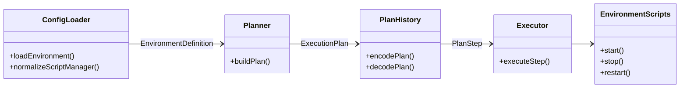
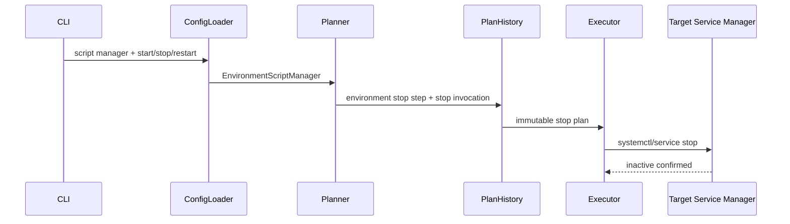

# Design：Environment script manager 的 stop 生命周期

Risk profile: ./risk-profile.yaml

## Design Scope

本次扩展 Environment 新生命周期的 `manager.kind: script`：配置和可重放计划从 `start`/`restart`
扩展为 `start`/`stop`/`restart`。CLI 直接请求 script manager 环境的 `stop` 时，执行器调用用户脚本。
system manager 保持既有 start/restart 内置能力，不在本次扩大到环境级 stop。缺省 manager 仍只安装
依赖，不产生任何服务动作。旧顶层 `scripts` 环境继续按旧路径运行，不迁移。

## Useful Context

当前 `EnvironmentScriptManager` 只有 start/restart；装载器禁止 stop 字段，计划器只在 start/restart
选择脚本调用。App managed script service 已有 start/stop/restart，可复用其生命周期形状，但不复用
其 run_as/delivery 机制。实际 multipass 集群的 MySQL 和 Redis 已经用脚本探测 Ubuntu/CentOS 的服务名。

## Overall Approach

装载器把 script manager 归一为包含 stop 的三段调用；YAML 必须声明三段。计划器在 start、stop、
restart 三个动作上都携带 manager 声明，并选择对应调用。plan v4 编码始终写入 stop；解码接受缺少
stop 的旧快照，但只有 start/restart 步骤可用；旧快照请求 stop 时失败关闭。Multipass 示例和实际集群
补充自包含 stop 脚本，仍通过 systemctl/service 操作服务并确认 inactive。

## Layered Design Document Index

| level | parent_document | unit | design_document | responsibility |
|-------|-----------------|------|-----------------|----------------|
| sfo-deploy | design.md | sfo-deploy | design.md | 顶层模块边界、兼容性和实现顺序 |
| environment-lifecycle | design.md | environment-lifecycle | design/environment-lifecycle.md | 类型、装载、计划、快照与执行分解 |

## Module Relationship UML



## Key Flows



失败路径：YAML 缺 stop、stop 脚本路径非法、历史快照非法、服务工具缺失、stop 命令非零或停止后
状态仍 active 都会失败关闭。执行器不隐藏回退工具的失败，也不直接杀进程。

## State and Ownership

- Owner: `EnvironmentDefinition` 拥有装载期三段 manager 声明；`PlanStep.environmentManager` 拥有可
  重放计划数据；服务 active/enabled 状态由目标节点拥有。

控制端不持久化服务状态。历史快照只在计划数据中携带脚本调用。`stop` 的目标状态是 inactive；已停止
服务再次 stop 视为幂等成功。

## API and Build Surface Impact

- Public API impact: migration-required
- Crate-root export change: no
- Build-surface change: yes
- Documentation examples affected: yes

`environment.yaml` 的 script manager 从两项扩展为三项；现有 script manager 配置必须补 `stop` 后才能
通过当前版本装载。plan v4 保持向后兼容：新快照携带 stop，旧快照的 start/restart 步骤可回放，旧快照
的 stop 步骤失败关闭。受影响消费者包括文档、模板、实际 multipass 集群和配置契约测试。

## environment-lifecycle

详细设计见 [environment-lifecycle.md](design/environment-lifecycle.md)。

## Consumer Migration Closure

| old_symbol | new_path | change_id | consumer_path | consumer_kind | migration_status |
|------------|----------|-----------|---------------|---------------|------------------|
| script manager start/restart YAML | script manager start/stop/restart YAML | CHG-environment-script-manager-stop | examples/eleph-server-multipass/cluster-template/environments/mysql/environment.yaml | configuration | migrated |
| script manager start/restart YAML | script manager start/stop/restart YAML | CHG-environment-script-manager-stop | examples/eleph-server-multipass/cluster-template/environments/redis/environment.yaml | configuration | migrated |
| two-action script manager guide | three-action script manager guide | CHG-environment-script-manager-stop | docs/guides/sfo-deploy-cluster-configuration.md | documentation | migrated |
| two-action script manager skill reference | three-action script manager skill reference | CHG-environment-script-manager-stop | skills/sfo-deploy-cluster/references/environment.md | documentation | migrated |

## File-Level Interfaces

- Consumer: `src/config.ts`, `src/planning.ts`, `src/history.ts`, `src/execution.ts`；change_id
  `CHG-environment-script-manager-stop`
- Compatibility: migration-required

```typescript
// src/types.ts
// consumer: src/config.ts, src/planning.ts, src/history.ts, src/execution.ts; CHG-environment-script-manager-stop
export interface EnvironmentScriptManager {
  readonly kind: "script";
  readonly start: ScriptInvocation;
  /** 新配置必需；旧 plan-v4 快照解码后可缺失。 */
  readonly stop?: ScriptInvocation;
  readonly restart: ScriptInvocation;
}
```

```typescript
// src/config.ts
// consumer: loadEnvironment; CHG-environment-script-manager-stop
async function environmentScriptManager(
  value: unknown,
  directory: string,
  label: string,
): Promise<EnvironmentScriptManager>;
```

```typescript
// src/history.ts
// consumer: release snapshot replay; CHG-environment-script-manager-stop
async function encodeEnvironmentManager(
  manager: EnvironmentManagerDefinition,
  archive: ArchiveWriter,
): Promise<JsonObject>;
async function decodeEnvironmentManager(
  raw: unknown,
  snapshot: string,
  action: string,
): Promise<EnvironmentManagerDefinition | undefined>;
```

```typescript
// src/planning.ts
// consumer: executor and plan history; CHG-environment-script-manager-stop
function selectEnvironmentScriptManagerInvocation(
  manager: EnvironmentScriptManager,
  action: "start" | "stop" | "restart",
): ScriptInvocation;
```

## Directly Mapped Change Items

| change_id | proposal_id | target_module | design_coverage | scope_paths |
|-----------|-------------|---------------|-----------------|-------------|
| CHG-environment-script-manager-stop | P-001, P-002 | sfo-deploy | `## File-Level Interfaces`、`design/environment-lifecycle.md`、`design/environment-lifecycle.md` Service Scripts | `src/types.ts`, `src/config.ts`, `src/planning.ts`, `src/history.ts`, `src/execution.ts`, `tests/**`, `README.md`, `docs/guides/sfo-deploy-cluster-configuration.md`, `docs/modules/sfo-deploy.md`, `skills/sfo-deploy-cluster/references/environment.md`, `examples/eleph-server-multipass/**` |

## Implementation Order

| phase | goal | depends_on | output |
|-------|------|------------|--------|
| 1 | 扩展类型与配置装载 | none | YAML 可声明必需 stop |
| 2 | 更新计划和快照 | 1 | direct stop 可计划且 plan v4 可往返 |
| 3 | 接入执行器与测试 | 2 | stop 调用和兼容行为可验证 |
| 4 | 更新文档和集群脚本 | 3 | 模板与实际集群可 stop |

## File-Level Implementation Sequence

| sequence | file_level_module | action | depends_on | change_id | scope_path | implementation_task |
|----------|-------------------|--------|------------|-----------|------------|---------------------|
| 1 | `src/types.ts` | modify | none | CHG-environment-script-manager-stop | `src/types.ts` | parent |
| 2 | `src/config.ts` | modify | 1 | CHG-environment-script-manager-stop | `src/config.ts` | parent |
| 3 | `src/planning.ts` | modify | 2 | CHG-environment-script-manager-stop | `src/planning.ts` | parent |
| 4 | `src/history.ts` | modify | 3 | CHG-environment-script-manager-stop | `src/history.ts` | parent |
| 5 | `src/execution.ts` | modify | 3 | CHG-environment-script-manager-stop | `src/execution.ts` | parent |
| 6 | `tests/**` | modify | 5 | CHG-environment-script-manager-stop | `tests/**` | parent |
| 7 | `README.md`, `docs/**`, `skills/sfo-deploy-cluster/**` | modify | 5 | CHG-environment-script-manager-stop | `README.md`, `docs/**`, `skills/sfo-deploy-cluster/**` | parent |
| 8 | `examples/eleph-server-multipass/**` | modify | 7 | CHG-environment-script-manager-stop | `examples/eleph-server-multipass/**` | parent |

## Design Notes

`stop` 在 YAML 是必需字段，但在内存值对象中可选，是为了让没有 stop 步骤的旧 plan v4 快照继续回放。
这不是配置级兼容 shim；新配置装载必须提供 stop，旧快照请求 stop 时失败关闭。脚本仍由环境目录交付，
框架不生成 MySQL/Redis 专属脚本。

## Risks and Rollback

- 旧 plan v4 快照缺少 stop：start/restart 回放保持可用，direct stop 拒绝执行。
- 服务名探测失败、服务工具缺失、stop 非零或 active 状态未收敛都失败关闭。
- 回滚以代码回退为准；新 YAML 移除 `manager.stop` 后恢复旧契约，但不支持环境级 stop。
