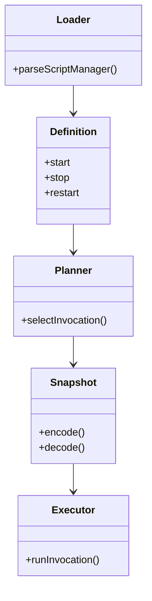

# Environment lifecycle：script manager stop

Risk profile: ../risk-profile.yaml

## 职责

该子模块负责 script manager 三段调用的装载、计划、快照和执行。它不改 package install、system
manager 的固定远端命令，也不改 App managed service 的 run_as 与配置事务。

## 模块关系



## Configuration Shape

```yaml
schema_version: 1
name: mysql
version: "8.0"
requires_privilege: true
install:
  kind: package
  manager: auto
  packages: [mysql-server]
  update_cache: true
manager:
  kind: script
  start:
    path: scripts/start.ts
    permissions:
      run: [/usr/bin/test, /usr/bin/systemctl, /usr/bin/service]
      net: []
  stop:
    path: scripts/stop.ts
    permissions:
      run: [/usr/bin/test, /usr/bin/systemctl, /usr/bin/service]
      net: []
  restart:
    path: scripts/restart.ts
    permissions:
      run: [/usr/bin/test, /usr/bin/systemctl, /usr/bin/service]
      net: []
```

装载规则：

- `manager.kind: script` 的必需字段是 `start`、`stop`、`restart`；未知字段拒绝。
- 三段各自复用 `{path, permissions}` 校验，路径必须位于环境目录内。
- `stop` 缺失、空对象或路径逃逸都在装载期失败。
- 顶层 `scripts` 与 `install`/`manager` 仍互斥；system manager 不受影响。

## Planning Contract

- `prepare` 仍生成 `install -> start -> restart`；不生成 stop。
- `deploy` 和 `configure` 仍只生成 `install`，不改变服务状态。
- direct `start` 和 `restart` 携带 system 或 script manager 的 `environmentManager`。
- direct `stop` 只携带 script manager；system manager 的环境级 stop 不在本次范围内。
- script manager 按 `currentAction` 选择对应 invocation；缺少对应调用时计划失败。
- system manager 的内置行为不变。

## Snapshot Contract

- 新 plan v4 的 script manager 编码 `start`、`stop`、`restart`。
- 旧 plan v4 只有 `start` 和 `restart` 时，start/restart 步骤可解码和回放。
- 旧快照的 stop 步骤或缺少 stop 的 stop 请求必须失败关闭。
- plan v3 继续不携带新字段。

## Execution Contract

- Executor 在 `stop` 动作上调用 script manager 的 `stop` 调用。
- 脚本必须自包含、幂等，并且只通过服务管理器停止服务。
- systemd 分支：探测 unit，`systemctl stop`，然后确认 `systemctl is-active --quiet` 非零。
- SysV 分支：探测 init 脚本，`service stop`，然后确认 `service status` 非零。
- 已停止服务可再次 stop；停止失败、工具缺失或状态仍 active 都失败。

## Service Scripts

MySQL 的候选服务名是 `mysql` 和 `mysqld`；Redis 的候选服务名是 `redis-server` 和 `redis`。三个脚本
必须独立，不导入兄弟模块，也不读取环境参数。它们的 run 权限只列出 `/usr/bin/test`、
`/usr/bin/systemctl` 和 `/usr/bin/service`。

## 回滚

代码回退后，新配置的 `manager.stop` 会因未知字段被旧版本拒绝。若需要回滚配置，先移除 `manager.stop`
和 stop 脚本，再回退代码；实际集群停止能力随之消失。
