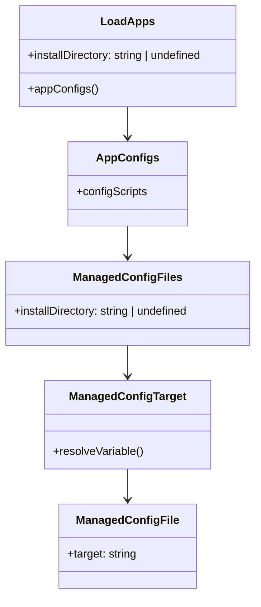
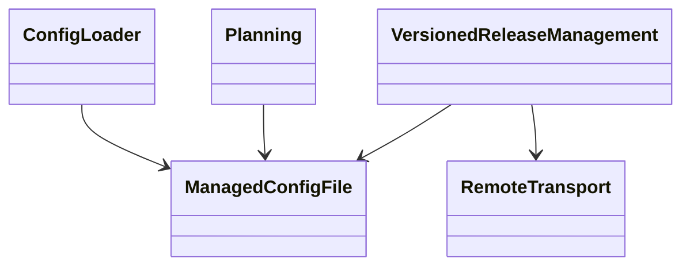
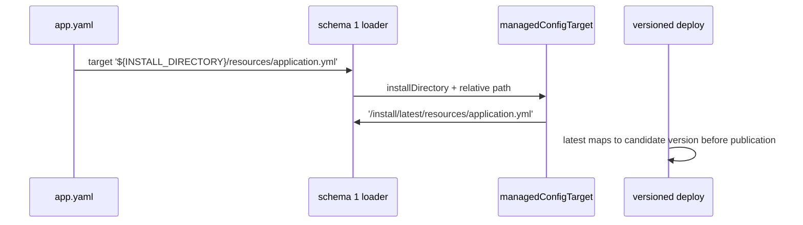

# multipass App 配置与 schema 1 安装目录绑定设计

Risk profile: ./risk-profile.yaml

## Design Scope

本次覆盖两类行为：

1. 恢复 App schema 1 顶层 `configs` 对 `${INSTALL_DIRECTORY}/` 目标的绑定，使装载结果与
   070 已验收契约一致：变量展开为 `<install_directory>/latest/<relative>`，后续由版本化
   发布逻辑映射到本次候选版本目录。
2. 将实际 multipass 集群的 `jx-server` 配置目标切换到该推荐写法，并把遗留明文 Redis 密码
   改为 `${ELEPH_REDIS_PASSWORD}`。`jx-web` 和 `nginx` 只做 schema 1 一致性检查；
   `nginx` 调整 `configs` 与 `management` 的书写顺序。

不扩展变量语法、不修改执行器协议、不改变旧绝对路径兼容语义、不调整 Redis 服务端或执行
真实部署。

## Useful Context

`src/config.ts` 的 `loadApps` 已经解析并校验 `install_directory`，当前把该值传给
`appManagement`，因此 `service.unit_config` 仍能解析相对 `working_directory`。但 schema 1
重构引入 `appConfigs` 后，调用 `managedConfigFiles` 时没有传 `installDirectory`，导致
`managedConfigTarget` 一律认为缺少安装目录。`managedConfigTarget` 本身已校验变量必须在
开头、只允许一个变量、后续片段为规范相对路径，并展开到 latest 前缀。

实际集群的三个 App 都已经是 schema 1；`jx-server` 的目标仍使用兼容的绝对 `latest` 路径。

## Overall Approach



最小修复是保留 `appConfigs` 现有职责，但让它接收并转发 `install_directory`。变量解析、
路径逃逸检查、重复目标检查和后续版本路径映射全部复用既有实现。这样 schema 1 不需要绕过
顶层配置装载，也不会为 `jx-server` 建立特例。

## Module Relationship UML



## Layered Design Document Index

| level | parent_document | unit | design_document | responsibility |
| --- | --- | --- | --- | --- |
| not-applicable: 单一配置装载回归修复，不拆子级设计 | design.md | not-applicable: 无独立子级模块 | not-applicable: 本任务不拆分子级设计文档 | not-applicable: 本任务不引入独立业务子模块 |

## File-Level Interfaces

- Consumer: `loadApps -> appConfigs -> managedConfigFiles`; change_id: CHG-sync-multipass-app-config
- Compatibility: backward-compatible

```typescript
// src/config.ts
// Consumer: loadApps; compatibility: backward-compatible
async function appConfigs(
  value: unknown,
  directory: string,
  installDirectory: string | undefined,
  label: string,
  secrets: ReadonlyMap<string, SecretDeclaration>,
): Promise<{
  configs: readonly ManagedConfigFile[];
  configScripts: readonly ScriptInvocation[];
}>;
```

`appConfigs` 是内部函数，签名变化不导出。`ManagedConfigFile.target` 仍然是归一后的远端
绝对路径；App YAML 输入中的 `${INSTALL_DIRECTORY}` 不会写入计划快照或远端配置内容。

## Key Flows



独立 `configure` 没有候选 release，继续通过 latest 写入当前版本。路径逃逸和缺失父目录沿用
既有本地/远端失败关闭行为。

## State and Ownership

- Owner: sfo-deploy config loader owns schema 1 install-directory binding and managed target normalization.

| State | Owner | Boundary |
| --- | --- | --- |
| `install_directory` | config loader | 装载期完成变量绑定，不读取控制机环境 |
| `ManagedConfigFile.target` | planning / versioned release management | 归一后的绝对路径；latest 是版本选择器 |
| `${ELEPH_REDIS_PASSWORD}` | cluster secrets loader | 只由 `cluster.yaml.secrets` 声明，配置源只写占位符 |

## Directly Mapped Change Items

| change_id | target_module | proposal_id | design_coverage | scope_paths |
| --- | --- | --- | --- | --- |
| CHG-sync-multipass-app-config | sfo-deploy | P-001, P-002, P-003, P-004 | schema 1 安装目录绑定回归修复、jx-server 推荐目标、集群秘密引用、jx-web/nginx 一致性检查和本地 validate/plan 证据 | `src/config.ts`, `tests/**`, `examples/eleph-server-multipass/clusters/multipass/apps/**` |

## API and Build Surface Impact

- Public API impact: backward-compatible
- Crate-root export change: no
- Build-surface change: no
- Documentation examples affected: no

修复仅改变当前 schema 1 顶层配置的内部调用，使既定 YAML 目标契约重新可用；不新增导出，
不改变计划格式或旧绝对路径兼容。

## Implementation Order

| phase | goal | depends_on | output |
| --- | --- | --- | --- |
| 1 | 恢复参数绑定并补装载测试 | none | `src/config.ts` 与 schema 1 回归测试 |
| 2 | 切换实际集群推荐目标 | 1 | `jx-server/app.yaml` |
| 3 | 运行集群与定向验证 | 1, 2 | 通过的 validate/plan 和测试 |

## File-Level Implementation Sequence

| sequence | file_level_module | action | depends_on | change_id | scope_path | implementation_task |
| --- | --- | --- | --- | --- | --- | --- |
| 1 | src/config.ts | modify | none | CHG-sync-multipass-app-config | `src/config.ts` | root |
| 2 | tests/unit/app_management_config.test.ts | modify | 1 | CHG-sync-multipass-app-config | `tests/**` | root |
| 3 | examples/eleph-server-multipass/clusters/multipass/apps/jx-server/app.yaml | modify | 1 | CHG-sync-multipass-app-config | `examples/eleph-server-multipass/clusters/multipass/apps/**` | root |
| 4 | examples/eleph-server-multipass/clusters/multipass/apps/jx-web/app.yaml, examples/eleph-server-multipass/clusters/multipass/apps/nginx/app.yaml | verify/adjust | none | CHG-sync-multipass-app-config | `examples/eleph-server-multipass/clusters/multipass/apps/**` | root |

## Design Notes

`service.unit_config` 与顶层 `configs` 都需要安装目录，但二者语义不同：前者是 systemd unit
文件，后者是业务配置资源。修复只恢复 schema 1 顶层配置的既有参数传递，不把二者归并。

`nginx` 的字段顺序不是契约规则；调整它是为了与集群模板和指南示例保持一致，避免后续维护
误读。`jx-web` 无配置，不添加虚构字段。

## Risks and Rollback

- 若变量片段允许 `..` 或非规范路径，会产生配置路径逃逸；继续依赖 `managedConfigTarget`
  在 join 前拒绝，并在测试中覆盖失败分支。
- 若缺失参数的修复被误扩展到执行器，可能改变旧路径语义；本次只修改装载层参数转发。
- Redis 目标必须接受集群 `ELEPH_REDIS_PASSWORD`，否则真实部署后连接失败；本地
  `validate`/`plan` 不能证明该运行时前提。
- 回退方式：代码恢复不传参会让推荐目标继续失败关闭；配置可改回兼容的绝对 latest 路径。
