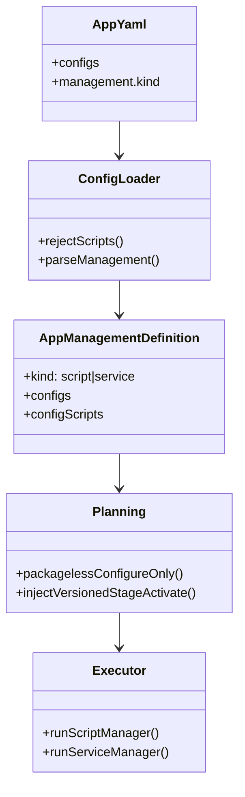
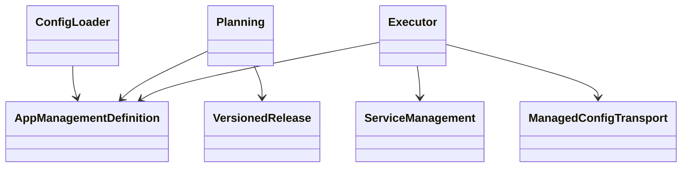
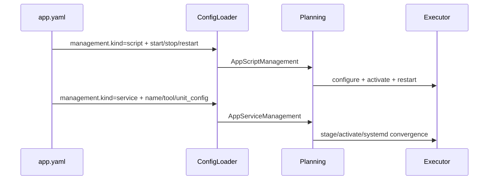

# App management.kind 配置契约设计

Risk profile: ./risk-profile.yaml

## Design Scope

App schema 1 的动作声明面收敛为顶层 `configs` 与 `management`。App YAML 禁止顶层
`scripts`，也不新增 `management.check`。`management` 直接使用 `kind` 分派：

- `kind: script` 携带 `start`、`stop`、`restart` 三个脚本 invocation。
- `kind: service` 携带系统服务配置：`name`、`tool`、`enabled`、`daemon_reload`、
  `on_deploy`、`timeout_ms` 和可选 `unit_config`。

装载器把外部 `kind: service` 归一为内部 service manager，`unit` 来自 `name`。内部计划
快照使用归一后的 `manager`，不再有 `management.service` 包装层。

## Useful Context

当前 `AppDefinition.scripts` 是顶层脚本的所有权载体，planning 用它生成 packageless
`check`、自定义 configure/deploy 和内置 stage/activate。执行器从
`management.service` 取服务管理器。移除顶层脚本后，只有 `configs[].kind: script`
和 `management.kind` 能携带用户脚本；内置 stage/activate 仍由框架注入。

## Overall Approach



`AppDefinition` 不再有 `scripts`。planning 为 versioned App 注入框架 stage/activate
脚本；packageless deploy 只生成 `configure`，若没有受管配置或管理器则不生成无意义步骤。
`management.kind: script` 的三个 invocation 进入 bundle；`management.kind: service`
沿用既有 systemd/SysV 执行路径。

## Module Relationship UML



## Layered Design Document Index

| level | parent_document | unit | design_document | responsibility |
| --- | --- | --- | --- | --- |
| not-applicable: 单一配置契约重构，不拆子级设计 | design.md | not-applicable: 无独立子级模块 | not-applicable: 本任务不拆分子级设计文档 | not-applicable: 本任务不引入独立业务子模块 |

## File-Level Interfaces

- Consumer: config loader, planning, execution, history, CLI; change_id: CHG-remove-app-scripts-node
- Compatibility: breaking

```typescript
// src/types.ts
// Consumer: App schema 1 loader/plan/execute; compatibility: breaking
export type AppManagementKind = "script" | "service";

export interface AppScriptManagement {
  readonly kind: "script";
  readonly start: ScriptInvocation;
  readonly stop: ScriptInvocation;
  readonly restart: ScriptInvocation;
}

export interface AppServiceManagement {
  readonly kind: "service";
  readonly unit: string;
  readonly tool: "auto" | "systemctl" | "service";
  readonly enabled?: boolean;
  readonly daemonReload: boolean;
  readonly onDeploy: SystemdDeployAction;
  readonly timeoutMs: number;
  readonly unitConfig?: SystemdUnitConfig;
}

export type AppManagerDefinition = AppScriptManagement | AppServiceManagement;

export interface AppManagementDefinition {
  readonly runAs?: string;
  readonly manager: AppManagerDefinition;
  readonly configs: readonly ManagedConfigFile[];
  readonly configScripts: readonly ScriptInvocation[];
}
```

旧 `management.service`、顶层 `scripts`、`management.hooks` 都不是合法输入。计划快照中
`management` 使用归一后的 `manager`；旧快照按破坏性契约拒收，需要用当前配置重新生成。

## Key Flows



packageless deploy 不再有 check。planning 生成受管 configure；没有受管动作时不生成步骤。
versioned deploy 仍然先完成全部 stage，再 activate 并立即收敛服务。

## State and Ownership

- Owner: sfo-deploy config loader owns App management parsing and normalized manager state.

| State | Owner | Boundary |
| --- | --- | --- |
| `management.kind` | config loader | YAML 唯一入口；执行器只消费归一结果 |
| App script bundle | planning | 仅包含 config scripts、script manager 脚本和内置 release 脚本 |
| systemd state | service management | 沿用既有恢复和状态确认 |

## Directly Mapped Change Items

| change_id | target_module | proposal_id | design_coverage | scope_paths |
| --- | --- | --- | --- | --- |
| CHG-remove-app-scripts-node | sfo-deploy | P-001, P-002, P-003, P-004 | 禁止顶层 scripts、management.kind 分派、packageless 去 check、快照/CLI/文档/示例同步与测试 | `src/**`, `tests/**`, `docs/guides/sfo-deploy-cluster-configuration.md`, `docs/modules/sfo-deploy.md`, `examples/eleph-server-multipass/**`, `skills/sfo-deploy-cluster/**` |

## API and Build Surface Impact

- Public API impact: breaking
- Crate-root export change: no
- Build-surface change: no
- Documentation examples affected: yes

`AppDefinition.scripts`、`AppManagementDefinition.service`、`AppScriptServiceManagement`
和 hook 字段从公开类型中移除。导出消费者必须改用 `AppManagerDefinition` 及其两个分支。

## Consumer Migration Closure

| old_symbol | new_path | change_id | consumer_path | consumer_kind | migration_status |
| --- | --- | --- | --- | --- | --- |
| `AppDefinition.scripts` | removed / built-in stage-activate + `configs[].kind: script` | CHG-remove-app-scripts-node | src/types.ts | public type | migrated |
| `AppManagementDefinition.service` | `AppManagementDefinition.manager` | CHG-remove-app-scripts-node | src/types.ts | public type | migrated |
| `AppScriptServiceManagement` | `AppScriptManagement` | CHG-remove-app-scripts-node | src/types.ts | public type | migrated |
| `AppManagementHook` | removed | CHG-remove-app-scripts-node | src/types.ts | public type | migrated |
| `SystemdServiceManagement` | `AppServiceManagement` | CHG-remove-app-scripts-node | src/types.ts | public type | migrated |
| `management.service.kind` | `management.kind: service` | CHG-remove-app-scripts-node | src/config.ts | configuration loader | migrated |

## Implementation Order

| phase | goal | depends_on | output |
| --- | --- | --- | --- |
| 1 | 更新类型、装载校验和规划 | none | schema/plan 契约 |
| 2 | 更新执行、历史、CLI | 1 | 运行时一致性 |
| 3 | 同步文档、技能和 multipass 配置 | 1 | 用户可见契约 |
| 4 | 更新并运行测试 | 1, 2, 3 | 通过的验证 |

## File-Level Implementation Sequence

| sequence | file_level_module | action | depends_on | change_id | scope_path | implementation_task |
| --- | --- | --- | --- | --- | --- | --- |
| 1 | src/types.ts | modify | none | CHG-remove-app-scripts-node | `src/types.ts` | root |
| 2 | src/config.ts | modify | 1 | CHG-remove-app-scripts-node | `src/config.ts` | root |
| 3 | src/planning.ts | modify | 1 | CHG-remove-app-scripts-node | `src/planning.ts` | root |
| 4 | src/execution.ts, src/history.ts, src/cli.ts, src/mod.ts | modify | 2 | CHG-remove-app-scripts-node | `src/**` | root |
| 5 | tests/unit/app_management_config.test.ts, tests/unit/history*.test.ts, tests/dv/app_management_execution.test.ts | modify | 1 | CHG-remove-app-scripts-node | `tests/**` | root |
| 6 | examples/eleph-server-multipass/**, README.md, docs/guides/**, skills/sfo-deploy-cluster/** | modify | 1 | CHG-remove-app-scripts-node | `examples/eleph-server-multipass/**`, `README.md`, `docs/guides/**`, `skills/sfo-deploy-cluster/**` | root |

## Design Notes

`configs[].kind: script` 不受顶层 `scripts` 禁令影响；它仍受与受管 file 配置互斥和权限
白名单约束。`management.kind: script` 的三个脚本必须幂等，stop 也要显式声明，因为计划快照
需要支持 stop/restart 动作。

packageless 失去 check 是用户确认的显式取舍。配置型 App 不再使用 check 来提前发现 sudo、
二进制或服务可用性问题；这些问题会推迟到配置发布或服务动作。

## Risks and Rollback

- 破坏性变更会拒收旧 App YAML 和旧计划快照；用户需迁移配置并用当前 CLI 重新生成计划。
- `management.kind: script` 依赖脚本存在、权限准确和幂等；本地计划通过不代表远端可运行。
- 若 service 管理器字段同步遗漏，会导致 validate/plan 或执行失败；用 schema 和执行测试覆盖。
- 回退需要恢复旧 schema 分支；本任务不提供旧契约兼容层。
