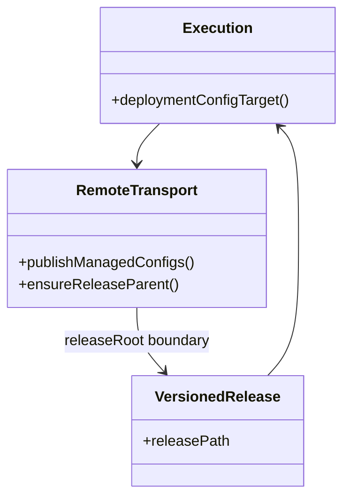
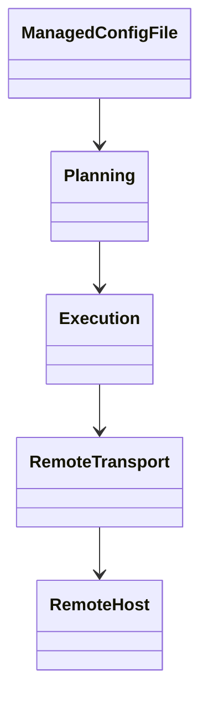
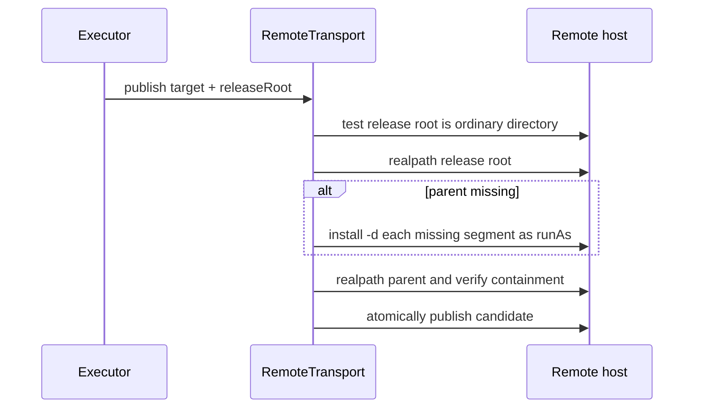

# versioned 配置父目录安全创建设计

Risk profile: ./risk-profile.yaml

## Design Scope

为带 `releaseRoot` 的受管配置发布增加受限父目录准备：目标父目录缺失时，先确认发布根是普通目录并解析其真实路径，再沿发布根到父目录的规范相对路径逐级检查和创建。父目录存在时保持真实路径边界校验；无 `releaseRoot` 的发布继续要求父目录已存在。

本任务不放宽目标路径规范、`latest` 映射、符号链接或受管配置事务语义。

## Useful Context

`src/execution.ts` 已把 `${INSTALL_DIRECTORY}/latest/resources/...` 映射到本次候选版本并设置 `releaseRoot`。`src/transport.ts` 当前用 `test -d` 拒绝缺失父目录，随后才检查发布根与 `realpath` 边界。内置发布脚本复制制品目录时不创建未存在于制品中的业务配置目录，因此不含 `resources/` 的 JX 制品会在 stage 配置发布前失败。

## Overall Approach



发布器收到 `releaseRoot` 后，先保持现有规范化目标、重复目标、发布根非符号链接与真实发布根检查。若目标父目录存在，继续 `realpath -e` 并验证其真实路径必须等于或位于真实发布根内。若父目录缺失，则把父目录拆成发布根下的非空规范片段，逐级检查每段不是符号链接且存在时为目录，然后用 `install -d` 创建缺失段；最后重新解析父目录并验证真实边界。

创建目录使用请求中的 `runAs` 作为 owner，模式 `0750`。当请求没有 `runAs` 时按当前特权账户创建；versioned App 的内置发布请求始终携带已验证 `runAs`。

## Module Relationship UML



## Layered Design Document Index

| level | parent_document | unit | design_document | responsibility |
| --- | --- | --- | --- | --- |
| not-applicable: 本任务只修改远端传输发布器单一职责，不拆子级设计 | design.md | not-applicable: 无独立子级模块 | not-applicable: 本任务不拆分子级设计文档 | not-applicable: 本任务不引入独立业务子模块 |

## File-Level Interfaces

- Consumer: sfo-deploy executor 调用 `RemoteSession.publishManagedConfigs`；change_id: CHG-versioned-config-parent
- Compatibility: backward-compatible

```typescript
// src/transport.ts
// Consumer: publishManagedConfigs -> OpenSshTransport; compatibility: backward-compatible
class OpenSshTransport {
  async publishManagedConfigs(
    requests: readonly ManagedConfigPublishRequest[],
    signal?: AbortSignal,
  ): Promise<readonly ManagedConfigPublication[]>;

  async #ensureReleaseParent(
    root: string,
    parent: string,
    runAs: string | undefined,
    signal?: AbortSignal,
  ): Promise<void>;
}
```

`ManagedConfigPublishRequest` 契约保持不变；`releaseRoot` 与 `runAs` 均为现有字段。

## Key Flows



创建失败、路径发现符号链接、发布根异常或最终 `realpath` 越界都会在写入目标前失败。若同一次请求已有前序配置成功发布，继续沿用现有恢复事务。

## State and Ownership

- Owner: versioned release management owns release root creation; remote transport owns managed-config parent preparation and path boundary checks.

| State | Owner | Boundary |
| --- | --- | --- |
| 版本目录及其 `VERSION` | versioned release management | 内置 stage 复制制品并提交版本目录 |
| 版本内受管配置父目录 | remote transport | 只依据已校验 `releaseRoot` 逐级准备 |
| 配置候选/备份/发布事务 | remote transport | 保留现有原子发布与恢复语义 |

## Directly Mapped Change Items

| change_id | target_module | proposal_id | design_coverage | scope_paths |
| --- | --- | --- | --- | --- |
| CHG-versioned-config-parent | sfo-deploy | P-001, P-002 | release parent 边界检查、受限目录创建、安全回归与部署文档同步 | `src/transport.ts`, `tests/integration/versioned_transport_boundary.test.ts`, `README.md`, `docs/modules/sfo-deploy.md`, `skills/sfo-deploy-cluster/**` |

## API and Build Surface Impact

- Public API impact: backward-compatible
- Crate-root export change: no
- Build-surface change: no
- Documentation examples affected: yes

`RemoteSession` 与计划契约不变；部署行为对缺少业务目录的合法制品向前兼容。

## Consumer Migration Closure

| old_symbol | new_path | change_id | consumer_path | consumer_kind | migration_status |
| --- | --- | --- | --- | --- | --- |
| “制品必须包含空 resources 目录”的要求 | 受限自动创建 release 内父目录 | CHG-versioned-config-parent | README.md | 配置契约文档 | migrated |
| “制品必须包含空 resources 目录”的要求 | 受限自动创建 release 内父目录 | CHG-versioned-config-parent | docs/modules/sfo-deploy.md | 模块边界文档 | migrated |
| “制品必须包含空 resources 目录”的要求 | 受限自动创建 release 内父目录 | CHG-versioned-config-parent | skills/sfo-deploy-cluster/references/app.md | 配置技能参考 | migrated |
| “制品必须包含空 resources 目录”的要求 | 受限自动创建 release 内父目录 | CHG-versioned-config-parent | docs/guides/sfo-deploy-cluster-configuration.md | 配置指南 | migrated |
| “制品必须包含空 resources 目录”的要求 | 受限自动创建 release 内父目录 | CHG-versioned-config-parent | examples/eleph-server-multipass/README.md | 示例契约文档 | migrated |

## Implementation Order

| phase | goal | depends_on | output |
| --- | --- | --- | --- |
| 1 | 实现 releaseRoot 内缺失父目录的受限创建 | none | transport 行为变更 |
| 2 | 扩展安全边界回归 | 1 | 集成测试 |
| 3 | 同步文档契约 | 1, 2 | README、模块边界与技能参考 |
| 4 | 运行统一测试与静态检查 | 2, 3 | 通过证据 |

## File-Level Implementation Sequence

| sequence | file_level_module | action | depends_on | change_id | scope_path | implementation_task |
| --- | --- | --- | --- | --- | --- | --- |
| 1 | src/transport.ts | modify | none | CHG-versioned-config-parent | `src/transport.ts` | root |
| 2 | tests/integration/versioned_transport_boundary.test.ts | modify | 1 | CHG-versioned-config-parent | `tests/integration/versioned_transport_boundary.test.ts` | root |
| 3 | README.md, docs/guides/sfo-deploy-cluster-configuration.md, docs/modules/sfo-deploy.md, examples/eleph-server-multipass/README.md, skills/sfo-deploy-cluster/references/app.md | modify | 1 | CHG-versioned-config-parent | `README.md`, `docs/guides/sfo-deploy-cluster-configuration.md`, `docs/modules/sfo-deploy.md`, `examples/eleph-server-multipass/README.md`, `skills/sfo-deploy-cluster/**` | root |

## Design Notes

逐级准备而不是 `mkdir -p`，是为了在创建前拒绝任一中间段是符号链接或非目录。`install -d -m 0750 -o <runAs>` 保证应用身份可穿越目录，同时不由其他用户写入。目标本身仍按普通文件发布，已存在非普通目标或符号链接目标继续拒绝。

无 `releaseRoot` 的配置可能位于服务目录或任意共享路径，框架无法推断安全根，因此继续要求父目录已存在。

## Risks and Rollback

- 竞态风险：检查与创建之间存在短暂窗口。单机部署持有 App 操作锁，远端真实路径边界仍会在创建后复核；本任务不引入异步并发目录写入。
- 权限风险：目录若由 root 创建，应用可能无法读取。缓解：versioned 请求使用已验证 `runAs` 作为目录 owner，并设置 `0750`。
- 回滚：移除父目录创建分支即可恢复旧行为；已创建的版本内目录只影响当前候选版本，不影响已发布 latest。
