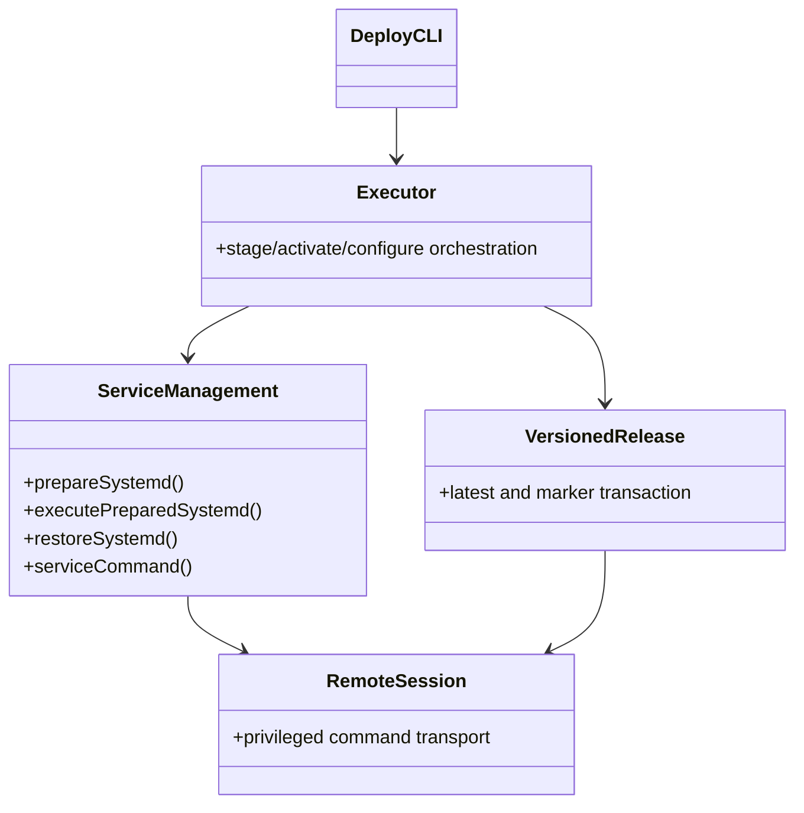
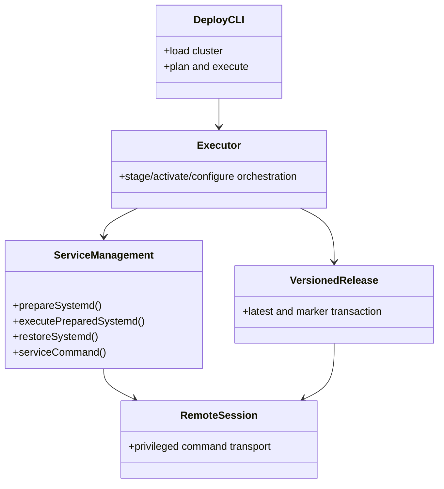
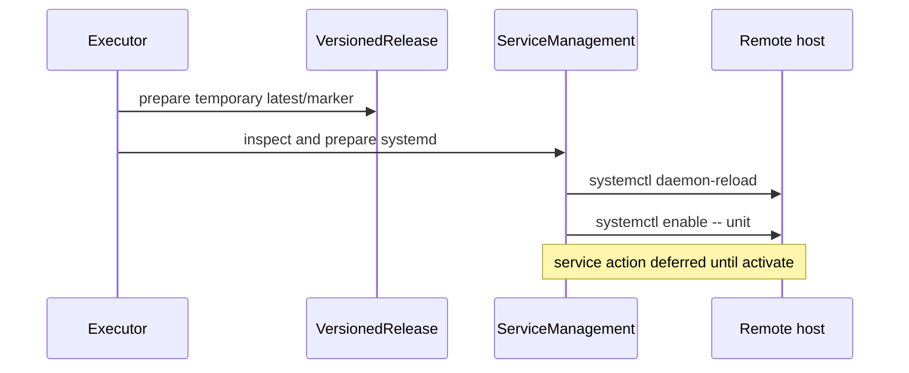
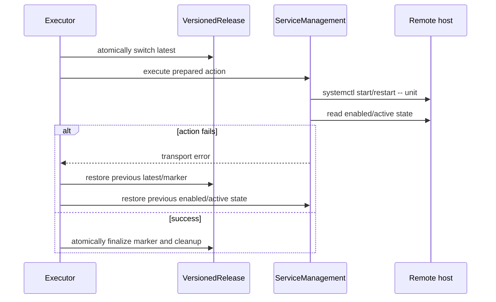

# multipass eleph-server deploy 成功链路设计

Risk profile: ./risk-profile.yaml

## Design Scope

让同一 multipass `eleph-server` deploy 中 5 个内置 versioned/packageless 步骤按既有
stage → activate → configure 顺序完整成功。第一个确定缺陷是 `serviceCommand` 把
`daemon-reload` 当作 unit 子命令构造为 `systemctl daemon-reload -- jx-server.service`；
Ubuntu 24.04 将其判定为 too many arguments。设计先把 unit 参数按 systemctl 子命令
区分，再以真实部署复验触发后续阻塞性缺陷的最小修复。

本任务不引入新命令、不改变计划生成、不新增部署目标、不改业务包内容或服务命名。

## Useful Context

`src/execution.ts` 先为 versioned App 准备发布事务、发布配置候选和 systemd unit 候选，
再调用 `prepareSystemd` 完成 daemon reload/enable 准备；activate 阶段切换 latest、执行
prepared service action，并在服务成功后提交 marker。失败路径通过
`recoverDeployment` 调用版本回滚和 `restoreSystemd`。因此 `serviceCommand` 是 prepare 与
restore 共用的 systemctl 特权命令构造点，必须在同一处修正。

远端复核显示两个服务 unit 仍不存在，`jx-server` 安装根下有先前失败事务遗留的临时
latest/marker 文件；这些文件不属于当前事务状态，不应被后续修复当作恢复依据。

## Overall Approach



`serviceCommand` 保留 systemctl/service 两条工具分支、特权执行、超时和 unit 校验语义。
对 systemctl，只对 `daemon-reload` 省略 `-- <unit>`；其他既有子命令继续追加 unit。
如果后续复验暴露阻断同一 5 步成功的缺陷，修复仍落在 execution、versioned release、
remote deployment、transport 或 service management 的既有职责内，并在进入实现前更新
Scope Paths 与本设计约束。

## Module Relationship UML



## Layered Design Document Index

| level | parent_document | unit | design_document | responsibility |
| --- | --- | --- | --- | --- |
| not-applicable: 修复集中在部署执行链既有职责，不新增业务子模块 | design.md | not-applicable: 无独立子级模块 | not-applicable: 本任务不拆分子级设计文档 | not-applicable: 不引入可复用的新抽象 |

## File-Level Interfaces

- Consumer: `src/execution.ts` 的 stage、activate 和补偿流程；change_id:
  `CHG-multipass-deploy-success`
- Compatibility: backward-compatible

```typescript
// src/service_management.ts
// Consumer: prepareSystemd / restoreSystemd / convergeSystemd; compatibility: backward-compatible
type SystemctlAction = "daemon-reload" | "enable" | "disable" | "start" | "stop" | "reload" | "restart";

function buildSystemctlCommand(
  toolPath: string,
  action: SystemctlAction,
  unit: string,
): readonly string[];
```

`prepareSystemd`、`executePreparedSystemd` 和 `restoreSystemd` 的导出签名不变。命令构造
保持内部函数，不新增公开 API；调用者仍传入同一 `RemoteSession`、`AppServiceManagement`
与信号对象。

## Key Flows

### stage



### activate and failure recovery



## State and Ownership

- Owner: versioned release management 拥有发布状态；service management 拥有 systemd 状态
  收敛接口；remote deployment/transport 拥有候选与备份生命周期。

| State | Owner | Boundary |
| --- | --- | --- |
| `latest` 与资源 version marker | versioned release management | 只有 stage 准备、activate 切换/提交和显式失败恢复可修改 |
| systemd enabled/active state | service management | prepare/execute/restore 通过 systemctl 或 service 工具读取与收敛 |
| 部署 bundle/config candidate | remote deployment/transport | 保留既有校验、原子发布、备份与恢复语义 |

失败事务遗留的 `.sfo-deploy-*` 文件不是当前状态；除非阻塞重试，本设计不主动删除。

## Directly Mapped Change Items

| change_id | target_module | proposal_id | design_coverage | scope_paths |
| --- | --- | --- | --- | --- |
| CHG-multipass-deploy-success | sfo-deploy | P-001, P-002, P-003, P-004 | systemctl 参数形状与 prepare/restore 回归；versioned 静态服务动作语义修复；multipass unit/config 布局修正；真实 5 步成功与目标机状态检查 | `src/service_management.ts`, `src/execution.ts`, `tests/unit/service_management.test.ts`, `tests/dv/versioned_deploy_order.test.ts`, `tests/integration/versioned_release.test.ts`, `examples/eleph-server-multipass/clusters/multipass/apps/jx-server/app.yaml`, `examples/eleph-server-multipass/clusters/multipass/apps/jx-web/app.yaml` |

`Scope Paths` 是计划影响提示，不是文件访问边界；实际进入实现前如果发现路径变更，
先更新该表。

## API and Build Surface Impact

- Public API impact: backward-compatible
- Crate-root export change: no
- Build-surface change: no
- Documentation examples affected: no

`prepareSystemd`、`executePreparedSystemd`、`restoreSystemd`、计划 schema 和 CLI 命令均
保持现有形态。没有 breaking API，因此不需要 consumer migration closure。

## Implementation Order

| phase | goal | depends_on | output |
| --- | --- | --- | --- |
| 1 | 修正 systemctl unitless 子命令并补全单元断言 | none | daemon-reload 不携带 unit |
| 2 | 运行本地静态检查和任务测试 | 1 | 红/绿回归与全量任务测试证据 |
| 3 | 修正 versioned 静态服务动作与 failed/missing 状态恢复 | 2 | jx-web 不强启；failed 状态可重置 |
| 4 | 修正 multipass unit/config 布局 | 3 | jx-server 使用 server/jx-server.jar；jx-web 静态 |
| 5 | 复跑真实 multipass deploy | 4 | 5/5 succeeded |
| 6 | 达成 5/5 succeeded 后完成文档与验收 | 5 | 独立验收证据 |

## File-Level Implementation Sequence

| sequence | file_level_module | action | depends_on | change_id | scope_path | implementation_task |
| --- | --- | --- | --- | --- | --- | --- |
| 1 | src/service_management.ts | modify | none | CHG-multipass-deploy-success | `src/service_management.ts` | root |
| 2 | tests/unit/service_management.test.ts | modify | 1 | CHG-multipass-deploy-success | `tests/unit/service_management.test.ts` | root |
| 3 | src/execution.ts | modify | 2 | CHG-multipass-deploy-success | `src/execution.ts` | root |
| 4 | tests/unit/service_management.test.ts | modify | 2 | CHG-multipass-deploy-success | `tests/unit/service_management.test.ts` | root |
| 5 | tests/dv/versioned_deploy_order.test.ts | modify | 3 | CHG-multipass-deploy-success | `tests/dv/versioned_deploy_order.test.ts` | root |
| 6 | tests/integration/versioned_release.test.ts | modify | 4 | CHG-multipass-deploy-success | `tests/integration/versioned_release.test.ts` | root |
| 7 | examples/eleph-server-multipass/clusters/multipass/apps/jx-server/app.yaml | modify | 4 | CHG-multipass-deploy-success | `examples/eleph-server-multipass/clusters/multipass/apps/jx-server/app.yaml` | root |
| 8 | examples/eleph-server-multipass/clusters/multipass/apps/jx-web/app.yaml | modify | 4 | CHG-multipass-deploy-success | `examples/eleph-server-multipass/clusters/multipass/apps/jx-web/app.yaml` | root |

## Design Notes

在共享 `serviceCommand` 修正而不是在两个调用点旁路发命令，是因为补偿路径也需要相同
argv 形状，旁路会重复特权与超时处理。仅对 `daemon-reload` 做例外，是为了不改变
`enable`、`start`、`stop`、`restart`、`reload` 和潜在 `disable` 的既有行为。

真实部署是最终验证，但不能替代本地回归：完整 argv 断言能在 Ubuntu 版本差异出现前
捕获 systemctl 参数误用；DV/集成测试可确认 stage/activate 顺序和失败恢复没有被修正破坏。

## Risks and Rollback

- 参数分支风险：遗漏补偿路径会让失败恢复继续失败。缓解：修正放在共同构造函数，并用
  prepare/restore 两类断言覆盖。
- 状态完整性风险：activate 失败可能留下未提交 latest。缓解：保留现有
  `restoreVersionedRelease` 顺序和 owner；任何新修复不得绕过该事务。
- 特权与安全风险：systemctl 变更必须继续使用 `privileged: true` 和既有 unit 校验。
- 回滚：仅改回 `serviceCommand` 对 `daemon-reload` 的追加逻辑即可恢复旧行为；后续最小
  修复按各自职责保持可反向回退。
