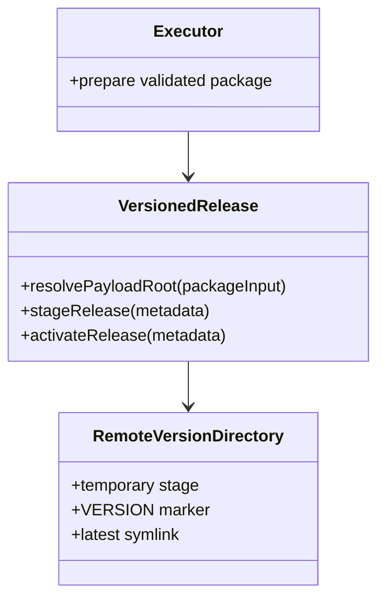
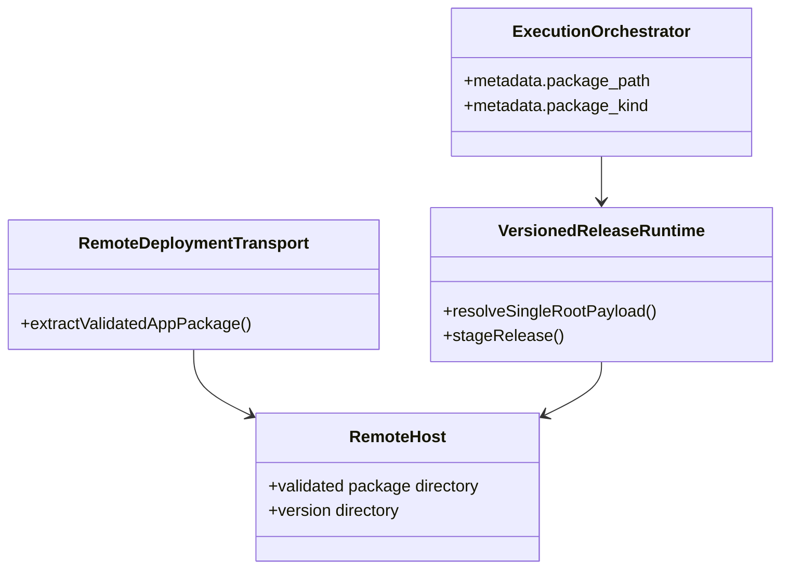
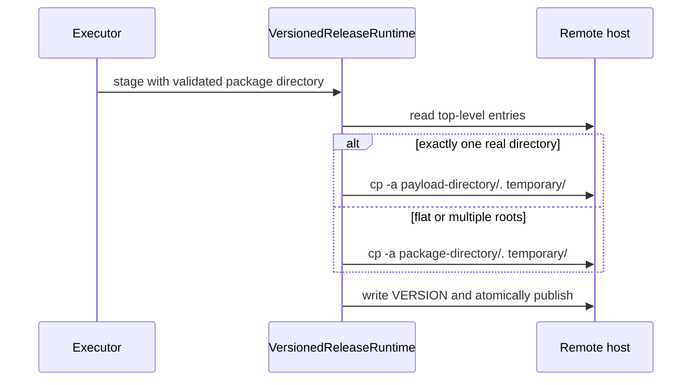
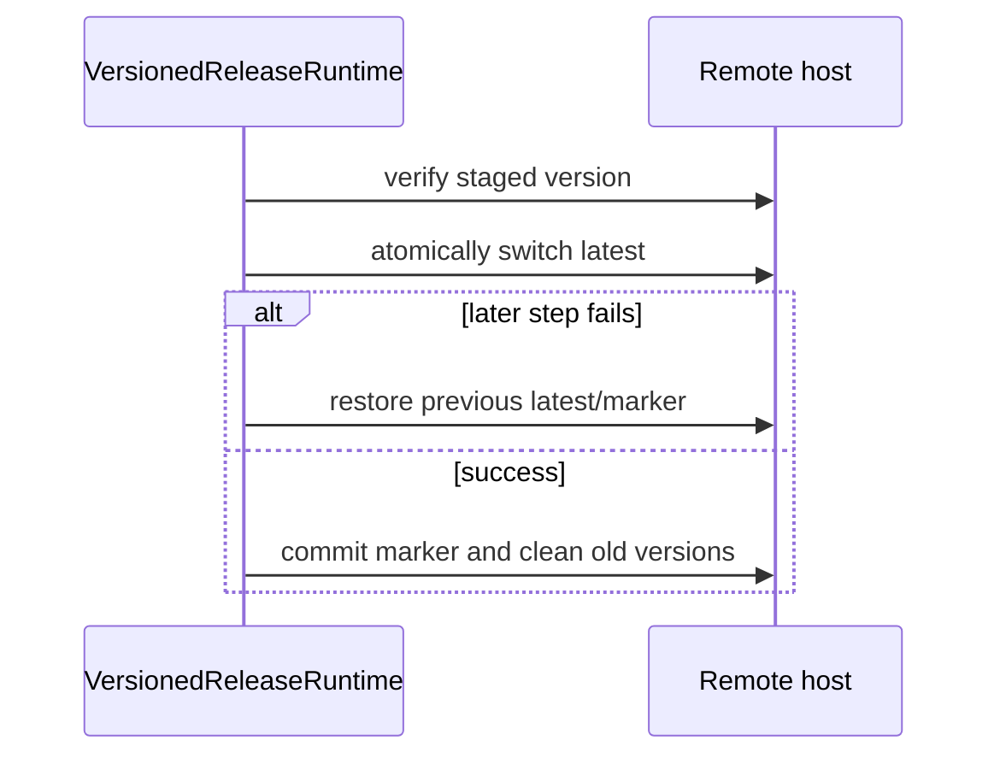

# 内置 versioned 发布单顶层目录剥离设计

Risk profile: ./risk-profile.yaml

## Design Scope

让内置 versioned 发布在安全解包后的候选目录阶段识别“唯一顶层普通目录”，并在复制到版本
目录时直接使用该目录作为载荷根。该规则是缺省行为；没有新增 `app.yaml` 字段。jx-server 与
jx-web 因此分别从 `latest/jx-server.jar` 和 `latest/index.html` 使用载荷，`latest/server/`
与 `latest/web/` 不再出现在新版本。

多顶层成员包、平铺包、空目录、非普通目录和符号链接目录不提升，继续按既有原样布局处理。
tar 成员校验、下载哈希、包数量/大小边界、安装身份、stage/activate 事务和失败恢复语义不变。

## Useful Context

`extractValidatedAppPackage` 已完成内层 tar 列表、类型、路径、重复、数量和展开大小校验，并把
包解到 attempt workspace 的隔离目录。`src/execution.ts` 将该隔离目录作为
`package_path=...`、`package_kind="validated-directory"` 传给 versioned 发布脚本。

`src/remote_runtime/versioned_release.ts` 的 `stageRelease` 是把 validated-directory 复制为
远端版本目录的唯一入口。它已经拥有版本目录、临时目录、`VERSION`、latest 切换和失败恢复的
状态所有权，因此在这里选择复制源比在 transport 后追加一次目录搬移更小、更容易回滚。

当前真实制品显示 jx-server 包顶层只有 `server/`，jx-web 包顶层只有 `web/`。模板演示包是
平铺布局，默认规则不会改变它。

## Overall Approach



`stageRelease` 在版本无变化跳过之后、创建临时目录之后，枚举 `packageInput` 顶层。若只有一个
`isDirectory && !isSymlink` 项，复制源改为 `${packageInput}/${entry.name}`；否则复制源仍为
`${packageInput}`。复制、版本写入、原子发布、latest 切换、marker 提交和旧版本清理均沿用既有代码。

## Module Relationship UML



## Layered Design Document Index

| level | parent_document | unit | design_document | responsibility |
| --- | --- | --- | --- | --- |
| not-applicable: 改动集中在既有 versioned runtime 单一职责内 | design.md | versioned-release | not-applicable: 本任务不拆分独立子级设计文档 | 判定复制源并保持发布事务不变 |

## File-Level Interfaces

- Consumer: `src/remote_runtime/versioned_release.ts` 的 `stageRelease`；change_id:
  `CHG-remove-jx-server-package-root`
- Compatibility: backward-compatible

```typescript
// src/remote_runtime/versioned_release.ts
// Consumer: stageRelease; compatibility: backward-compatible
type PayloadRoot = string;

async function resolveSingleRootPayload(
  packageInput: string,
): Promise<PayloadRoot>;

async function stageRelease(metadata: JsonObject): Promise<void>;
```

`stageRelease` 的远端元数据格式和导出入口不变。`resolveSingleRootPayload` 是脚本内部函数，
仅返回实际复制源路径；它不改变 `package_path` 元数据，也不移动或删除输入包。

## Key Flows

### single-root stage



### activate and failure recovery



布局选择只发生在 stage。activate 和失败恢复不重新判断包布局，避免同一版本在不同步骤被解释为
不同布局。

## State and Ownership

- Owner: `VersionedReleaseRuntime` 拥有从已验证包目录选择载荷根、复制到版本目录、写入
  `VERSION`、切换 `latest`、提交 marker 和失败恢复的完整状态边界。

| State | Owner | Boundary |
| --- | --- | --- |
| validated package directory | remote deployment/transport | 只读输入；本任务不修改其安全校验或生命周期 |
| selected payload root | versioned release runtime | stage 复制前的内存选择；不持久化、不移动输入 |
| version directory, `VERSION`, `latest`, marker | versioned release runtime | 沿用既有 stage/activate/restore 事务 |

## Directly Mapped Change Items

| change_id | target_module | proposal_id | design_coverage | scope_paths |
| --- | --- | --- | --- | --- |
| CHG-remove-jx-server-package-root | sfo-deploy | P-001, P-002, P-003, P-004 | 默认单顶层目录判定与复制源选择；多顶层/平铺保留；jx-server 配置路径与契约；jx-web 载荷契约；文档路径说明 | `src/remote_runtime/versioned_release.ts`, `tests/integration/versioned_release.test.ts`, `examples/eleph-server-multipass/cluster-template/apps/jx-server/app.yaml`, `examples/eleph-server-multipass/clusters/multipass/apps/jx-server/app.yaml`, `examples/eleph-server-multipass/clusters/multipass/apps/jx-web/app.yaml`, `examples/eleph-server-multipass/README.md` |

`Scope Paths` 是计划影响提示，不是文件访问边界；实现发现路径变更时先更新本表和 task manifest。

## API and Build Surface Impact

- Public API impact: backward-compatible
- Crate-root export change: no
- Build-surface change: no
- Documentation examples affected: yes

远端 runtime 脚本不是模块导出 API，`DeploymentDefinition` 和 CLI 接口不变。示例 README 的
制品布局说明会随默认规则更新。

## Consumer Migration Closure

| old_symbol | new_path | change_id | consumer_path | consumer_kind | migration_status |
| --- | --- | --- | --- | --- | --- |
| `latest/server/jx-server.jar` | `latest/jx-server.jar` | CHG-remove-jx-server-package-root | `examples/eleph-server-multipass/clusters/multipass/apps/jx-server/app.yaml` | app config | migrated |
| `${INSTALL_DIRECTORY}/server/resources/application.yml` | `${INSTALL_DIRECTORY}/resources/application.yml` | CHG-remove-jx-server-package-root | `examples/eleph-server-multipass/clusters/multipass/apps/jx-server/app.yaml` | app config | migrated |
| `latest/web/index.html` | `latest/index.html` | CHG-remove-jx-server-package-root | `examples/eleph-server-multipass/README.md` | documentation example | migrated |
| `latest/server/jx-server.jar` | `latest/jx-server.jar` | CHG-remove-jx-server-package-root | `tests/integration/versioned_release.test.ts` | test | migrated |

## Implementation Order

| phase | goal | depends_on | output |
| --- | --- | --- | --- |
| 1 | 在 stageRelease 中选择单顶层载荷根 | none | 默认 strip 行为 |
| 2 | 增加真实 runtime 集成回归 | 1 | 单顶层、多顶层和平铺包布局证据 |
| 3 | 同步 Multipass jx-server 配置和文档 | 2 | live `latest/jx-server.jar` 契约 |
| 4 | 更新 jx-web 布局契约 | 3 | `latest/index.html` 契约 |
| 5 | 运行本地和真实部署验证 | 4 | validate/plan 与 Multipass 远端证据 |

## File-Level Implementation Sequence

| sequence | file_level_module | action | depends_on | change_id | scope_path | implementation_task |
| --- | --- | --- | --- | --- | --- | --- |
| 1 | src/remote_runtime/versioned_release.ts | modify | none | CHG-remove-jx-server-package-root | `src/remote_runtime/versioned_release.ts` | root |
| 2 | tests/integration/versioned_release.test.ts | modify | 1 | CHG-remove-jx-server-package-root | `tests/integration/versioned_release.test.ts` | root |
| 3 | examples/eleph-server-multipass/clusters/multipass/apps/jx-server/app.yaml | modify | 2 | CHG-remove-jx-server-package-root | `examples/eleph-server-multipass/clusters/multipass/apps/jx-server/app.yaml` | root |
| 4 | examples/eleph-server-multipass/README.md | modify | 3 | CHG-remove-jx-server-package-root | `examples/eleph-server-multipass/README.md` | root |
| 5 | examples/eleph-server-multipass/clusters/multipass/apps/jx-web/app.yaml | modify | 4 | CHG-remove-jx-server-package-root | `examples/eleph-server-multipass/clusters/multipass/apps/jx-web/app.yaml` | root |

模板 `apps/jx-server/app.yaml` 已是平铺演示布局；若契约测试需要保留该场景，本任务仅保持它不变。
jx-web live/template 配置不需要新增路径字段，静态载荷路径变化由默认布局规则与文档/测试固化。

## Design Notes

在 `stageRelease` 中判定而不是在 `extractValidatedAppPackage` 后搬移，可以避免引入第二个临时
目录、远端 rename 顺序和失败恢复分支。布局判定在每次 stage 时基于已校验目录重新进行，同一版本
已发布后跳过 stage，因此不会对已激活版本重放不同的布局解释。

不把规则放在 `extractValidatedAppPackage`，还保留了 transport 的职责边界：transport 负责把
tar 安全转换成 validated-directory，versioned runtime 负责决定哪些内容进入版本目录。

## Risks and Rollback

- 误判风险：一个顶层目录旁边出现隐藏文件、普通文件或另一个目录时不剥离；集成测试直接覆盖。
- 运行时路径风险：jx-server 与 jx-web 的既有配置/文档可能残留旧路径；通过契约测试和真实部署复核。
- 部署风险：真实 Multipass 部署会创建新版本并切换 latest；沿用现有失败恢复，不迁移旧版本。
- 回滚：恢复 `stageRelease` 原复制源选择，并把 jx-server live 配置恢复为 `latest/server` 即可；
  新旧版本目录并存，不要求迁移。
