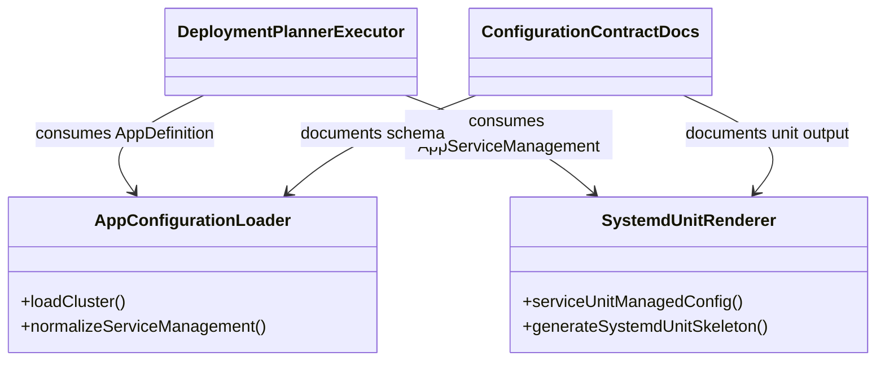
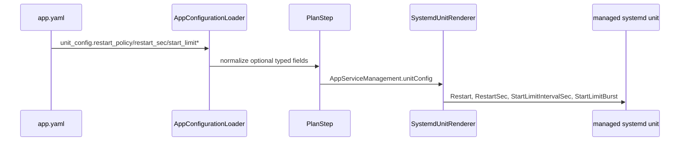

Risk profile: ./risk-profile.yaml

# Design：App service unit 崩溃拉起策略

## Design Scope

本设计覆盖 sfo-deploy 单模块的 App service 配置装载、计划内 systemd unit 渲染、文档契约与
集群配置模板。新增 `management.kind: service.unit_config` 下的可选字段：
`restart_policy`、`restart_sec`、`start_limit_interval_sec` 和 `start_limit_burst`。 配置装载负责把
YAML 值收敛为类型安全字段；systemd 渲染器负责输出原生指令；文档与模板同步展示
契约。本任务不新增通用看门狗，不修改外部 systemd unit，也不改变 SysV、部署编排或失败补偿语义。

## Useful Context

- 当前 App v1 已把 `service.unit_config` 作为 managed systemd unit 的唯一生成入口。
- `src/systemd_unit.ts` 通过 `serviceUnitManagedConfig()` 把 unit 转换为 managed config 候选，
  并通过 `generateSystemdUnitSkeleton()` 确定性渲染 unit。
- 计划与执行器只消费 `AppServiceManagement`，不读取原始 YAML；服务发布、`daemon-reload`、
  启动/重启和部署补偿已有既定边界。
- `src/config.ts` 的 `fields()` 白名单是失败关闭的配置契约控制点；`boundedInteger()` 已提供
  安全整数校验。

## Overall Approach

1. 类型层：为 `SystemdUnitConfig` 增加四项可选字段。缺失字段保持旧行为，旧配置和旧计划快照
   无需迁移。
2. 装载层：扩展 `unit_config` 字段白名单，使用受控枚举和安全整数边界解析新字段。非法值在
   `loadCluster()` 阶段失败，计划不触达目标机。
3. 渲染层：在 `[Unit]` 输出启动限流，在 `[Service]` 输出 `Restart` 与 `RestartSec`。未声明
   字段不写入 unit；输出顺序保持确定性。
4. 契约层：README、集群配置技能参考和版本化模板展示推荐写法，并说明字段只作用于框架生成的 managed
   systemd unit。
5. 测试层：由 testing 阶段围绕装载边界、渲染边界、旧配置兼容性和模板契约补充任务级验证。

## Layered Design Document Index

| level | parent_document | unit       | design_document | responsibility                                                                                 |
| ----- | --------------- | ---------- | --------------- | ---------------------------------------------------------------------------------------------- |
| root  | design.md       | sfo-deploy | design.md       | 配置契约、计划内 unit 渲染、文档与模板的模块级设计；文件级接口在本文定义，无独立子模块设计文档 |

## Module Relationship UML



App 配置装载器是唯一把 YAML 字段映射到内部 `AppServiceManagement` 的边界。计划与执行器继续
消费归一后类型。systemd unit 渲染器是唯一把受管服务定义映射为 unit 文本的边界。文档和模板只
表达两个边界的外部契约。

## File-Level Interfaces

```ts
// src/types.ts
// Compatibility: backward-compatible
export type SystemdRestartPolicy =
  | "no"
  | "on-success"
  | "on-failure"
  | "on-abnormal"
  | "on-watchdog"
  | "on-abort"
  | "always";

export interface SystemdUnitConfig {
  readonly target: string;
  readonly workingDirectory: string;
  readonly command: string;
  readonly args: readonly string[];
  readonly restartPolicy?: SystemdRestartPolicy;
  readonly restartSec?: number;
  readonly startLimitIntervalSec?: number;
  readonly startLimitBurst?: number;
}
```

```ts
// src/config.ts
// Compatibility: backward-compatible
function systemdUnitConfig(
  value: unknown,
  unit: string,
  installDirectory: string | undefined,
  label: string,
): SystemdUnitConfig;
// restartSec/startLimitIntervalSec: 0..86400 秒
// startLimitBurst: 0..10000 次
```

```ts
// src/systemd_unit.ts
// Compatibility: backward-compatible
function renderUnit(
  service: AppServiceManagement,
  runAs: string,
): string;
```

- Consumer: `src/config.ts`、`src/planning.ts`、`src/execution.ts`、`src/systemd_unit.ts`、 计划快照
  codec、文档与模板。
- Compatibility: backward-compatible

Compatibility: backward-compatible

## Key Flows



装载失败会阻止计划生成。渲染成功后，unit 候选沿既有 managed config 事务发布，随后执行既有
`daemon-reload` 和启动/重启动作。本任务不引入新的远端重试或轮询。

## State and Ownership

- Owner: `src/config.ts` 拥有 YAML 到 `SystemdUnitConfig` 的归一化所有权；`src/systemd_unit.ts` 拥有
  unit 文本渲染所有权；计划快照只保存装载后的只读定义。
- 不新增持久化状态；新字段会自然出现在新计划快照中，旧快照因字段缺失而保持原语义。
- 若目标机 systemd 版本不支持指令，unit 在服务启动或重载阶段失败，并沿既有失败补偿路径暴露；
  框架不预先探测 systemd 版本。

## Directly Mapped Change Items

| change_id                               | target_module | proposal_id | design_coverage                                                              | scope_paths                                                                                                     |
| --------------------------------------- | ------------- | ----------- | ---------------------------------------------------------------------------- | --------------------------------------------------------------------------------------------------------------- |
| CHG-service-restart-policy-schema       | sfo-deploy    | P-001       | 定义四项可选 unit 重启字段的归一化类型、边界、失败关闭规则、确定性渲染顺序和计划快照编解码。 | src/types.ts, src/config.ts, src/systemd_unit.ts, src/history.ts                                                |
| CHG-service-restart-policy-template-doc | sfo-deploy    | P-002       | 同步 README、集群配置技能契约与版本化模板中的推荐写法。                      | README.md, skills/sfo-deploy-cluster/references/app.md, skills/sfo-deploy-cluster/assets/app-versioned/app.yaml |

## Implementation Order

| phase | goal                             | depends_on | output                                       |
| ----- | -------------------------------- | ---------- | -------------------------------------------- |
| 1     | 扩展内部 unit 配置类型与装载校验 | 无         | `src/types.ts`、`src/config.ts` 可装载新字段 |
| 2     | 扩展确定性 systemd unit 渲染     | phase 1    | `src/systemd_unit.ts` 按缺省与显式声明输出   |
| 3     | 同步文档、技能契约和模板         | phase 2    | README、集群配置技能参考与模板一致           |
| 4     | 补充测试与任务级验证             | phase 3    | 配置、渲染、兼容性与契约测试通过             |

## File-Level Implementation Sequence

| sequence | file_level_module                                       | action | depends_on | change_id                               | scope_path                                              | implementation_task |
| -------- | ------------------------------------------------------- | ------ | ---------- | --------------------------------------- | ------------------------------------------------------- | ------------------- |
| 1        | src/types.ts                                            | modify | -          | CHG-service-restart-policy-schema       | src/types.ts                                            | default             |
| 2        | src/config.ts                                           | modify | 1          | CHG-service-restart-policy-schema       | src/config.ts                                           | default             |
| 3        | src/systemd_unit.ts                                     | modify | 2          | CHG-service-restart-policy-schema       | src/systemd_unit.ts                                     | default             |
| 4        | src/history.ts                                          | modify | 3          | CHG-service-restart-policy-schema       | src/history.ts                                          | default             |
| 5        | skills/sfo-deploy-cluster/references/app.md             | modify | 4          | CHG-service-restart-policy-template-doc | skills/sfo-deploy-cluster/references/app.md             | default             |
| 6        | skills/sfo-deploy-cluster/assets/app-versioned/app.yaml | modify | 5          | CHG-service-restart-policy-template-doc | skills/sfo-deploy-cluster/assets/app-versioned/app.yaml | default             |
| 7        | README.md                                               | modify | 6          | CHG-service-restart-policy-template-doc | README.md                                               | default             |
| 8        | tests/unit/app_management_config.test.ts                | modify | 7          | CHG-service-restart-policy-schema       | tests/unit/app_management_config.test.ts                | default             |
| 9        | tests/unit/systemd_unit.test.ts                         | modify | 8          | CHG-service-restart-policy-schema       | tests/unit/systemd_unit.test.ts                         | default             |
| 10       | tests/unit/history.test.ts                              | modify | 9          | CHG-service-restart-policy-schema       | tests/unit/history.test.ts                              | default             |
| 11       | tests/contract/verify_app_management_contract.ts        | modify | 10         | CHG-service-restart-policy-template-doc | tests/contract/verify_app_management_contract.ts        | default             |

## API and Build Surface Impact

- Public API impact: backward-compatible
- Crate-root export change: no
- Build-surface change: no
- Documentation examples affected: yes

说明：`src/mod.ts` 导出的内部配置类型增加可选字段；README 与集群配置技能模板/契约示例更新。

无删除或重命名的导出符号，不需要 consumer migration closure。

## Consumer Migration Closure

| old_symbol                    | new_path                          | change_id                         | consumer_kind          | consumer_path       | migration_status |
| ----------------------------- | --------------------------------- | --------------------------------- | ---------------------- | ------------------- | ---------------- |
| SystemdUnitConfig（旧字段集） | src/types.ts 的 SystemdUnitConfig | CHG-service-restart-policy-schema | internal-type-consumer | src/config.ts       | migrated         |
| SystemdUnitConfig（旧字段集） | src/types.ts 的 SystemdUnitConfig | CHG-service-restart-policy-schema | internal-type-consumer | src/systemd_unit.ts | migrated         |
| SystemdUnitConfig（旧字段集） | src/types.ts 的 SystemdUnitConfig | CHG-service-restart-policy-schema | plan-snapshot-consumer | src/history.ts      | migrated         |

## Design Notes

- 没有把新字段放在 `management` 顶层，因为缺少 `unit_config` 时框架不拥有外部 unit 文件；在那里
  接受字段会形成不生效契约。
- 没有引入通用重启策略抽象：当前只有 systemd managed unit 一个消费方，新增抽象会增加无收益边界。
- 维护既有不变量：`tool: service` 仍禁止 `unit_config`；unit 目标名仍必须与 service unit 一致；
  `daemon_reload: true` 仍是 `unit_config` 的前提；受管配置与 unit 目标不能重复。

## Risks and Rollback

- systemd 版本差异可能影响 `StartLimitIntervalSec` 的位置或可用性；以现代 systemd 的
  `systemd.unit(5)` 语义为准，只做声明式映射，不做远端版本探测。
- 自动重启可能掩盖业务缺陷或反复重启；通过可选启动限流和文档说明限制，但不替用户选择策略。
- 回滚通过移除或恢复旧版本 unit 候选进行；缺失新字段时渲染器保持旧输出，部署补偿和回滚路径不变。
