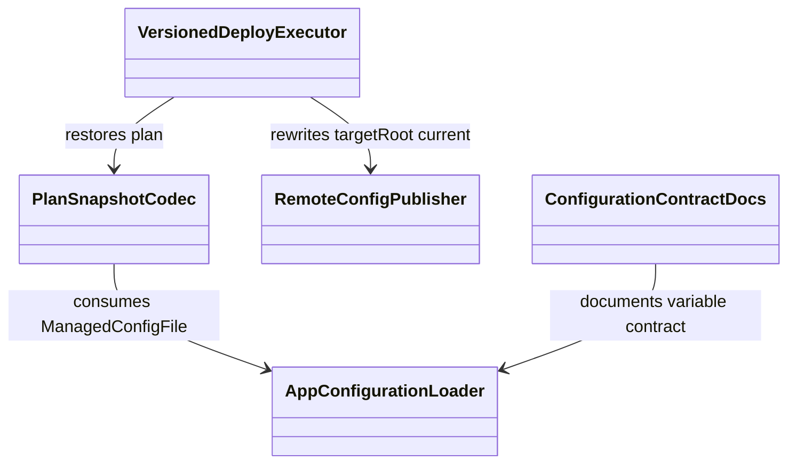
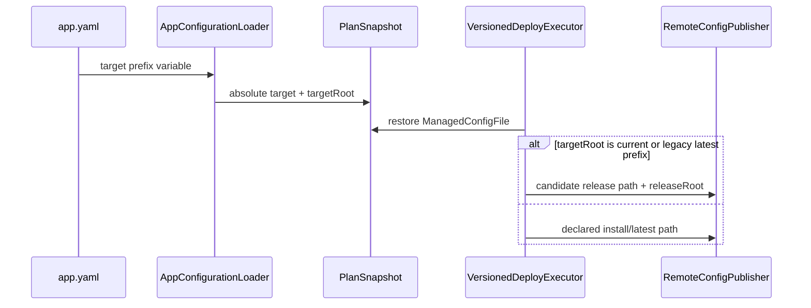

Risk profile: ./risk-profile.yaml

# Design：App 配置目录变量契约

## Design Scope

本设计覆盖 App managed file config 的 target 变量装载、计划快照编码、内置 deploy 的目标重定位、
文档/示例迁移。新增 `${CURRENT_VERSION_DIRECTORY}` 和 `${LATEST_DIRECTORY}`，并把
`${INSTALL_DIRECTORY}` 语义改为与 `app.yaml.install_directory` 一致的安装根。只有
`target` 前缀支持这些变量；`source`、配置内容、服务参数和 shell 环境不展开它们。

## Useful Context

- `src/config.ts.managedConfigTarget()` 当前只识别 `${INSTALL_DIRECTORY}/`，装载后展开为
  `<install_directory>/latest/<relative>`。
- `src/execution.ts.deploymentConfigTarget()` 通过 target 是否命中
  `<candidate>.latestPath/`，把该前缀重定位为候选版本目录。
- 计划快照只保存装载后的绝对 target；当前结构无法区分“用户写了 latest”和“变量本应表示 latest”。
- 绝对 `<install_directory>/latest/...` target 继续保留既有 deploy 重定位行为；变量语义修正
  不改变无变量旧路径。

## Overall Approach

1. 在内部 `ManagedConfigFile` 增加目标根类型 `targetRoot`：`absolute`、`install`、
   `current`、`latest`。装载器返回该类型，计划快照显式携带它。
2. `${INSTALL_DIRECTORY}` 直接展开安装根，不再追加 `latest`；`${CURRENT_VERSION_DIRECTORY}`
   和 `${LATEST_DIRECTORY}` 都装载为 `<install_directory>/latest`，但保存不同目标根。
3. 内置 deploy 只重定位 `targetRoot: current` 与旧的绝对 latest 前缀；`install` 和 `latest`
   保持原路径。
4. 所有路径仍走 `managedTargetPath()` 与远端发布根边界。装载期重复 target 检查使用展开后的
   绝对路径，因此同一相对文件不能同时声明为 current 和 latest。
5. 同步 README、配置指南、模块边界、技能参考和仓库示例，明确 breaking 迁移。

## Layered Design Document Index

| level | parent_document | unit | design_document | responsibility |
| --- | --- | --- | --- | --- |
| root | design.md | sfo-deploy | design.md | 配置契约、计划编码、部署重定位与文档迁移的模块级设计；文件级接口在本文定义，无独立子模块设计文档 |

## Module Relationship UML



App 配置装载器拥有 YAML 变量到内部目标根的唯一归一化边界。执行器只消费装载结果，不重新猜测
原始 YAML。快照编解码保证 deploy 语义可恢复。远端发布器继续拥有路径安全与发布事务。

## File-Level Interfaces

```ts
// src/types.ts
// Compatibility: migration-required
export type ManagedConfigTargetRoot = "absolute" | "install" | "current" | "latest";

export interface ManagedConfigFile {
  readonly target: string;
  readonly targetRoot: ManagedConfigTargetRoot;
  // 既有字段保持不变。
}
```

- Consumer: `src/config.ts`、`src/history.ts`、`src/execution.ts`；
  `CHG-app-directory-variable-contract`。
- Compatibility: migration-required

```ts
// src/config.ts
// Compatibility: migration-required
function managedConfigTarget(
  value: unknown,
  installDirectory: string | undefined,
  label: string,
): { readonly target: string; readonly targetRoot: ManagedConfigTargetRoot };
```

- Consumer: `src/config.ts.managedConfigFiles()`；`CHG-app-directory-variable-contract`。
- Compatibility: migration-required

```ts
// src/history.ts
// Compatibility: backward-compatible for old plan snapshots
function encodeManagement(management: AppManagementDefinition, archive: ArchiveWriter): Promise<JsonObject>;
function decodeManagement(
  raw: unknown,
  snapshot: string,
  runAs?: string,
  deployment?: DeploymentDefinition,
): Promise<AppManagementDefinition | undefined>;
```

- Consumer: 计划快照保存/恢复路径；`CHG-app-directory-variable-contract`。
- Compatibility: backward-compatible for old snapshots

```ts
// src/execution.ts
// Compatibility: migration-required for ${INSTALL_DIRECTORY} config targets
function deploymentConfigTarget(
  target: string,
  release: PreparedVersionedRelease | undefined,
  targetRoot?: ManagedConfigTargetRoot,
): { readonly target: string; readonly releaseRoot?: string };
```

- Consumer: `src/execution.ts` 内置 deploy 配置发布；`CHG-app-directory-variable-contract`。
- Compatibility: migration-required

## Key Flows



装载失败会阻止计划生成。deploy 失败继续走既有候选发布与恢复事务；`LATEST_DIRECTORY`
写入发生在 latest 仍指向当前版本时，不经由候选版本重定位。独立 configure 不提供候选版本，
current 和 latest 都写当前 latest 指向的路径。

## State and Ownership

- Owner: `src/config.ts` 拥有 YAML target 变量解析；`src/history.ts` 拥有计划快照字段编码；
  `src/execution.ts` 拥有 deploy 重定位。
- `targetRoot` 是计划内只读状态，不持久化到远端配置内容。旧快照缺省为 `absolute`。
- 不改变 `install_directory`、版本目录、`latest` 切换、发布权限或失败补偿的所有权。

## Directly Mapped Change Items

| change_id | target_module | proposal_id | design_coverage | scope_paths |
| --- | --- | --- | --- | --- |
| CHG-app-directory-variable-contract | sfo-deploy | P-001/P-002 | 定义三类变量、目标根类型、快照兼容、deploy 重定位和路径安全行为；同步长期边界、README、指南、技能契约、示例和测试迁移。 | src/types.ts, src/config.ts, src/history.ts, src/systemd_unit.ts, src/execution.ts, README.md, docs/guides/sfo-deploy-cluster-configuration.md, docs/modules/sfo-deploy.md, skills/sfo-deploy-cluster/references/app.md, examples/eleph-server-multipass/README.md, examples/eleph-server-multipass/clusters/multipass/apps/jx-server/app.yaml, tests/unit/app_management_config.test.ts, tests/unit/history.test.ts, tests/unit/managed_config_generation.test.ts, tests/dv/versioned_deploy_order.test.ts, tests/integration/versioned_release.test.ts, tests/integration/config_updater.test.ts, tests/contract/verify_app_management_contract.ts |

## Implementation Order

| phase | goal | depends_on | output |
| --- | --- | --- | --- |
| 1 | 定义目标根类型并重构装载解析 | 无 | 新变量装载成功、非法输入失败 |
| 2 | 扩展计划快照编解码 | 1 | 新旧计划快照都能恢复目标根 |
| 3 | 调整 deploy 重定位 | 2 | current 重定位，install/latest 不重定位 |
| 4 | 同步文档和示例 | 3 | 用户契约与实现一致 |
| 5 | 补充测试 | 4 | 单元、DV、集成和契约验证通过 |

## File-Level Implementation Sequence

| sequence | file_level_module | action | depends_on | change_id | scope_path | implementation_task |
| --- | --- | --- | --- | --- | --- | --- |
| 1 | src/types.ts | modify | - | CHG-app-directory-variable-contract | src/types.ts | default |
| 2 | src/config.ts | modify | 1 | CHG-app-directory-variable-contract | src/config.ts | default |
| 3 | src/history.ts | modify | 2 | CHG-app-directory-variable-contract | src/history.ts | default |
| 4 | src/execution.ts | modify | 3 | CHG-app-directory-variable-contract | src/execution.ts | default |
| 5 | README.md | modify | 4 | CHG-app-directory-variable-contract | README.md | default |
| 6 | docs/guides/sfo-deploy-cluster-configuration.md | modify | 5 | CHG-app-directory-variable-contract | docs/guides/sfo-deploy-cluster-configuration.md | default |
| 7 | docs/modules/sfo-deploy.md | modify | 6 | CHG-app-directory-variable-contract | docs/modules/sfo-deploy.md | default |
| 8 | skills/sfo-deploy-cluster/references/app.md | modify | 7 | CHG-app-directory-variable-contract | skills/sfo-deploy-cluster/references/app.md | default |
| 9 | examples/eleph-server-multipass/clusters/multipass/apps/jx-server/app.yaml | modify | 8 | CHG-app-directory-variable-contract | examples/eleph-server-multipass/clusters/multipass/apps/jx-server/app.yaml | default |
| 10 | examples/eleph-server-multipass/README.md | modify | 9 | CHG-app-directory-variable-contract | examples/eleph-server-multipass/README.md | default |
| 11 | tests/unit/app_management_config.test.ts | modify | 10 | CHG-app-directory-variable-contract | tests/unit/app_management_config.test.ts | default |
| 12 | tests/unit/history.test.ts | modify | 11 | CHG-app-directory-variable-contract | tests/unit/history.test.ts | default |
| 13 | tests/unit/managed_config_generation.test.ts | modify | 12 | CHG-app-directory-variable-contract | tests/unit/managed_config_generation.test.ts | default |
| 14 | tests/dv/versioned_deploy_order.test.ts | modify | 13 | CHG-app-directory-variable-contract | tests/dv/versioned_deploy_order.test.ts | default |
| 15 | tests/integration/versioned_release.test.ts | modify | 14 | CHG-app-directory-variable-contract | tests/integration/versioned_release.test.ts | default |
| 16 | tests/integration/config_updater.test.ts | modify | 15 | CHG-app-directory-variable-contract | tests/integration/config_updater.test.ts | default |
| 17 | tests/contract/verify_app_management_contract.ts | modify | 16 | CHG-app-directory-variable-contract | tests/contract/verify_app_management_contract.ts | default |
| 10 | tests/unit/app_management_config.test.ts | modify | 9 | CHG-app-directory-variable-contract | tests/unit/app_management_config.test.ts | default |
| 11 | tests/dv/versioned_deploy_order.test.ts | modify | 10 | CHG-app-directory-variable-contract | tests/dv/versioned_deploy_order.test.ts | default |
| 12 | tests/integration/versioned_release.test.ts | modify | 11 | CHG-app-directory-variable-contract | tests/integration/versioned_release.test.ts | default |
| 13 | tests/contract/verify_app_management_contract.ts | modify | 12 | CHG-app-directory-variable-contract | tests/contract/verify_app_management_contract.ts | default |

## API and Build Surface Impact

- Public API impact: migration-required
- Crate-root export change: no
- Build-surface change: no
- Documentation examples affected: yes

`ManagedConfigFile` 是导出的内部配置类型，新增必填 `targetRoot` 会导致构造者迁移；计划快照
通过缺省 `absolute` 保持读取兼容。配置 YAML 的 `${INSTALL_DIRECTORY}` 语义为 breaking。

## Consumer Migration Closure

| old_symbol | new_path | change_id | consumer_kind | consumer_path | migration_status |
| --- | --- | --- | --- | --- | --- |
| `${INSTALL_DIRECTORY}` 版本内 target | `${CURRENT_VERSION_DIRECTORY}` target | CHG-app-directory-variable-contract | app-config-consumer | examples/eleph-server-multipass/clusters/multipass/apps/jx-server/app.yaml | migrated |
| `${INSTALL_DIRECTORY}` 版本内 target | `${CURRENT_VERSION_DIRECTORY}` target | CHG-app-directory-variable-contract | contract-doc | README.md | migrated |
| `${INSTALL_DIRECTORY}` 版本内 target | `${CURRENT_VERSION_DIRECTORY}` target | CHG-app-directory-variable-contract | contract-doc | docs/guides/sfo-deploy-cluster-configuration.md | migrated |
| `${INSTALL_DIRECTORY}` 版本内 target | `${CURRENT_VERSION_DIRECTORY}` target | CHG-app-directory-variable-contract | contract-doc | docs/modules/sfo-deploy.md | migrated |
| `${INSTALL_DIRECTORY}` 版本内 target | `${CURRENT_VERSION_DIRECTORY}` target | CHG-app-directory-variable-contract | contract-doc | skills/sfo-deploy-cluster/references/app.md | migrated |
| `${INSTALL_DIRECTORY}` 版本内 target | `${CURRENT_VERSION_DIRECTORY}` target | CHG-app-directory-variable-contract | example-doc | examples/eleph-server-multipass/README.md | migrated |

仓库外用户配置必须手动迁移；框架不提供旧语义别名。

## Design Notes

- 不用字符串前缀区分两个 latest 展开结果，因为装载后它们值相同；目标根必须成为显式状态。
- 不引入通用的变量替换器或 shell 环境接口；当前只有一个受控消费者 `configs[].target`，
  新抽象会扩大不必要的安全面。
- 保留绝对 latest 重定位是为了兼容已验收的旧版本内配置写法；变量契约本身不做双义兼容。

## Risks and Rollback

- 旧配置继续使用 `${INSTALL_DIRECTORY}` 会写到安装根而非版本目录；错误文档和迁移路径必须
  清晰。
- `${LATEST_DIRECTORY}` 在 deploy 期间写入当前 latest 是用户要求的显式语义，必须与
  `${CURRENT_VERSION_DIRECTORY}` 区分说明。
- 回滚恢复旧计划/实现；新字段在计划快照中向后兼容，装载失败会阻止新计划触达目标机。
