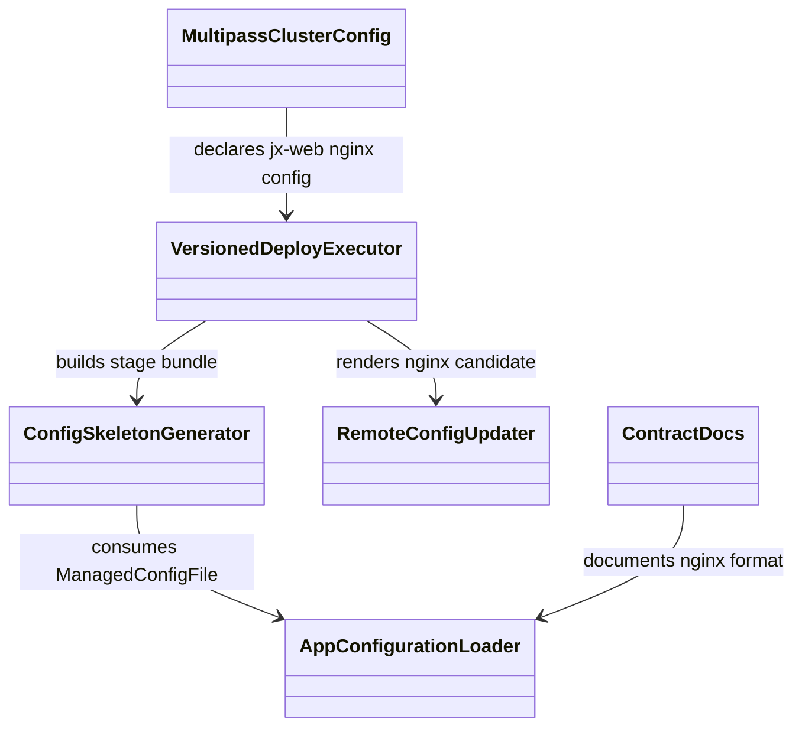

Risk profile: ./risk-profile.yaml

# Design：Nginx 原生配置格式与 jx-web 站点发布

## Design Scope

本设计覆盖 App managed file config 的 `nginx` 纯文本格式、计划快照兼容、内置
versioned deploy 的配置发布/reload、Multipass 示例拓扑和文档契约。`nginx` 格式
不做 DSL 解析；装载端只验证 UTF-8、无框架保留标记、无 `${...}` 占位符和无配置
变量，远端 updater 原样生成候选。站点配置由 `jx-web` 发布到
`/etc/nginx/conf.d/jx-web.conf`。

## Useful Context

- 受管配置现有公开格式为 `yaml|json|toml|ini`，装载与骨架生成都会先解析为结构化
  值；Nginx server 块不符合这些语法。
- 远端 `config_updater` 以 `--format` 驱动，是独立 bundle 交付产物，必须同步重编译。
- 内置 versioned deploy 先在 stage 事务中发布配置并准备 systemd，再在 activate 中
  切换 latest 后执行准备好的服务动作；现有事务已支持配置失败恢复和 versioned
  release 恢复。
- jx-web 没有自己的 systemd 服务；Nginx 由 `nginx` environment 安装并由
  `nginx.service` 管理。

## Overall Approach

1. 将 `nginx` 加入受管配置公开格式。装载器对它使用文本分支：必须 UTF-8；禁止
   `__SFO_` 保留前缀、`${...}`、秘密引用和 variables。不解析 Nginx DSL。
2. 控制端骨架生成对 `nginx` 保留原文并按同样边界复查；远端 updater 对 `nginx`
   拒绝绑定后原样复制，复用既有 UTF-8、大小、候选和发布事务。
3. 计划快照把 `format` 当普通字符串保留；读取端允许 `nginx`，旧快照行为不变。
4. `jx-web` 声明 `depends_on: [nginx]`、nginx managed config 和
   `nginx.service` 管理外壳；`enabled` 省略，`on_deploy: none`，配置
   `on_change: reload`。
5. 移除独立 nginx App；保留 nginx environment。同步 README、指南、模块边界和
   技能参考。

## Layered Design Document Index

| level | parent_document | unit | design_document | responsibility |
| --- | --- | --- | --- | --- |
| root | design.md | sfo-deploy | design.md | 配置契约、远端渲染、部署执行、示例集群与文档；文件级接口在本文定义，无独立子模块设计文档 |

## Module Relationship UML



App 装载器是 YAML 到内部 `ManagedConfigFile` 的唯一契约边界；骨架生成与远端
updater 不重新解析 app.yaml。执行器继续拥有 stage/activate 和补偿。示例集群是
契约消费者，不直接写 `/etc/nginx/conf.d`。

## Key Flows

```mermaid
sequenceDiagram
  participant Stage as Versioned Stage
  participant Generator as ConfigSkeletonGenerator
  participant Updater as RemoteConfigUpdater
  participant Publisher as ManagedConfigPublisher
  participant Service as Nginx Service
  participant Activate as Versioned Activate

  Stage->>Generator: generate nginx skeleton
  Stage->>Updater: render candidate without bindings
  Stage->>Publisher: validate and stage candidate
  Stage->>Service: prepare reload only when config changes
  Activate->>Activate: switch latest atomically
  Activate->>Service: execute prepared reload
  Activate->>Activate: commit release marker
```

候选生成或发布失败在 stage 内失败并恢复；activate 中 reload 失败会切换候选回滚
并恢复配置和服务状态。配置没有变化时 prepared action 为 none，不会调用服务命令。

## File-Level Interfaces

```ts
// src/types.ts
// Compatibility: backward-compatible
export type ManagedConfigFormat = "yaml" | "json" | "toml" | "ini" | "nginx";
export type ManagedFileFormat = ManagedConfigFormat | "systemd";
```

- Consumer: `src/config.ts`、`src/config_generation.ts`、`src/history.ts`、
  `src/remote_runtime/config_updater.ts`；`CHG-jx-web-nginx-server-config`。
- Compatibility: backward-compatible, 新增 union member，不改变既有字段。

```ts
// src/config_generation.ts
// Compatibility: new
export function parseManagedStructured(
  format: Exclude<ManagedConfigFormat, "nginx">,
  text: string,
  name: string,
): unknown;
export async function generateConfigSkeleton(
  config: ManagedConfigFile,
  parameters: Readonly<Record<string, unknown>>,
): Promise<GeneratedConfigSkeleton>;
```

- Consumer: 配置装载、部署 bundle 生成；`CHG-jx-web-nginx-server-config`。
- Compatibility: new, `nginx` 分支不调用结构化 parser，不生成秘密/变量绑定。

```ts
// src/remote_runtime/config_updater.ts
// Compatibility: new
type ConfigFormat = ManagedConfigFormat;
export async function updateConfig(options: UpdateConfigOptions): Promise<void>;
```

- Consumer: 远端受管配置发布；`CHG-jx-web-nginx-server-config`。
- Compatibility: new, `nginx` 拒绝 bindings 后原样生成候选。

```ts
// src/history.ts
// Compatibility: backward-compatible
function decodeManagedConfig(raw: unknown, snapshot: string): ManagedConfigFile;
```

- Consumer: 计划快照恢复；`CHG-jx-web-nginx-server-config`。
- Compatibility: backward-compatible; 旧快照不携带 `nginx` 也保持可读。

## State and Ownership

- Owner: `src/config.ts` 拥有用户 YAML 格式装载；`src/config_generation.ts` 拥有
  控制端骨架；`src/remote_runtime/config_updater.ts` 拥有远端候选；`src/history.ts`
  拥有计划快照编解码。
- `config_updater.bundle.js` 是仓库内远端交付产物，必须由 `deno task
  bundle:remote-runtime` 重新生成，不手工编辑。
- 示例集群的 jx-web 发布状态仍由 versioned release 管理；Nginx 配置候选由既有
  managed config 事务拥有。

## Directly Mapped Change Items

| change_id | target_module | proposal_id | design_coverage | scope_paths |
| --- | --- | --- | --- | --- |
| CHG-jx-web-nginx-server-config | sfo-deploy | P-001/P-002/P-003 | 定义 `nginx` 格式、文本安全边界、远端原样渲染、快照兼容、jx-web/nginx service 编排、示例迁移、文档和测试。 | src/types.ts, src/config.ts, src/config_generation.ts, src/remote_runtime/config_updater.ts, src/remote_runtime/config_updater.bundle.js, src/history.ts, README.md, docs/guides/sfo-deploy-cluster-configuration.md, docs/modules/sfo-deploy.md, skills/sfo-deploy-cluster/references/app.md, examples/eleph-server-multipass/**, tests/** |

## Implementation Order

| phase | goal | depends_on | output |
| --- | --- | --- | --- |
| 1 | 扩展类型与装载文本边界 | 无 | YAML 装载接受 nginx，拒绝秘密/变量/保留标记 |
| 2 | 实现控制端与远端原样渲染 | 1 | nginx skeleton/candidate 内容稳定 |
| 3 | 兼容计划快照并同步 bundle | 2 | 新旧计划可恢复，bundle 与源一致 |
| 4 | 迁移 Multipass 配置 | 3 | jx-web 发布 server 配置，独立 nginx App 移除 |
| 5 | 更新文档与测试 | 4 | 契约、技能、单元/集成/DV 覆盖一致 |

## File-Level Implementation Sequence

| sequence | file_level_module | action | depends_on | change_id | scope_path | implementation_task |
| --- | --- | --- | --- | --- | --- | --- |
| 1 | src/types.ts | modify | - | CHG-jx-web-nginx-server-config | src/types.ts | default |
| 2 | src/config.ts | modify | 1 | CHG-jx-web-nginx-server-config | src/config.ts | default |
| 3 | src/config_generation.ts | modify | 2 | CHG-jx-web-nginx-server-config | src/config_generation.ts | default |
| 4 | src/remote_runtime/config_updater.ts | modify | 3 | CHG-jx-web-nginx-server-config | src/remote_runtime/config_updater.ts | default |
| 5 | src/history.ts | modify | 4 | CHG-jx-web-nginx-server-config | src/history.ts | default |
| 6 | src/remote_runtime/config_updater.bundle.js | regenerate | 5 | CHG-jx-web-nginx-server-config | src/remote_runtime/config_updater.bundle.js | default |
| 7 | examples/eleph-server-multipass/clusters/multipass/apps/jx-web/app.yaml | modify | 6 | CHG-jx-web-nginx-server-config | examples/eleph-server-multipass/clusters/multipass/apps/jx-web/app.yaml | default |
| 8 | examples/eleph-server-multipass/cluster-template/apps/jx-web/app.yaml | modify | 7 | CHG-jx-web-nginx-server-config | examples/eleph-server-multipass/cluster-template/apps/jx-web/app.yaml | default |
| 9 | examples/eleph-server-multipass/clusters/multipass/apps/jx-web/templates/jx-web.conf | create | 8 | CHG-jx-web-nginx-server-config | examples/eleph-server-multipass/clusters/multipass/apps/jx-web/templates/jx-web.conf | default |
| 10 | examples/eleph-server-multipass/cluster-template/apps/jx-web/templates/jx-web.conf | create | 9 | CHG-jx-web-nginx-server-config | examples/eleph-server-multipass/cluster-template/apps/jx-web/templates/jx-web.conf | default |
| 11 | examples/eleph-server-multipass/clusters/multipass/apps/nginx/app.yaml | delete | 10 | CHG-jx-web-nginx-server-config | examples/eleph-server-multipass/clusters/multipass/apps/nginx/app.yaml | default |
| 12 | examples/eleph-server-multipass/clusters/multipass/apps/nginx/templates/nginx.yaml | delete | 11 | CHG-jx-web-nginx-server-config | examples/eleph-server-multipass/clusters/multipass/apps/nginx/templates/nginx.yaml | default |
| 13 | examples/eleph-server-multipass/cluster-template/apps/nginx/app.yaml | delete | 12 | CHG-jx-web-nginx-server-config | examples/eleph-server-multipass/cluster-template/apps/nginx/app.yaml | default |
| 14 | examples/eleph-server-multipass/cluster-template/apps/nginx/templates/nginx.yaml | delete | 13 | CHG-jx-web-nginx-server-config | examples/eleph-server-multipass/cluster-template/apps/nginx/templates/nginx.yaml | default |
| 15 | examples/eleph-server-multipass/clusters/multipass/cluster.yaml | modify | 14 | CHG-jx-web-nginx-server-config | examples/eleph-server-multipass/clusters/multipass/cluster.yaml | default |
| 16 | examples/eleph-server-multipass/cluster-template/cluster.yaml | modify | 15 | CHG-jx-web-nginx-server-config | examples/eleph-server-multipass/cluster-template/cluster.yaml | default |
| 17 | README.md | modify | 16 | CHG-jx-web-nginx-server-config | README.md | default |
| 18 | docs/guides/sfo-deploy-cluster-configuration.md | modify | 17 | CHG-jx-web-nginx-server-config | docs/guides/sfo-deploy-cluster-configuration.md | default |
| 19 | docs/modules/sfo-deploy.md | modify | 18 | CHG-jx-web-nginx-server-config | docs/modules/sfo-deploy.md | default |
| 20 | skills/sfo-deploy-cluster/references/app.md | modify | 19 | CHG-jx-web-nginx-server-config | skills/sfo-deploy-cluster/references/app.md | default |
| 21 | examples/eleph-server-multipass/README.md | modify | 20 | CHG-jx-web-nginx-server-config | examples/eleph-server-multipass/README.md | default |
| 22 | tests/unit/app_management_config.test.ts | modify | 21 | CHG-jx-web-nginx-server-config | tests/unit/app_management_config.test.ts | default |
| 23 | tests/unit/managed_config_generation.test.ts | modify | 22 | CHG-jx-web-nginx-server-config | tests/unit/managed_config_generation.test.ts | default |
| 24 | tests/unit/history.test.ts | modify | 23 | CHG-jx-web-nginx-server-config | tests/unit/history.test.ts | default |
| 25 | tests/integration/config_updater.test.ts | modify | 24 | CHG-jx-web-nginx-server-config | tests/integration/config_updater.test.ts | default |
| 26 | tests/dv/versioned_deploy_order.test.ts | modify | 25 | CHG-jx-web-nginx-server-config | tests/dv/versioned_deploy_order.test.ts | default |
| 27 | tests/contract/verify_app_management_contract.ts | modify | 26 | CHG-jx-web-nginx-server-config | tests/contract/verify_app_management_contract.ts | default |

## API and Build Surface Impact

- Public API impact: backward-compatible
- Crate-root export change: no
- Build-surface change: yes
- Documentation examples affected: yes

`ManagedConfigFormat` 新增 union member；既有配置无需迁移。远端 config updater
bundle 是构建交付面，重新生成后随部署 bundle 交付。

## Consumer Migration Closure

| old_symbol | new_path | change_id | consumer_kind | consumer_path | migration_status |
| --- | --- | --- | --- | --- | --- |
| 旧远端 config updater bundle（无 nginx format） | src/remote_runtime/config_updater.bundle.js | CHG-jx-web-nginx-server-config | remote-runtime-artifact | src/remote_runtime/config_updater.bundle.js | migrated |
| 旧 nginx App YAML 主配置 | examples/eleph-server-multipass/clusters/multipass/apps/jx-web/templates/jx-web.conf | CHG-jx-web-nginx-server-config | cluster-config-consumer | examples/eleph-server-multipass/clusters/multipass/apps/jx-web/templates/jx-web.conf | migrated |
| 旧 nginx App YAML 主配置 | examples/eleph-server-multipass/cluster-template/apps/jx-web/templates/jx-web.conf | CHG-jx-web-nginx-server-config | cluster-config-consumer | examples/eleph-server-multipass/cluster-template/apps/jx-web/templates/jx-web.conf | migrated |

## Design Notes

- 不把 Nginx 配置伪装成 INI/YAML，因为结构化序列化会改写原文，Nginx 指令也无法
  用这些模型准确表达。
- 不让 App 脚本通过 sudo 写系统目录；受管配置事务保留 root 发布、原子替换、
  validator、备份和失败恢复。
- 不实现完整 Nginx parser；部署端通过真实 `nginx -t`、reload 结果和 HTTP 验收
  发现语法错误。

## Risks and Rollback

- Nginx 语法错误只能由部署验证发现；stage 候选和 versioned release 事务会在
  reload/提交失败时恢复。
- 错误的静态根目录会导致页面 404；示例使用 `/home/projects/ui/latest`，验收必须
  实际请求页面。
- 远端 bundle 与源不同步会导致目标机拒绝 `--format nginx`；实现后重新生成并校验
  无 diff。
