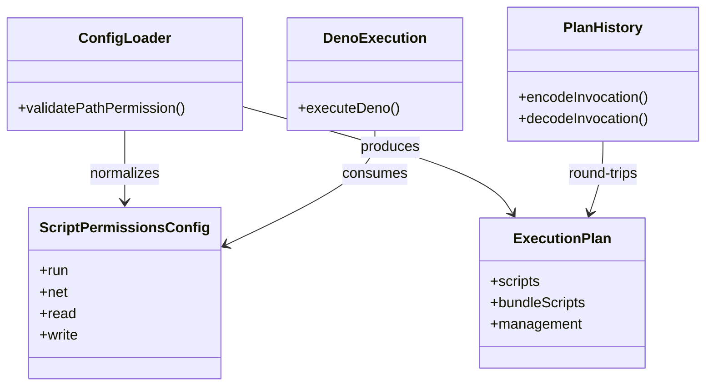
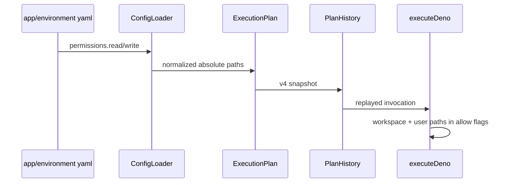

# Design：生命周期脚本文件权限

Risk profile: ./risk-profile.yaml

## Design Scope

本设计覆盖 sfo-deploy 单模块的脚本权限契约、计划快照、执行入口与文档。脚本
`permissions` 在既有 `run`/`net` 基础上增加可选 `read` 和 `write` 绝对 POSIX
路径列表。装载器负责失败关闭校验；执行器把框架必要的远端工作目录与用户扩展
授权合并为 Deno `--allow-read`/`--allow-write`。本设计同时移除 Python 运行时
专属执行与 schema v1 Python 快照兼容路径。

## Useful Context

当前 `ScriptPermissions` 只携带 `run` 和 `net`；配置装载、计划快照和远端执行
都以脚本 invocation 为所有权边界。`OpenSshRemoteSession.executeDeno()` 固定授
予当前 workspace 读写。`ScriptRuntimeKind`仍包含历史 `python`，但新配置装载
只会创建 Deno 运行时。

## Overall Approach

装载器把 `read`/`write` 归一为只读字符串数组，拒绝相对路径、根路径、`.`/`..`
片段、反斜杠、逗号、空白、控制字符和重复值。计划器继续传递 invocation，不改
变动作选择。执行器始终把远端 workspace 加入 Deno 文件权限；用户 `read`/`write`
是额外授权，缺省数组不会扩大或缩小既有 workspace 边界。历史 v4 编码始终写入
新字段；解码旧快照时把缺失字段解释为空数组。旧 Deno v2/v3 快照的步骤脚本可省略
`relative_path`，解码保留空字符串；重新归档回退计划时，普通步骤脚本和 bundle
script 必须保留该空值，不能套用 managed delivery invocation 的非空相对路径校验。

Python 移除是破坏性变更：`ScriptRuntimeKind` 只保留 `deno`；远端会话删除
`preflightPython`/`executePython`；执行准备只接受 Deno；schema v1 快照解码返
回明确的不支持错误。旧 v2/v3/v4 Deno 快照保持可读，缺失的新权限字段保持缺省
workspace 行为。

## Layered Design Document Index

| level | parent_document | unit | design_document | responsibility |
| --- | --- | --- | --- | --- |
| not-applicable: 单一脚本权限契约，不拆子级设计 | design.md | not-applicable: 无独立子级模块 | not-applicable: 本任务不拆分子级设计文档 | not-applicable: 本任务不引入独立业务子模块 |

## Module Relationship UML



## Key Flows



若路径不合法、历史字段非法或远端权限数组重复，装载/重放在触达脚本前失败。
Deno 原生权限拒绝越界直接读写和删除；获准启动的外部程序不继承该限制。

## State and Ownership

- Owner: `src/config.ts` 拥有 YAML 权限归一化；`src/history.ts` 拥有快照编解
  码；`src/transport.ts` 拥有执行前最终 argv 权限合并。旧快照脚本
  `relativePath` 的空值由 history codec 所有；managed delivery invocation 仍要求
  规范相对路径。
- 不新增持久化状态。新发布快照携带逐脚本授权；旧快照缺失字段保持旧行为。

## File-Level Interfaces

- Consumer: config loader, planner, executor, history, CLI；change_id:
  `CHG-lifecycle-file-permissions`
- Compatibility: backward-compatible

```typescript
// src/types.ts
// Consumer: loader/planner/history/executor; compatibility: backward-compatible
export type ScriptRuntimeKind = "deno";

export interface ScriptPermissions {
  readonly run: readonly string[];
  readonly net: readonly string[];
  /** Deno --allow-read 扩展路径；空数组保持默认 workspace。 */
  readonly read: readonly string[];
  /** Deno --allow-write 扩展路径；空数组保持默认 workspace。 */
  readonly write: readonly string[];
}
```

```typescript
// src/config.ts
// Consumer: scriptInvocation; compatibility: backward-compatible
function pathPermission(value: unknown, label: string): string;
```

```typescript
// src/transport.ts
// Consumer: execution runtime; compatibility: breaking (Python-only methods removed)
async executeDeno(
  executable: string,
  script: string,
  options: {
    readonly workspace: string;
    readonly metadataPath: string;
    readonly secretDir?: string;
    readonly permissions: ScriptPermissions;
    readonly privileged?: boolean;
    readonly runAs?: string;
    readonly signal?: AbortSignal;
  },
): Promise<CommandResult>;
```

## Directly Mapped Change Items

| change_id | proposal_id | target_module | design_coverage | scope_paths |
| --- | --- | --- | --- | --- |
| CHG-lifecycle-file-permissions | PROP-lifecycle-file-permissions | sfo-deploy | 权限类型/装载/计划快照/执行合并/CLI/文档与测试 | `src/**`, `tests/**`, `README.md`, `docs/guides/sfo-deploy-cluster-configuration.md`, `skills/sfo-deploy-cluster/references/app.md`, `skills/sfo-deploy-cluster/references/environment.md`, `examples/eleph-server-multipass/README.md` |
| CHG-remove-python-runtime | PROP-remove-python-runtime | sfo-deploy | 移除 Python runtime kind、session methods、loader、schema v1 codec，同步文档/示例 | `src/**`, `tests/**`, `README.md`, `docs/guides/sfo-deploy-cluster-configuration.md`, `examples/eleph-server-multipass/README.md` |

## API and Build Surface Impact

- Public API impact: migration-required
- Crate-root export change: no
- Build-surface change: yes
- Documentation examples affected: yes

`ScriptRuntimeKind` 的 `python` 值和远端会话 Python 方法移除；`ScriptPermissions`
新增字段为向后兼容。schema v1 Python 快照不再可回放，需使用匹配快照的旧版执
行器或迁移为 Deno 计划。

## Consumer Migration Closure

| old_symbol | new_path | change_id | consumer_path | consumer_kind | migration_status |
| --- | --- | --- | --- | --- | --- |
| `ScriptRuntimeKind` 的 Deno 或 Python union | `src/types.ts` 的 Deno-only union | CHG-remove-python-runtime | `src/execution.ts` | internal type consumer | migrated |
| `preflightPython` | removed / `preflightDeno` | CHG-remove-python-runtime | `src/transport.ts` | remote session interface | migrated |
| `executePython` | removed / `executeDeno` | CHG-remove-python-runtime | `src/transport.ts` | remote session interface | migrated |
| `python.py` | removed / `src/secret_loader/deno.ts` | CHG-remove-python-runtime | `src/execution.ts` | runtime loader consumer | migrated |
| `definition.python` | `src/history.ts` 的明确拒绝解码路径 | CHG-remove-python-runtime | `src/history.ts` | plan snapshot consumer | migrated |
| `ScriptPermissions` 的 run/net-only 形状 | `src/types.ts` 增加可选归一 `read/write` | CHG-lifecycle-file-permissions | `src/config.ts` | configuration loader | migrated |

## Implementation Order

| phase | goal | depends_on | output |
| --- | --- | --- | --- |
| 1 | 扩展权限类型、装载与运行时移除 | none | Deno-only types和 loader 校验 |
| 2 | 更新执行器、远端传输和历史快照 | 1 | 权限贯通且旧 Deno 快照兼容 |
| 3 | 同步 CLI、文档、示例和契约 | 2 | 用户可见边界一致 |
| 4 | 补充并运行任务测试 | 3 | 实际 Deno 授权/拒绝证据 |

## File-Level Implementation Sequence

| sequence | file_level_module | action | depends_on | change_id | scope_path | implementation_task |
| --- | --- | --- | --- | --- | --- | --- |
| 1 | `src/types.ts` | modify | none | CHG-lifecycle-file-permissions, CHG-remove-python-runtime | `src/types.ts` | root |
| 2 | `src/config.ts` | modify | 1 | CHG-lifecycle-file-permissions | `src/config.ts` | root |
| 3 | `src/execution.ts` | modify | 2 | CHG-remove-python-runtime | `src/execution.ts` | root |
| 4 | `src/transport.ts` | modify | 3 | CHG-lifecycle-file-permissions, CHG-remove-python-runtime | `src/transport.ts` | root |
| 5 | `src/history.ts` | modify | 2 | CHG-lifecycle-file-permissions, CHG-remove-python-runtime | `src/history.ts` | root |
| 6 | `src/cli.ts`, `src/mod.ts`, `src/secret_loader/python.py` | modify/delete | 4 | CHG-remove-python-runtime | `src/**` | root |
| 7 | tests（config/history/runtime/contract） | modify | 1-6 | both | `tests/**` | root |
| 8 | README、指南、技能参考、示例 README | modify | 7 | both | docs and examples | root |

## Design Notes

`read` 与 `write` 分开建模，避免用单一 file 权限同时授权只读和可写路径。
Deno 路径授权按路径前缀展开；这不是 symlink 或子进程沙箱。配置路径做语法规范
化，不做控制端 stat 或远端 realpath，因为授权目标是部署时远端位置。

## Risks and Rollback

- 授权 `/usr/bin/rm` 仍会允许子进程删除 Deno 权限外的文件；文档必须声明这是
  运行程序本身的能力，不是框架提供隔离。
- 只读授权不能作为可写授权；删除要求目标本身在 write 授权内。
- Python v1 快照移除兼容后只能保留为不可重放历史；不提供静默改写。
- 旧 Deno v2/v3 快照的空 `relativePath` 是合法遗留输入；把它误判为非法会阻断
  回退继承。受管 delivery invocation 的非空路径校验不得套用到普通步骤脚本。
- 回退需恢复旧执行器；新配置可通过移除 `read`/`write` 恢复默认边界。
